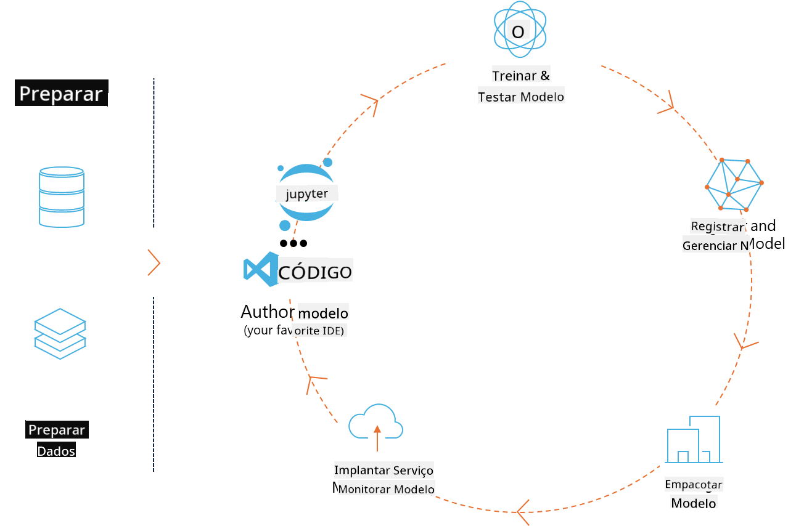
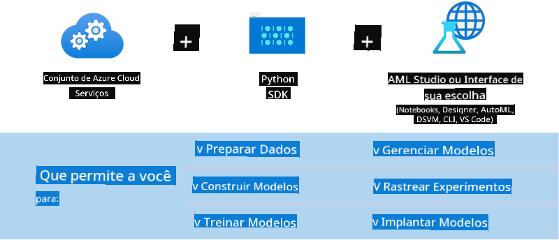

<!--
CO_OP_TRANSLATOR_METADATA:
{
  "original_hash": "f61c383bbf0c3dac97e43f833c258731",
  "translation_date": "2025-05-09T18:36:26+00:00",
  "source_file": "md/02.Application/01.TextAndChat/Phi3/E2E_Phi-3-MLflow.md",
  "language_code": "br"
}
-->
# MLflow

[MLflow](https://mlflow.org/) zo platforma digor-kodet evit merañ buhez-holl ar c'hiz-seurt kenkiz-seurt stummadur.



MLFlow a vez implijet evit merañ buhez ar c'hiz-seurt kenkiz-seurt, o tont da-heul ar c'houlzad, ar galloud da adober, ar stummadur hag ur rolloù modeloù kreñv. Bremañ, ML flow a ginnig pevar elfenn.

- **MLflow Tracking:** Enskrivañ ha klask war an enklaskoù, ar c'hod, ar c'honfiguradur roadennoù ha disoc'hoù.
- **MLflow Projects:** Paket kodoù skiantoù roadennoù evit adober runoù war pep lec'h.
- **Mlflow Models:** Staliañ modeloù kenkiz-seurt er c'hentañ servij.
- **Model Registry:** Merañ, merkañ ha miret modeloù e rollad-kreiz.

Emañ o kinnig tu da heulañ enklaskoù, paket kodoù evit runoù adoberet, ha rannañ ha staliañ modeloù. MLFlow zo keveliet gant Databricks ha he deus skoazell evit meur a libaraire kenkiz-seurt, o lakaat e servij da vezañ digor d’ar libaraireoù. Gallout a ra bezañ implijet gant libaraire kenkiz-seurt pe brezhoneg programming e pep yezh, rak e kinnig ur REST API ha CLI evit aesaat ar servij.


Penaos a dalvez MLFlow:

- **Heuliañ enklaskoù:** Enskrivañ ha kevreañ parametrou ha disoc'hoù.
- **Merañ modeloù:** Staliañ modeloù war meur a servijer ha platformenn.
- **Model Registry:** Merañ buhez modeloù MLflow en ur skipailh, en o mesk ar c'hemmadurezh ha merkañ.
- **Projects:** Paket kod ML evit rannañ pe implij war produ.
MLFlow a skoazell ivez ar c'houlzad MLOps, o tont da-barzh ober gant roadennoù, enrollañ ha merañ modeloù, paket modeloù evit oberiadur, staliañ servijoù, ha mererezh modeloù. Pal eo aesaat ar c'houlzad adalek ur prototyp da ur raktres produ, dreist-holl war c'hilou ha war skritelloù.

## Senario E2E - Sevel un emglev ha implij Phi-3 evel model MLFlow

Emañ ar sampl E2E-mañ o diskouez daou mod da sevel un emglev ouzh Phi-3, ur model yezh bihan (SLM), ha da vont da redek anezhañ evel un model MLFlow pe war lec'hienn lec'hel pe war an neñv, da skouer e labour-douar Azure Machine Learning.



| Raktres | Deskrivadur | Lec'h |
| ------------ | ----------- | -------- |
| Transformer Pipeline | Transformer Pipeline zo ar mod simplañ evit sevel un emglev ma fell deoc'h implij un model HuggingFace gant ar blas transformer eksperimentel MLFlow. | [**TransformerPipeline.ipynb**](../../../../../../code/06.E2E/E2E_Phi-3-MLflow_TransformerPipeline.ipynb) |
| Custom Python Wrapper | Er mare skridañ, pipeline transformer n’o deus ket skoazell da sevel emglev MLFlow evit modeloù HuggingFace e stumm ONNX, nemet gant ar pakad python optimum eksperimentel. E arvar-se, e c'hallit sevel ho emglev Python personel evit MLFlow. | [**CustomPythonWrapper.ipynb**](../../../../../../code/06.E2E/E2E_Phi-3-MLflow_CustomPythonWrapper.ipynb) |

## Raktres : Transformer Pipeline

1. Ret e vo deoc'h paketioù Python reizh eus MLFlow ha HuggingFace:

    ``` Python
    import mlflow
    import transformers
    ```

2. Goude-se, e rankit krouiñ un pipeline transformer o lakaat e anv ar model Phi-3 e roll HuggingFace. Evel ma weler war levrenn ar model _Phi-3-mini-4k-instruct_, e labour evit "Generezh Testenn":

    ``` Python
    pipeline = transformers.pipeline(
        task = "text-generation",
        model = "microsoft/Phi-3-mini-4k-instruct"
    )
    ```

3. Bremañ e c'hallit enrollañ pipeline transformer Phi-3 e stumm MLFlow ha reiñ roadennoù ouzhpenn evel lec'h ar c'hod, ar c'honfiguradur modeloù resis hag ar stumm API inferens:

    ``` Python
    model_info = mlflow.transformers.log_model(
        transformers_model = pipeline,
        artifact_path = "phi3-mlflow-model",
        model_config = model_config,
        task = "llm/v1/chat"
    )
    ```

## Raktres : Custom Python Wrapper

1. Aze e c'hallomp implijout ar [ONNX Runtime generate() API](https://github.com/microsoft/onnxruntime-genai) a Microsoft evit inferens ar model ONNX ha kodad tokenoù. Ret e vo dibab ar pakad _onnxruntime_genai_ evit ho skramm, ar skouer a-is a implij CPU:

    ``` Python
    import mlflow
    from mlflow.models import infer_signature
    import onnxruntime_genai as og
    ```

1. Hon klas personel a implij daou metod : _load_context()_ evit krouiñ **model ONNX** Phi-3 Mini 4K Instruct, **parametrou generadur** ha **tokenizer**; ha _predict()_ evit krouiñ tokenoù evit ar prompt roet:

    ``` Python
    class Phi3Model(mlflow.pyfunc.PythonModel):
        def load_context(self, context):
            # Retrieving model from the artifacts
            model_path = context.artifacts["phi3-mini-onnx"]
            model_options = {
                 "max_length": 300,
                 "temperature": 0.2,         
            }
        
            # Defining the model
            self.phi3_model = og.Model(model_path)
            self.params = og.GeneratorParams(self.phi3_model)
            self.params.set_search_options(**model_options)
            
            # Defining the tokenizer
            self.tokenizer = og.Tokenizer(self.phi3_model)
    
        def predict(self, context, model_input):
            # Retrieving prompt from the input
            prompt = model_input["prompt"][0]
            self.params.input_ids = self.tokenizer.encode(prompt)
    
            # Generating the model's response
            response = self.phi3_model.generate(self.params)
    
            return self.tokenizer.decode(response[0][len(self.params.input_ids):])
    ```

1. A-benn-henn e c'hallit implijout _mlflow.pyfunc.log_model()_ evit krouiñ un emglev Python personel (e stumm pickle) evit model Phi-3, en o zouez ar model ONNX orin ha an dibaboù ret:

    ``` Python
    model_info = mlflow.pyfunc.log_model(
        artifact_path = artifact_path,
        python_model = Phi3Model(),
        artifacts = {
            "phi3-mini-onnx": "cpu_and_mobile/cpu-int4-rtn-block-32-acc-level-4",
        },
        input_example = input_example,
        signature = infer_signature(input_example, ["Run"]),
        extra_pip_requirements = ["torch", "onnxruntime_genai", "numpy"],
    )
    ```

## Sinadoù modeloù MLFlow krouet

1. Er 3vet devezh eus raktres Transformer Pipeline, hon eus lakaet pal ar model MLFlow da " _llm/v1/chat_ ". An instruktion-se a grou ur emglev API evit ar model, kevel ouzh OpenAI Chat API evel ma vez diskouezet a-is:

    ``` Python
    {inputs: 
      ['messages': Array({content: string (required), name: string (optional), role: string (required)}) (required), 'temperature': double (optional), 'max_tokens': long (optional), 'stop': Array(string) (optional), 'n': long (optional), 'stream': boolean (optional)],
    outputs: 
      ['id': string (required), 'object': string (required), 'created': long (required), 'model': string (required), 'choices': Array({finish_reason: string (required), index: long (required), message: {content: string (required), name: string (optional), role: string (required)} (required)}) (required), 'usage': {completion_tokens: long (required), prompt_tokens: long (required), total_tokens: long (required)} (required)],
    params: 
      None}
    ```

1. Goude-se, e c'hallit kas ho prompt e stumm da-heul:

    ``` Python
    messages = [{"role": "user", "content": "What is the capital of Spain?"}]
    ```

1. War-lerc'h, implijit post-processadenn kevel ouzh OpenAI API, da skouer _response[0][‘choices’][0][‘message’][‘content’]_, evit gwellañ ho produ evit ma vint evel-se:

    ``` JSON
    Question: What is the capital of Spain?
    
    Answer: The capital of Spain is Madrid. It is the largest city in Spain and serves as the political, economic, and cultural center of the country. Madrid is located in the center of the Iberian Peninsula and is known for its rich history, art, and architecture, including the Royal Palace, the Prado Museum, and the Plaza Mayor.
    
    Usage: {'prompt_tokens': 11, 'completion_tokens': 73, 'total_tokens': 84}
    ```

1. Er 3vet devezh eus raktres Custom Python Wrapper, e ro ar pakad MLFlow tu da grou sinadenn ar model diwar ur skouer input roet. Sinadenn hor emglev MLFlow a vo evel-se:

    ``` Python
    {inputs: 
      ['prompt': string (required)],
    outputs: 
      [string (required)],
    params: 
      None}
    ```

1. Gant-se, hor prompt a rankfe bezañ ur "prompt" e-barzh ur geriaoueg, evel-se:

    ``` Python
    {"prompt": "<|system|>You are a stand-up comedian.<|end|><|user|>Tell me a joke about atom<|end|><|assistant|>",}
    ```

1. Disoc'hoù ar model a vo roet er stumm ur c'hrennadenn:

    ``` JSON
    Alright, here's a little atom-related joke for you!
    
    Why don't electrons ever play hide and seek with protons?
    
    Because good luck finding them when they're always "sharing" their electrons!
    
    Remember, this is all in good fun, and we're just having a little atomic-level humor!
    ```

**Aviso Legal**:  
Este documento foi traduzido utilizando o serviço de tradução automática [Co-op Translator](https://github.com/Azure/co-op-translator). Embora nos esforcemos para garantir a precisão, esteja ciente de que traduções automáticas podem conter erros ou imprecisões. O documento original em seu idioma nativo deve ser considerado a fonte autorizada. Para informações críticas, recomenda-se tradução profissional realizada por humanos. Não nos responsabilizamos por quaisquer mal-entendidos ou interpretações equivocadas decorrentes do uso desta tradução.