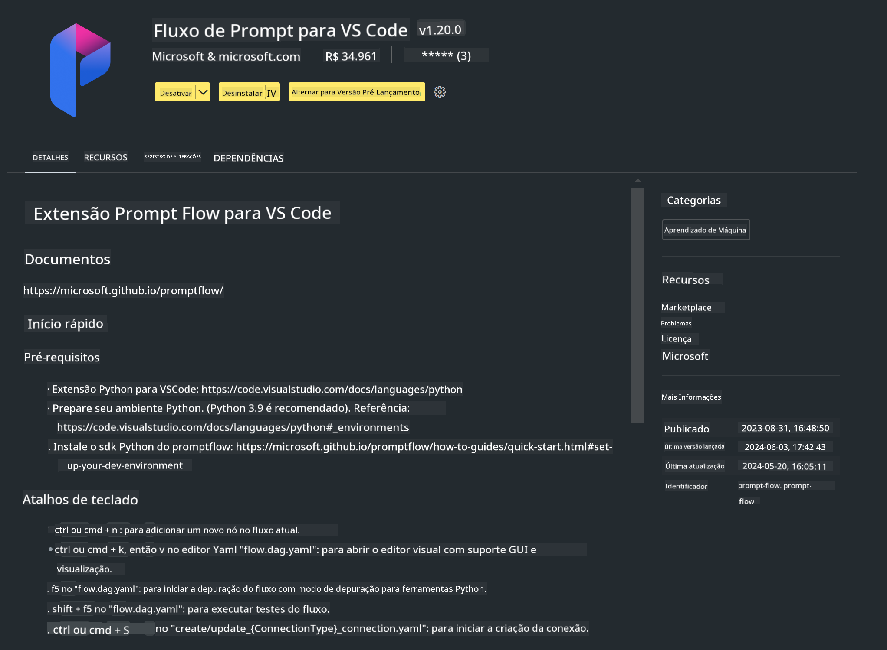

<!--
CO_OP_TRANSLATOR_METADATA:
{
  "original_hash": "a4ef39027902e82f2c33d568d2a2259a",
  "translation_date": "2025-05-09T19:19:07+00:00",
  "source_file": "md/02.Application/02.Code/Phi3/VSCodeExt/HOL/AIPC/01.Installations.md",
  "language_code": "br"
}
-->
# **Lab 0 - Instalação**

Quando entramos no Lab, precisamos configurar o ambiente relevante:


### **1. Python 3.11+**

É recomendado usar miniforge para configurar seu ambiente Python

Para configurar o miniforge, por favor consulte [https://github.com/conda-forge/miniforge](https://github.com/conda-forge/miniforge)

Após configurar o miniforge, execute o seguinte comando no Power Shell

```bash

conda create -n pyenv python==3.11.8 -y

conda activate pyenv

```


### **2. Instalar o Prompt flow SDK**

No Lab 1, usaremos o Prompt flow, então você precisa configurar o Prompt flow SDK.

```bash

pip install promptflow --upgrade

```

Você pode verificar o promptflow sdk com este comando


```bash

pf --version

```

### **3. Instalar a extensão Prompt flow do Visual Studio Code**




### **4. Biblioteca de Aceleração Intel NPU**

Os processadores de nova geração da Intel suportam NPU. Se você quiser usar NPU para rodar LLMs / SLMs localmente, pode usar a ***Biblioteca de Aceleração Intel NPU***. Se quiser saber mais, pode ler [https://github.com/microsoft/PhiCookBook/blob/main/md/01.Introduction/03/AIPC_Inference.md](https://github.com/microsoft/PhiCookBook/blob/main/md/01.Introduction/03/AIPC_Inference.md).

Instale a Biblioteca de Aceleração Intel NPU no bash


```bash

pip install intel-npu-acceleration-library

```

***Note***: Por favor, note que esta biblioteca suporta transformers ***4.40.2***, confirme a versão


### **5. Outras Bibliotecas Python**


crie o requirements.txt e adicione este conteúdo

```txt

notebook
numpy 
scipy 
scikit-learn 
matplotlib 
pandas 
pillow 
graphviz

```


### **6. Instalar NVM**

instale o nvm no Powershell


```bash

winget install -e --id CoreyButler.NVMforWindows

```

instale o nodejs 18.20


```bash

nvm install 18.20.0

nvm use 18.20.0

```

### **7. Instalar Suporte ao Desenvolvimento no Visual Studio Code**


```bash

npm install --global yo generator-code

```

Parabéns! Você configurou o SDK com sucesso. Agora, prossiga para as etapas práticas.

**Aviso Legal**:  
Este documento foi traduzido usando o serviço de tradução por IA [Co-op Translator](https://github.com/Azure/co-op-translator). Embora nos esforcemos para garantir a precisão, esteja ciente de que traduções automáticas podem conter erros ou imprecisões. O documento original em seu idioma nativo deve ser considerado a fonte autorizada. Para informações críticas, recomenda-se tradução profissional feita por humanos. Não nos responsabilizamos por quaisquer mal-entendidos ou interpretações incorretas decorrentes do uso desta tradução.