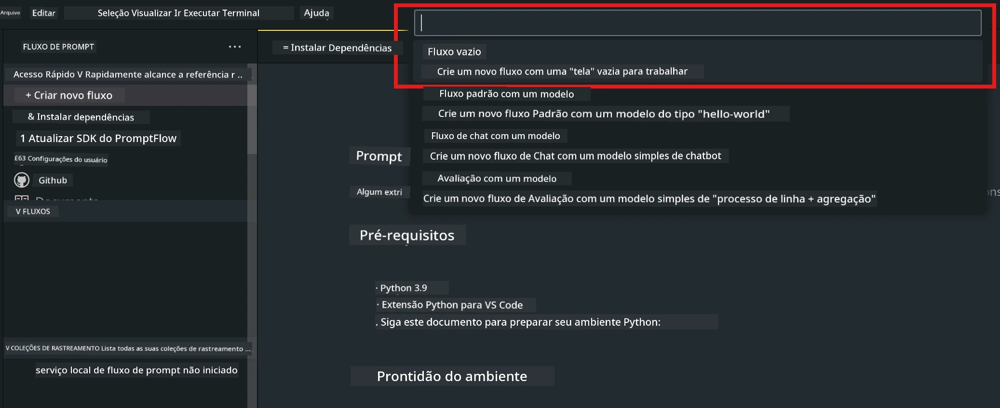
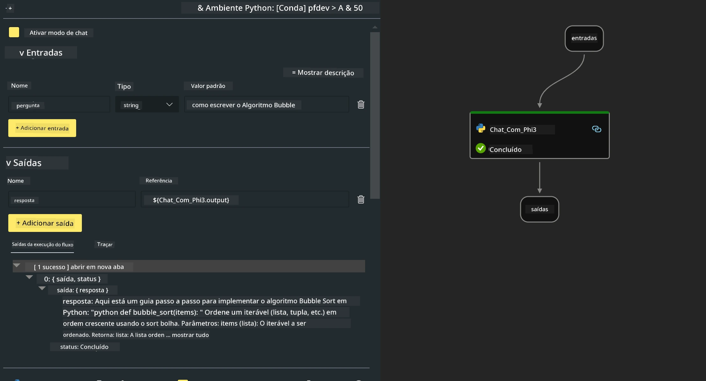

<!--
CO_OP_TRANSLATOR_METADATA:
{
  "original_hash": "bc29f7fe7fc16bed6932733eac8c81b8",
  "translation_date": "2025-07-17T03:57:30+00:00",
  "source_file": "md/02.Application/02.Code/Phi3/VSCodeExt/HOL/AIPC/02.PromptflowWithNPU.md",
  "language_code": "br"
}
-->
# **Lab 2 - Executando Prompt flow com Phi-3-mini no AIPC**

## **O que é Prompt flow**

Prompt flow é um conjunto de ferramentas de desenvolvimento projetado para simplificar o ciclo completo de criação de aplicações de IA baseadas em LLM, desde a ideação, prototipagem, testes, avaliação até o deployment em produção e monitoramento. Ele torna a engenharia de prompts muito mais fácil e permite que você construa apps com LLMs com qualidade de produção.

Com o prompt flow, você poderá:

- Criar fluxos que conectam LLMs, prompts, código Python e outras ferramentas em um workflow executável.

- Depurar e iterar seus fluxos, especialmente a interação com LLMs, de forma simples.

- Avaliar seus fluxos, calcular métricas de qualidade e desempenho com conjuntos de dados maiores.

- Integrar os testes e avaliações no seu sistema de CI/CD para garantir a qualidade do seu fluxo.

- Fazer o deployment dos seus fluxos na plataforma de serviço que escolher ou integrar facilmente ao código do seu app.

- (Opcional, mas altamente recomendado) Colaborar com sua equipe aproveitando a versão em nuvem do Prompt flow no Azure AI.

## **O que é AIPC**

Um AI PC possui uma CPU, uma GPU e uma NPU, cada um com capacidades específicas de aceleração para IA. Uma NPU, ou unidade de processamento neural, é um acelerador especializado que executa tarefas de inteligência artificial (IA) e aprendizado de máquina (ML) diretamente no seu PC, sem precisar enviar dados para processamento na nuvem. A GPU e a CPU também podem processar essas cargas, mas a NPU é especialmente eficiente em cálculos de IA com baixo consumo de energia. O AI PC representa uma mudança fundamental na forma como nossos computadores funcionam. Não é uma solução para um problema que não existia antes, mas sim uma grande melhoria para o uso cotidiano do PC.

Então, como funciona? Comparado à IA generativa e aos enormes modelos de linguagem (LLMs) treinados com toneladas de dados públicos, a IA que vai rodar no seu PC é mais acessível em praticamente todos os níveis. O conceito é mais fácil de entender e, por ser treinado com seus dados, sem precisar acessar a nuvem, os benefícios são mais imediatos e atraentes para um público mais amplo.

No curto prazo, o mundo do AI PC envolve assistentes pessoais e modelos menores de IA rodando diretamente no seu PC, usando seus dados para oferecer melhorias pessoais, privadas e mais seguras para tarefas que você já faz todo dia – fazer atas de reunião, organizar uma liga de fantasy football, automatizar melhorias em edição de fotos e vídeos, ou montar o roteiro perfeito para uma reunião de família com base nos horários de chegada e saída de todos.

## **Construindo fluxos de geração de código no AIPC**

***Note*** ：Se você ainda não completou a instalação do ambiente, por favor visite [Lab 0 -Installations](./01.Installations.md)

1. Abra a extensão Prompt flow no Visual Studio Code e crie um projeto de fluxo vazio



2. Adicione parâmetros de Inputs e Outputs e adicione código Python como novo fluxo



Você pode se basear nesta estrutura (flow.dag.yaml) para construir seu fluxo

```yaml

inputs:
  question:
    type: string
    default: how to write Bubble Algorithm
outputs:
  answer:
    type: string
    reference: ${Chat_With_Phi3.output}
nodes:
- name: Chat_With_Phi3
  type: python
  source:
    type: code
    path: Chat_With_Phi3.py
  inputs:
    question: ${inputs.question}


```

3. Adicione o código em ***Chat_With_Phi3.py***

```python


from promptflow.core import tool

# import torch
from transformers import AutoTokenizer, pipeline,TextStreamer
import intel_npu_acceleration_library as npu_lib

import warnings

import asyncio
import platform

class Phi3CodeAgent:
    
    model = None
    tokenizer = None
    text_streamer = None
    
    model_id = "microsoft/Phi-3-mini-4k-instruct"

    @staticmethod
    def init_phi3():
        
        if Phi3CodeAgent.model is None or Phi3CodeAgent.tokenizer is None or Phi3CodeAgent.text_streamer is None:
            Phi3CodeAgent.model = npu_lib.NPUModelForCausalLM.from_pretrained(
                                    Phi3CodeAgent.model_id,
                                    torch_dtype="auto",
                                    dtype=npu_lib.int4,
                                    trust_remote_code=True
                                )
            Phi3CodeAgent.tokenizer = AutoTokenizer.from_pretrained(Phi3CodeAgent.model_id)
            Phi3CodeAgent.text_streamer = TextStreamer(Phi3CodeAgent.tokenizer, skip_prompt=True)

    

    @staticmethod
    def chat_with_phi3(prompt):
        
        Phi3CodeAgent.init_phi3()

        messages = "<|system|>You are a AI Python coding assistant. Please help me to generate code in Python.The answer only genertated Python code, but any comments and instructions do not need to be generated<|end|><|user|>" + prompt +"<|end|><|assistant|>"


        generation_args = {
            "max_new_tokens": 1024,
            "return_full_text": False,
            "temperature": 0.3,
            "do_sample": False,
            "streamer": Phi3CodeAgent.text_streamer,
        }

        pipe = pipeline(
            "text-generation",
            model=Phi3CodeAgent.model,
            tokenizer=Phi3CodeAgent.tokenizer,
            # **generation_args
        )

        result = ''

        with warnings.catch_warnings():
            warnings.simplefilter("ignore")
            response = pipe(messages, **generation_args)
            result =response[0]['generated_text']
            return result


@tool
def my_python_tool(question: str) -> str:
    if platform.system() == 'Windows':
        asyncio.set_event_loop_policy(asyncio.WindowsSelectorEventLoopPolicy())
    return Phi3CodeAgent.chat_with_phi3(question)


```

4. Você pode testar o fluxo pelo Debug ou Run para verificar se a geração do código está funcionando


5. Execute o fluxo como API de desenvolvimento no terminal

```

pf flow serve --source ./ --port 8080 --host localhost   

```

Você pode testar no Postman / Thunder Client

### **Note**

1. A primeira execução demora bastante. Recomenda-se baixar o modelo phi-3 pelo Hugging face CLI.

2. Considerando a capacidade limitada de processamento da Intel NPU, recomenda-se usar o Phi-3-mini-4k-instruct

3. Usamos a aceleração Intel NPU para quantização com conversão INT4, mas se você reiniciar o serviço, será necessário apagar as pastas cache e nc_workshop.

## **Recursos**

1. Aprenda Promptflow [https://microsoft.github.io/promptflow/](https://microsoft.github.io/promptflow/)

2. Aprenda sobre Intel NPU Acceleration [https://github.com/intel/intel-npu-acceleration-library](https://github.com/intel/intel-npu-acceleration-library)

3. Código de exemplo, download [Local NPU Agent Sample Code](../../../../../../../../../code/07.Lab/01/AIPC)

**Aviso Legal**:  
Este documento foi traduzido utilizando o serviço de tradução por IA [Co-op Translator](https://github.com/Azure/co-op-translator). Embora nos esforcemos para garantir a precisão, esteja ciente de que traduções automáticas podem conter erros ou imprecisões. O documento original em seu idioma nativo deve ser considerado a fonte autorizada. Para informações críticas, recomenda-se tradução profissional humana. Não nos responsabilizamos por quaisquer mal-entendidos ou interpretações incorretas decorrentes do uso desta tradução.