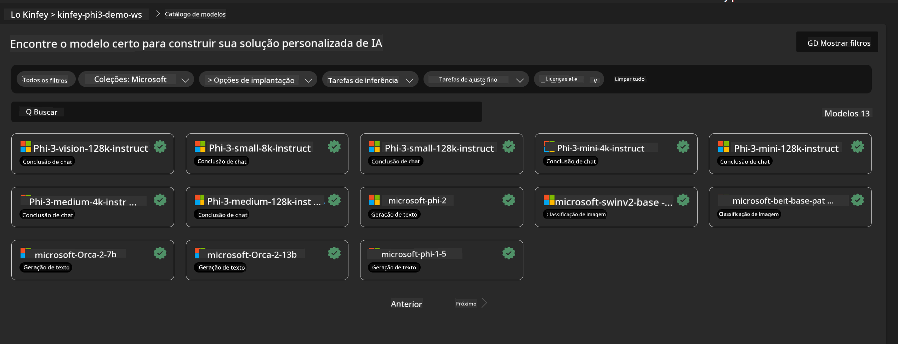
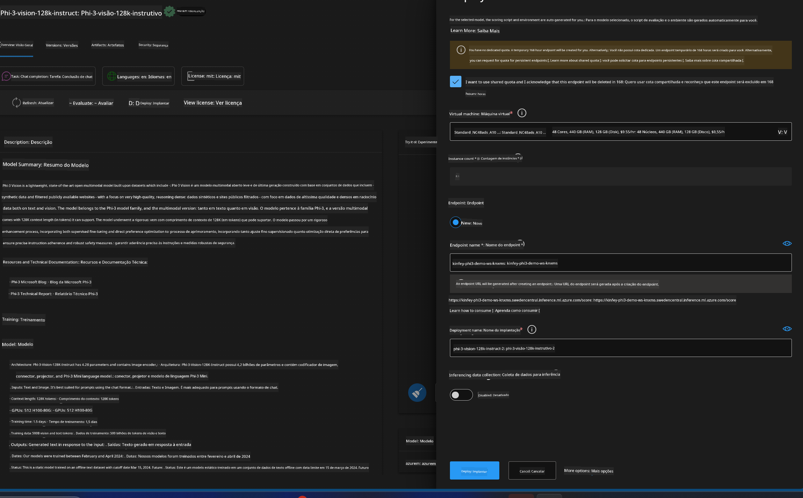
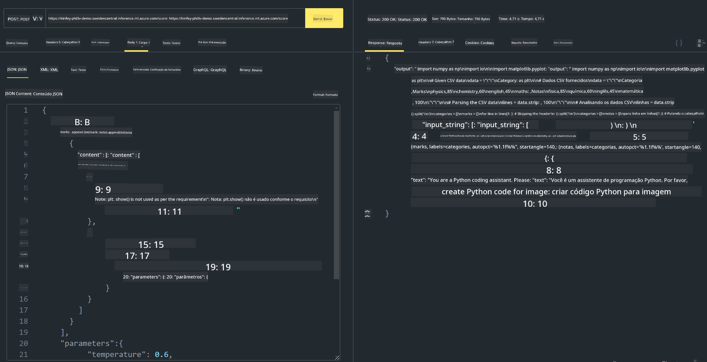

<!--
CO_OP_TRANSLATOR_METADATA:
{
  "original_hash": "20cb4e6ac1686248e8be913ccf6c2bc2",
  "translation_date": "2025-07-17T04:06:01+00:00",
  "source_file": "md/02.Application/02.Code/Phi3/VSCodeExt/HOL/AIPC/03.DeployPhi3VisionOnAzure.md",
  "language_code": "br"
}
-->
# **Laboratório 3 - Implantar Phi-3-vision no Azure Machine Learning Service**

Usamos NPU para concluir a implantação em produção do código local, e agora queremos introduzir a capacidade de integrar o PHI-3-VISION para gerar código a partir de imagens.

Nesta introdução, podemos rapidamente construir um serviço Model As Service Phi-3 Vision no Azure Machine Learning Service.

***Note***： Phi-3 Vision requer poder computacional para gerar conteúdo em uma velocidade maior. Precisamos da computação em nuvem para nos ajudar a alcançar isso.


### **1. Criar Azure Machine Learning Service**

Precisamos criar um Azure Machine Learning Service no Portal do Azure. Se quiser aprender como, visite este link [https://learn.microsoft.com/azure/machine-learning/quickstart-create-resources?view=azureml-api-2](https://learn.microsoft.com/azure/machine-learning/quickstart-create-resources?view=azureml-api-2)


### **2. Escolher Phi-3 Vision no Azure Machine Learning Service**




### **3. Implantar Phi-3-Vision no Azure**





### **4. Testar Endpoint no Postman**





***Note***

1. Os parâmetros a serem enviados devem incluir Authorization, azureml-model-deployment e Content-Type. Você precisa verificar as informações da implantação para obtê-los.

2. Para enviar parâmetros, o Phi-3-Vision precisa receber um link de imagem. Por favor, consulte o método GPT-4-Vision para enviar parâmetros, como

```json

{
  "input_data":{
    "input_string":[
      {
        "role":"user",
        "content":[ 
          {
            "type": "text",
            "text": "You are a Python coding assistant.Please create Python code for image "
          },
          {
              "type": "image_url",
              "image_url": {
                "url": "https://ajaytech.co/wp-content/uploads/2019/09/index.png"
              }
          }
        ]
      }
    ],
    "parameters":{
          "temperature": 0.6,
          "top_p": 0.9,
          "do_sample": false,
          "max_new_tokens": 2048
    }
  }
}

```

3. Chame **/score** usando o método Post

**Parabéns**! Você completou a implantação rápida do PHI-3-VISION e experimentou como usar imagens para gerar código. A seguir, podemos construir aplicações combinando NPUs e nuvens.

**Aviso Legal**:  
Este documento foi traduzido utilizando o serviço de tradução por IA [Co-op Translator](https://github.com/Azure/co-op-translator). Embora nos esforcemos para garantir a precisão, esteja ciente de que traduções automáticas podem conter erros ou imprecisões. O documento original em seu idioma nativo deve ser considerado a fonte autorizada. Para informações críticas, recomenda-se tradução profissional humana. Não nos responsabilizamos por quaisquer mal-entendidos ou interpretações incorretas decorrentes do uso desta tradução.