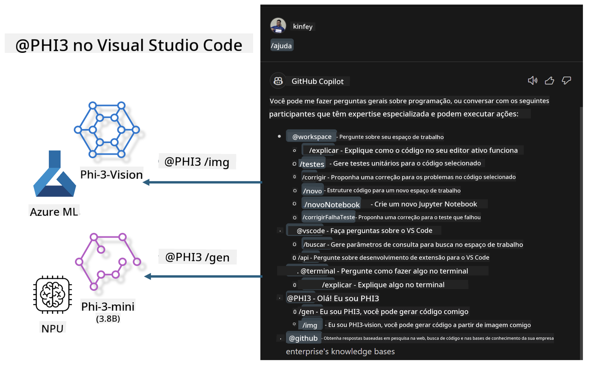

<!--
CO_OP_TRANSLATOR_METADATA:
{
  "original_hash": "00b7a699de8ac405fa821f4c0f7fc0ab",
  "translation_date": "2025-05-09T19:12:07+00:00",
  "source_file": "md/02.Application/02.Code/Phi3/VSCodeExt/README.md",
  "language_code": "br"
}
-->
# **Krouiñ hoc'h-unan Visual Studio Code GitHub Copilot Chat gant Microsoft Phi-3 Family**

Ha bet oc'h o implij an agent labour-douar e GitHub Copilot Chat ? Ha c'hoant ho peus da grouiñ agent kod ho skipailh ? Ar labourez-pratik-mañ a soñj da gemer un doare digor eus ar model evit krouiñ un agent kod evit embregerezh uhel.

## **Diazez**

### **Perak dibab Microsoft Phi-3**

Phi-3 zo ur familh, o tont gant phi-3-mini, phi-3-small, hag phi-3-medium, diazezet war parametrouioù trenerezh disheñvel evit krouiñ testenn, echuadur dialogoù, ha krouiñ kod. Bez ez eus ivez phi-3-vision, diazezet war Vision. Talvoudus eo evit embregerezhioù pe skipailhoù disheñvel da grouiñ diskoulmoù AI generativ war lec'h.

Kaset eo da lenn ar liamm-mañ [https://github.com/microsoft/PhiCookBook/blob/main/md/01.Introduction/01/01.PhiFamily.md](https://github.com/microsoft/PhiCookBook/blob/main/md/01.Introduction/01/01.PhiFamily.md)

### **Microsoft GitHub Copilot Chat**

Ar stummad GitHub Copilot Chat a ro deoc'h ur meziant komz evit kevreañ gant GitHub Copilot ha resev respontoù diwar goulennioù kod en un doare reizh e-barzh VS Code, hep ma rankit klask e dielloù pe war foromoù war al lec'hienn.

Copilot Chat a c'hall implijout livadur sintaks, indentadur, hag alioù all evit lakaat ar respontoù da vezañ aes da verañ. Hervez an doare goulennoù, e c'hall ar respontoù bezañ leun a liammoù da kont da implij ar c'hod pe an teuliadoù anavezet gant Copilot, pe boutonoù evit mont war raok gant ar c'hiz VS Code.

- Copilot Chat a en em laka e darempred gant ho doare labour ha kinnig a ra sikour d'ar mare ma 'z oc'h ezhomm :

- Kregiñ ur gaozeadenn enlinenn dre an ezhommer pe ar terminal evit sikour pa kodit

- Implijout ar sell Chat evit bezañ gant ur sikour AI e-barzh ar gontell

- Degemer Quick Chat evit goulennañ ur goulenn buan ha distreiñ da labourat

Gallout a rit implij GitHub Copilot Chat e meur a doare :

- Respont d goulennioù kod evit gouzout penaos diskouez ar goulenn

- Deskrivañ kod ur re all ha kinnig gwellaat

- Kinnig diorren kod

- Krouiñ arvestoù testennoù unvan

- Krouiñ teuliadoù deskrivadur kod

Kaset eo da lenn ar liamm-mañ [https://code.visualstudio.com/docs/copilot/copilot-chat](https://code.visualstudio.com/docs/copilot/copilot-chat?WT.mc_id=aiml-137032-kinfeylo)

###  **Microsoft GitHub Copilot Chat @workspace**

Evit implijout **@workspace** e Copilot Chat e c'hallit goulenn diwar-benn ho kod a-bezh. Hervez ar goulenn, Copilot a glask ha diskouez teuliadoù ha simboloù talvoudus ha kas a ra liammoù ha skouerioù kod e respontoù.

Evit respont d ho goulenn, **@workspace** a glask dre ar memes soubidigezhioù ma vefe ur programez o klask e-barzh ur kod e VS Code :

- An holl restroù e-barzh an darempred, nemet ar re disoñjet gant un teulioù .gitignore

- Seurt an diavaezadur gant rollioù ha restroù en he zreuz

- Index klask kod GitHub, ma vez ar darempred ur repo GitHub ha bet diskouezet gant klask kod

- Simboloù ha difinioù e-barzh ar darempred

- An destenn dibabet pe gwelet e-barzh an aozer aktuel

Notenn : .gitignore a c'haller en em ziskarout ma vez ur teul digor pe ur destenn dibabet e-barzh un teul disoñjet.

Kaset eo da lenn ar liamm-mañ [[https://code.visualstudio.com/docs/copilot/copilot-chat](https://code.visualstudio.com/docs/copilot/workspace-context?WT.mc_id=aiml-137032-kinfeylo)]

## **Gouzout hiroc'h diwar-benn ar Labourez-mañ**

GitHub Copilot en deus gwellaet kalz efedusted an embregerezhioù e programming, ha pep embregerezh a c'hoarvez da customize ar perzhioù talvoudus a GitHub Copilot. Kalz embregerezhioù o deus krouet Extensions kevret ouzh GitHub Copilot hervez o stummoù biziañs hag ar modeloù digor. Evit embregerezhioù, ar Extensions customizeet a zo aesoc'h da renabl, met n'eo ket hepken; e c'hall bezañ un tamm dister. Ar gwir eo ez eus GitHub Copilot gant kreñvder brasoc'h evit ober gant ar c'hontroloù hollek hag ar profedusted. Ma c'haller derc'hel ur prof eus ar memes doare, gwelloc'h e vefe da customize ho Extension embregerezh. GitHub Copilot Chat a ginnig APIoù talvoudus evit embregerezhioù da lakaat o spi en arvar chat. Derc'hel un prof eus ar memes doare ha bezañ o c'hounit perzhioù personelaet eo ur prof gwelloc'h.

Ar labourez-mañ a implij dreist-holl ar model Phi-3 heñvel ouzh NPU lec'hel ha Azure evit krouiñ un Agent personelaet e GitHub Copilot Chat ***@PHI3*** evit skoazellañ ar programezed embregerezh da echuiñ krouiñ kod***(@PHI3 /gen)*** ha krouiñ kod diwar skeudennoù***(@PHI3 /img)***.

### ***Notenn :*** 

Ar labourez-mañ zo implijet bremañ e AIPC Intel CPU ha Apple Silicon. Kenderc'hel a reomp da hizivaat ar stumm Qualcomm eus NPU.

## **Labourez**

| Anv | Deskrivadur | AIPC | Apple |
| ------------ | ----------- | -------- |-------- |
| Lab0 - Installations(✅) | Krouiñ ha lakaat e plas an enebourien ha ar c'hizioù instal | [Go](./HOL/AIPC/01.Installations.md) |[Go](./HOL/Apple/01.Installations.md) |
| Lab1 - Run Prompt flow with Phi-3-mini (✅) | Krouiñ kod gant Phi-3-mini en o zouez AIPC / Apple Silicon, en implij NPU lec'hel | [Go](./HOL/AIPC/02.PromptflowWithNPU.md) |  [Go](./HOL/Apple/02.PromptflowWithMLX.md) |
| Lab2 - Deploy Phi-3-vision on Azure Machine Learning Service(✅) | Krouiñ kod dre aozañ katalog ar modadoù Azure Machine Learning Service - Phi-3-vision skeudenn | [Go](./HOL/AIPC/03.DeployPhi3VisionOnAzure.md) |[Go](./HOL/Apple/03.DeployPhi3VisionOnAzure.md) |
| Lab3 - Create a @phi-3 agent in GitHub Copilot Chat(✅)  | Krouiñ un agent Phi-3 personelaet e GitHub Copilot Chat evit echuiñ krouiñ kod, krouiñ kod graf, RAG, hag all | [Go](./HOL/AIPC/04.CreatePhi3AgentInVSCode.md) | [Go](./HOL/Apple/04.CreatePhi3AgentInVSCode.md) |
| Sample Code (✅)  | Pellgargañ kod skouer | [Go](../../../../../../../code/07.Lab/01/AIPC) | [Go](../../../../../../../code/07.Lab/01/Apple) |

## **Resoursoù**

1. Phi-3 Cookbook [https://github.com/microsoft/Phi-3CookBook](https://github.com/microsoft/Phi-3CookBook)

2. Gouzout hiroc'h diwar-benn GitHub Copilot [https://learn.microsoft.com/training/paths/copilot/](https://learn.microsoft.com/training/paths/copilot/?WT.mc_id=aiml-137032-kinfeylo)

3. Gouzout hiroc'h diwar-benn GitHub Copilot Chat [https://learn.microsoft.com/training/paths/accelerate-app-development-using-github-copilot/](https://learn.microsoft.com/training/paths/accelerate-app-development-using-github-copilot/?WT.mc_id=aiml-137032-kinfeylo)

4. Gouzout hiroc'h diwar-benn API GitHub Copilot Chat [https://code.visualstudio.com/api/extension-guides/chat](https://code.visualstudio.com/api/extension-guides/chat?WT.mc_id=aiml-137032-kinfeylo)

5. Gouzout hiroc'h diwar-benn Azure AI Foundry [https://learn.microsoft.com/training/paths/create-custom-copilots-ai-studio/](https://learn.microsoft.com/training/paths/create-custom-copilots-ai-studio/?WT.mc_id=aiml-137032-kinfeylo)

6. Gouzout hiroc'h diwar-benn katalog ar modadoù Azure AI Foundry [https://learn.microsoft.com/azure/ai-studio/how-to/model-catalog-overview](https://learn.microsoft.com/azure/ai-studio/how-to/model-catalog-overview)

**Aviso Legal**:  
Este documento foi traduzido usando o serviço de tradução automática [Co-op Translator](https://github.com/Azure/co-op-translator). Embora nos esforcemos para garantir a precisão, esteja ciente de que traduções automáticas podem conter erros ou imprecisões. O documento original em seu idioma nativo deve ser considerado a fonte oficial. Para informações críticas, recomenda-se tradução profissional feita por humanos. Não nos responsabilizamos por quaisquer mal-entendidos ou interpretações incorretas decorrentes do uso desta tradução.