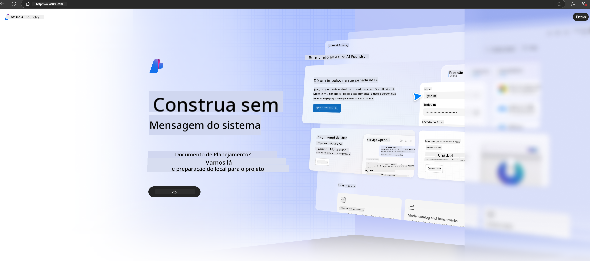

<!--
CO_OP_TRANSLATOR_METADATA:
{
  "original_hash": "3a1e48b628022485aac989c9f733e792",
  "translation_date": "2025-05-09T20:10:53+00:00",
  "source_file": "md/02.QuickStart/AzureAIFoundry_QuickStart.md",
  "language_code": "br"
}
-->
# **Ouzh Diaze Phi-3 e Azure AI Foundry**

Gant ar c’hentañ a-bouez eus Generative AI, e soñjomp implij ur platfom unanet evit merañ LLM ha SLM disheñvel, integradur roadennoù embregerezh, fine-tuning/RAG, hag ar c’hinnig eus disoc’hoù embregerezh disheñvel goude integradur LLM ha SLM, evit ma vo gwelloc’h sevenet ar c’hinnigoù smart gant generative AI. [Azure AI Foundry](https://ai.azure.com) zo ur platfom generative AI evit embregerezhioù.

Gant Azure AI Foundry, e c’hallit gwerzhañ respontoù ar model lieslevr (LLM) ha sevel ar c’hinnigoù gant prompt flow evit gwelloc’h oberiantiz. Ar platfom a sikour da eskaladur evit treuzkas ar prouiñ evid ar produiñ a-feson hep kalz strivoù. Ar monitorañ ha ar gwellañ padus a sikour da stagañ gant an darempredoù.

E c’hallomp lakaat ar model Phi-3 war Azure AI Foundry buan dre fazioù simpl, ha goude-se implij Azure AI Foundry evit echuiñ ar c’hinnigadoù liammet ouzh Phi-3 evel Playground/Chat, Fine-tuning, prouiñ ha kement zo.

## **1. Preder**

Ma vez an [Azure Developer CLI](https://learn.microsoft.com/azure/developer/azure-developer-cli/overview?WT.mc_id=aiml-138114-kinfeylo) aliet war ho urzhiataer, implijout ar patrom-mañ a zo aes-tre, klikañ ar c’homand-mañ er c’havlec’h nevez.

## Krouiñ da Lavar

Krouiñ ur raktres hag ur hub e Microsoft Azure AI Foundry a zo un doare mat da aozañ ha merañ ho labour AI. Setu ur merdeiñ gant ar fazioù evit kregiñ :

### Krouiñ ur raktres e Azure AI Foundry

1. **Mont da Azure AI Foundry** : Kevreañ e portal Azure AI Foundry.
2. **Krouiñ ur raktres** :
   - Ma vezc’h en ur raktres, dibab "Azure AI Foundry" er gornôg kleiz evit mont d’ar bajenn Gweledva.
   - Dibab "+ Create project".
   - Enskrivañ un anv evit ar raktres.
   - Ma vez ur hub, e vo dibabet dre ziouer. Ma vez muioc’h evit ma vo ur c’hendiviz ouzh ur c’hub all, e c’hallit dibab anezhañ en ur roll krenn. Ma fell deoc’h krouiñ ur hub nevez, dibabit "Create new hub" ha reiñ ur anv.
   - Dibabit "Create".

### Krouiñ ur Hub e Azure AI Foundry

1. **Mont da Azure AI Foundry** : Kevreañ gant ho kont Azure.
2. **Krouiñ ur Hub** :
   - Dibabit ar Mererezh er menù kleiz.
   - Dibabit "All resources", goude-se an dro-dell dindan "+ New project" ha dibabit "+ New hub".
   - En ur gommenn "Create a new hub", enskrivañ un anv evit ho hub (da skouer, contoso-hub) ha kemmañ ar maezioù all hervez ho plijadur.
   - Dibabit "Next", sellit war an titouroù ha goude-se dibabit "Create".

Evit gouzout muioc’h, e c’hallit mont war an [dokumentadur ofisiel Microsoft](https://learn.microsoft.com/azure/ai-studio/how-to/create-projects).

Goude ma vo krouet mat, e c’hallit mont d’ar studio ho peus krouet dre [ai.azure.com](https://ai.azure.com/)

Gallout a reer kaout meur a raktres war un AI Foundry. Krouit ur raktres e AI Foundry evit en em ziskouez.

Krouiñ Azure AI Foundry [QuickStarts](https://learn.microsoft.com/azure/ai-studio/quickstarts/get-started-code)

## **2. Lakaat Phi model war Azure AI Foundry**

Klikañ war Explore evit mont d’ar Model Catalog ha dibab Phi-3

Dibab Phi-3-mini-4k-instruct

Klikañ 'Deploy' evit lakaat ar model Phi-3-mini-4k-instruct

> [!NOTE]
>
> Gellout a rit dibab ar galloud komputañ pa lakaer e plas

## **3. Playground Chat Phi e Azure AI Foundry**

Mont d’ar bajenn lakaat e plas, dibab Playground, ha chom e kavan Phi-3 e Azure AI Foundry

## **4. Lakaat e plas ar model gant Azure AI Foundry**

Evit lakaat e plas ur model eus Azure Model Catalog, heuliañ ar fazioù-mañ :

- Kevreañ e Azure AI Foundry.
- Dibab ar model ho peus c’hoant lakaat e plas eus katalog Azure AI Foundry.
- War pajenn titouroù ar model, dibabit Deploy ha goude-se Serverless API gant Azure AI Content Safety.
- Dibabit ar raktres ma fell deoc’h lakaat ho modeloù e plas. Evit implijout an Serverless API, ho studio a rank bezañ e rannvro East US 2 pe Sweden Central. Gellout a rit kemmañ anv ar lakaat e plas.
- War ar merdeiñ lakaat e plas, dibabit Pricing and terms evit gwelet titouroù war ar priz ha termenoù ar implij.
- Dibabit Deploy. Gortozit betek ma vo prest ar lakaat e plas ha ma vo roet deoc’h da bajenn Deployments.
- Dibabit Open in playground evit kregiñ gant ar model.
- Gellout a rit distreiñ d’ar bajenn Deployments, dibab ar lakaat e plas, ha sellet ouzh URL Target ha Secret Key evit implijout ar lakaat e plas ha krouiñ respontoù.
- Gellout a rit kavout titouroù ar stumm, URL ha ar c’hlefoù implijout dre mont d’ar tab Build ha dibab Deployments e rann Components.

> [!NOTE]
> Evezhiañ ez eo ret bezañ ganoc’h roll Azure AI Developer war ar Resource Group evit ober ar fazioù-se.

## **5. Implij API Phi e Azure AI Foundry**

Gellout a rit mont da https://{Your project name}.region.inference.ml.azure.com/swagger.json dre Postman GET ha ober gant Key evit gouzout muioc’h diwar-benn an interfacioù kinniget

Gellout a rit kavout aes ar parametroù goulenn, ivez ar parametroù respont.

**Aviso Legal**:  
Este documento foi traduzido utilizando o serviço de tradução automática [Co-op Translator](https://github.com/Azure/co-op-translator). Embora nos esforcemos para garantir a precisão, esteja ciente de que traduções automáticas podem conter erros ou imprecisões. O documento original em seu idioma nativo deve ser considerado a fonte oficial. Para informações críticas, recomenda-se a tradução profissional realizada por humanos. Não nos responsabilizamos por quaisquer mal-entendidos ou interpretações incorretas decorrentes do uso desta tradução.