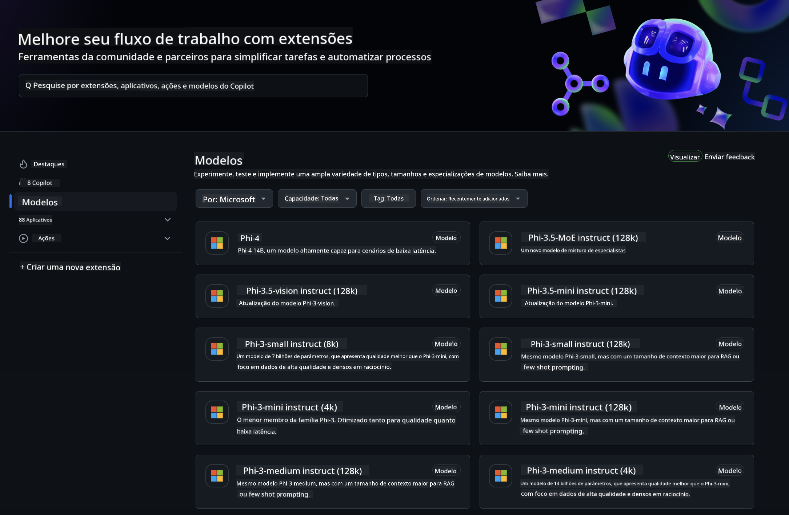
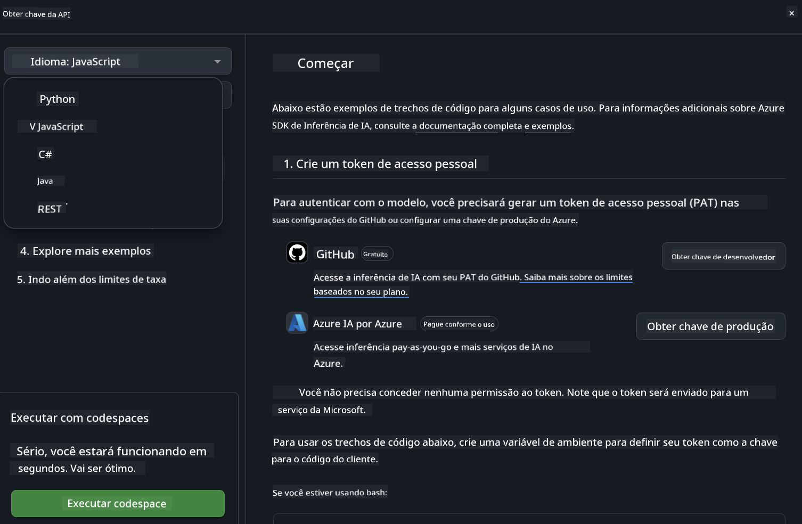
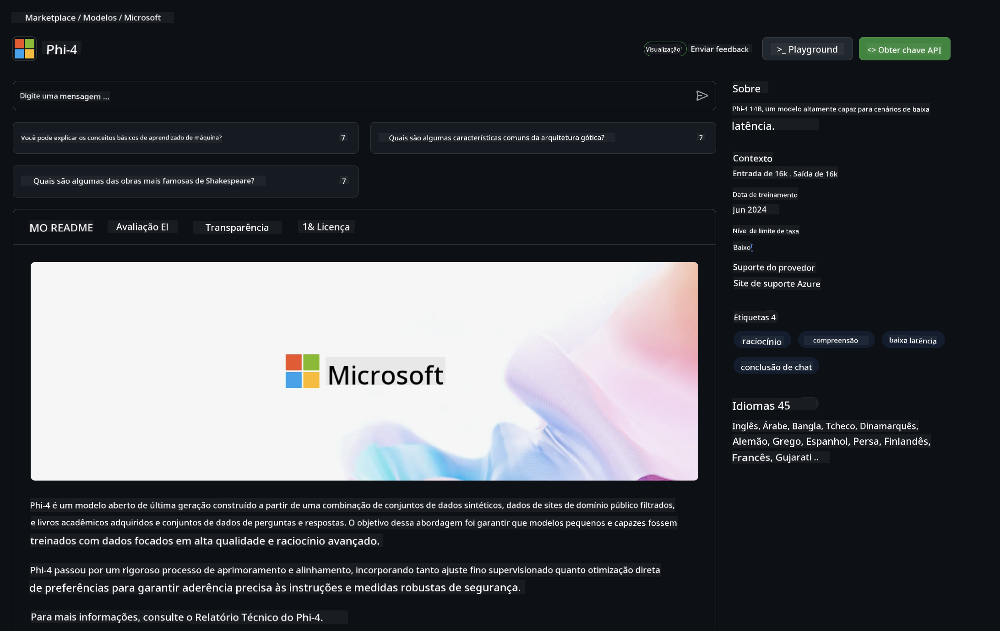

<!--
CO_OP_TRANSLATOR_METADATA:
{
  "original_hash": "5113634b77370af6790f9697d5d7de90",
  "translation_date": "2025-07-17T05:35:30+00:00",
  "source_file": "md/02.QuickStart/GitHubModel_QuickStart.md",
  "language_code": "br"
}
-->
## GitHub Models - Beta Pública Limitada

Bem-vindo ao [GitHub Models](https://github.com/marketplace/models)! Tudo está pronto para você explorar os Modelos de IA hospedados no Azure AI.



Para mais informações sobre os Modelos disponíveis no GitHub Models, confira o [GitHub Model Marketplace](https://github.com/marketplace/models)

## Modelos Disponíveis

Cada modelo possui um playground dedicado e código de exemplo


### Modelos Phi-3 no Catálogo do GitHub Model

[Phi-3-Medium-128k-Instruct](https://github.com/marketplace/models/azureml/Phi-3-medium-128k-instruct)

[Phi-3-medium-4k-instruct](https://github.com/marketplace/models/azureml/Phi-3-medium-4k-instruct)

[Phi-3-mini-128k-instruct](https://github.com/marketplace/models/azureml/Phi-3-mini-128k-instruct)

[Phi-3-mini-4k-instruct](https://github.com/marketplace/models/azureml/Phi-3-mini-4k-instruct)

[Phi-3-small-128k-instruct](https://github.com/marketplace/models/azureml/Phi-3-small-128k-instruct)

[Phi-3-small-8k-instruct](https://github.com/marketplace/models/azureml/Phi-3-small-8k-instruct)

## Começando

Existem alguns exemplos básicos prontos para você executar. Você pode encontrá-los no diretório samples. Se quiser ir direto para sua linguagem favorita, os exemplos estão disponíveis nas seguintes linguagens:

- Python
- JavaScript
- cURL

Também há um ambiente Codespaces dedicado para rodar os exemplos e modelos.



## Código de Exemplo

Abaixo estão trechos de código para alguns casos de uso. Para mais informações sobre o Azure AI Inference SDK, consulte a documentação completa e os exemplos.

## Configuração

1. Crie um token de acesso pessoal  
Você não precisa conceder nenhuma permissão ao token. Note que o token será enviado para um serviço da Microsoft.

Para usar os trechos de código abaixo, crie uma variável de ambiente para definir seu token como a chave para o código cliente.

Se estiver usando bash:  
```
export GITHUB_TOKEN="<your-github-token-goes-here>"
```  
Se estiver usando powershell:  

```
$Env:GITHUB_TOKEN="<your-github-token-goes-here>"
```  

Se estiver usando o prompt de comando do Windows:  

```
set GITHUB_TOKEN=<your-github-token-goes-here>
```  

## Exemplo em Python

### Instale as dependências  
Instale o Azure AI Inference SDK usando pip (Requer: Python >=3.8):

```
pip install azure-ai-inference
```  
### Execute um exemplo básico

Este exemplo demonstra uma chamada básica para a API de chat completion. Ele utiliza o endpoint de inferência do modelo de IA do GitHub e seu token do GitHub. A chamada é síncrona.

```
import os
from azure.ai.inference import ChatCompletionsClient
from azure.ai.inference.models import SystemMessage, UserMessage
from azure.core.credentials import AzureKeyCredential

endpoint = "https://models.inference.ai.azure.com"
# Replace Model_Name 
model_name = "Phi-3-small-8k-instruct"
token = os.environ["GITHUB_TOKEN"]

client = ChatCompletionsClient(
    endpoint=endpoint,
    credential=AzureKeyCredential(token),
)

response = client.complete(
    messages=[
        SystemMessage(content="You are a helpful assistant."),
        UserMessage(content="What is the capital of France?"),
    ],
    model=model_name,
    temperature=1.,
    max_tokens=1000,
    top_p=1.
)

print(response.choices[0].message.content)
```

### Execute uma conversa com múltiplas interações

Este exemplo demonstra uma conversa com múltiplas interações usando a API de chat completion. Ao usar o modelo para um aplicativo de chat, você precisará gerenciar o histórico da conversa e enviar as mensagens mais recentes para o modelo.

```
import os
from azure.ai.inference import ChatCompletionsClient
from azure.ai.inference.models import AssistantMessage, SystemMessage, UserMessage
from azure.core.credentials import AzureKeyCredential

token = os.environ["GITHUB_TOKEN"]
endpoint = "https://models.inference.ai.azure.com"
# Replace Model_Name
model_name = "Phi-3-small-8k-instruct"

client = ChatCompletionsClient(
    endpoint=endpoint,
    credential=AzureKeyCredential(token),
)

messages = [
    SystemMessage(content="You are a helpful assistant."),
    UserMessage(content="What is the capital of France?"),
    AssistantMessage(content="The capital of France is Paris."),
    UserMessage(content="What about Spain?"),
]

response = client.complete(messages=messages, model=model_name)

print(response.choices[0].message.content)
```

### Transmita a saída

Para uma melhor experiência do usuário, você vai querer transmitir a resposta do modelo para que o primeiro token apareça rapidamente e você evite esperar por respostas longas.

```
import os
from azure.ai.inference import ChatCompletionsClient
from azure.ai.inference.models import SystemMessage, UserMessage
from azure.core.credentials import AzureKeyCredential

token = os.environ["GITHUB_TOKEN"]
endpoint = "https://models.inference.ai.azure.com"
# Replace Model_Name
model_name = "Phi-3-small-8k-instruct"

client = ChatCompletionsClient(
    endpoint=endpoint,
    credential=AzureKeyCredential(token),
)

response = client.complete(
    stream=True,
    messages=[
        SystemMessage(content="You are a helpful assistant."),
        UserMessage(content="Give me 5 good reasons why I should exercise every day."),
    ],
    model=model_name,
)

for update in response:
    if update.choices:
        print(update.choices[0].delta.content or "", end="")

client.close()
```  
## JavaScript

### Instale as dependências

Instale o Node.js.

Copie as linhas abaixo e salve como um arquivo package.json dentro da sua pasta.

```
{
  "type": "module",
  "dependencies": {
    "@azure-rest/ai-inference": "latest",
    "@azure/core-auth": "latest",
    "@azure/core-sse": "latest"
  }
}
```

Nota: @azure/core-sse é necessário apenas quando você transmite a resposta das chat completions.

Abra um terminal nessa pasta e execute npm install.

Para cada trecho de código abaixo, copie o conteúdo para um arquivo sample.js e execute com node sample.js.

### Execute um exemplo básico

Este exemplo demonstra uma chamada básica para a API de chat completion. Ele utiliza o endpoint de inferência do modelo de IA do GitHub e seu token do GitHub. A chamada é síncrona.

```
import ModelClient from "@azure-rest/ai-inference";
import { AzureKeyCredential } from "@azure/core-auth";

const token = process.env["GITHUB_TOKEN"];
const endpoint = "https://models.inference.ai.azure.com";
// Update your modelname
const modelName = "Phi-3-small-8k-instruct";

export async function main() {

  const client = new ModelClient(endpoint, new AzureKeyCredential(token));

  const response = await client.path("/chat/completions").post({
    body: {
      messages: [
        { role:"system", content: "You are a helpful assistant." },
        { role:"user", content: "What is the capital of France?" }
      ],
      model: modelName,
      temperature: 1.,
      max_tokens: 1000,
      top_p: 1.
    }
  });

  if (response.status !== "200") {
    throw response.body.error;
  }
  console.log(response.body.choices[0].message.content);
}

main().catch((err) => {
  console.error("The sample encountered an error:", err);
});
```

### Execute uma conversa com múltiplas interações

Este exemplo demonstra uma conversa com múltiplas interações usando a API de chat completion. Ao usar o modelo para um aplicativo de chat, você precisará gerenciar o histórico da conversa e enviar as mensagens mais recentes para o modelo.

```
import ModelClient from "@azure-rest/ai-inference";
import { AzureKeyCredential } from "@azure/core-auth";

const token = process.env["GITHUB_TOKEN"];
const endpoint = "https://models.inference.ai.azure.com";
// Update your modelname
const modelName = "Phi-3-small-8k-instruct";

export async function main() {

  const client = new ModelClient(endpoint, new AzureKeyCredential(token));

  const response = await client.path("/chat/completions").post({
    body: {
      messages: [
        { role: "system", content: "You are a helpful assistant." },
        { role: "user", content: "What is the capital of France?" },
        { role: "assistant", content: "The capital of France is Paris." },
        { role: "user", content: "What about Spain?" },
      ],
      model: modelName,
    }
  });

  if (response.status !== "200") {
    throw response.body.error;
  }

  for (const choice of response.body.choices) {
    console.log(choice.message.content);
  }
}

main().catch((err) => {
  console.error("The sample encountered an error:", err);
});
```

### Transmita a saída  
Para uma melhor experiência do usuário, você vai querer transmitir a resposta do modelo para que o primeiro token apareça rapidamente e você evite esperar por respostas longas.

```
import ModelClient from "@azure-rest/ai-inference";
import { AzureKeyCredential } from "@azure/core-auth";
import { createSseStream } from "@azure/core-sse";

const token = process.env["GITHUB_TOKEN"];
const endpoint = "https://models.inference.ai.azure.com";
// Update your modelname
const modelName = "Phi-3-small-8k-instruct";

export async function main() {

  const client = new ModelClient(endpoint, new AzureKeyCredential(token));

  const response = await client.path("/chat/completions").post({
    body: {
      messages: [
        { role: "system", content: "You are a helpful assistant." },
        { role: "user", content: "Give me 5 good reasons why I should exercise every day." },
      ],
      model: modelName,
      stream: true
    }
  }).asNodeStream();

  const stream = response.body;
  if (!stream) {
    throw new Error("The response stream is undefined");
  }

  if (response.status !== "200") {
    stream.destroy();
    throw new Error(`Failed to get chat completions, http operation failed with ${response.status} code`);
  }

  const sseStream = createSseStream(stream);

  for await (const event of sseStream) {
    if (event.data === "[DONE]") {
      return;
    }
    for (const choice of (JSON.parse(event.data)).choices) {
        process.stdout.write(choice.delta?.content ?? ``);
    }
  }
}

main().catch((err) => {
  console.error("The sample encountered an error:", err);
});
```

## REST

### Execute um exemplo básico

Cole o seguinte em um shell:

```
curl -X POST "https://models.inference.ai.azure.com/chat/completions" \
    -H "Content-Type: application/json" \
    -H "Authorization: Bearer $GITHUB_TOKEN" \
    -d '{
        "messages": [
            {
                "role": "system",
                "content": "You are a helpful assistant."
            },
            {
                "role": "user",
                "content": "What is the capital of France?"
            }
        ],
        "model": "Phi-3-small-8k-instruct"
    }'
```  
### Execute uma conversa com múltiplas interações

Chame a API de chat completion e envie o histórico da conversa:

```
curl -X POST "https://models.inference.ai.azure.com/chat/completions" \
    -H "Content-Type: application/json" \
    -H "Authorization: Bearer $GITHUB_TOKEN" \
    -d '{
        "messages": [
            {
                "role": "system",
                "content": "You are a helpful assistant."
            },
            {
                "role": "user",
                "content": "What is the capital of France?"
            },
            {
                "role": "assistant",
                "content": "The capital of France is Paris."
            },
            {
                "role": "user",
                "content": "What about Spain?"
            }
        ],
        "model": "Phi-3-small-8k-instruct"
    }'
```  
### Transmita a saída

Este é um exemplo de chamada ao endpoint com transmissão da resposta.

```
curl -X POST "https://models.inference.ai.azure.com/chat/completions" \
    -H "Content-Type: application/json" \
    -H "Authorization: Bearer $GITHUB_TOKEN" \
    -d '{
        "messages": [
            {
                "role": "system",
                "content": "You are a helpful assistant."
            },
            {
                "role": "user",
                "content": "Give me 5 good reasons why I should exercise every day."
            }
        ],
        "stream": true,
        "model": "Phi-3-small-8k-instruct"
    }'
```

## Uso GRATUITO e Limites de Taxa para GitHub Models



Os [limites de taxa para o playground e uso gratuito da API](https://docs.github.com/en/github-models/prototyping-with-ai-models#rate-limits) são pensados para ajudar você a experimentar os modelos e prototipar sua aplicação de IA. Para uso além desses limites, e para escalar sua aplicação, você deve provisionar recursos a partir de uma conta Azure e autenticar por lá, em vez de usar seu token pessoal do GitHub. Não é necessário alterar mais nada no seu código. Use este link para descobrir como ultrapassar os limites da camada gratuita no Azure AI.

### Avisos

Lembre-se que ao interagir com um modelo você está experimentando IA, portanto erros de conteúdo são possíveis.

O recurso está sujeito a vários limites (incluindo requisições por minuto, requisições por dia, tokens por requisição e requisições simultâneas) e não é projetado para casos de uso em produção.

GitHub Models utiliza o Azure AI Content Safety. Esses filtros não podem ser desativados como parte da experiência do GitHub Models. Se você decidir usar modelos por meio de um serviço pago, configure seus filtros de conteúdo conforme suas necessidades.

Este serviço está sujeito aos Termos de Pré-lançamento do GitHub.

**Aviso Legal**:  
Este documento foi traduzido utilizando o serviço de tradução por IA [Co-op Translator](https://github.com/Azure/co-op-translator). Embora nos esforcemos para garantir a precisão, esteja ciente de que traduções automáticas podem conter erros ou imprecisões. O documento original em seu idioma nativo deve ser considerado a fonte autorizada. Para informações críticas, recomenda-se tradução profissional humana. Não nos responsabilizamos por quaisquer mal-entendidos ou interpretações incorretas decorrentes do uso desta tradução.