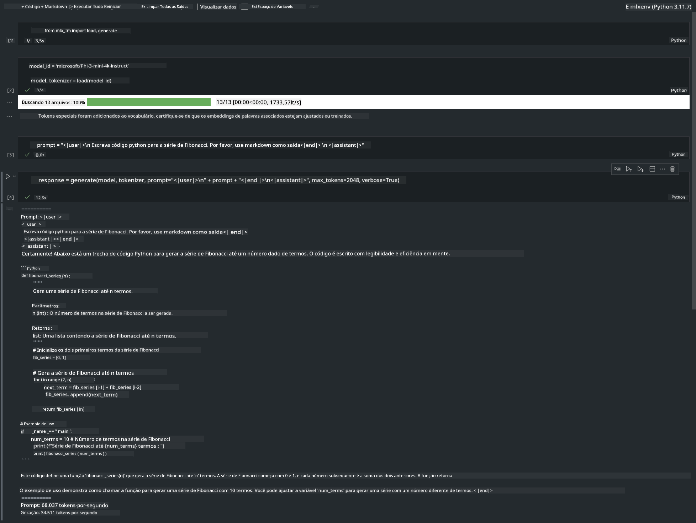

<!--
CO_OP_TRANSLATOR_METADATA:
{
  "original_hash": "dcb656f3d206fc4968e236deec5d4384",
  "translation_date": "2025-07-17T10:06:03+00:00",
  "source_file": "md/03.FineTuning/03.Inference/MLX_Inference.md",
  "language_code": "br"
}
-->
# **Inferência Phi-3 com o Framework Apple MLX**

## **O que é o Framework MLX**

MLX é um framework de arrays para pesquisa em aprendizado de máquina no Apple silicon, desenvolvido pela equipe de pesquisa em aprendizado de máquina da Apple.

MLX foi criado por pesquisadores de aprendizado de máquina para pesquisadores de aprendizado de máquina. O framework é pensado para ser fácil de usar, mas ainda assim eficiente para treinar e implantar modelos. O design do próprio framework também é conceitualmente simples. Nosso objetivo é facilitar para os pesquisadores a extensão e melhoria do MLX, permitindo explorar novas ideias rapidamente.

LLMs podem ser acelerados em dispositivos Apple Silicon através do MLX, e os modelos podem ser executados localmente de forma muito prática.

## **Usando MLX para inferir Phi-3-mini**

### **1. Configure seu ambiente MLX**

1. Python 3.11.x  
2. Instale a biblioteca MLX

```bash

pip install mlx-lm

```

### **2. Executando Phi-3-mini no Terminal com MLX**

```bash

python -m mlx_lm.generate --model microsoft/Phi-3-mini-4k-instruct --max-token 2048 --prompt  "<|user|>\nCan you introduce yourself<|end|>\n<|assistant|>"

```

O resultado (meu ambiente é Apple M1 Max, 64GB) é


### **3. Quantizando Phi-3-mini com MLX no Terminal**

```bash

python -m mlx_lm.convert --hf-path microsoft/Phi-3-mini-4k-instruct

```

***Note:*** O modelo pode ser quantizado através do mlx_lm.convert, e a quantização padrão é INT4. Este exemplo quantiza o Phi-3-mini para INT4.

O modelo pode ser quantizado através do mlx_lm.convert, e a quantização padrão é INT4. Este exemplo é para quantizar o Phi-3-mini em INT4. Após a quantização, ele será armazenado no diretório padrão ./mlx_model

Podemos testar o modelo quantizado com MLX pelo terminal

```bash

python -m mlx_lm.generate --model ./mlx_model/ --max-token 2048 --prompt  "<|user|>\nCan you introduce yourself<|end|>\n<|assistant|>"

```

O resultado é


### **4. Executando Phi-3-mini com MLX no Jupyter Notebook**



***Note:*** Por favor, leia este exemplo [clique neste link](../../../../../code/03.Inference/MLX/MLX_DEMO.ipynb)

## **Recursos**

1. Saiba mais sobre o Apple MLX Framework [https://ml-explore.github.io](https://ml-explore.github.io/mlx/build/html/index.html)

2. Repositório Apple MLX no GitHub [https://github.com/ml-explore](https://github.com/ml-explore)

**Aviso Legal**:  
Este documento foi traduzido utilizando o serviço de tradução por IA [Co-op Translator](https://github.com/Azure/co-op-translator). Embora nos esforcemos para garantir a precisão, esteja ciente de que traduções automáticas podem conter erros ou imprecisões. O documento original em seu idioma nativo deve ser considerado a fonte autorizada. Para informações críticas, recomenda-se tradução profissional humana. Não nos responsabilizamos por quaisquer mal-entendidos ou interpretações incorretas decorrentes do uso desta tradução.