<!--
CO_OP_TRANSLATOR_METADATA:
{
  "original_hash": "c1559c5af6caccf6f623fd43a6b3a9a3",
  "translation_date": "2025-05-09T20:29:48+00:00",
  "source_file": "md/03.FineTuning/FineTuning_AIFoundry.md",
  "language_code": "br"
}
-->
# Fine-tuning Phi-3 com Azure AI Foundry

Vamos explorar como fazer fine-tuning do modelo de linguagem Phi-3 Mini da Microsoft usando o Azure AI Foundry. O fine-tuning permite adaptar o Phi-3 Mini a tarefas específicas, tornando-o ainda mais potente e sensível ao contexto.

## Considerações

- **Capacidades:** Quais modelos podem ser fine-tuned? Para o que o modelo base pode ser ajustado?
- **Custo:** Qual é o modelo de precificação para fine-tuning?
- **Personalização:** Até que ponto posso modificar o modelo base – e de que formas?
- **Conveniência:** Como o fine-tuning acontece na prática – preciso escrever código personalizado? Preciso fornecer meu próprio poder de computação?
- **Segurança:** Modelos fine-tuned podem apresentar riscos de segurança – existem mecanismos de proteção para evitar danos não intencionais?

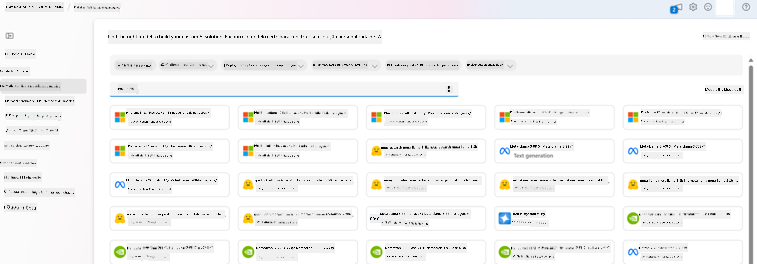

## Preparação para o fine-tuning

### Pré-requisitos

> [!NOTE]
> Para modelos da família Phi-3, a oferta de fine-tuning pay-as-you-go está disponível apenas para hubs criados na região **East US 2**.

- Uma assinatura do Azure. Se você não tem uma, crie uma [conta Azure paga](https://azure.microsoft.com/pricing/purchase-options/pay-as-you-go) para começar.

- Um [projeto AI Foundry](https://ai.azure.com?WT.mc_id=aiml-138114-kinfeylo).
- Controles de acesso baseados em função do Azure (Azure RBAC) são usados para conceder acesso às operações no Azure AI Foundry. Para executar os passos deste artigo, sua conta de usuário deve ter a __função Azure AI Developer__ atribuída ao grupo de recursos.

### Registro do provedor de assinatura

Verifique se a assinatura está registrada com o provedor de recursos `Microsoft.Network`.

1. Faça login no [portal Azure](https://portal.azure.com).
1. Selecione **Assinaturas** no menu à esquerda.
1. Escolha a assinatura que deseja usar.
1. Selecione **Configurações do projeto AI** > **Provedores de recursos** no menu à esquerda.
1. Confirme que **Microsoft.Network** está na lista de provedores. Caso contrário, adicione-o.

### Preparação dos dados

Prepare seus dados de treinamento e validação para fazer o fine-tuning do modelo. Seus conjuntos de dados devem conter exemplos de entrada e saída que representem como você deseja que o modelo funcione.

Garanta que todos os exemplos de treinamento sigam o formato esperado para inferência. Para um fine-tuning eficaz, mantenha um conjunto de dados equilibrado e diversificado.

Isso envolve manter o equilíbrio dos dados, incluir diferentes cenários e refinar periodicamente os dados de treinamento para alinhá-los às expectativas do mundo real, resultando em respostas mais precisas e equilibradas do modelo.

Diferentes tipos de modelo exigem formatos diferentes para os dados de treinamento.

### Chat Completion

Os dados de treinamento e validação que você usar **devem** estar no formato JSON Lines (JSONL). Para `Phi-3-mini-128k-instruct`, o conjunto de dados para fine-tuning deve estar no formato de conversação usado pela API de Chat completions.

### Exemplo de formato de arquivo

```json
    {"messages": [{"role": "system", "content": "You are an Xbox customer support agent whose primary goal is to help users with issues they are experiencing with their Xbox devices. You are friendly and concise. You only provide factual answers to queries, and do not provide answers that are not related to Xbox."}, {"role": "user", "content": "Is Xbox better than PlayStation?"}, {"role": "assistant", "content": "I apologize, but I cannot provide personal opinions. My primary job is to assist you with any issues related to your Xbox device. Do you have any Xbox-related issues that need addressing?"}]}
    {"messages": [{"role": "system", "content": "You are an Xbox customer support agent whose primary goal is to help users with issues they are experiencing with their Xbox devices. You are friendly and concise. You only provide factual answers to queries, and do not provide answers that are not related to Xbox."}, {"role": "user", "content": "Can I play PC games on my Xbox?"}, {"role": "assistant", "content": "While Xbox consoles don't natively support PC games, they can play an array of Xbox games, many of which are also available on PC. Can I assist you with finding games compatible with your Xbox device?"}]}
    {"messages": [{"role": "system", "content": "You are an Xbox customer support agent whose primary goal is to help users with issues they are experiencing with their Xbox devices. You are friendly and concise. You only provide factual answers to queries, and do not provide answers that are not related to Xbox."}, {"role": "user", "content": "I'm having trouble connecting my Xbox to the Wi-Fi."}, {"role": "assistant", "content": "No worries, let's go through the network settings on your Xbox. Can you please tell me what happens when you try to connect it to the Wi-Fi?"}]}
```

O tipo de arquivo suportado é JSON Lines. Os arquivos são enviados para o datastore padrão e disponibilizados no seu projeto.

## Fine-tuning Phi-3 com Azure AI Foundry

O Azure AI Foundry permite que você personalize grandes modelos de linguagem com seus próprios conjuntos de dados, usando um processo chamado fine-tuning. O fine-tuning traz muito valor ao permitir customização e otimização para tarefas e aplicações específicas. Isso resulta em melhor desempenho, eficiência de custo, menor latência e saídas ajustadas.

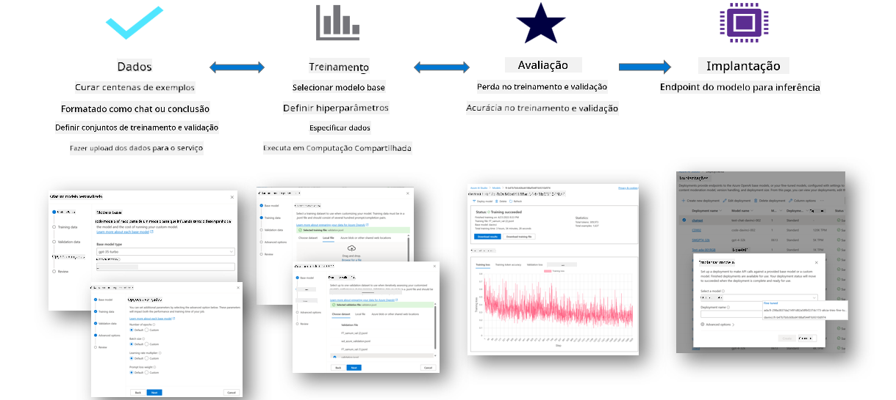

### Criar um novo projeto

1. Faça login no [Azure AI Foundry](https://ai.azure.com).

1. Selecione **+New project** para criar um novo projeto no Azure AI Foundry.

    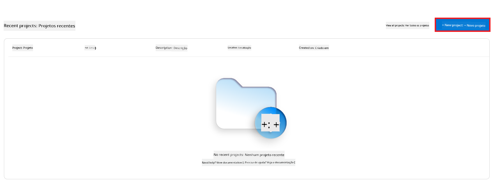

1. Realize as seguintes tarefas:

    - Nome do **Hub** do projeto. Deve ser um valor único.
    - Selecione o **Hub** a ser usado (crie um novo se necessário).

    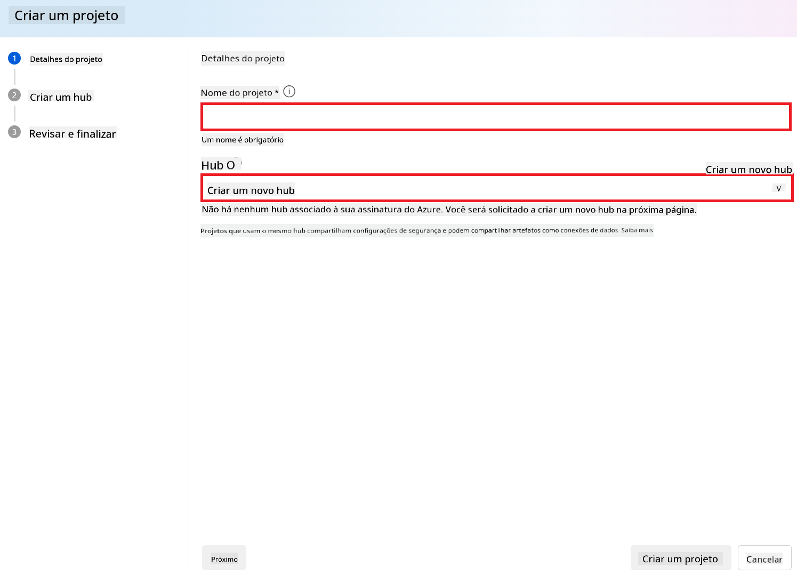

1. Para criar um novo hub, faça o seguinte:

    - Informe o **Nome do Hub**. Deve ser único.
    - Selecione sua **Assinatura** do Azure.
    - Selecione o **Grupo de recursos** a ser usado (crie um novo se necessário).
    - Selecione a **Localização** que deseja usar.
    - Selecione **Connect Azure AI Services** para usar (crie um novo se necessário).
    - Selecione **Connect Azure AI Search** para **Pular conexão**.

    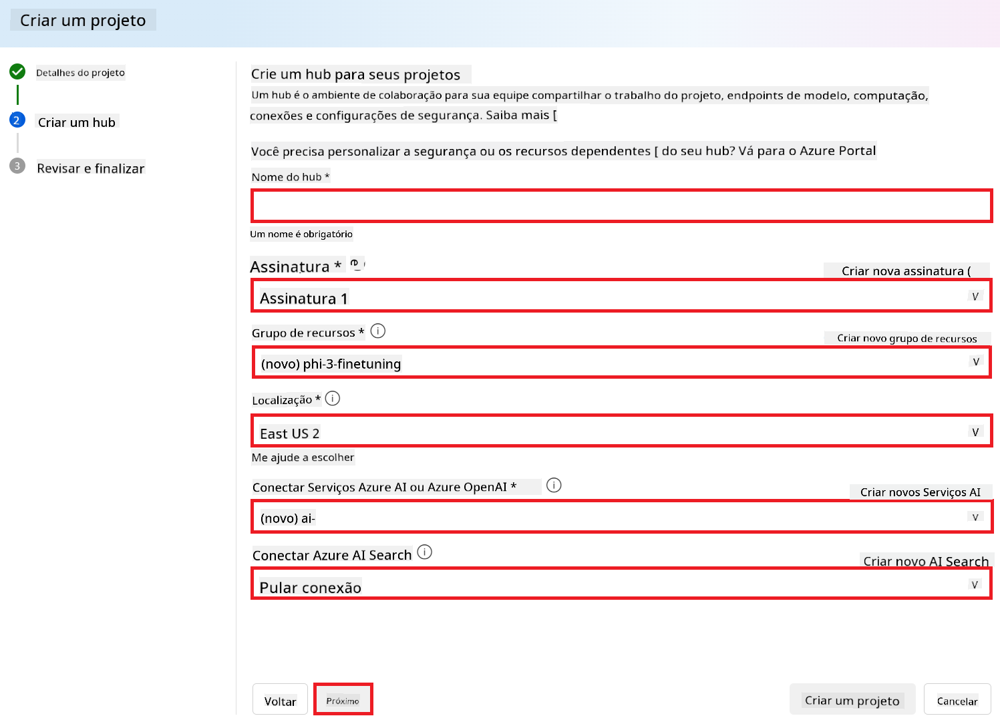

1. Clique em **Next**.
1. Clique em **Create a project**.

### Preparação dos dados

Antes do fine-tuning, reúna ou crie um conjunto de dados relevante para sua tarefa, como instruções de chat, pares pergunta-resposta ou qualquer outro texto pertinente. Limpe e pré-processe esses dados removendo ruídos, tratando valores ausentes e tokenizando o texto.

### Fine-tune modelos Phi-3 no Azure AI Foundry

> [!NOTE]
> O fine-tuning de modelos Phi-3 é atualmente suportado apenas em projetos localizados em East US 2.

1. Selecione **Model catalog** na aba do lado esquerdo.

1. Digite *phi-3* na **barra de busca** e escolha o modelo phi-3 que deseja usar.

    

1. Clique em **Fine-tune**.

    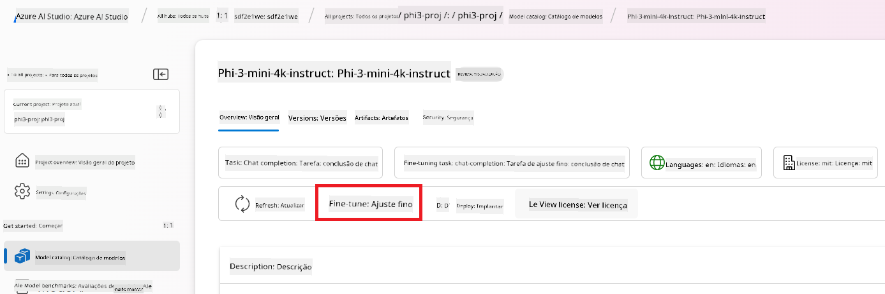

1. Informe o **Nome do modelo fine-tuned**.

    

1. Clique em **Next**.

1. Faça o seguinte:

    - Selecione o **tipo de tarefa** como **Chat completion**.
    - Selecione os **dados de treinamento** que deseja usar. Você pode enviá-los pelo Azure AI Foundry ou do seu ambiente local.

    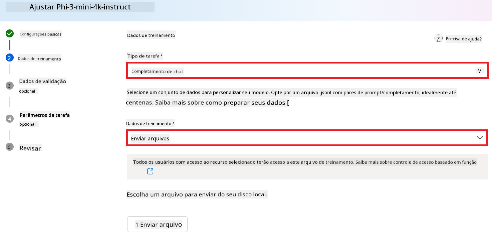

1. Clique em **Next**.

1. Envie os **dados de validação** que deseja usar ou selecione **Automatic split of training data**.

    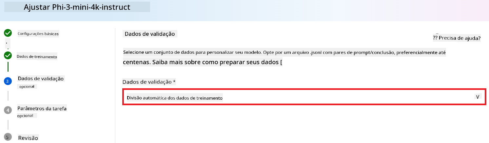

1. Clique em **Next**.

1. Configure os seguintes parâmetros:

    - Selecione o **Multiplicador do tamanho do lote** que deseja usar.
    - Selecione a **Taxa de aprendizado** que deseja usar.
    - Selecione o número de **Épocas** que deseja usar.

    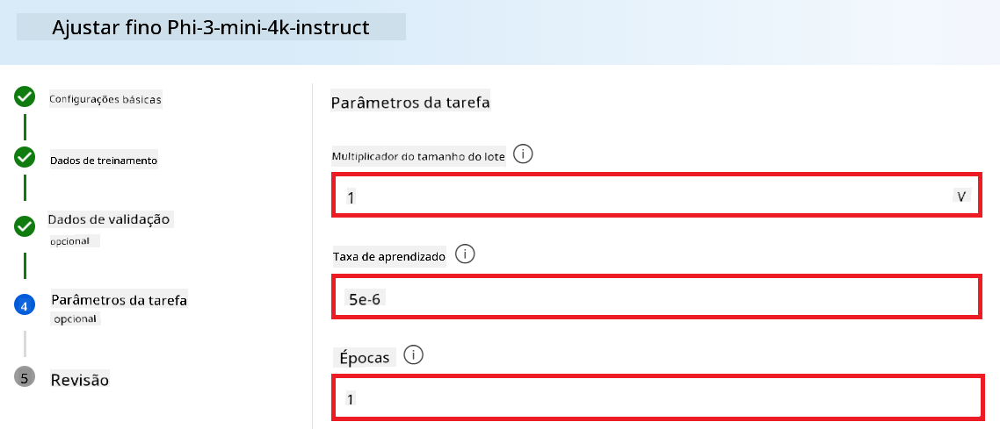

1. Clique em **Submit** para iniciar o processo de fine-tuning.

    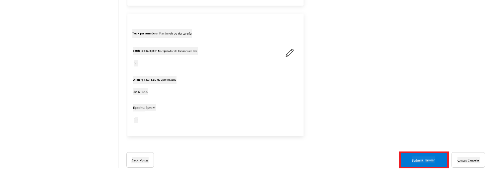

1. Quando seu modelo estiver fine-tuned, o status aparecerá como **Completed**, como mostrado na imagem abaixo. Agora você pode implantar o modelo e usá-lo em sua aplicação, no playground ou no prompt flow. Para mais detalhes, veja [Como implantar a família de modelos Phi-3 com Azure AI Foundry](https://learn.microsoft.com/azure/ai-studio/how-to/deploy-models-phi-3?tabs=phi-3-5&pivots=programming-language-python).

    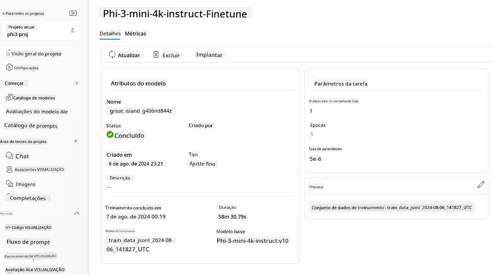

> [!NOTE]
> Para informações mais detalhadas sobre fine-tuning do Phi-3, visite [Fine-tune Phi-3 models in Azure AI Foundry](https://learn.microsoft.com/azure/ai-studio/how-to/fine-tune-phi-3?tabs=phi-3-mini).

## Limpando seus modelos fine-tuned

Você pode deletar um modelo fine-tuned da lista de modelos de fine-tuning no [Azure AI Foundry](https://ai.azure.com) ou na página de detalhes do modelo. Selecione o modelo fine-tuned que deseja deletar na página de Fine-tuning e clique no botão Deletar para removê-lo.

> [!NOTE]
> Você não pode deletar um modelo customizado se ele tiver uma implantação ativa. Primeiro, é preciso deletar a implantação antes de remover o modelo customizado.

## Custos e cotas

### Considerações sobre custos e cotas para modelos Phi-3 fine-tuned como serviço

Modelos Phi fine-tuned como serviço são oferecidos pela Microsoft e integrados ao Azure AI Foundry para uso. Você pode consultar os preços ao [implantar](https://learn.microsoft.com/azure/ai-studio/how-to/deploy-models-phi-3?tabs=phi-3-5&pivots=programming-language-python) ou fazer o fine-tuning dos modelos na aba de Preços e termos do assistente de implantação.

## Filtragem de conteúdo

Modelos implantados como serviço pay-as-you-go são protegidos pelo Azure AI Content Safety. Ao implantar em endpoints em tempo real, você pode optar por desativar essa funcionalidade. Com o Azure AI Content Safety ativado, tanto o prompt quanto a resposta passam por um conjunto de modelos de classificação que detectam e previnem a geração de conteúdo prejudicial. O sistema de filtragem identifica e age sobre categorias específicas de conteúdo potencialmente nocivo, tanto nos prompts de entrada quanto nas respostas. Saiba mais sobre [Azure AI Content Safety](https://learn.microsoft.com/azure/ai-studio/concepts/content-filtering).

**Configuração do Fine-Tuning**

Hyperparâmetros: Defina hyperparâmetros como taxa de aprendizado, tamanho do lote e número de épocas de treinamento.

**Função de perda**

Escolha uma função de perda adequada para sua tarefa (ex: cross-entropy).

**Otimizador**

Selecione um otimizador (ex: Adam) para atualização dos gradientes durante o treinamento.

**Processo de Fine-Tuning**

- Carregar Modelo Pré-Treinado: Carregue o checkpoint do Phi-3 Mini.
- Adicionar Camadas Customizadas: Adicione camadas específicas para a tarefa (ex: cabeça de classificação para instruções de chat).

**Treinar o Modelo**  
Faça o fine-tuning do modelo usando seu conjunto de dados preparado. Acompanhe o progresso do treinamento e ajuste os hyperparâmetros conforme necessário.

**Avaliação e Validação**

Conjunto de Validação: Separe seus dados em conjuntos de treinamento e validação.

**Avaliar Desempenho**

Use métricas como acurácia, F1-score ou perplexidade para avaliar o desempenho do modelo.

## Salvar Modelo Fine-Tuned

**Checkpoint**  
Salve o checkpoint do modelo fine-tuned para uso futuro.

## Implantação

- Implemente como Serviço Web: Faça o deploy do seu modelo fine-tuned como um serviço web no Azure AI Foundry.
- Teste o Endpoint: Envie consultas de teste para o endpoint implantado para verificar sua funcionalidade.

## Iterar e Melhorar

Itere: Se o desempenho não estiver satisfatório, ajuste hyperparâmetros, adicione mais dados ou faça fine-tuning por mais épocas.

## Monitorar e Refinar

Monitore continuamente o comportamento do modelo e refine conforme necessário.

## Personalizar e Expandir

Tarefas customizadas: O Phi-3 Mini pode ser fine-tuned para diversas tarefas além de instruções de chat. Explore outros casos de uso!  
Experimente: Teste diferentes arquiteturas, combinações de camadas e técnicas para melhorar o desempenho.

> [!NOTE]
> O fine-tuning é um processo iterativo. Experimente, aprenda e adapte seu modelo para alcançar os melhores resultados para sua tarefa específica!

**Aviso Legal**:  
Este documento foi traduzido usando o serviço de tradução automática [Co-op Translator](https://github.com/Azure/co-op-translator). Embora nos esforcemos para garantir a precisão, esteja ciente de que traduções automáticas podem conter erros ou imprecisões. O documento original em seu idioma nativo deve ser considerado a fonte autorizada. Para informações críticas, recomenda-se a tradução profissional feita por humanos. Não nos responsabilizamos por quaisquer mal-entendidos ou interpretações incorretas decorrentes do uso desta tradução.