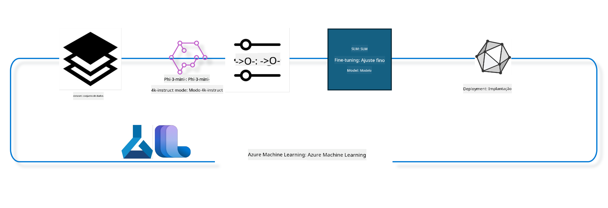

<!--
CO_OP_TRANSLATOR_METADATA:
{
  "original_hash": "944949f040e61b2ea25b3460f7394fd4",
  "translation_date": "2025-05-09T21:05:03+00:00",
  "source_file": "md/03.FineTuning/FineTuning_MLSDK.md",
  "language_code": "br"
}
-->
## Penañsoù pouezus :  
1. NA add ket '''markdown pe stumm all a tagoù war ar c'hemmoù  
2. Gwiriit e vefe ar c'hemmadur hep bezañ re litaral  
3. Trokit ivez ar c'hemmadurioù  
4. Ar restr-mañ zo skrivet e stumm Markdown - na derc'helit ket outo evel XML pe HTML  
5. Na trokit ket :  
   - [!NOTE], [!WARNING], [!TIP], [!IMPORTANT], [!CAUTION]  
   - Anvioù argemmoù, anvioù arc'hwelioù, anvioù klasoù  
   - Plasennadoù evel @@INLINE_CODE_x@@ pe @@CODE_BLOCK_x@@  
   - URLoù pe hentadoù  
6. Dav eo derc'hel an holl furmad markdown orin  
7. Distreiñ an danvez troet hep tagoù pe markadoù ouzhpenn  
Skrivit ar produiad a-gleiz da dreizh.

## Penañ penaos implijout an elfenn chat-completion eus ar Azure ML system registry evit gwellañ ur model

Emañ ar muiañ er sammad-mañ da lakaat war-wel penaos ober ar gwellañ model Phi-3-mini-4k-instruct evit echuiñ ur gweladenn etre daou dud o implijout ar roadennoù ultrachat_200k.



Ar sammad-mañ a ziskouez penaos ober ar gwellañ gant Azure ML SDK ha Python ha goude deployañ ar model gwellaet war ur servij war al lec'h evit diskoulmoù e-prantad gwir.

### Roadennoù stummañ

Implijimp ar roadenn ultrachat_200k. Ur verzion kalz e filtet eus ar roadenn UltraChat eo ha bet implijet evit stummañ Zephyr-7B-β, ur model chat 7b a-hed an amzer.

### Model

Implijomp ar model Phi-3-mini-4k-instruct evit mont war-well ur model evit al labour chat-completion. Ma'z oc'h digoret al levr-notebook-mañ eus ur bajenn model resis, soñjit da ziremel anv ar model.

### Labourioù

- Dibabit ur model da wellaat.
- Dibabit ha sellet ouzh roadennoù stummañ.
- Kemm an afer gwellañ.
- Gwerzhañ ar gwellañ.
- Sellet ouzh ar metrikoù stummañ ha prientiñ.
- Enrollañ ar model gwellaet.
- Deployañ ar model gwellaet evit diskoulmoù e-prantad gwir.
- Lakaat an traoù d'ober.

## 1. Krouiñ ar benvegioù kentañ

- Staliañ ar c'houlzadioù ezhomm
- Kevrekaat ouzh AzureML Workspace. Gwellaat e kaver muioc'h war set up SDK authentication. Kemer lec'h e lec'h <WORKSPACE_NAME>, <RESOURCE_GROUP> ha <SUBSCRIPTION_ID> a-us.
- Kevrekaat ouzh azureml system registry
- Rannañ anv eksperiñ evit ar pezh a c'hall bezañ
- Gwiriñ pe krouiñ ur compute.

> [!NOTE]  
> Ez eo ret bezañ gant un neud GPU hepken met e c'hall bezañ meur a GPU en ur neud. Da skouer, e Standard_NC24rs_v3 ez eus 4 NVIDIA V100 GPUs, ha e Standard_NC12s_v3 ez eus 2 NVIDIA V100 GPUs. Sellit ouzh an teulioù evit an titouroù-se. Niver ar GPU e pep neud a zo merket e param gpus_per_node a-us. Ober ar pezh mat evit ar param-se a garanti implij mat an holl GPU e pep neud. Ar GPU compute SKUs a ginnigomp zo amañ ha amañ.

### Lirioù Python

Staliet ar c'houlzadioù dre redek ar c'heler a-is. N'eo ket ur poent dibabet ma'z oc'h o redek en un endro nevez.

```bash
pip install azure-ai-ml
pip install azure-identity
pip install datasets==2.9.0
pip install mlflow
pip install azureml-mlflow
```

### Ober gant Azure ML

1. Skript Python-mañ a implij Azure Machine Learning (Azure ML). Setu un enklask eus ar pezh a ra:

    - Enporzhia modulioù ezhomm eus azure.ai.ml, azure.identity, ha azure.ai.ml.entities. Enporzhia ivez modul time.

    - Klask a ra ober an autentifikadur gant DefaultAzureCredential(), a ro un doare simplañ da ober ar c'hemm evit kregiñ buan gant ar c'hod en Azure. Ma fell ket, e cheñch da InteractiveBrowserCredential(), a ginnig ur c'hinnig login gant ar merdeer.

    - Klask a ra krouiñ un MLClient gant from_config, a lenn an azasadur e config.json. Ma fell ket, e krou ur MLClient gant subscription_id, resource_group_name, ha workspace_name dre evezhiañ.

    - Krou ur MLClient all evit azure ML registry anvet "azureml". Er registry-mañ e vez enrollet ar modeloù, pipelineoù gwellañ, ha an endroioù.

    - Rannañ anv eksperiñ "chat_completion_Phi-3-mini-4k-instruct".

    - Krou ur niverenn amzer unvan dre ober un int eus ar mare bremañ (e eilennadoù eus an epoch) ha kemmañ e stumm ur strivenn. Ar niverenn-mañ a c'hall servij evit krouiñ anvioù ha restroù unvan.

    ```python
    # Import necessary modules from Azure ML and Azure Identity
    from azure.ai.ml import MLClient
    from azure.identity import (
        DefaultAzureCredential,
        InteractiveBrowserCredential,
    )
    from azure.ai.ml.entities import AmlCompute
    import time  # Import time module
    
    # Try to authenticate using DefaultAzureCredential
    try:
        credential = DefaultAzureCredential()
        credential.get_token("https://management.azure.com/.default")
    except Exception as ex:  # If DefaultAzureCredential fails, use InteractiveBrowserCredential
        credential = InteractiveBrowserCredential()
    
    # Try to create an MLClient instance using the default config file
    try:
        workspace_ml_client = MLClient.from_config(credential=credential)
    except:  # If that fails, create an MLClient instance by manually providing the details
        workspace_ml_client = MLClient(
            credential,
            subscription_id="<SUBSCRIPTION_ID>",
            resource_group_name="<RESOURCE_GROUP>",
            workspace_name="<WORKSPACE_NAME>",
        )
    
    # Create another MLClient instance for the Azure ML registry named "azureml"
    # This registry is where models, fine-tuning pipelines, and environments are stored
    registry_ml_client = MLClient(credential, registry_name="azureml")
    
    # Set the experiment name
    experiment_name = "chat_completion_Phi-3-mini-4k-instruct"
    
    # Generate a unique timestamp that can be used for names and versions that need to be unique
    timestamp = str(int(time.time()))
    ```

## 2. Dibabit ur model diazezet da wellaat

1. Phi-3-mini-4k-instruct zo ur model a 3.8B parametrou, skañv ha modern, bet savet war roadennoù implijet evit Phi-2. Ar model-se a zo eus familh Phi-3, ha an hini Mini zo e 2 stumm 4K ha 128K (a zispleg an niverenn tokenn e c'hall derc'hel). Ret eo gwellañ ar model evit hor pal resis. Gallout a rez sellet ouzh ar modeloù-se er Model Catalog e AzureML Studio, hepken oc'h lammat war ar labour chat-completion. En arouez-mañ e implijomp Phi-3-mini-4k-instruct. Ma'z oc'h o implij ur model all, kemerit an anv hag ar stumm.

    > [!NOTE]  
    > ar propreded id model. An hini-se a vo kaset d'ar gont gwellañ. Gweler ivez e pennad Asset ID e pajenn titouroù ar model e Model Catalog e AzureML Studio.

2. Skript Python-mañ a ober gant Azure Machine Learning. Setu an enklask:

    - Rannañ an anv model_name da "Phi-3-mini-4k-instruct".

    - Implij get diwar models eus registry_ml_client evit kaout an hini diwezhañ eus ar model gant an anv resis. An argumantoù a zo anv ar model ha label evit an hini diwezhañ.

    - Diskouez ur gemenn d'ar consol diwar-benn anv, stumm, ha id ar model a vo implijet evit gwellañ. Implijout format evit enrollañ an titouroù-se eus foundation_model.

    ```python
    # Set the model name
    model_name = "Phi-3-mini-4k-instruct"
    
    # Get the latest version of the model from the Azure ML registry
    foundation_model = registry_ml_client.models.get(model_name, label="latest")
    
    # Print the model name, version, and id
    # This information is useful for tracking and debugging
    print(
        "\n\nUsing model name: {0}, version: {1}, id: {2} for fine tuning".format(
            foundation_model.name, foundation_model.version, foundation_model.id
        )
    )
    ```

## 3. Krouiñ ur compute da implijout gant ar gont

Ar gont gwellañ a labour KENEK gant GPU compute hepken. Brasder ar compute a zispleg an hirder model, ha kalz a wech e vez diaes dibab ar compute reizh. En arouez-mañ e sikouromp an implijer da dibab ar compute reizh.

> [!NOTE]  
> An computeoù en ur roll a-us a labour gant ar furmad gwellañ. Kemm ebet er furmad-mañ a c'hall krouiñ fazi CUDA Out Of Memory. E pezh-se e klaskit mont da compute brasoc'h.

> [!NOTE]  
> Pa dibabit compute_cluster_size, gwiriit e vez kavet ar compute er resource group. Ma n'eus ket an compute resis, e c'hallit ober ur goulenn evit kavout an tu da implij an arzhoù compute.

### Gwiriadur Model evit skoazell ar gwellañ

1. Skript Python-mañ a labour gant ur model Azure Machine Learning. Setu an enklask:

    - Enporzhia modul ast evit ober gant ar c'hemmadurioù Python.

    - Gwiriout ma 'z eus ur tag finetune_compute_allow_list war foundation_model. Ar tagoù e Azure ML zo juioù kleier-ha-kleier evit lakaat ur model war ur roll pe ur stumm.

    - Ma 'z eus ar tag, implij ast.literal_eval evit lakaat an destenn er tag da listenn Python, ha lakaat ar listenn-se e varr computes_allow_list. Diskouez ur gemenn da lavarout e ranker krouiñ ur compute eus ar roll-se.

    - Ma n'eus ket ar tag, lakaat computes_allow_list da None ha diskouez ur gemenn da lavarout e n'eo ket en ur roll ar tag finetune_compute_allow_list.

    - Er fin, skript a glask ur tag resis en metadonneoù ar model, a cheñch e stumm da listenn ma vez kavet, ha diskouez ar respont d'an implijer.

    ```python
    # Import the ast module, which provides functions to process trees of the Python abstract syntax grammar
    import ast
    
    # Check if the 'finetune_compute_allow_list' tag is present in the model's tags
    if "finetune_compute_allow_list" in foundation_model.tags:
        # If the tag is present, use ast.literal_eval to safely parse the tag's value (a string) into a Python list
        computes_allow_list = ast.literal_eval(
            foundation_model.tags["finetune_compute_allow_list"]
        )  # convert string to python list
        # Print a message indicating that a compute should be created from the list
        print(f"Please create a compute from the above list - {computes_allow_list}")
    else:
        # If the tag is not present, set computes_allow_list to None
        computes_allow_list = None
        # Print a message indicating that the 'finetune_compute_allow_list' tag is not part of the model's tags
        print("`finetune_compute_allow_list` is not part of model tags")
    ```

### Gwiriadur Compute Instance

1. Skript Python-mañ a labour gant Azure Machine Learning ha gwiriañ ur compute instance. Setu an enklask:

    - Klask a ra kavout compute instance gant anv compute_cluster eus workspace Azure ML. Ma vez ar stad "failed" e throw un ValueError.

    - Gwiriout ma n'eo ket None computes_allow_list. Ma n'eo ket, e cheñch an holl anvioù compute da lower case hag e sellet ma vez an anv compute e listenn. Ma n'eo ket, e throw un ValueError.

    - Ma n'eo ket compute_allow_list, e sellet ma vez an anv compute e roll compute VM GPU a vez diweredekaet. Ma vez, e throw un ValueError.

    - Kavout roll an holl computeoù kavet er workspace. Mont dre roll ha gwelout ma vez anv compute hemañ er roll. Ma vez, kavout niver ar GPU ha lakaat gpu_count_found da True.

    - Ma vez gpu_count_found True, diskouez niver ar GPU. Ma n'eo ket, throw un ValueError.

    - En holl, skript a gwiriañ ar compute instance e Azure ML, e sellet ouzh ar stad, ar roll er listenn aotreet pe diweredekaet, ha niver ar GPUoù.

    ```python
    # Print the exception message
    print(e)
    # Raise a ValueError if the compute size is not available in the workspace
    raise ValueError(
        f"WARNING! Compute size {compute_cluster_size} not available in workspace"
    )
    
    # Retrieve the compute instance from the Azure ML workspace
    compute = workspace_ml_client.compute.get(compute_cluster)
    # Check if the provisioning state of the compute instance is "failed"
    if compute.provisioning_state.lower() == "failed":
        # Raise a ValueError if the provisioning state is "failed"
        raise ValueError(
            f"Provisioning failed, Compute '{compute_cluster}' is in failed state. "
            f"please try creating a different compute"
        )
    
    # Check if computes_allow_list is not None
    if computes_allow_list is not None:
        # Convert all compute sizes in computes_allow_list to lowercase
        computes_allow_list_lower_case = [x.lower() for x in computes_allow_list]
        # Check if the size of the compute instance is in computes_allow_list_lower_case
        if compute.size.lower() not in computes_allow_list_lower_case:
            # Raise a ValueError if the size of the compute instance is not in computes_allow_list_lower_case
            raise ValueError(
                f"VM size {compute.size} is not in the allow-listed computes for finetuning"
            )
    else:
        # Define a list of unsupported GPU VM sizes
        unsupported_gpu_vm_list = [
            "standard_nc6",
            "standard_nc12",
            "standard_nc24",
            "standard_nc24r",
        ]
        # Check if the size of the compute instance is in unsupported_gpu_vm_list
        if compute.size.lower() in unsupported_gpu_vm_list:
            # Raise a ValueError if the size of the compute instance is in unsupported_gpu_vm_list
            raise ValueError(
                f"VM size {compute.size} is currently not supported for finetuning"
            )
    
    # Initialize a flag to check if the number of GPUs in the compute instance has been found
    gpu_count_found = False
    # Retrieve a list of all available compute sizes in the workspace
    workspace_compute_sku_list = workspace_ml_client.compute.list_sizes()
    available_sku_sizes = []
    # Iterate over the list of available compute sizes
    for compute_sku in workspace_compute_sku_list:
        available_sku_sizes.append(compute_sku.name)
        # Check if the name of the compute size matches the size of the compute instance
        if compute_sku.name.lower() == compute.size.lower():
            # If it does, retrieve the number of GPUs for that compute size and set gpu_count_found to True
            gpus_per_node = compute_sku.gpus
            gpu_count_found = True
    # If gpu_count_found is True, print the number of GPUs in the compute instance
    if gpu_count_found:
        print(f"Number of GPU's in compute {compute.size}: {gpus_per_node}")
    else:
        # If gpu_count_found is False, raise a ValueError
        raise ValueError(
            f"Number of GPU's in compute {compute.size} not found. Available skus are: {available_sku_sizes}."
            f"This should not happen. Please check the selected compute cluster: {compute_cluster} and try again."
        )
    ```

## 4. Dibabit ar roadenn evit gwellañ ar model

1. Implijomp roadenn ultrachat_200k. Ar roadenn zo divizet e pevar rann, mat evit Supervised fine-tuning (sft). Rannad ranking (gen). An niver a skouerioù e pep rann zo amañ :

    ```bash
    train_sft test_sft  train_gen  test_gen
    207865  23110  256032  28304
    ```

1. An nebeud kelennoù a-us a ziskouez ar prientiñ diazez evit gwellañ :

### Diskouez ur nebeud linenn roadennoù

Hoffimp ma vefe buan an enklask-mañ, neuze enrollit train_sft, test_sft gant 5% eus ar roadennoù roet dija. Se a dalv da model gwellaet hep kalz a fazioù, ne rank ket bezañ implijet er bed gwir. download-dataset.py a implij da download roadenn ultrachat_200k ha kemmañ ar roadenn da furmad evit pipeline gwellañ. Koulskoude, abalamour d'ar roadenn bras, n'eus amañ nemet ur rann eus ar roadenn.

1. Redezit ar skript a-is evit download 5% eus ar roadenn. Gallout a ra bezañ liesaat dre kemmañ dataset_split_pc d'ar procentaj ho peus c'hoant.

    > [!NOTE]  
    > Lod modeloù yezh zo gant kodoù yezh disheñvel, neuze anv ar c'holonnennoù er roadenn a rank bezañ hepmuiken.

1. Da skouer, setu penaos e rank bezañ an roadenn  
Ar roadenn chat-completion a vez enrollet e furmad parquet gant pep enskrivadenn o heul ar skeudenn-mañ:

    - Ur restr JSON eo (JavaScript Object Notation), ur furmad evit stummañ ha kas roadennoù. N'eo ket kod da redek, met ur furmad da stummañ ha kas data. Setu ur enklask war ar skeudenn:

    - "prompt": Un eilenn testenn a ro ur goulenn pe ur pal d'ar AI.

    - "messages": Un roll objektoù. Pep objekt a zo ur gemenn er gweladenn etre implijer ha AI. Pep objekt a zo daou klever:

    - "content": An destenn eus ar gemenn.
    - "role": An anv eus ar roll a ro ar gemenn, "user" pe "assistant".
    - "prompt_id": Un anv unvan evit ar prompt.

1. E gwirionez, ur gweladenn eo amañ e lec'h ma c'houlenn un implijer digant ar AI krouiñ ur protagonisted evit ur istor dystopiek. Respont a ra ar AI, ha goude e c'houlenn muioc'h an implijer. Ar AI a ro muioc'h a ditouroù. An holl gweladenn a zo liammet gant un id prompt resis.

    ```python
    {
        // The task or question posed to an AI assistant
        "prompt": "Create a fully-developed protagonist who is challenged to survive within a dystopian society under the rule of a tyrant. ...",
        
        // An array of objects, each representing a message in a conversation between a user and an AI assistant
        "messages":[
            {
                // The content of the user's message
                "content": "Create a fully-developed protagonist who is challenged to survive within a dystopian society under the rule of a tyrant. ...",
                // The role of the entity that sent the message
                "role": "user"
            },
            {
                // The content of the assistant's message
                "content": "Name: Ava\n\n Ava was just 16 years old when the world as she knew it came crashing down. The government had collapsed, leaving behind a chaotic and lawless society. ...",
                // The role of the entity that sent the message
                "role": "assistant"
            },
            {
                // The content of the user's message
                "content": "Wow, Ava's story is so intense and inspiring! Can you provide me with more details.  ...",
                // The role of the entity that sent the message
                "role": "user"
            }, 
            {
                // The content of the assistant's message
                "content": "Certainly! ....",
                // The role of the entity that sent the message
                "role": "assistant"
            }
        ],
        
        // A unique identifier for the prompt
        "prompt_id": "d938b65dfe31f05f80eb8572964c6673eddbd68eff3db6bd234d7f1e3b86c2af"
    }
    ```

### Download Roadenn

1. Skript Python-mañ a implij ur skript skoazell download-dataset.py evit download roadenn. Setu an enklask:

    - Enporzhia modul os evit ober gant an elfennoù sistem.

    - Implij os.system da redek download-dataset.py gant argumantoù resis evit dibab ar roadenn (HuggingFaceH4/ultrachat_200k), an diabarzh da download (ultrachat_200k_dataset), ha procentaj ar roadenn (5). An os.system a gas en-dro statud ar kommand; lakaet e vez e varr exit_status.

    - Gwiriout ma n'eo ket 0 exit_status. En arverioù Unix e 0 a dalv da seurt labour mat, nemetken. Ma n'eo ket, throw un Exception gant kemenn.

    - En holl, skript a redek ur kommand da download ur roadenn dre ur skript skoazell, ha throw un fazi ma fell ket.

    ```python
    # Import the os module, which provides a way of using operating system dependent functionality
    import os
    
    # Use the os.system function to run the download-dataset.py script in the shell with specific command-line arguments
    # The arguments specify the dataset to download (HuggingFaceH4/ultrachat_200k), the directory to download it to (ultrachat_200k_dataset), and the percentage of the dataset to split (5)
    # The os.system function returns the exit status of the command it executed; this status is stored in the exit_status variable
    exit_status = os.system(
        "python ./download-dataset.py --dataset HuggingFaceH4/ultrachat_200k --download_dir ultrachat_200k_dataset --dataset_split_pc 5"
    )
    
    # Check if exit_status is not 0
    # In Unix-like operating systems, an exit status of 0 usually indicates that a command has succeeded, while any other number indicates an error
    # If exit_status is not 0, raise an Exception with a message indicating that there was an error downloading the dataset
    if exit_status != 0:
        raise Exception("Error downloading dataset")
    ```

### Kargañ ar roadenn en ur DataFrame

1. Skript Python-mañ a karg ur restr JSON Lines e DataFrame pandas ha diskouez ar 5 linenn kentañ. Setu an enklask:

    - Enporzhia pandas, ur c'hlaskad data ha kemmañ nerzhus.

    - Rannañ ar ventenn max e pandas da 0 evit diskouez ar testenn klok e pep kolonn hep distreiñ.

    - Implij pd.read_json evit karg train_sft.jsonl eus ultrachat_200k_dataset. lines=True a lavar e vez JSON Lines, pep linenn ur JSON.

    - Diskouez ar 5 kentañ linenn gant head. Ma n'eus ket 5 linenn, diskouez an holl.

    - En holl, skript a karg ur restr JSON Lines e DataFrame ha diskouez ar 5 kentañ linenn gant testenn klok.

    ```python
    # Import the pandas library, which is a powerful data manipulation and analysis library
    import pandas as pd
    
    # Set the maximum column width for pandas' display options to 0
    # This means that the full text of each column will be displayed without truncation when the DataFrame is printed
    pd.set_option("display.max_colwidth", 0)
    
    # Use the pd.read_json function to load the train_sft.jsonl file from the ultrachat_200k_dataset directory into a DataFrame
    # The lines=True argument indicates that the file is in JSON Lines format, where each line is a separate JSON object
    df = pd.read_json("./ultrachat_200k_dataset/train_sft.jsonl", lines=True)
    
    # Use the head method to display the first 5 rows of the DataFrame
    # If the DataFrame has less than 5 rows, it will display all of them
    df.head()
    ```

## 5. Kas ar gont gwellañ o implijout ar model ha roadennoù evel danvez

Krou ar gont a implij ar pipeline chat-completion. Gwellaat muioc'h diwar-benn an holl argumantoù a ginnig ar gwellañ.

### Rannañ parametrou gwellañ

1. Parametrou gwellañ a vez rannaet e 2 rummad - parametrou stummañ, parametrou optimelezh

1. Parametrou stummañ a difinen an doareoù stummañ evel -

    - Ar optimizer, scheduler da implijout
    - Ar metrik evit optimelezh ar gwellañ
    - Niver ar stegoù stummañ, hag ar batch size hag all
    - Parametrou optimelezh a sikour da optimelezh ar memor GPU ha implij efedus ar arzhoù compute.

1. Amañ zo un nebeud eus an argumantoù en un doare. Ar parametrou optimelezh a cheñch hervez ar model ha vez embannet gant ar model evit ober gant an diforc'hioù-se.

    - Gwelet deepspeed ha LoRA a-bouez
    - Gwelet ar stumm training mixte
    - Gwelet training meur-neud

> [!NOTE]  
> Ar gwellañ dre stummañ a c'hall kas da distagadur pe kolloù er c'houlzad. Goulenn a reer gwiriañ ar fazioù-se ha redek un stad alignañ goude ar gwellañ.

### Parametrou Gwellañ  
1. Skript Python-mañ a stalia parametrou evit gwellañ ur model. Setu an enklask:  
- Ranna parametrou stummañ diazez evel niver ar epokoù, batch size evit stummañ ha prientiñ, reolennad ar rate deskiñ, ha seurt scheduler.  
- Ranna parametrou optimelezh evel ma vez implijet LoRa ha DeepSpeed, ha stad DeepSpeed.  
- Enroll parametrou stummañ ha optimelezh e ur gerzherenn finetune_parameters.  
- Gwiri ma 'z eus parametrou diazez resis gant foundation_model. Ma 'z eus, diskouez ur gemenn ha hizivañ finetune_parameters gant an argumantoù-se. Implij ast.literal_eval evit cheñch ar strivenn da gerzherenn.  
- Diskouez ar roll diwezhañ a vo implijet evit ar run.  
- En holl, skript a stalia ha diskouez parametrou gwellañ ur model gant posuplañ ober gant parametrou resis.  

```python
    # Set up default training parameters such as the number of training epochs, batch sizes for training and evaluation, learning rate, and learning rate scheduler type
    training_parameters = dict(
        num_train_epochs=3,
        per_device_train_batch_size=1,
        per_device_eval_batch_size=1,
        learning_rate=5e-6,
        lr_scheduler_type="cosine",
    )
    
    # Set up default optimization parameters such as whether to apply Layer-wise Relevance Propagation (LoRa) and DeepSpeed, and the DeepSpeed stage
    optimization_parameters = dict(
        apply_lora="true",
        apply_deepspeed="true",
        deepspeed_stage=2,
    )
    
    # Combine the training and optimization parameters into a single dictionary called finetune_parameters
    finetune_parameters = {**training_parameters, **optimization_parameters}
    
    # Check if the foundation_model has any model-specific default parameters
    # If it does, print a warning message and update the finetune_parameters dictionary with these model-specific defaults
    # The ast.literal_eval function is used to convert the model-specific defaults from a string to a Python dictionary
    if "model_specific_defaults" in foundation_model.tags:
        print("Warning! Model specific defaults exist. The defaults could be overridden.")
        finetune_parameters.update(
            ast.literal_eval(  # convert string to python dict
                foundation_model.tags["model_specific_defaults"]
            )
        )
    
    # Print the final set of fine-tuning parameters that will be used for the run
    print(
        f"The following finetune parameters are going to be set for the run: {finetune_parameters}"
    )
    ```

### Pipeline Stummañ  
1. Skript Python-mañ a defines ur fonksion evit krouiñ un anv da diskouez
pipeline de treinamento baseado em vários parâmetros, e então imprimindo este nome de exibição. ```python
    # Define a function to generate a display name for the training pipeline
    def get_pipeline_display_name():
        # Calculate the total batch size by multiplying the per-device batch size, the number of gradient accumulation steps, the number of GPUs per node, and the number of nodes used for fine-tuning
        batch_size = (
            int(finetune_parameters.get("per_device_train_batch_size", 1))
            * int(finetune_parameters.get("gradient_accumulation_steps", 1))
            * int(gpus_per_node)
            * int(finetune_parameters.get("num_nodes_finetune", 1))
        )
        # Retrieve the learning rate scheduler type
        scheduler = finetune_parameters.get("lr_scheduler_type", "linear")
        # Retrieve whether DeepSpeed is applied
        deepspeed = finetune_parameters.get("apply_deepspeed", "false")
        # Retrieve the DeepSpeed stage
        ds_stage = finetune_parameters.get("deepspeed_stage", "2")
        # If DeepSpeed is applied, include "ds" followed by the DeepSpeed stage in the display name; if not, include "nods"
        if deepspeed == "true":
            ds_string = f"ds{ds_stage}"
        else:
            ds_string = "nods"
        # Retrieve whether Layer-wise Relevance Propagation (LoRa) is applied
        lora = finetune_parameters.get("apply_lora", "false")
        # If LoRa is applied, include "lora" in the display name; if not, include "nolora"
        if lora == "true":
            lora_string = "lora"
        else:
            lora_string = "nolora"
        # Retrieve the limit on the number of model checkpoints to keep
        save_limit = finetune_parameters.get("save_total_limit", -1)
        # Retrieve the maximum sequence length
        seq_len = finetune_parameters.get("max_seq_length", -1)
        # Construct the display name by concatenating all these parameters, separated by hyphens
        return (
            model_name
            + "-"
            + "ultrachat"
            + "-"
            + f"bs{batch_size}"
            + "-"
            + f"{scheduler}"
            + "-"
            + ds_string
            + "-"
            + lora_string
            + f"-save_limit{save_limit}"
            + f"-seqlen{seq_len}"
        )
    
    # Call the function to generate the display name
    pipeline_display_name = get_pipeline_display_name()
    # Print the display name
    print(f"Display name used for the run: {pipeline_display_name}")
    ```

### Configurando o Pipeline

Este script Python está definindo e configurando um pipeline de machine learning usando o Azure Machine Learning SDK. Veja o que ele faz:

1. Importa os módulos necessários do Azure AI ML SDK.
2. Busca um componente de pipeline chamado "chat_completion_pipeline" no registro.
3. Define um job de pipeline usando `@pipeline` decorator and the function `create_pipeline`. The name of the pipeline is set to `pipeline_display_name`.

1. Inside the `create_pipeline` function, it initializes the fetched pipeline component with various parameters, including the model path, compute clusters for different stages, dataset splits for training and testing, the number of GPUs to use for fine-tuning, and other fine-tuning parameters.

1. It maps the output of the fine-tuning job to the output of the pipeline job. This is done so that the fine-tuned model can be easily registered, which is required to deploy the model to an online or batch endpoint.

1. It creates an instance of the pipeline by calling the `create_pipeline` function.

1. It sets the `force_rerun` setting of the pipeline to `True`, meaning that cached results from previous jobs will not be used.

1. It sets the `continue_on_step_failure` setting of the pipeline to `False`, o que significa que o pipeline será interrompido se algum passo falhar.
4. Resumindo, este script está definindo e configurando um pipeline de machine learning para uma tarefa de conclusão de chat usando o Azure Machine Learning SDK.

```python
    # Import necessary modules from the Azure AI ML SDK
    from azure.ai.ml.dsl import pipeline
    from azure.ai.ml import Input
    
    # Fetch the pipeline component named "chat_completion_pipeline" from the registry
    pipeline_component_func = registry_ml_client.components.get(
        name="chat_completion_pipeline", label="latest"
    )
    
    # Define the pipeline job using the @pipeline decorator and the function create_pipeline
    # The name of the pipeline is set to pipeline_display_name
    @pipeline(name=pipeline_display_name)
    def create_pipeline():
        # Initialize the fetched pipeline component with various parameters
        # These include the model path, compute clusters for different stages, dataset splits for training and testing, the number of GPUs to use for fine-tuning, and other fine-tuning parameters
        chat_completion_pipeline = pipeline_component_func(
            mlflow_model_path=foundation_model.id,
            compute_model_import=compute_cluster,
            compute_preprocess=compute_cluster,
            compute_finetune=compute_cluster,
            compute_model_evaluation=compute_cluster,
            # Map the dataset splits to parameters
            train_file_path=Input(
                type="uri_file", path="./ultrachat_200k_dataset/train_sft.jsonl"
            ),
            test_file_path=Input(
                type="uri_file", path="./ultrachat_200k_dataset/test_sft.jsonl"
            ),
            # Training settings
            number_of_gpu_to_use_finetuning=gpus_per_node,  # Set to the number of GPUs available in the compute
            **finetune_parameters
        )
        return {
            # Map the output of the fine tuning job to the output of pipeline job
            # This is done so that we can easily register the fine tuned model
            # Registering the model is required to deploy the model to an online or batch endpoint
            "trained_model": chat_completion_pipeline.outputs.mlflow_model_folder
        }
    
    # Create an instance of the pipeline by calling the create_pipeline function
    pipeline_object = create_pipeline()
    
    # Don't use cached results from previous jobs
    pipeline_object.settings.force_rerun = True
    
    # Set continue on step failure to False
    # This means that the pipeline will stop if any step fails
    pipeline_object.settings.continue_on_step_failure = False
    ```

### Enviando o Job

1. Este script Python está enviando um job de pipeline de machine learning para um workspace do Azure Machine Learning e depois aguardando a conclusão do job. Veja o que ele faz:

- Chama o método create_or_update do objeto jobs no workspace_ml_client para enviar o job do pipeline. O pipeline a ser executado é especificado por pipeline_object, e o experimento sob o qual o job é executado é especificado por experiment_name.
- Em seguida, chama o método stream do objeto jobs no workspace_ml_client para aguardar a conclusão do job do pipeline. O job a ser aguardado é especificado pelo atributo name do objeto pipeline_job.
- Resumindo, este script está enviando um job de pipeline de machine learning para um workspace do Azure Machine Learning e depois aguardando a conclusão do job.

```python
    # Submit the pipeline job to the Azure Machine Learning workspace
    # The pipeline to be run is specified by pipeline_object
    # The experiment under which the job is run is specified by experiment_name
    pipeline_job = workspace_ml_client.jobs.create_or_update(
        pipeline_object, experiment_name=experiment_name
    )
    
    # Wait for the pipeline job to complete
    # The job to wait for is specified by the name attribute of the pipeline_job object
    workspace_ml_client.jobs.stream(pipeline_job.name)
    ```

## 6. Registrar o modelo fine tuned no workspace

Vamos registrar o modelo a partir da saída do job de fine tuning. Isso vai rastrear a linhagem entre o modelo fine tuned e o job de fine tuning. O job de fine tuning, por sua vez, rastreia a linhagem do modelo base, dos dados e do código de treinamento.

### Registrando o Modelo de ML

1. Este script Python está registrando um modelo de machine learning que foi treinado em um pipeline do Azure Machine Learning. Veja o que ele faz:

- Importa os módulos necessários do Azure AI ML SDK.
- Verifica se a saída trained_model está disponível a partir do job do pipeline, chamando o método get do objeto jobs no workspace_ml_client e acessando seu atributo outputs.
- Constrói um caminho para o modelo treinado formatando uma string com o nome do job do pipeline e o nome da saída ("trained_model").
- Define um nome para o modelo fine tuned adicionando "-ultrachat-200k" ao nome original do modelo e substituindo quaisquer barras por hífens.
- Prepara o registro do modelo criando um objeto Model com vários parâmetros, incluindo o caminho para o modelo, o tipo do modelo (modelo MLflow), o nome e a versão do modelo, e uma descrição do modelo.
- Registra o modelo chamando o método create_or_update do objeto models no workspace_ml_client com o objeto Model como argumento.
- Imprime o modelo registrado.

1. Resumindo, este script está registrando um modelo de machine learning que foi treinado em um pipeline do Azure Machine Learning.

```python
    # Import necessary modules from the Azure AI ML SDK
    from azure.ai.ml.entities import Model
    from azure.ai.ml.constants import AssetTypes
    
    # Check if the `trained_model` output is available from the pipeline job
    print("pipeline job outputs: ", workspace_ml_client.jobs.get(pipeline_job.name).outputs)
    
    # Construct a path to the trained model by formatting a string with the name of the pipeline job and the name of the output ("trained_model")
    model_path_from_job = "azureml://jobs/{0}/outputs/{1}".format(
        pipeline_job.name, "trained_model"
    )
    
    # Define a name for the fine-tuned model by appending "-ultrachat-200k" to the original model name and replacing any slashes with hyphens
    finetuned_model_name = model_name + "-ultrachat-200k"
    finetuned_model_name = finetuned_model_name.replace("/", "-")
    
    print("path to register model: ", model_path_from_job)
    
    # Prepare to register the model by creating a Model object with various parameters
    # These include the path to the model, the type of the model (MLflow model), the name and version of the model, and a description of the model
    prepare_to_register_model = Model(
        path=model_path_from_job,
        type=AssetTypes.MLFLOW_MODEL,
        name=finetuned_model_name,
        version=timestamp,  # Use timestamp as version to avoid version conflict
        description=model_name + " fine tuned model for ultrachat 200k chat-completion",
    )
    
    print("prepare to register model: \n", prepare_to_register_model)
    
    # Register the model by calling the create_or_update method of the models object in the workspace_ml_client with the Model object as the argument
    registered_model = workspace_ml_client.models.create_or_update(
        prepare_to_register_model
    )
    
    # Print the registered model
    print("registered model: \n", registered_model)
    ```

## 7. Implantar o modelo fine tuned em um endpoint online

Endpoints online fornecem uma API REST durável que pode ser usada para integrar com aplicações que precisam usar o modelo.

### Gerenciar Endpoint

1. Este script Python está criando um endpoint online gerenciado no Azure Machine Learning para um modelo registrado. Veja o que ele faz:

- Importa os módulos necessários do Azure AI ML SDK.
- Define um nome único para o endpoint online adicionando um timestamp à string "ultrachat-completion-".
- Prepara a criação do endpoint online criando um objeto ManagedOnlineEndpoint com vários parâmetros, incluindo o nome do endpoint, uma descrição do endpoint e o modo de autenticação ("key").
- Cria o endpoint online chamando o método begin_create_or_update do workspace_ml_client com o objeto ManagedOnlineEndpoint como argumento. Em seguida, aguarda a conclusão da operação chamando o método wait.

1. Resumindo, este script está criando um endpoint online gerenciado no Azure Machine Learning para um modelo registrado.

```python
    # Import necessary modules from the Azure AI ML SDK
    from azure.ai.ml.entities import (
        ManagedOnlineEndpoint,
        ManagedOnlineDeployment,
        ProbeSettings,
        OnlineRequestSettings,
    )
    
    # Define a unique name for the online endpoint by appending a timestamp to the string "ultrachat-completion-"
    online_endpoint_name = "ultrachat-completion-" + timestamp
    
    # Prepare to create the online endpoint by creating a ManagedOnlineEndpoint object with various parameters
    # These include the name of the endpoint, a description of the endpoint, and the authentication mode ("key")
    endpoint = ManagedOnlineEndpoint(
        name=online_endpoint_name,
        description="Online endpoint for "
        + registered_model.name
        + ", fine tuned model for ultrachat-200k-chat-completion",
        auth_mode="key",
    )
    
    # Create the online endpoint by calling the begin_create_or_update method of the workspace_ml_client with the ManagedOnlineEndpoint object as the argument
    # Then wait for the creation operation to complete by calling the wait method
    workspace_ml_client.begin_create_or_update(endpoint).wait()
    ```

> [!NOTE]
> Você pode encontrar aqui a lista de SKUs suportados para implantação - [Managed online endpoints SKU list](https://learn.microsoft.com/azure/machine-learning/reference-managed-online-endpoints-vm-sku-list)

### Implantando o Modelo de ML

1. Este script Python está implantando um modelo de machine learning registrado em um endpoint online gerenciado no Azure Machine Learning. Veja o que ele faz:

- Importa o módulo ast, que fornece funções para processar árvores da gramática abstrata do Python.
- Define o tipo de instância para a implantação como "Standard_NC6s_v3".
- Verifica se a tag inference_compute_allow_list está presente no modelo base. Se estiver, converte o valor da tag de string para uma lista Python e atribui a inference_computes_allow_list. Caso contrário, define inference_computes_allow_list como None.
- Verifica se o tipo de instância especificado está na lista permitida. Se não estiver, imprime uma mensagem pedindo ao usuário para selecionar um tipo de instância da lista permitida.
- Prepara a criação da implantação criando um objeto ManagedOnlineDeployment com vários parâmetros, incluindo o nome da implantação, o nome do endpoint, o ID do modelo, o tipo e a contagem da instância, as configurações da sonda de vivacidade e as configurações de requisição.
- Cria a implantação chamando o método begin_create_or_update do workspace_ml_client com o objeto ManagedOnlineDeployment como argumento. Em seguida, aguarda a conclusão da operação chamando o método wait.
- Define o tráfego do endpoint para direcionar 100% do tráfego para a implantação "demo".
- Atualiza o endpoint chamando o método begin_create_or_update do workspace_ml_client com o objeto endpoint como argumento. Em seguida, aguarda a conclusão da operação chamando o método result.

1. Resumindo, este script está implantando um modelo de machine learning registrado em um endpoint online gerenciado no Azure Machine Learning.

```python
    # Import the ast module, which provides functions to process trees of the Python abstract syntax grammar
    import ast
    
    # Set the instance type for the deployment
    instance_type = "Standard_NC6s_v3"
    
    # Check if the `inference_compute_allow_list` tag is present in the foundation model
    if "inference_compute_allow_list" in foundation_model.tags:
        # If it is, convert the tag value from a string to a Python list and assign it to `inference_computes_allow_list`
        inference_computes_allow_list = ast.literal_eval(
            foundation_model.tags["inference_compute_allow_list"]
        )
        print(f"Please create a compute from the above list - {computes_allow_list}")
    else:
        # If it's not, set `inference_computes_allow_list` to `None`
        inference_computes_allow_list = None
        print("`inference_compute_allow_list` is not part of model tags")
    
    # Check if the specified instance type is in the allow list
    if (
        inference_computes_allow_list is not None
        and instance_type not in inference_computes_allow_list
    ):
        print(
            f"`instance_type` is not in the allow listed compute. Please select a value from {inference_computes_allow_list}"
        )
    
    # Prepare to create the deployment by creating a `ManagedOnlineDeployment` object with various parameters
    demo_deployment = ManagedOnlineDeployment(
        name="demo",
        endpoint_name=online_endpoint_name,
        model=registered_model.id,
        instance_type=instance_type,
        instance_count=1,
        liveness_probe=ProbeSettings(initial_delay=600),
        request_settings=OnlineRequestSettings(request_timeout_ms=90000),
    )
    
    # Create the deployment by calling the `begin_create_or_update` method of the `workspace_ml_client` with the `ManagedOnlineDeployment` object as the argument
    # Then wait for the creation operation to complete by calling the `wait` method
    workspace_ml_client.online_deployments.begin_create_or_update(demo_deployment).wait()
    
    # Set the traffic of the endpoint to direct 100% of the traffic to the "demo" deployment
    endpoint.traffic = {"demo": 100}
    
    # Update the endpoint by calling the `begin_create_or_update` method of the `workspace_ml_client` with the `endpoint` object as the argument
    # Then wait for the update operation to complete by calling the `result` method
    workspace_ml_client.begin_create_or_update(endpoint).result()
    ```

## 8. Testar o endpoint com dados de exemplo

Vamos buscar alguns dados de exemplo do conjunto de teste e enviar para o endpoint online para inferência. Depois, exibiremos as labels previstas junto com as labels reais.

### Lendo os resultados

1. Este script Python está lendo um arquivo JSON Lines em um DataFrame do pandas, pegando uma amostra aleatória e resetando o índice. Veja o que ele faz:

- Lê o arquivo ./ultrachat_200k_dataset/test_gen.jsonl em um DataFrame do pandas. A função read_json é usada com o argumento lines=True porque o arquivo está no formato JSON Lines, onde cada linha é um objeto JSON separado.
- Pega uma amostra aleatória de 1 linha do DataFrame. A função sample é usada com o argumento n=1 para especificar o número de linhas aleatórias a serem selecionadas.
- Reseta o índice do DataFrame. A função reset_index é usada com o argumento drop=True para descartar o índice original e substituí-lo por um novo índice com valores inteiros padrão.
- Exibe as primeiras 2 linhas do DataFrame usando a função head com o argumento 2. Contudo, como o DataFrame contém apenas uma linha após a amostragem, isso exibirá apenas essa linha.

1. Resumindo, este script está lendo um arquivo JSON Lines em um DataFrame do pandas, pegando uma amostra aleatória de 1 linha, resetando o índice e exibindo a primeira linha.

```python
    # Import pandas library
    import pandas as pd
    
    # Read the JSON Lines file './ultrachat_200k_dataset/test_gen.jsonl' into a pandas DataFrame
    # The 'lines=True' argument indicates that the file is in JSON Lines format, where each line is a separate JSON object
    test_df = pd.read_json("./ultrachat_200k_dataset/test_gen.jsonl", lines=True)
    
    # Take a random sample of 1 row from the DataFrame
    # The 'n=1' argument specifies the number of random rows to select
    test_df = test_df.sample(n=1)
    
    # Reset the index of the DataFrame
    # The 'drop=True' argument indicates that the original index should be dropped and replaced with a new index of default integer values
    # The 'inplace=True' argument indicates that the DataFrame should be modified in place (without creating a new object)
    test_df.reset_index(drop=True, inplace=True)
    
    # Display the first 2 rows of the DataFrame
    # However, since the DataFrame only contains one row after the sampling, this will only display that one row
    test_df.head(2)
    ```

### Criar Objeto JSON

1. Este script Python está criando um objeto JSON com parâmetros específicos e salvando-o em um arquivo. Veja o que ele faz:

- Importa o módulo json, que fornece funções para trabalhar com dados JSON.
- Cria um dicionário parameters com chaves e valores que representam parâmetros para um modelo de machine learning. As chaves são "temperature", "top_p", "do_sample" e "max_new_tokens", e seus valores correspondentes são 0.6, 0.9, True e 200 respectivamente.
- Cria outro dicionário test_json com duas chaves: "input_data" e "params". O valor de "input_data" é outro dicionário com as chaves "input_string" e "parameters". O valor de "input_string" é uma lista contendo a primeira mensagem do DataFrame test_df. O valor de "parameters" é o dicionário parameters criado anteriormente. O valor de "params" é um dicionário vazio.
- Abre um arquivo chamado sample_score.json

```python
    # Import the json module, which provides functions to work with JSON data
    import json
    
    # Create a dictionary `parameters` with keys and values that represent parameters for a machine learning model
    # The keys are "temperature", "top_p", "do_sample", and "max_new_tokens", and their corresponding values are 0.6, 0.9, True, and 200 respectively
    parameters = {
        "temperature": 0.6,
        "top_p": 0.9,
        "do_sample": True,
        "max_new_tokens": 200,
    }
    
    # Create another dictionary `test_json` with two keys: "input_data" and "params"
    # The value of "input_data" is another dictionary with keys "input_string" and "parameters"
    # The value of "input_string" is a list containing the first message from the `test_df` DataFrame
    # The value of "parameters" is the `parameters` dictionary created earlier
    # The value of "params" is an empty dictionary
    test_json = {
        "input_data": {
            "input_string": [test_df["messages"][0]],
            "parameters": parameters,
        },
        "params": {},
    }
    
    # Open a file named `sample_score.json` in the `./ultrachat_200k_dataset` directory in write mode
    with open("./ultrachat_200k_dataset/sample_score.json", "w") as f:
        # Write the `test_json` dictionary to the file in JSON format using the `json.dump` function
        json.dump(test_json, f)
    ```

### Invocando o Endpoint

1. Este script Python está invocando um endpoint online no Azure Machine Learning para fazer a pontuação de um arquivo JSON. Veja o que ele faz:

- Chama o método invoke da propriedade online_endpoints do objeto workspace_ml_client. Esse método é usado para enviar uma requisição a um endpoint online e obter uma resposta.
- Especifica o nome do endpoint e da implantação com os argumentos endpoint_name e deployment_name. Neste caso, o nome do endpoint está armazenado na variável online_endpoint_name e o nome da implantação é "demo".
- Especifica o caminho para o arquivo JSON a ser pontuado com o argumento request_file. Neste caso, o arquivo é ./ultrachat_200k_dataset/sample_score.json.
- Armazena a resposta do endpoint na variável response.
- Imprime a resposta bruta.

1. Resumindo, este script está invocando um endpoint online no Azure Machine Learning para pontuar um arquivo JSON e imprimindo a resposta.

```python
    # Invoke the online endpoint in Azure Machine Learning to score the `sample_score.json` file
    # The `invoke` method of the `online_endpoints` property of the `workspace_ml_client` object is used to send a request to an online endpoint and get a response
    # The `endpoint_name` argument specifies the name of the endpoint, which is stored in the `online_endpoint_name` variable
    # The `deployment_name` argument specifies the name of the deployment, which is "demo"
    # The `request_file` argument specifies the path to the JSON file to be scored, which is `./ultrachat_200k_dataset/sample_score.json`
    response = workspace_ml_client.online_endpoints.invoke(
        endpoint_name=online_endpoint_name,
        deployment_name="demo",
        request_file="./ultrachat_200k_dataset/sample_score.json",
    )
    
    # Print the raw response from the endpoint
    print("raw response: \n", response, "\n")
    ```

## 9. Excluir o endpoint online

1. Não esqueça de excluir o endpoint online, caso contrário você continuará sendo cobrado pelo uso do compute pelo endpoint. Esta linha de código Python está excluindo um endpoint online no Azure Machine Learning. Veja o que ela faz:

- Chama o método begin_delete da propriedade online_endpoints do objeto workspace_ml_client. Esse método inicia a exclusão de um endpoint online.
- Especifica o nome do endpoint a ser excluído com o argumento name. Neste caso, o nome do endpoint está armazenado na variável online_endpoint_name.
- Chama o método wait para aguardar a conclusão da operação de exclusão. Esta é uma operação bloqueante, ou seja, impede que o script continue até que a exclusão seja finalizada.
- Resumindo, esta linha de código está iniciando a exclusão de um endpoint online no Azure Machine Learning e aguardando a conclusão da operação.

```python
    # Delete the online endpoint in Azure Machine Learning
    # The `begin_delete` method of the `online_endpoints` property of the `workspace_ml_client` object is used to start the deletion of an online endpoint
    # The `name` argument specifies the name of the endpoint to be deleted, which is stored in the `online_endpoint_name` variable
    # The `wait` method is called to wait for the deletion operation to complete. This is a blocking operation, meaning that it will prevent the script from continuing until the deletion is finished
    workspace_ml_client.online_endpoints.begin_delete(name=online_endpoint_name).wait()
    ```

**Aviso Legal**:  
Este documento foi traduzido utilizando o serviço de tradução por IA [Co-op Translator](https://github.com/Azure/co-op-translator). Embora nos esforcemos para garantir a precisão, por favor, esteja ciente de que traduções automáticas podem conter erros ou imprecisões. O documento original em seu idioma nativo deve ser considerado a fonte oficial. Para informações críticas, recomenda-se tradução profissional realizada por humanos. Não nos responsabilizamos por quaisquer mal-entendidos ou interpretações incorretas decorrentes do uso desta tradução.