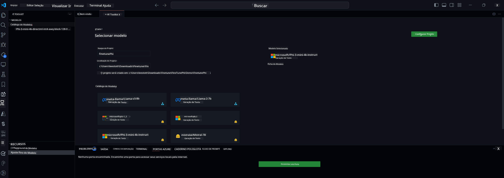

<!--
CO_OP_TRANSLATOR_METADATA:
{
  "original_hash": "c2bc0950f44919ac75a88c1a871680c2",
  "translation_date": "2025-07-17T09:09:50+00:00",
  "source_file": "md/03.FineTuning/Finetuning_VSCodeaitoolkit.md",
  "language_code": "br"
}
-->
## Bem-vindo ao AI Toolkit para VS Code

[AI Toolkit para VS Code](https://github.com/microsoft/vscode-ai-toolkit/tree/main) reúne diversos modelos do Azure AI Studio Catalog e outros catálogos como o Hugging Face. A ferramenta simplifica as tarefas comuns de desenvolvimento para criar apps de IA com ferramentas e modelos de IA generativa por meio de:
- Comece com a descoberta de modelos e playground.
- Ajuste fino e inferência de modelos usando recursos locais de computação.
- Ajuste fino e inferência remotos usando recursos do Azure

[Instale o AI Toolkit para VSCode](https://marketplace.visualstudio.com/items?itemName=ms-windows-ai-studio.windows-ai-studio)




**[Private Preview]** Provisionamento com um clique para Azure Container Apps para executar ajuste fino e inferência de modelos na nuvem.

Agora vamos começar o desenvolvimento do seu app de IA:

- [Bem-vindo ao AI Toolkit para VS Code](../../../../md/03.FineTuning)
- [Desenvolvimento Local](../../../../md/03.FineTuning)
  - [Preparativos](../../../../md/03.FineTuning)
  - [Ativar Conda](../../../../md/03.FineTuning)
  - [Ajuste fino apenas do modelo base](../../../../md/03.FineTuning)
  - [Ajuste fino e inferência do modelo](../../../../md/03.FineTuning)
  - [Ajuste fino do modelo](../../../../md/03.FineTuning)
  - [Microsoft Olive](../../../../md/03.FineTuning)
  - [Exemplos e Recursos de Ajuste Fino](../../../../md/03.FineTuning)
- [**\[Private Preview\]** Desenvolvimento Remoto](../../../../md/03.FineTuning)
  - [Pré-requisitos](../../../../md/03.FineTuning)
  - [Configurando um Projeto de Desenvolvimento Remoto](../../../../md/03.FineTuning)
  - [Provisionar Recursos do Azure](../../../../md/03.FineTuning)
  - [\[Opcional\] Adicionar Token Huggingface ao Segredo do Azure Container App](../../../../md/03.FineTuning)
  - [Executar Ajuste Fino](../../../../md/03.FineTuning)
  - [Provisionar Endpoint de Inferência](../../../../md/03.FineTuning)
  - [Implantar o Endpoint de Inferência](../../../../md/03.FineTuning)
  - [Uso avançado](../../../../md/03.FineTuning)

## Desenvolvimento Local
### Preparativos

1. Certifique-se de que o driver NVIDIA está instalado no host.
2. Execute `huggingface-cli login`, se estiver usando HF para utilização de dataset.
3. Explicações das configurações da chave `Olive` para qualquer ajuste que modifique o uso de memória.

### Ativar Conda
Como estamos usando o ambiente WSL e ele é compartilhado, você precisa ativar manualmente o ambiente conda. Após este passo, você pode executar ajuste fino ou inferência.

```bash
conda activate [conda-env-name] 
```

### Ajuste fino apenas do modelo base
Para apenas testar o modelo base sem ajuste fino, você pode executar este comando após ativar o conda.

```bash
cd inference

# Web browser interface allows to adjust a few parameters like max new token length, temperature and so on.
# User has to manually open the link (e.g. http://0.0.0.0:7860) in a browser after gradio initiates the connections.
python gradio_chat.py --baseonly
```

### Ajuste fino e inferência do modelo

Uma vez que o workspace esteja aberto em um dev container, abra um terminal (o caminho padrão é a raiz do projeto) e execute o comando abaixo para ajustar um LLM no dataset selecionado.

```bash
python finetuning/invoke_olive.py 
```

Os checkpoints e o modelo final serão salvos na pasta `models`.

Em seguida, execute a inferência com o modelo ajustado por meio de chats no `console`, `navegador web` ou `prompt flow`.

```bash
cd inference

# Console interface.
python console_chat.py

# Web browser interface allows to adjust a few parameters like max new token length, temperature and so on.
# User has to manually open the link (e.g. http://127.0.0.1:7860) in a browser after gradio initiates the connections.
python gradio_chat.py
```

Para usar o `prompt flow` no VS Code, consulte este [Quick Start](https://microsoft.github.io/promptflow/how-to-guides/quick-start.html).

### Ajuste fino do modelo

Em seguida, baixe o modelo conforme a disponibilidade de GPU no seu dispositivo.

Para iniciar a sessão local de ajuste fino usando QLoRA, selecione um modelo do nosso catálogo que deseja ajustar.
| Plataforma(s) | GPU disponível | Nome do modelo | Tamanho (GB) |
|---------|---------|--------|--------|
| Windows | Sim | Phi-3-mini-4k-**directml**-int4-awq-block-128-onnx | 2.13GB |
| Linux | Sim | Phi-3-mini-4k-**cuda**-int4-onnx | 2.30GB |
| Windows<br>Linux | Não | Phi-3-mini-4k-**cpu**-int4-rtn-block-32-acc-level-4-onnx | 2.72GB |

**_Nota_** Você não precisa de uma conta Azure para baixar os modelos

O modelo Phi3-mini (int4) tem aproximadamente 2GB-3GB. Dependendo da velocidade da sua rede, o download pode levar alguns minutos.

Comece selecionando um nome e local para o projeto.
Depois, escolha um modelo do catálogo. Você será solicitado a baixar o template do projeto. Então, clique em "Configurar Projeto" para ajustar várias configurações.

### Microsoft Olive

Usamos o [Olive](https://microsoft.github.io/Olive/why-olive.html) para executar o ajuste fino QLoRA em um modelo PyTorch do nosso catálogo. Todas as configurações vêm pré-definidas com valores padrão para otimizar o processo localmente com uso eficiente de memória, mas podem ser ajustadas para o seu cenário.

### Exemplos e Recursos de Ajuste Fino

- [Guia de Introdução ao Ajuste Fino](https://learn.microsoft.com/windows/ai/toolkit/toolkit-fine-tune)
- [Ajuste fino com um Dataset HuggingFace](https://github.com/microsoft/vscode-ai-toolkit/blob/main/archive/walkthrough-hf-dataset.md)
- [Ajuste fino com Dataset Simples](https://github.com/microsoft/vscode-ai-toolkit/blob/main/archive/walkthrough-simple-dataset.md)

## **[Private Preview]** Desenvolvimento Remoto

### Pré-requisitos

1. Para executar o ajuste fino do modelo no seu ambiente remoto Azure Container App, certifique-se de que sua assinatura tem capacidade GPU suficiente. Abra um [ticket de suporte](https://azure.microsoft.com/support/create-ticket/) para solicitar a capacidade necessária para sua aplicação. [Mais informações sobre capacidade GPU](https://learn.microsoft.com/azure/container-apps/workload-profiles-overview)
2. Se estiver usando dataset privado no HuggingFace, certifique-se de ter uma [conta HuggingFace](https://huggingface.co/?WT.mc_id=aiml-137032-kinfeylo) e [gerar um token de acesso](https://huggingface.co/docs/hub/security-tokens?WT.mc_id=aiml-137032-kinfeylo)
3. Ative a flag de recurso Remote Fine-tuning and Inference no AI Toolkit para VS Code
   1. Abra as Configurações do VS Code selecionando *Arquivo -> Preferências -> Configurações*.
   2. Navegue até *Extensões* e selecione *AI Toolkit*.
   3. Marque a opção *"Enable Remote Fine-tuning And Inference"*.
   4. Recarregue o VS Code para aplicar.

- [Ajuste fino remoto](https://github.com/microsoft/vscode-ai-toolkit/blob/main/archive/remote-finetuning.md)

### Configurando um Projeto de Desenvolvimento Remoto
1. Execute a paleta de comandos `AI Toolkit: Focus on Resource View`.
2. Navegue até *Model Fine-tuning* para acessar o catálogo de modelos. Dê um nome ao seu projeto e selecione sua localização na máquina. Depois, clique no botão *"Configure Project"*.
3. Configuração do Projeto
    1. Evite habilitar a opção *"Fine-tune locally"*.
    2. As configurações do Olive aparecerão com valores padrão pré-definidos. Ajuste e preencha conforme necessário.
    3. Prossiga para *Generate Project*. Esta etapa usa WSL e configura um novo ambiente Conda, preparando para futuras atualizações que incluirão Dev Containers.
4. Clique em *"Relaunch Window In Workspace"* para abrir seu projeto de desenvolvimento remoto.

> **Nota:** O projeto atualmente funciona localmente ou remotamente dentro do AI Toolkit para VS Code. Se você escolher *"Fine-tune locally"* durante a criação, ele funcionará exclusivamente no WSL sem capacidades remotas. Caso não habilite *"Fine-tune locally"*, o projeto ficará restrito ao ambiente remoto Azure Container App.

### Provisionar Recursos do Azure
Para começar, você precisa provisionar o recurso Azure para ajuste fino remoto. Faça isso executando o comando `AI Toolkit: Provision Azure Container Apps job for fine-tuning` na paleta de comandos.

Acompanhe o progresso do provisionamento pelo link exibido no canal de saída.

### [Opcional] Adicionar Token Huggingface ao Segredo do Azure Container App
Se estiver usando dataset privado HuggingFace, defina seu token HuggingFace como variável de ambiente para evitar login manual no Hugging Face Hub.
Você pode fazer isso usando o comando `AI Toolkit: Add Azure Container Apps Job secret for fine-tuning`. Com este comando, defina o nome do segredo como [`HF_TOKEN`](https://huggingface.co/docs/huggingface_hub/package_reference/environment_variables#hftoken) e use seu token Hugging Face como valor do segredo.

### Executar Ajuste Fino
Para iniciar o trabalho de ajuste fino remoto, execute o comando `AI Toolkit: Run fine-tuning`.

Para visualizar os logs do sistema e do console, você pode acessar o portal Azure pelo link no painel de saída (mais detalhes em [Visualizar e Consultar Logs no Azure](https://aka.ms/ai-toolkit/remote-provision#view-and-query-logs-on-azure)). Ou, pode ver os logs do console diretamente no painel de saída do VSCode executando o comando `AI Toolkit: Show the running fine-tuning job streaming logs`.
> **Nota:** O trabalho pode ficar na fila devido à falta de recursos. Se o log não aparecer, execute o comando `AI Toolkit: Show the running fine-tuning job streaming logs`, aguarde um pouco e execute novamente para reconectar ao streaming do log.

Durante este processo, o QLoRA será usado para ajuste fino, criando adaptadores LoRA para o modelo usar durante a inferência.
Os resultados do ajuste fino serão armazenados no Azure Files.

### Provisionar Endpoint de Inferência
Após os adaptadores serem treinados no ambiente remoto, use uma aplicação simples Gradio para interagir com o modelo.
Assim como no ajuste fino, você precisa configurar os recursos Azure para inferência remota executando o comando `AI Toolkit: Provision Azure Container Apps for inference` na paleta de comandos.

Por padrão, a assinatura e o grupo de recursos para inferência devem ser os mesmos usados no ajuste fino. A inferência usará o mesmo ambiente Azure Container App e acessará o modelo e adaptador armazenados no Azure Files, gerados durante o ajuste fino.

### Implantar o Endpoint de Inferência
Se desejar revisar o código de inferência ou recarregar o modelo de inferência, execute o comando `AI Toolkit: Deploy for inference`. Isso sincronizará seu código mais recente com o Azure Container App e reiniciará a réplica.

Após a implantação ser concluída com sucesso, você pode acessar a API de inferência clicando no botão "*Go to Inference Endpoint*" exibido na notificação do VSCode. Ou, o endpoint da API web pode ser encontrado em `ACA_APP_ENDPOINT` no arquivo `./infra/inference.config.json` e no painel de saída. Agora você está pronto para avaliar o modelo usando este endpoint.

### Uso avançado
Para mais informações sobre desenvolvimento remoto com AI Toolkit, consulte a documentação [Ajuste fino de modelos remotamente](https://aka.ms/ai-toolkit/remote-provision) e [Inferência com o modelo ajustado](https://aka.ms/ai-toolkit/remote-inference).

**Aviso Legal**:  
Este documento foi traduzido utilizando o serviço de tradução por IA [Co-op Translator](https://github.com/Azure/co-op-translator). Embora nos esforcemos para garantir a precisão, esteja ciente de que traduções automáticas podem conter erros ou imprecisões. O documento original em seu idioma nativo deve ser considerado a fonte autorizada. Para informações críticas, recomenda-se tradução profissional humana. Não nos responsabilizamos por quaisquer mal-entendidos ou interpretações incorretas decorrentes do uso desta tradução.