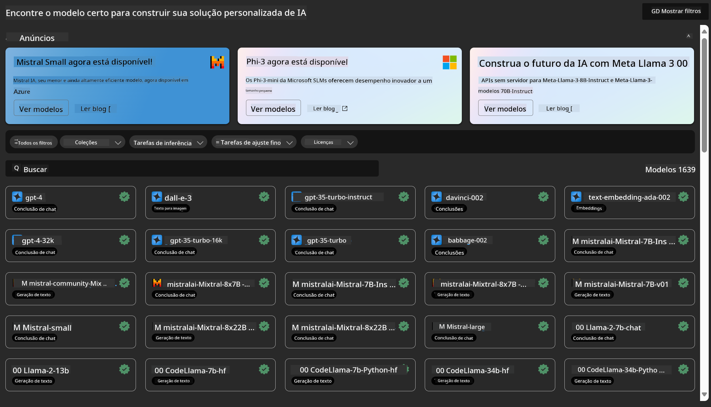
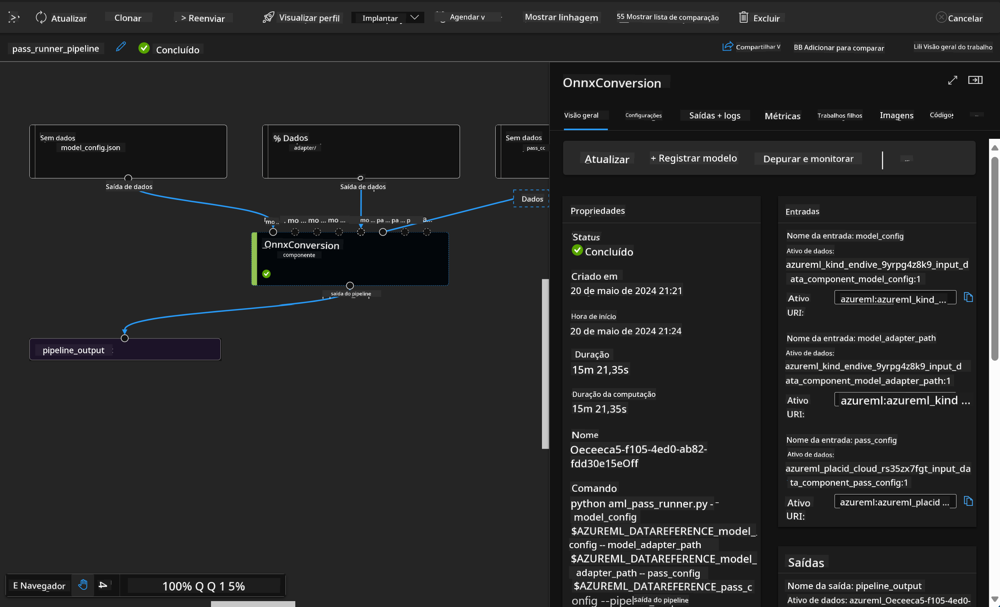

<!--
CO_OP_TRANSLATOR_METADATA:
{
  "original_hash": "7fe541373802e33568e94e13226d463c",
  "translation_date": "2025-05-09T22:19:18+00:00",
  "source_file": "md/03.FineTuning/Introduce_AzureML.md",
  "language_code": "br"
}
-->
# **Introdúz Azure Machine Learning Service**

[Azure Machine Learning](https://ml.azure.com?WT.mc_id=aiml-138114-kinfeylo) zo ur servijenn en-linenn evit buheziñ ha merañ bevenn buhez ar raktresoù kentañ (ML).

Ar profoù ML, ar skiantoù roadennoù ha ar sevelerien a c’hall ober gant anezhañ bemdez evit :

- Seveniñ ha kas da benn ar modleoù.
- Merañ ar c’hudennoù labourat ML (MLOps).
- Gallout a rit krouiñ ur model e Azure Machine Learning pe implijout ur model savet gant ur platformezi digor, evel PyTorch, TensorFlow, pe scikit-learn.
- Ar benvegioù MLOps a sikour ac'hanout da sellet ouzh ar modleoù, da ad-dreuzkas ha da adkas anezho en-dro.

## Piv eo Azure Machine Learning evit ?

**Skiantoù Roadennoù ha Sevelerien ML**

Gallout a reont implijout benvegioù evit buheziñ ha automatisaat o labourioù bemdez.
Azure ML a ginnig arc’hantoù evit reizhder, displegañ, heuliañ, ha kontrol audit.

**Sevelerien Arc’hantioù**

Gallout a reont enporzhiañ modleoù en arloadoù pe servijoù hep problem.

**Sevelerien Platvorm**

Bez’ ez int gouest da implijout ur roll benvegioù kreñv skoazellet gant APIoù Azure Resource Manager kreñv.
Ar benvegioù-se a ro an tu da sevel ostilhoù ML dibar.

**Kompagnunoù**

O labourat er sklaer Microsoft Azure, ez a ar gevredigezhioù gant ar surentez anavezet ha kontrol a arloadoù war rolloù.
Setu ma c’hallont lakaat raktresoù evit merañ an tu da heul data diogel ha obererezhioù resis.

## Buhez buhez evit an holl er skipailh  
A bep seurt skiantoù a rank mont e darempred evit sevel ha merañ raktresoù ML.

Azure ML a ginnig benvegioù evit :
- Kevreañ gant ho skipailh dre notebookoù heverk, darvoudoù compute, compute serverless, roadennoù ha endroioù.
- Seveniñ modleoù gant reizhder, displegañ, heuliañ ha audit evit mont war-raok gant ar reoladoù lineage ha audit.
- Kas da benn modleoù ML buan ha aes dre skalañ, ha merañ ha renabl an oad gant MLOps.
- Ober ar gwellañ labourioù ML e lec’h m’ho peus c’hoant gant ur roll mererezh, surentez ha kempouezadur enno.

## Benvegioù Platvorm Skorioù

An holl er skipailh ML a c’hall implijout e benvegioù karet evit ober o labour.
Piv bennak o klask ober eksperimentoù buan, o lammat hyperparameterioù, o sevel pipelineoù pe o merañ inferenzennoù, e c’hallit implijout interfezoù anavezet evel :
- Azure Machine Learning Studio
- Python SDK (v2)
- Azure CLI (v2)
- Azure Resource Manager REST APIs

Pa vez graet ar modleoù ha kevrinoù e-pad an hentad diorren, e c’hallit kemer perzh ha kavout madoù, roadennoù, ha metrikoù e-barzh Azure Machine Learning studio UI.

## **LLM/SLM e Azure ML**

Azure ML en deus ouzhpennet kalz a arc’hantoù liammet gant LLM/SLM, o kevreañ LLMOps ha SLMOps evit krouiñ ur platvorm teknologiezh generadelezh arzoù artifisel evit an holl embregerezhioù.

### **Katalog Modleoù**

An implijerien embregerezh a c’hall kas modleoù disheñvel hervez ar c’hudennoù embregerezh dre Katalog Modleoù, ha kinnig servijoù evel Model as Service evit ar sevelerien pe ar implijerien embregerezh.

Katalog Modleoù e Azure Machine Learning studio zo ar gêr evit kavout ha implijout kalz modleoù a ro an tu deoc’h da sevel arloadoù Generative AI. Katalog Modleoù a ginnig cantadoù modleoù gant proviñerien modleoù evel Azure OpenAI service, Mistral, Meta, Cohere, Nvidia, Hugging Face, ha modleoù bet desavet gant Microsoft ivez. Modleoù a zo bet krouet gant proviñerien all nemet Microsoft a zo Non-Microsoft Products, evel ma vez termenet e Temoù Arc’hant Microsoft, ha gouest da termeoù ar model.

### **Pipeline Labour**

Kerne ur pipeline labourat ML eo rann ur raktres komplek ML e ul labourad meur-vad. Pep labourad a zo ur rann eus an holl labourad, a c’hall bezañ diorren, optimizet, kempennet ha automatiset hepken. Pep labourad a vez liammet dre interfezoù resis. Servij pipeline Azure Machine Learning a orinat an holl darempredoù etre labouradoù ar pipeline.

E fin-tuning SLM / LLM, e c’hallomp merañ hor roadennoù, hor c’henlabour ha hor prosesoù generadelezh dre Pipeline.

### **Prompt flow**

Dibaboù implij Azure Machine Learning prompt flow  
Azure Machine Learning prompt flow a ginnig kalz a dibaboù evit sikour an implijerien da vont eus ar c’henlabour da eskemmoù ha da sevel arloadoù LLM a zo prest evit ar produiñ :

**Agilite en arloañ prompt**

Dibaboù skrivañ interaktivel : Azure Machine Learning prompt flow a ro un displegadenn gwelet eus stumm ar flow, evit ma c’hall an implijerien kompren ha merkañ o raktresoù aesoc’h. Emañ ivez da vezañ ur sell notebook-like evit skrivañ ha diskoulmañ ar flowoù buanoc’h.  
Variantioù evit lammat prompt : An implijerien a c’hall krouiñ ha kevrinañ meur a variant prompt evit un diorren iterel.

Priz : Ar flowoù priz enno a ro lañs d’an implijerien da werzhañ kalite ha efedusted o promptoù ha flowoù.

Madoù komplek : Azure Machine Learning prompt flow a ginnig ur roll benvegioù, skouerioù ha templetennoù enno evit krouiñ, o tisplegañ ha buheziñ ar proses.

**Prestantez embregerezh evit arloadoù LLM**

Kevreerezh : Azure Machine Learning prompt flow a skoazella kevreerezh e skipailh, da reiñ lañs d’ar meur a implijerien da labourat war arloadoù prompt, da rannañ anavezout ha da mirout kontrol ar vent.

Platvorm unan-tre : Azure Machine Learning prompt flow a strinklec’h an holl dazont arloañ prompt, adpriz, kas da benn ha mererezh. An implijerien a c’hall kas o flowoù da benn evel Azure Machine Learning endpoints ha sellet ouzh o stumm e gwir-aman evit ma vefe ar gwellañ obererezh hag ur gwellañ pad.

Soluzoù Prestantez Embregerezh Azure Machine Learning : Prompt flow a implij soluzoù kreñv prestantez embregerezh Azure Machine Learning, o kinnig ur skeudenn sur, skalañ ha sur evit diorren, eskemm ha kas da benn ar flowoù.

Gant Azure Machine Learning prompt flow, an implijerien a c’hall diskouez o agilite en arloañ prompt, kevreañ efedus, ha implijout soluzoù prestantez embregerezh evit sevel ha kas da benn arloadoù LLM.

O krouiñ gant galloud ar c’halkul, roadennoù, ha meur a rann eus Azure ML, an sevelerien embregerezh a c’hall sevel aes o arloadoù arzoù artifisel.

**Aviso Legal**:  
Este documento foi traduzido utilizando o serviço de tradução por IA [Co-op Translator](https://github.com/Azure/co-op-translator). Embora nos esforcemos para garantir a precisão, esteja ciente de que traduções automáticas podem conter erros ou imprecisões. O documento original em seu idioma nativo deve ser considerado a fonte autorizada. Para informações críticas, recomenda-se a tradução profissional humana. Não nos responsabilizamos por quaisquer mal-entendidos ou interpretações incorretas decorrentes do uso desta tradução.