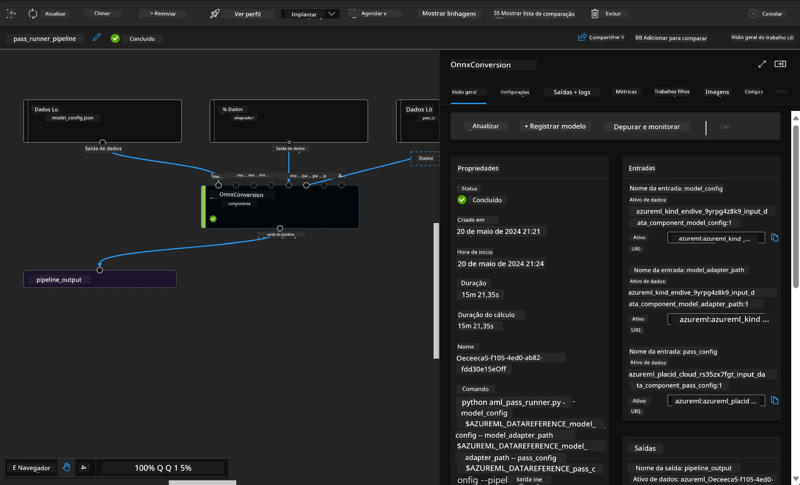

<!--
CO_OP_TRANSLATOR_METADATA:
{
  "original_hash": "7fe541373802e33568e94e13226d463c",
  "translation_date": "2025-07-17T09:40:25+00:00",
  "source_file": "md/03.FineTuning/Introduce_AzureML.md",
  "language_code": "br"
}
-->
# **Introdução ao Azure Machine Learning Service**

[Azure Machine Learning](https://ml.azure.com?WT.mc_id=aiml-138114-kinfeylo) é um serviço em nuvem para acelerar e gerenciar o ciclo de vida de projetos de machine learning (ML).

Profissionais de ML, cientistas de dados e engenheiros podem usá-lo em seus fluxos de trabalho diários para:

- Treinar e implantar modelos.  
Gerenciar operações de machine learning (MLOps).  
- Você pode criar um modelo no Azure Machine Learning ou usar um modelo construído em uma plataforma open-source, como PyTorch, TensorFlow ou scikit-learn.  
- As ferramentas de MLOps ajudam a monitorar, retreinar e reimplantar modelos.

## Para quem é o Azure Machine Learning?

**Cientistas de Dados e Engenheiros de ML**

Eles podem usar ferramentas para acelerar e automatizar seus fluxos de trabalho diários.  
O Azure ML oferece recursos para justiça, explicabilidade, rastreamento e auditoria.

**Desenvolvedores de Aplicações:**  
Podem integrar modelos em aplicações ou serviços de forma simples.

**Desenvolvedores de Plataforma**

Têm acesso a um conjunto robusto de ferramentas suportadas por APIs duráveis do Azure Resource Manager.  
Essas ferramentas permitem construir soluções avançadas de ML.

**Empresas**

Trabalhando na nuvem Microsoft Azure, as empresas se beneficiam de segurança familiar e controle de acesso baseado em funções.  
Configure projetos para controlar o acesso a dados protegidos e operações específicas.

## Produtividade para toda a equipe  
Projetos de ML geralmente exigem uma equipe com habilidades variadas para construir e manter.

O Azure ML oferece ferramentas que permitem:  
- Colaborar com sua equipe por meio de notebooks compartilhados, recursos de computação, computação serverless, dados e ambientes.  
- Desenvolver modelos com justiça, explicabilidade, rastreamento e auditoria para atender a requisitos de linhagem e conformidade.  
- Implantar modelos de ML rápida e facilmente em escala, além de gerenciá-los e governá-los eficientemente com MLOps.  
- Executar cargas de trabalho de machine learning em qualquer lugar com governança, segurança e conformidade integradas.

## Ferramentas da plataforma compatíveis entre si

Qualquer pessoa na equipe de ML pode usar suas ferramentas preferidas para realizar o trabalho.  
Seja para executar experimentos rápidos, ajuste de hiperparâmetros, construir pipelines ou gerenciar inferências, você pode usar interfaces familiares, incluindo:  
- Azure Machine Learning Studio  
- Python SDK (v2)  
- Azure CLI (v2)  
- Azure Resource Manager REST APIs

À medida que você refina modelos e colabora durante o ciclo de desenvolvimento, pode compartilhar e encontrar ativos, recursos e métricas dentro da interface do Azure Machine Learning Studio.

## **LLM/SLM no Azure ML**

O Azure ML adicionou muitas funções relacionadas a LLM/SLM, combinando LLMOps e SLMOps para criar uma plataforma tecnológica de inteligência artificial generativa para toda a empresa.

### **Catálogo de Modelos**

Usuários empresariais podem implantar diferentes modelos conforme diferentes cenários de negócio através do Catálogo de Modelos, e fornecer serviços como Modelo como Serviço para desenvolvedores ou usuários empresariais acessarem.

O Catálogo de Modelos no Azure Machine Learning Studio é o centro para descobrir e usar uma ampla variedade de modelos que permitem construir aplicações de IA Generativa. O catálogo apresenta centenas de modelos de provedores como Azure OpenAI service, Mistral, Meta, Cohere, Nvidia, Hugging Face, incluindo modelos treinados pela Microsoft. Modelos de provedores que não sejam Microsoft são Produtos Não Microsoft, conforme definido nos Termos de Produto da Microsoft, e estão sujeitos aos termos fornecidos com o modelo.

### **Pipeline de Jobs**

O núcleo de um pipeline de machine learning é dividir uma tarefa completa de ML em um fluxo de trabalho com múltiplas etapas. Cada etapa é um componente gerenciável que pode ser desenvolvido, otimizado, configurado e automatizado individualmente. As etapas são conectadas por interfaces bem definidas. O serviço de pipeline do Azure Machine Learning orquestra automaticamente todas as dependências entre as etapas do pipeline.

No fine-tuning de SLM / LLM, podemos gerenciar nossos dados, treinamento e processos de geração através do Pipeline.

### **Prompt flow**

Benefícios de usar o prompt flow do Azure Machine Learning  
O prompt flow do Azure Machine Learning oferece uma série de benefícios que ajudam os usuários a passar da ideação para a experimentação e, finalmente, para aplicações baseadas em LLM prontas para produção:

**Agilidade na engenharia de prompts**

Experiência interativa de autoria: o prompt flow do Azure Machine Learning fornece uma representação visual da estrutura do fluxo, permitindo que os usuários entendam e naveguem facilmente em seus projetos. Também oferece uma experiência de codificação semelhante a notebooks para desenvolvimento e depuração eficientes do fluxo.  
Variantes para ajuste de prompt: os usuários podem criar e comparar múltiplas variantes de prompt, facilitando um processo iterativo de refinamento.

Avaliação: fluxos de avaliação integrados permitem que os usuários avaliem a qualidade e eficácia de seus prompts e fluxos.

Recursos abrangentes: o prompt flow do Azure Machine Learning inclui uma biblioteca de ferramentas, exemplos e templates integrados que servem como ponto de partida para o desenvolvimento, inspirando criatividade e acelerando o processo.

**Pronto para empresas em aplicações baseadas em LLM**

Colaboração: o prompt flow do Azure Machine Learning suporta colaboração em equipe, permitindo que múltiplos usuários trabalhem juntos em projetos de engenharia de prompts, compartilhem conhecimento e mantenham controle de versões.

Plataforma tudo-em-um: o prompt flow do Azure Machine Learning simplifica todo o processo de engenharia de prompts, desde o desenvolvimento e avaliação até a implantação e monitoramento. Os usuários podem implantar seus fluxos como endpoints do Azure Machine Learning e monitorar seu desempenho em tempo real, garantindo operação ideal e melhoria contínua.

Soluções de Prontidão Empresarial do Azure Machine Learning: o prompt flow aproveita as robustas soluções de prontidão empresarial do Azure Machine Learning, oferecendo uma base segura, escalável e confiável para o desenvolvimento, experimentação e implantação de fluxos.

Com o prompt flow do Azure Machine Learning, os usuários podem liberar sua agilidade na engenharia de prompts, colaborar efetivamente e aproveitar soluções de nível empresarial para o desenvolvimento e implantação bem-sucedidos de aplicações baseadas em LLM.

Combinando o poder computacional, dados e diferentes componentes do Azure ML, desenvolvedores empresariais podem construir facilmente suas próprias aplicações de inteligência artificial.

**Aviso Legal**:  
Este documento foi traduzido utilizando o serviço de tradução por IA [Co-op Translator](https://github.com/Azure/co-op-translator). Embora nos esforcemos para garantir a precisão, esteja ciente de que traduções automáticas podem conter erros ou imprecisões. O documento original em seu idioma nativo deve ser considerado a fonte autorizada. Para informações críticas, recomenda-se tradução profissional humana. Não nos responsabilizamos por quaisquer mal-entendidos ou interpretações incorretas decorrentes do uso desta tradução.