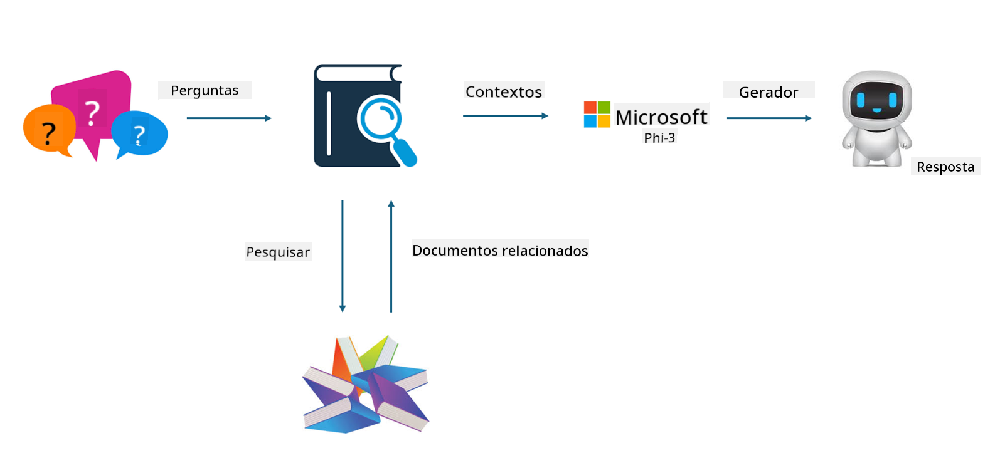

<!--
CO_OP_TRANSLATOR_METADATA:
{
  "original_hash": "743d7e9cb9c4e8ea642d77bee657a7fa",
  "translation_date": "2025-05-09T22:26:04+00:00",
  "source_file": "md/03.FineTuning/LetPhi3gotoIndustriy.md",
  "language_code": "br"
}
-->
# **Lass Phi-3 ein Branchenexperte werden**

Um das Phi-3-Modell in einer Branche einzusetzen, müssen branchenspezifische Geschäftsdaten in das Phi-3-Modell integriert werden. Wir haben zwei verschiedene Optionen: die erste ist RAG (Retrieval Augmented Generation) und die zweite Fine-Tuning.

## **RAG vs Fine-Tuning**

### **Retrieval Augmented Generation**

RAG ist Datenabruf + Textgenerierung. Die strukturierten und unstrukturierten Daten des Unternehmens werden in der Vektordatenbank gespeichert. Bei der Suche nach relevantem Inhalt werden relevante Zusammenfassungen und Inhalte gefunden, um einen Kontext zu bilden, und die Textvervollständigungsfunktion von LLM/SLM wird kombiniert, um Inhalte zu generieren.

### **Fine-tuning**

Fine-Tuning basiert auf der Verbesserung eines bestimmten Modells. Es muss nicht beim Modellalgorithmus beginnen, aber es müssen kontinuierlich Daten gesammelt werden. Wenn Sie in Branchenanwendungen präzisere Terminologie und sprachliche Ausdrucksweise wünschen, ist Fine-Tuning die bessere Wahl. Wenn sich Ihre Daten jedoch häufig ändern, kann Fine-Tuning kompliziert werden.

### **Wie man wählt**

1. Wenn unsere Antwort die Einführung externer Daten erfordert, ist RAG die beste Wahl

2. Wenn Sie stabile und präzise Branchenkenntnisse ausgeben müssen, ist Fine-Tuning eine gute Wahl. RAG priorisiert das Abrufen relevanter Inhalte, trifft aber nicht immer die spezialisierten Nuancen genau.

3. Fine-Tuning benötigt einen hochwertigen Datensatz; bei nur einem kleinen Datenbereich macht es wenig Unterschied. RAG ist flexibler.

4. Fine-Tuning ist eine Blackbox, eine Metaphysik, und es ist schwer, den internen Mechanismus zu verstehen. RAG erleichtert es hingegen, die Datenquelle zu finden, wodurch Halluzinationen oder Inhaltsfehler effektiv angepasst und bessere Transparenz geboten werden.

### **Szenarien**

1. Vertikale Branchen benötigen spezifisches Fachvokabular und Ausdrucksweisen, ***Fine-Tuning*** ist hier die beste Wahl

2. QA-Systeme, die verschiedene Wissenspunkte zusammenführen, ***RAG*** ist hier die beste Wahl

3. Die Kombination aus automatisiertem Geschäftsablauf ***RAG + Fine-Tuning*** ist die beste Wahl

## **Wie man RAG nutzt**

Eine Vektordatenbank ist eine Sammlung von Daten, die in mathematischer Form gespeichert sind. Vektordatenbanken erleichtern es Machine-Learning-Modellen, sich an frühere Eingaben zu erinnern, und ermöglichen so den Einsatz von Machine Learning für Anwendungsfälle wie Suche, Empfehlungen und Textgenerierung. Daten können anhand von Ähnlichkeitsmaßen identifiziert werden, statt durch exakte Übereinstimmungen, was es Computermodellen erlaubt, den Kontext der Daten zu verstehen.

Die Vektordatenbank ist der Schlüssel zur Realisierung von RAG. Wir können Daten durch Vektormodelle wie text-embedding-3, jina-ai-embedding usw. in Vektorspeicher umwandeln.

Mehr über die Erstellung von RAG-Anwendungen erfahren Sie unter [https://github.com/microsoft/Phi-3CookBook](https://github.com/microsoft/Phi-3CookBook?WT.mc_id=aiml-138114-kinfeylo)

## **Wie man Fine-tuning nutzt**

Die gängigen Algorithmen beim Fine-Tuning sind Lora und QLora. Wie wählt man aus?
- [Mehr erfahren mit diesem Beispiel-Notebook](../../../../code/04.Finetuning/Phi_3_Inference_Finetuning.ipynb)
- [Beispiel eines Python FineTuning Samples](../../../../code/04.Finetuning/FineTrainingScript.py)

### **Lora und QLora**

LoRA (Low-Rank Adaptation) und QLoRA (Quantized Low-Rank Adaptation) sind Techniken, um große Sprachmodelle (LLMs) mittels Parameter Efficient Fine Tuning (PEFT) zu verfeinern. PEFT-Techniken sind darauf ausgelegt, Modelle effizienter zu trainieren als traditionelle Methoden.

LoRA ist eine eigenständige Fine-Tuning-Technik, die den Speicherbedarf reduziert, indem sie eine Low-Rank-Approximation auf die Gewichtungs-Update-Matrix anwendet. Sie bietet schnelle Trainingszeiten und hält die Leistung nahe an traditionellen Fine-Tuning-Methoden.

QLoRA ist eine erweiterte Version von LoRA, die Quantisierungstechniken integriert, um den Speicherbedarf weiter zu senken. QLoRA quantisiert die Präzision der Gewichtungsparameter im vortrainierten LLM auf 4-Bit-Präzision, was speichereffizienter ist als LoRA. Allerdings ist das Training mit QLoRA etwa 30 % langsamer als mit LoRA aufgrund der zusätzlichen Quantisierungs- und Dequantisierungsschritte.

QLoRA verwendet LoRA als Ergänzung, um Fehler zu korrigieren, die durch die Quantisierung entstehen. QLoRA ermöglicht das Fine-Tuning riesiger Modelle mit Milliarden von Parametern auf vergleichsweise kleinen, weit verbreiteten GPUs. Zum Beispiel kann QLoRA ein 70B-Parameter-Modell feinjustieren, das normalerweise 36 GPUs erfordern würde, mit nur 2 GPUs.

**Aviso Legal**:  
Este documento foi traduzido utilizando o serviço de tradução por IA [Co-op Translator](https://github.com/Azure/co-op-translator). Embora nos esforcemos para garantir a precisão, esteja ciente de que traduções automáticas podem conter erros ou imprecisões. O documento original em seu idioma nativo deve ser considerado a fonte oficial. Para informações críticas, recomenda-se tradução profissional realizada por humanos. Não nos responsabilizamos por quaisquer mal-entendidos ou interpretações incorretas decorrentes do uso desta tradução.