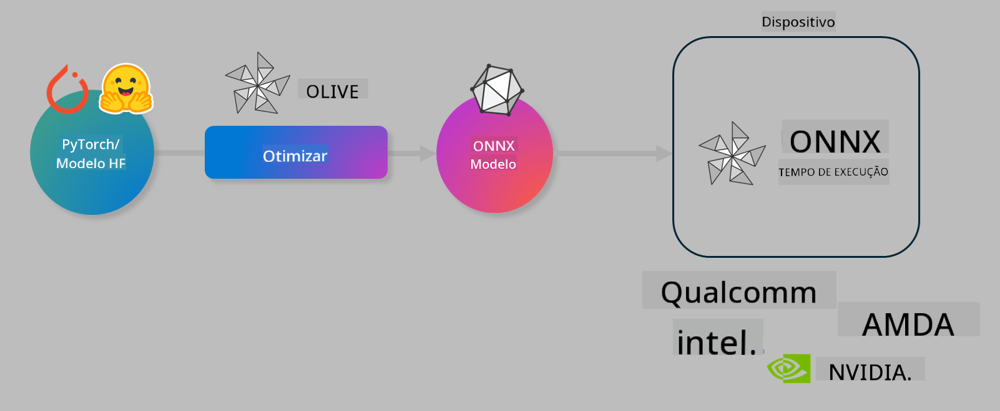

<!--
CO_OP_TRANSLATOR_METADATA:
{
  "original_hash": "6bbe47de3b974df7eea29dfeccf6032b",
  "translation_date": "2025-05-09T22:35:40+00:00",
  "source_file": "md/03.FineTuning/olive-lab/readme.md",
  "language_code": "br"
}
-->
# Laboratóriu. Optimize ar modeloù AI evit ar c’hinnig war an dispozitiv

## Disklêriadur

> [!IMPORTANT]
> Ret eo kaout **GPU Nvidia A10 pe A100** gant driverezh ha toolkit CUDA (stumm 12 pe uheloc’h) lakaet en-dro evit ar labour-mañ.

> [!NOTE]
> Laboratóriu a-vicher evit 35 munutenn eo-mañ hag a ginnig deoc’h un diskouezadeg dreistordinal war ar c’huzulioù pennañ evit optimizañ modeloù evit kinnig war an dispozitiv o implijout OLIVE.

## Palioù ar c’hentañ

A-benn echuiñ ar labour-mañ e c’hallit implijout OLIVE evit :

- Quantizañ ur model AI o implijout ar metoda AWQ.
- Fine-tunañ ur model AI evit ur c’hinnig resis.
- Krouiñ adaptadoù LoRA (model fine-tunet) evit kinnig efedus war an dispozitiv gant ONNX Runtime.

### Petra eo Olive

Olive (*O*NNX *live*) zo ur c’houtil evit optimizañ modeloù gant ur CLI heñvel, a lak deoc’h kas modeloù evit ONNX runtime +++https://onnxruntime.ai+++ gant kalite ha perzhioù mat.



An entrad evit Olive a vez dreist-holl ur model PyTorch pe Hugging Face, ha produ a zo ur model ONNX optimizet a vez kinniget war ur device (lec’h kas) o vont gant ONNX runtime. Olive a zegas ar model da vat evit an acceleradur AI (NPU, GPU, CPU) war al lec’h kas, digant ur fourner hardware evel Qualcomm, AMD, Nvidia pe Intel.

Olive a seven ur *workflow*, ur seurt urzhad-sekventiel eus tachennadoù optimizañ model, anvet *passes* - e-keñveroù zo model kompresiñ, kavout ar graf, quantizañ, optimizañ ar graf. Pep pass en deus ur roll parametroad a c’haller kempenn evit gounit ar metrikoù gwellañ, evel ar c’halloud ha ar c’hourc’hemant, anvet gant an evaluator resis. Olive a implij ur strategie enklask evit auto-kempenn pep pass pe strollad passes en ur mod ordonet.

#### Talvoudoù Olive

- **Dizale ar frustriadur ha ar prantad** evit klask dre klask, dre labor dre vugale, teknikoù disheñvel evit optimizañ ar graf, kompresiñ ha quantizañ. Diskouez ho talvoudegezhioù evit kalite ha perzhioù ha lak Olive da glask an dibaoù gwellañ evit ho model.
- **40+ komponent optimizañ model enno** a ginnig teknikioù nevez war quantizañ, kompresiñ, optimizañ ar graf hag fine-tuning.
- **CLI aes da implijout** evit tachennadoù simpl model optimizañ. Da skouer, olive quantize, olive auto-opt, olive finetune.
- Pakaderezh ha kas modeloù enno.
- Gallout krouiñ modeloù evit **Multi LoRA serving**.
- Krouiñ workflows gant YAML/JSON evit urzhiañ tachennadoù optimizañ ha kas modeloù.
- Integradur gant **Hugging Face** ha **Azure AI**.
- Mekanism **cache** enno evit **arvestiñ arc’hant**.

## Kemer ar labour
> [!NOTE]
> Gwiriit ez eus bet krouet ho Azure AI Hub ha Project ha setu ho compute A100 hervez Lab 1.

### Adtap 0: Kevreañ gant Azure AI Compute

Kevreañ a rit gant Azure AI compute o implijout ar mod distanç en **VS Code.**

1. Digorit ho programm **VS Code** war ar gador:
1. Digorit ar **command palette** gant **Shift+Ctrl+P**
1. E-barzh ar command palette klaskit **AzureML - remote: Connect to compute instance in New Window**.
1. Heuliañ an instruksionoù war an ekran evit kevreañ gant ar Compute. Ret eo dibab ho Azure Subscription, Resource Group, Project ha anv ar Compute savet er Lab 1.
1. Pa vo kevreet gant Azure ML Compute node e vo diskouezet e-barzh **banniel izel-korn VS Code** `><Azure ML: Compute Name`

### Adtap 1: Klonañ ar repo-mañ

E VS Code, digorit ur terminal nevez gant **Ctrl+J** ha klonit ar repo-mañ :

Er terminal e welit ar prompt

```
azureuser@computername:~/cloudfiles/code$ 
```
Klonañ an diskoulm

```bash
cd ~/localfiles
git clone https://github.com/microsoft/phi-3cookbook.git
```

### Adtap 2: Digoriñ ar c’havlec’h e VS Code

E terminal e krouit ur c’hommand evit digoriñ VS Code en un doare nevez, a ziskouez ur prenestr nevez:

```bash
code phi-3cookbook/code/04.Finetuning/Olive-lab
```

Pe e c’hallit digoriñ ar c’havlec’h dre dibab **File** > **Open Folder**.

### Adtap 3: Diwall an ezhommoù

E VS Code war ho Azure AI Compute Instance, digorit ur terminal (tip: **Ctrl+J**) ha krouit ar c’hommandoù da heul evit lakaat an ezhommoù en-dro :

```bash
conda create -n olive-ai python=3.11 -y
conda activate olive-ai
pip install -r requirements.txt
az extension remove -n azure-cli-ml
az extension add -n ml
```

> [!NOTE]
> Emañ ar mont-en-dro o vont da ober un 5 munutenn.

Er labour-mañ e vo pellgomzet ha kaset modeloù e katalog Azure AI Model. Evit bezañ gouest da gontañ ar katalog modeloù, ret eo kevreañ gant Azure :

```bash
az login
```

> [!NOTE]
> Pa kevrait e vo goulennet dibab ho subscription. Gwiriit mat e vo ar subscription lakaet war an hini bet roet evit ar labour-mañ.

### Adtap 4: Ober ar c’hommandoù Olive

E VS Code war Azure AI Compute Instance, digorit ur terminal (tip: **Ctrl+J**) ha gwiriit e vez lakaet an endro `olive-ai` conda aktivet :

```bash
conda activate olive-ai
```

Goude-se, krouit ar c’hommandoù Olive da heul war ar linenn-douar.

1. **Displegañ an data :** Er memes doare, e vo fine-tunet ar model Phi-3.5-Mini evit bezañ ijinus war respontoù liammet ouzh an amzervezh. Ar kod da-heul a ziskouez ar prenestroù kentañ eus ar dataset, en ur furmad JSON lines :

    ```bash
    head data/data_sample_travel.jsonl
    ```
1. **Quantizañ ar model :** A-raok mont da gentañ ar model, quantizañ a rit gant ar c’hommand da-heul o implijout ur teknik anvet Active Aware Quantization (AWQ) +++https://arxiv.org/abs/2306.00978+++. AWQ a quantize ar c’houloù (weights) eus ur model o sellet ouzh an activations a vez krouet e-pad ar c’hinnig. Ar pezh a dalv da vezañ e vez diskoulmet ar furmad gwir eus an data e-barzh ar quantizañ, a gas da gwellaat ar c’halloud model e-keñver ar metodoù kozh.

    ```bash
    olive quantize \
       --model_name_or_path microsoft/Phi-3.5-mini-instruct \
       --trust_remote_code \
       --algorithm awq \
       --output_path models/phi/awq \
       --log_level 1
    ```

    Mont a ra war-raok evit **~8 munutenn** evit echuiñ ar quantizañ AWQ, a vo o **dizale ar ment eus ~7.5GB da ~2.5GB**.

   Er labour-mañ e tiskouezomp penaos lakaat modeloù eus Hugging Face (da skouer: `microsoft/Phi-3.5-mini-instruct`). However, Olive also allows you to input models from the Azure AI catalog by updating the `model_name_or_path` argument to an Azure AI asset ID (for example:  `azureml://registries/azureml/models/Phi-3.5-mini-instruct/versions/4`). 

1. **Train the model:** Next, the `olive finetune` a fine-tune ar model quantizet. Quantizañ ar model *a-raok* fine-tuning a gas da gwellaat ar c’halloud rak ar fine-tuning a adkav ar foll eus ar quantizañ.

    ```bash
    olive finetune \
        --method lora \
        --model_name_or_path models/phi/awq \
        --data_files "data/data_sample_travel.jsonl" \
        --data_name "json" \
        --text_template "<|user|>\n{prompt}<|end|>\n<|assistant|>\n{response}<|end|>" \
        --max_steps 100 \
        --output_path ./models/phi/ft \
        --log_level 1
    ```

    Mont a ra war-raok evit **~6 munutenn** evit echuiñ ar fine-tuning (gant 100 poent).

1. **Optimizañ :** Goude bezañ stummet ar model, optimizañ a rit gant Olive dre ar c’hommand `auto-opt` command, which will capture the ONNX graph and automatically perform a number of optimizations to improve the model performance for CPU by compressing the model and doing fusions. It should be noted, that you can also optimize for other devices such as NPU or GPU by just updating the `--device` and `--provider` - met evit ar labour-mañ e vo implijet CPU.

    ```bash
    olive auto-opt \
       --model_name_or_path models/phi/ft/model \
       --adapter_path models/phi/ft/adapter \
       --device cpu \
       --provider CPUExecutionProvider \
       --use_ort_genai \
       --output_path models/phi/onnx-ao \
       --log_level 1
    ```

    Mont a ra war-raok evit **~5 munutenn** evit echuiñ ar optimizañ.

### Adtap 5: Amprouiñ buan evit kinnig ar model

Evit amprouiñ ar model e krouit ur restr Python e-barzh ho c’havlec’h anvet **app.py** ha karget eizh ar kod da-heul :

```python
import onnxruntime_genai as og
import numpy as np

print("loading model and adapters...", end="", flush=True)
model = og.Model("models/phi/onnx-ao/model")
adapters = og.Adapters(model)
adapters.load("models/phi/onnx-ao/model/adapter_weights.onnx_adapter", "travel")
print("DONE!")

tokenizer = og.Tokenizer(model)
tokenizer_stream = tokenizer.create_stream()

params = og.GeneratorParams(model)
params.set_search_options(max_length=100, past_present_share_buffer=False)
user_input = "what is the best thing to see in chicago"
params.input_ids = tokenizer.encode(f"<|user|>\n{user_input}<|end|>\n<|assistant|>\n")

generator = og.Generator(model, params)

generator.set_active_adapter(adapters, "travel")

print(f"{user_input}")

while not generator.is_done():
    generator.compute_logits()
    generator.generate_next_token()

    new_token = generator.get_next_tokens()[0]
    print(tokenizer_stream.decode(new_token), end='', flush=True)

print("\n")
```

Krouit ar kod dre :

```bash
python app.py
```

### Adtap 6: Kas ar model d’Azure AI

Kas ar model d’ur gatalog modeloù Azure AI a laka ar model da vezañ rannaet gant tud all eus ho skipailh diorroadurel ha en em laka da vont a-raok ha da vezañ kontrollañ ar stummoù model.

> [!NOTE]
> Diwediñ an anvioù `{}` ` placeholders with the name of your resource group and Azure AI Project Name. 

To find your resource group ` evit "resourceGroup" ha an anv eus ho Project Azure AI, ha krouit ar c’hommand da-heul :

```
az ml workspace show
```

Pe dre mont da +++ai.azure.com+++ ha dibab **management center** **project** **overview**

Diwediñ an `{}` gant an anvioù gwir eus ho resource group ha ho Azure AI Project.

```bash
az ml model create \
    --name ft-for-travel \
    --version 1 \
    --path ./models/phi/onnx-ao \
    --resource-group {RESOURCE_GROUP_NAME} \
    --workspace-name {PROJECT_NAME}
```

Gellout a rit heuliañ ho model kaset hag ober ar deployment war https://ml.azure.com/model/list

**Aviso Legal**:  
Este documento foi traduzido usando o serviço de tradução por IA [Co-op Translator](https://github.com/Azure/co-op-translator). Embora nos esforcemos para garantir a precisão, esteja ciente de que traduções automáticas podem conter erros ou imprecisões. O documento original em seu idioma nativo deve ser considerado a fonte autorizada. Para informações críticas, recomenda-se a tradução profissional humana. Não nos responsabilizamos por quaisquer mal-entendidos ou interpretações incorretas decorrentes do uso desta tradução.