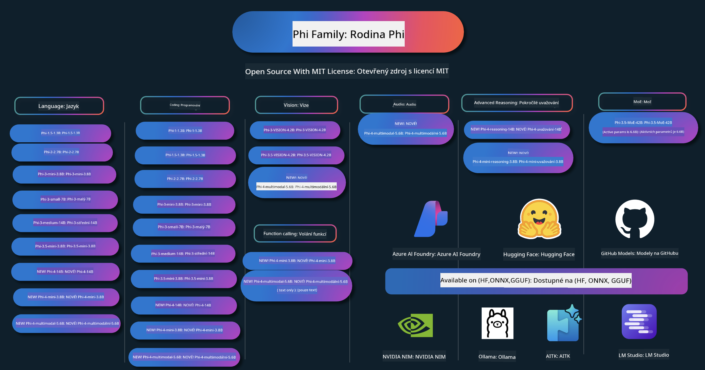

<!--
CO_OP_TRANSLATOR_METADATA:
{
  "original_hash": "1cab9282e04f2e1c388a38dca7763c16",
  "translation_date": "2025-05-09T04:10:23+00:00",
  "source_file": "README.md",
  "language_code": "cs"
}
-->
# Phi Cookbook: Ejemplos prácticos con los modelos Phi de Microsoft

Phi es una serie de modelos de IA de código abierto desarrollados por Microsoft.

Actualmente, Phi es el modelo de lenguaje pequeño (SLM) más potente y rentable, con excelentes resultados en múltiples idiomas, razonamiento, generación de texto/chat, codificación, imágenes, audio y otros escenarios.

Puedes desplegar Phi en la nube o en dispositivos edge, y construir fácilmente aplicaciones de IA generativa con recursos limitados.

Sigue estos pasos para comenzar a usar estos recursos:
1. **Haz un fork del repositorio**: Haz clic en 
2. **Clona el repositorio**: `git clone https://github.com/microsoft/PhiCookBook.git`
3. [**Únete a la comunidad Microsoft AI en Discord y conecta con expertos y otros desarrolladores**](https://discord.com/invite/ByRwuEEgH4?WT.mc_id=aiml-137032-kinfeylo)

## 🌐 Soporte Multilingüe

### Soportado mediante GitHub Action (Automatizado y siempre actualizado)

[Francés](../fr/README.md) | [Español](../es/README.md) | [Alemán](../de/README.md) | [Ruso](../ru/README.md) | [Árabe](../ar/README.md) | [Persa (Farsi)](../fa/README.md) | [Urdu](../ur/README.md) | [Chino (Simplificado)](../zh/README.md) | [Chino (Tradicional, Macao)](../mo/README.md) | [Chino (Tradicional, Hong Kong)](../hk/README.md) | [Chino (Tradicional, Taiwán)](../tw/README.md) | [Japonés](../ja/README.md) | [Coreano](../ko/README.md) | [Hindi](../hi/README.md)

### Soportado mediante CLI
## Obsah

- Úvod
- [欢迎来到 Phi 家族](./md/01.Introduction/01/01.PhiFamily.md)
  - [环境搭建](./md/01.Introduction/01/01.EnvironmentSetup.md)
  - [关键技术解析](./md/01.Introduction/01/01.Understandingtech.md)
  - [Phi 模型的 AI 安全](./md/01.Introduction/01/01.AISafety.md)
  - [Phi 硬件支持](./md/01.Introduction/01/01.Hardwaresupport.md)
  - [Phi 模型及其在各平台的可用性](./md/01.Introduction/01/01.Edgeandcloud.md)
  - [使用 Guidance-ai 和 Phi](./md/01.Introduction/01/01.Guidance.md)
  - [GitHub Marketplace 模型](https://github.com/marketplace/models)
  - [Azure AI 模型目录](https://ai.azure.com)

- 不同环境下的 Phi 推理
    -  [Hugging face](./md/01.Introduction/02/01.HF.md)
    -  [GitHub 模型](./md/01.Introduction/02/02.GitHubModel.md)
    -  [Azure AI Foundry 模型目录](./md/01.Introduction/02/03.AzureAIFoundry.md)
    -  [Ollama](./md/01.Introduction/02/04.Ollama.md)
    -  [AI Toolkit VSCode (AITK)](./md/01.Introduction/02/05.AITK.md)
    -  [NVIDIA NIM](./md/01.Introduction/02/06.NVIDIA.md)

- Phi 家族推理
    - [iOS 上的 Phi 推理](./md/01.Introduction/03/iOS_Inference.md)
    - [Android 上的 Phi 推理](./md/01.Introduction/03/Android_Inference.md)
    - [Jetson 上的 Phi 推理](./md/01.Introduction/03/Jetson_Inference.md)
    - [AI PC 上的 Phi 推理](./md/01.Introduction/03/AIPC_Inference.md)
    - [使用 Apple MLX 框架进行 Phi 推理](./md/01.Introduction/03/MLX_Inference.md)
    - [本地服务器上的 Phi 推理](./md/01.Introduction/03/Local_Server_Inference.md)
    - [通过 AI Toolkit 在远程服务器上进行 Phi 推理](./md/01.Introduction/03/Remote_Interence.md)
    - [使用 Rust 进行 Phi 推理](./md/01.Introduction/03/Rust_Inference.md)
    - [本地的 Phi 视觉推理](./md/01.Introduction/03/Vision_Inference.md)
    - [使用 Kaito AKS 和 Azure 容器进行 Phi 推理（官方支持）](./md/01.Introduction/03/Kaito_Inference.md)
-  [Phi 家族量化](./md/01.Introduction/04/QuantifyingPhi.md)
    - [使用 llama.cpp 量化 Phi-3.5 / 4](./md/01.Introduction/04/UsingLlamacppQuantifyingPhi.md)
    - [使用 onnxruntime 的生成式 AI 扩展量化 Phi-3.5 / 4](./md/01.Introduction/04/UsingORTGenAIQuantifyingPhi.md)
    - [使用 Intel OpenVINO 量化 Phi-3.5 / 4](./md/01.Introduction/04/UsingIntelOpenVINOQuantifyingPhi.md)
    - [使用 Apple MLX 框架量化 Phi-3.5 / 4](./md/01.Introduction/04/UsingAppleMLXQuantifyingPhi.md)

-  Phi 评估
- [Response AI](./md/01.Introduction/05/ResponsibleAI.md)
    - [Azure AI Foundry para Evaluación](./md/01.Introduction/05/AIFoundry.md)
    - [Uso de Promptflow para Evaluación](./md/01.Introduction/05/Promptflow.md)
 
- RAG con Azure AI Search
    - [Cómo usar Phi-4-mini y Phi-4-multimodal(RAG) con Azure AI Search](https://github.com/microsoft/PhiCookBook/blob/main/code/06.E2E/E2E_Phi-4-RAG-Azure-AI-Search.ipynb)

- Ejemplos de desarrollo de aplicaciones Phi
  - Aplicaciones de Texto y Chat
    - Ejemplos Phi-4 🆕
      - [📓] [Chat con el modelo ONNX Phi-4-mini](./md/02.Application/01.TextAndChat/Phi4/ChatWithPhi4ONNX/README.md)
      - [Chat con modelo ONNX local Phi-4 en .NET](../../md/04.HOL/dotnet/src/LabsPhi4-Chat-01OnnxRuntime)
      - [App de consola .NET para chat con Phi-4 ONNX usando Semantic Kernel](../../md/04.HOL/dotnet/src/LabsPhi4-Chat-02SK)
    - Ejemplos Phi-3 / 3.5
      - [Chatbot local en el navegador usando Phi3, ONNX Runtime Web y WebGPU](https://github.com/microsoft/onnxruntime-inference-examples/tree/main/js/chat)
      - [Chat OpenVino](./md/02.Application/01.TextAndChat/Phi3/E2E_OpenVino_Chat.md)
      - [Modelo múltiple - Phi-3-mini interactivo y OpenAI Whisper](./md/02.Application/01.TextAndChat/Phi3/E2E_Phi-3-mini_with_whisper.md)
      - [MLFlow - Construyendo un wrapper y usando Phi-3 con MLFlow](./md//02.Application/01.TextAndChat/Phi3/E2E_Phi-3-MLflow.md)
      - [Optimización de modelo - Cómo optimizar el modelo Phi-3-mini para ONNX Runtime Web con Olive](https://github.com/microsoft/Olive/tree/main/examples/phi3)
      - [App WinUI3 con Phi-3 mini-4k-instruct-onnx](https://github.com/microsoft/Phi3-Chat-WinUI3-Sample/)
      -[Ejemplo de app de notas con AI múltiple en WinUI3](https://github.com/microsoft/ai-powered-notes-winui3-sample)
      - [Afinar e integrar modelos personalizados Phi-3 con Prompt flow](./md/02.Application/01.TextAndChat/Phi3/E2E_Phi-3-FineTuning_PromptFlow_Integration.md)
      - [Afinar e integrar modelos personalizados Phi-3 con Prompt flow en Azure AI Foundry](./md/02.Application/01.TextAndChat/Phi3/E2E_Phi-3-FineTuning_PromptFlow_Integration_AIFoundry.md)
      - [Evaluar el modelo afinado Phi-3 / Phi-3.5 en Azure AI Foundry enfocándose en los principios de Responsible AI de Microsoft](./md/02.Application/01.TextAndChat/Phi3/E2E_Phi-3-Evaluation_AIFoundry.md)
      - [📓] [Ejemplo de predicción de lenguaje Phi-3.5-mini-instruct (Chino/Inglés)](../../md/02.Application/01.TextAndChat/Phi3/phi3-instruct-demo.ipynb)
      - [Chatbot RAG Phi-3.5-Instruct WebGPU](./md/02.Application/01.TextAndChat/Phi3/WebGPUWithPhi35Readme.md)
      - [Uso de GPU de Windows para crear solución Prompt flow con Phi-3.5-Instruct ONNX](./md/02.Application/01.TextAndChat/Phi3/UsingPromptFlowWithONNX.md)
      - [Uso de Microsoft Phi-3.5 tflite para crear app Android](./md/02.Application/01.TextAndChat/Phi3/UsingPhi35TFLiteCreateAndroidApp.md)
      - [Ejemplo Q&A .NET usando modelo ONNX local Phi-3 con Microsoft.ML.OnnxRuntime](../../md/04.HOL/dotnet/src/LabsPhi301)
      - [App consola chat .NET con Semantic Kernel y Phi-3](../../md/04.HOL/dotnet/src/LabsPhi302)

  - Ejemplos basados en código con Azure AI Inference SDK 
    - Ejemplos Phi-4 🆕
      - [📓] [Generar código de proyecto usando Phi-4-multimodal](./md/02.Application/02.Code/Phi4/GenProjectCode/README.md)
    - Ejemplos Phi-3 / 3.5
      - [Construye tu propio GitHub Copilot Chat para Visual Studio Code con la familia Microsoft Phi-3](./md/02.Application/02.Code/Phi3/VSCodeExt/README.md)
      - [Crea tu propio agente Chat Copilot para Visual Studio Code con Phi-3.5 usando modelos de GitHub](/md/02.Application/02.Code/Phi3/CreateVSCodeChatAgentWithGitHubModels.md)

  - Ejemplos de razonamiento avanzado
    - Ejemplos Phi-4 🆕
      - [📓] [Ejemplos de razonamiento Phi-4-mini o Phi-4](./md/02.Application/03.AdvancedReasoning/Phi4/AdvancedResoningPhi4mini/README.md)
      - [📓] [Afinación fina de Phi-4-mini-reasoning con Microsoft Olive](../../md/02.Application/03.AdvancedReasoning/Phi4/AdvancedResoningPhi4mini/olive_ft_phi_4_reasoning_with_medicaldata.ipynb)
      - [📓] [Afinación fina de Phi-4-mini-reasoning con Apple MLX](../../md/02.Application/03.AdvancedReasoning/Phi4/AdvancedResoningPhi4mini/mlx_ft_phi_4_reasoning_with_medicaldata.ipynb)
      - [📓] [Phi-4-mini-reasoning con modelos de GitHub](../../md/02.Application/02.Code/Phi4r/github_models_inference.ipynb)
- [📓] [Phi-4-mini razonamiento con modelos Azure AI Foundry](../../md/02.Application/02.Code/Phi4r/azure_models_inference.ipynb)
  - Demos
      - [Phi-4-mini demos alojados en Hugging Face Spaces](https://huggingface.co/spaces/microsoft/phi-4-mini?WT.mc_id=aiml-137032-kinfeylo)
      - [Phi-4-multimodal demos alojados en Hugginge Face Spaces](https://huggingface.co/spaces/microsoft/phi-4-multimodal?WT.mc_id=aiml-137032-kinfeylo)
  - Ejemplos de Visión
    - Ejemplos Phi-4 🆕
      - [📓] [Usar Phi-4-multimodal para leer imágenes y generar código](./md/02.Application/04.Vision/Phi4/CreateFrontend/README.md) 
    - Ejemplos Phi-3 / 3.5
      -  [📓][Phi-3-vision Texto a texto desde imagen](../../md/02.Application/04.Vision/Phi3/E2E_Phi-3-vision-image-text-to-text-online-endpoint.ipynb)
      - [Phi-3-vision-ONNX](https://onnxruntime.ai/docs/genai/tutorials/phi3-v.html)
      - [📓][Phi-3-vision CLIP Embedding](../../md/02.Application/04.Vision/Phi3/E2E_Phi-3-vision-image-text-to-text-online-endpoint.ipynb)
      - [DEMO: Phi-3 Recycling](https://github.com/jennifermarsman/PhiRecycling/)
      - [Phi-3-vision - Asistente de lenguaje visual - con Phi3-Vision y OpenVINO](https://docs.openvino.ai/nightly/notebooks/phi-3-vision-with-output.html)
      - [Phi-3 Vision Nvidia NIM](./md/02.Application/04.Vision/Phi3/E2E_Nvidia_NIM_Vision.md)
      - [Phi-3 Vision OpenVino](./md/02.Application/04.Vision/Phi3/E2E_OpenVino_Phi3Vision.md)
      - [📓][Phi-3.5 Vision muestra multi-frame o multi-imagen](../../md/02.Application/04.Vision/Phi3/phi3-vision-demo.ipynb)
      - [Modelo local ONNX de Phi-3 Vision usando Microsoft.ML.OnnxRuntime .NET](../../md/04.HOL/dotnet/src/LabsPhi303)
      - [Modelo local ONNX de Phi-3 Vision basado en menú usando Microsoft.ML.OnnxRuntime .NET](../../md/04.HOL/dotnet/src/LabsPhi304)

  - Ejemplos de Audio
    - Ejemplos Phi-4 🆕
      - [📓] [Extracción de transcripciones de audio usando Phi-4-multimodal](./md/02.Application/05.Audio/Phi4/Transciption/README.md)
      - [📓] [Ejemplo de audio Phi-4-multimodal](../../md/02.Application/05.Audio/Phi4/Siri/demo.ipynb)
      - [📓] [Ejemplo de traducción de voz con Phi-4-multimodal](../../md/02.Application/05.Audio/Phi4/Translate/demo.ipynb)
      - [Aplicación de consola .NET usando Phi-4-multimodal Audio para analizar un archivo de audio y generar transcripción](../../md/04.HOL/dotnet/src/LabsPhi4-MultiModal-02Audio)

  - Ejemplos MOE
    - Ejemplos Phi-3 / 3.5
      - [📓] [Modelos Mixture of Experts (MoEs) Phi-3.5 para redes sociales](../../md/02.Application/06.MoE/Phi3/phi3_moe_demo.ipynb)
      - [📓] [Construyendo una pipeline Retrieval-Augmented Generation (RAG) con NVIDIA NIM Phi-3 MOE, Azure AI Search y LlamaIndex](../../md/02.Application/06.MoE/Phi3/azure-ai-search-nvidia-rag.ipynb)
  - Ejemplos de Llamadas a Funciones
    - Ejemplos Phi-4 🆕
      -  [📓] [Uso de llamadas a funciones con Phi-4-mini](./md/02.Application/07.FunctionCalling/Phi4/FunctionCallingBasic/README.md)
      -  [📓] [Uso de llamadas a funciones para crear multi-agentes con Phi-4-mini](../../md/02.Application/07.FunctionCalling/Phi4/Multiagents/Phi_4_mini_multiagent.ipynb)
      -  [📓] [Uso de llamadas a funciones con Ollama](../../md/02.Application/07.FunctionCalling/Phi4/Ollama/ollama_functioncalling.ipynb)
  - Ejemplos de Mezcla Multimodal
    - Ejemplos Phi-4 🆕
      -  [📓] [Usando Phi-4-multimodal como periodista tecnológico](../../md/02.Application/08.Multimodel/Phi4/TechJournalist/phi_4_mm_audio_text_publish_news.ipynb)
      - [Aplicación de consola .NET usando Phi-4-multimodal para analizar imágenes](../../md/04.HOL/dotnet/src/LabsPhi4-MultiModal-01Images)

- Fine-tuning Phi Samples
  - [Escenarios de fine-tuning](./md/03.FineTuning/FineTuning_Scenarios.md)
  - [Fine-tuning vs RAG](./md/03.FineTuning/FineTuning_vs_RAG.md)
  - [Fine-tuning: Deja que Phi-3 se convierta en un experto de la industria](./md/03.FineTuning/LetPhi3gotoIndustriy.md)
  - [Fine-tuning Phi-3 con AI Toolkit para VS Code](./md/03.FineTuning/Finetuning_VSCodeaitoolkit.md)
  - [Fine-tuning Phi-3 con Azure Machine Learning Service](./md/03.FineTuning/Introduce_AzureML.md)
- [Fine-tuning Phi-3 with Lora](./md/03.FineTuning/FineTuning_Lora.md)
  - [Fine-tuning Phi-3 with QLora](./md/03.FineTuning/FineTuning_Qlora.md)
  - [Fine-tuning Phi-3 with Azure AI Foundry](./md/03.FineTuning/FineTuning_AIFoundry.md)
  - [Fine-tuning Phi-3 with Azure ML CLI/SDK](./md/03.FineTuning/FineTuning_MLSDK.md)
  - [Fine-tuning with Microsoft Olive](./md/03.FineTuning/FineTuning_MicrosoftOlive.md)
  - [Fine-tuning with Microsoft Olive Hands-On Lab](./md/03.FineTuning/olive-lab/readme.md)
  - [Fine-tuning Phi-3-vision with Weights and Bias](./md/03.FineTuning/FineTuning_Phi-3-visionWandB.md)
  - [Fine-tuning Phi-3 with Apple MLX Framework](./md/03.FineTuning/FineTuning_MLX.md)
  - [Fine-tuning Phi-3-vision (official support)](./md/03.FineTuning/FineTuning_Vision.md)
  - [Fine-Tuning Phi-3 with Kaito AKS , Azure Containers(official Support)](./md/03.FineTuning/FineTuning_Kaito.md)
  - [Fine-Tuning Phi-3 and 3.5 Vision](https://github.com/2U1/Phi3-Vision-Finetune)

- Hands on Lab
  - [Exploring cutting-edge models: LLMs, SLMs, local development and more](https://github.com/microsoft/aitour-exploring-cutting-edge-models)
  - [Unlocking NLP Potential: Fine-Tuning with Microsoft Olive](https://github.com/azure/Ignite_FineTuning_workshop)

- Academic Research Papers and Publications
  - [Textbooks Are All You Need II: phi-1.5 technical report](https://arxiv.org/abs/2309.05463)
  - [Phi-3 Technical Report: A Highly Capable Language Model Locally on Your Phone](https://arxiv.org/abs/2404.14219)
  - [Phi-4 Technical Report](https://arxiv.org/abs/2412.08905)
  - [Phi-4-Mini Technical Report: Compact yet Powerful Multimodal Language Models via Mixture-of-LoRAs](https://arxiv.org/abs/2503.01743)
  - [Optimizing Small Language Models for In-Vehicle Function-Calling](https://arxiv.org/abs/2501.02342)
  - [(WhyPHI) Fine-Tuning PHI-3 for Multiple-Choice Question Answering: Methodology, Results, and Challenges](https://arxiv.org/abs/2501.01588)
  - [Phi-4-reasoning Technical Report](https://www.microsoft.com/en-us/research/wp-content/uploads/2025/04/phi_4_reasoning.pdf)
  - [Phi-4-mini-reasoning Technical Report](https://huggingface.co/microsoft/Phi-4-mini-reasoning/blob/main/Phi-4-Mini-Reasoning.pdf)

## 使用 Phi 模型

### 在 Azure AI Foundry 上使用 Phi

您可以学习如何使用 Microsoft Phi 以及如何在不同硬件设备上构建端到端解决方案。想要亲自体验 Phi，可以先通过[Azure AI Foundry Azure AI Model Catalog](https://aka.ms/phi3-azure-ai) 试玩模型并根据您的场景定制 Phi，更多信息请参见[Azure AI Foundry 快速入门](/md/02.QuickStart/AzureAIFoundry_QuickStart.md)

**Playground**  
每个模型都有专门的 playground 用于测试模型，[Azure AI Playground](https://aka.ms/try-phi3)。

### 在 GitHub 模型上使用 Phi

您可以学习如何使用 Microsoft Phi 以及如何在不同硬件设备上构建端到端解决方案。想要亲自体验 Phi，可以先通过[GitHub Model Catalog](https://github.com/marketplace/models?WT.mc_id=aiml-137032-kinfeylo) 试玩模型并根据您的场景定制 Phi，更多信息请参见[GitHub Model Catalog 快速入门](/md/02.QuickStart/GitHubModel_QuickStart.md)

**Playground**  
每个模型都有专门的[playground 用于测试模型](/md/02.QuickStart/GitHubModel_QuickStart.md)。

### 在 Hugging Face 上使用 Phi

您也可以在[Hugging Face](https://huggingface.co/microsoft)找到该模型。

**Playground**  
[Hugging Chat playground](https://huggingface.co/chat/models/microsoft/Phi-3-mini-4k-instruct)

## 负责任的 AI

微软致力于帮助客户负责任地使用我们的 AI 产品，分享我们的经验，并通过透明说明和影响评估等工具建立基于信任的合作关系。许多相关资源可在[https://aka.ms/RAI](https://aka.ms/RAI)找到。  
微软的负责任 AI 方法基于公平性、可靠性和安全性、隐私和安全性、包容性、透明度和问责制的 AI 原则。
// Крупномасштабные модели обработки естественного языка, изображений и речи — такие, как используемые в этом примере — могут потенциально вести себя несправедливо, ненадежно или оскорбительно, что может привести к негативным последствиям. Пожалуйста, ознакомьтесь с [Azure OpenAI service Transparency note](https://learn.microsoft.com/legal/cognitive-services/openai/transparency-note?tabs=text), чтобы быть в курсе рисков и ограничений.

// Рекомендуемый подход к снижению этих рисков — включить в архитектуру систему безопасности, которая сможет обнаруживать и предотвращать вредоносное поведение. [Azure AI Content Safety](https://learn.microsoft.com/azure/ai-services/content-safety/overview) предоставляет независимый уровень защиты, способный выявлять вредоносный контент, созданный пользователями и ИИ, в приложениях и сервисах. Azure AI Content Safety включает текстовые и графические API, позволяющие обнаруживать вредоносные материалы. В рамках Azure AI Foundry сервис Content Safety позволяет просматривать, исследовать и пробовать примеры кода для обнаружения вредоносного контента в различных модальностях. Следующая [документация по быстрому старту](https://learn.microsoft.com/azure/ai-services/content-safety/quickstart-text?tabs=visual-studio%2Clinux&pivots=programming-language-rest) проведет вас через процесс отправки запросов к сервису.

// Еще один аспект, который нужно учитывать — общая производительность приложения. В приложениях с несколькими модальностями и моделями под производительностью понимается соответствие системы вашим и ожиданиям пользователей, включая отсутствие генерации вредоносных результатов. Важно оценивать производительность вашего приложения с помощью [Performance and Quality and Risk and Safety evaluators](https://learn.microsoft.com/azure/ai-studio/concepts/evaluation-metrics-built-in). Также у вас есть возможность создавать и проводить оценку с помощью [custom evaluators](https://learn.microsoft.com/azure/ai-studio/how-to/develop/evaluate-sdk#custom-evaluators).

// Вы можете оценить ваше AI-приложение в среде разработки, используя [Azure AI Evaluation SDK](https://microsoft.github.io/promptflow/index.html). При наличии тестового набора данных или целевого результата генерации вашего генеративного AI-приложения количественно измеряются с помощью встроенных или пользовательских оценщиков по вашему выбору. Чтобы начать работу с Azure AI Evaluation SDK для оценки вашей системы, вы можете следовать [руководству по быстрому старту](https://learn.microsoft.com/azure/ai-studio/how-to/develop/flow-evaluate-sdk). После выполнения оценки вы можете [визуализировать результаты в Azure AI Foundry](https://learn.microsoft.com/azure/ai-studio/how-to/evaluate-flow-results).

## Товарные знаки

// В этом проекте могут содержаться товарные знаки или логотипы проектов, продуктов или сервисов. Авторизованное использование товарных знаков или логотипов Microsoft подчиняется и должно соответствовать [Microsoft's Trademark & Brand Guidelines](https://www.microsoft.com/legal/intellectualproperty/trademarks/usage/general).
// Использование товарных знаков или логотипов Microsoft в измененных версиях проекта не должно вызывать путаницу или подразумевать спонсорство Microsoft. Использование товарных знаков или логотипов третьих сторон подчиняется политикам этих третьих сторон.

**Prohlášení o vyloučení odpovědnosti**:  
Tento dokument byl přeložen pomocí AI překladatelské služby [Co-op Translator](https://github.com/Azure/co-op-translator). Přestože usilujeme o přesnost, mějte prosím na paměti, že automatické překlady mohou obsahovat chyby nebo nepřesnosti. Originální dokument v jeho mateřském jazyce by měl být považován za závazný zdroj. Pro důležité informace se doporučuje využít profesionální lidský překlad. Nejsme odpovědní za jakékoli nedorozumění nebo nesprávné výklady vyplývající z použití tohoto překladu.