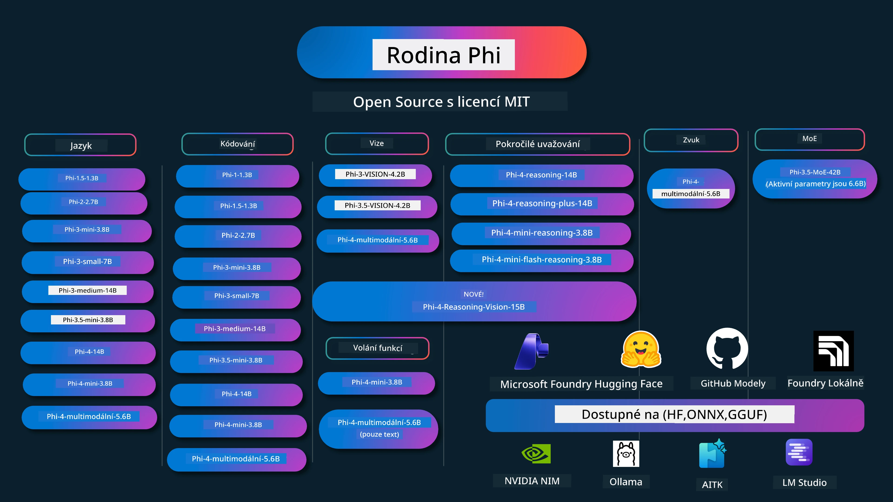

# Phi Cookbook: Praktické příklady s modely Phi od Microsoftu

[](https://codespaces.new/microsoft/phicookbook)
[](https://vscode.dev/redirect?url=vscode://ms-vscode-remote.remote-containers/cloneInVolume?url=https://github.com/microsoft/phicookbook)

[](https://GitHub.com/microsoft/phicookbook/graphs/contributors/?WT.mc_id=aiml-137032-kinfeylo)
[](https://GitHub.com/microsoft/phicookbook/issues/?WT.mc_id=aiml-137032-kinfeylo)
[](https://GitHub.com/microsoft/phicookbook/pulls/?WT.mc_id=aiml-137032-kinfeylo)
[](http://makeapullrequest.com?WT.mc_id=aiml-137032-kinfeylo)

[](https://GitHub.com/microsoft/phicookbook/watchers/?WT.mc_id=aiml-137032-kinfeylo)
[](https://GitHub.com/microsoft/phicookbook/network/?WT.mc_id=aiml-137032-kinfeylo)
[](https://GitHub.com/microsoft/phicookbook/stargazers/?WT.mc_id=aiml-137032-kinfeylo)

[](https://discord.com/invite/ByRwuEEgH4)

Phi je řada open source modelů umělé inteligence vyvinutých společností Microsoft.

Phi je v současnosti nejvýkonnější a nejekonomičtější malý jazykový model (SLM) s velmi dobrými výsledky v multi-jazycích, uvažování, generování textu/chatů, programování, zpracování obrázků, zvuku a dalších scénářích.

Můžete nasadit Phi do cloudu nebo na zařízení na okraji sítě a snadno vytvářet generativní AI aplikace s omezeným výpočetním výkonem.

Postupujte podle těchto kroků, abyste mohli začít používat tyto zdroje:
1. **Vytvořte fork repozitáře**: Klikněte na [](https://GitHub.com/microsoft/phicookbook/network/?WT.mc_id=aiml-137032-kinfeylo)
2. **Naklonujte repozitář**: `git clone https://github.com/microsoft/PhiCookBook.git`
3. [**Připojte se k AI komunitě Microsoft na Discordu a potkejte odborníky a další vývojáře**](https://discord.com/invite/ByRwuEEgH4?WT.mc_id=aiml-137032-kinfeylo)



### 🌐 Podpora více jazyků

#### Podporováno přes GitHub Action (automatizované a vždy aktuální)

<!-- CO-OP TRANSLATOR LANGUAGES TABLE START -->
[Arabština](../ar/README.md) | [Bengálština](../bn/README.md) | [Bulharština](../bg/README.md) | [Barmština (Myanmar)](../my/README.md) | [Čínština (zjednodušená)](../zh-CN/README.md) | [Čínština (tradiční, Hong Kong)](../zh-HK/README.md) | [Čínština (tradiční, Macau)](../zh-MO/README.md) | [Čínština (tradiční, Tchaj-wan)](../zh-TW/README.md) | [Chorvatština](../hr/README.md) | [Čeština](./README.md) | [Dánština](../da/README.md) | [Holandština](../nl/README.md) | [Estonština](../et/README.md) | [Finština](../fi/README.md) | [Francouzština](../fr/README.md) | [Němčina](../de/README.md) | [Řečtina](../el/README.md) | [Hebrejština](../he/README.md) | [Hinština](../hi/README.md) | [Maďarština](../hu/README.md) | [Indonéština](../id/README.md) | [Italština](../it/README.md) | [Japonština](../ja/README.md) | [Kannadština](../kn/README.md) | [Khmerština](../km/README.md) | [Korejština](../ko/README.md) | [Litvanština](../lt/README.md) | [Malajština](../ms/README.md) | [Malajalámština](../ml/README.md) | [Maráthština](../mr/README.md) | [Nepálština](../ne/README.md) | [Nigerijský pidžin](../pcm/README.md) | [Norština](../no/README.md) | [Perština (Farsi)](../fa/README.md) | [Polština](../pl/README.md) | [Portugalština (Brazílie)](../pt-BR/README.md) | [Portugalština (Portugalsko)](../pt-PT/README.md) | [Paňdžábština (Gurmukhí)](../pa/README.md) | [Rumunština](../ro/README.md) | [Ruština](../ru/README.md) | [Srbština (Cyrilice)](../sr/README.md) | [Slovenština](../sk/README.md) | [Slovinština](../sl/README.md) | [Španělština](../es/README.md) | [Svahilština](../sw/README.md) | [Švédština](../sv/README.md) | [Tagalog (Filipíny)](../tl/README.md) | [Tamilština](../ta/README.md) | [Telugu](../te/README.md) | [Thajština](../th/README.md) | [Turečtina](../tr/README.md) | [Ukrajinština](../uk/README.md) | [Urdu](../ur/README.md) | [Vietnamština](../vi/README.md)

> **Raději klonovat lokálně?**
>
> Tento repozitář obsahuje více než 50 jazykových překladů, což výrazně zvětšuje velikost stažení. Chcete-li klonovat bez překladů, použijte sparse checkout:
>
> **Bash / macOS / Linux:**
> ```bash
> git clone --filter=blob:none --sparse https://github.com/microsoft/PhiCookBook.git
> cd PhiCookBook
> git sparse-checkout set --no-cone '/*' '!translations' '!translated_images'
> ```
>
> **CMD (Windows):**
> ```cmd
> git clone --filter=blob:none --sparse https://github.com/microsoft/PhiCookBook.git
> cd PhiCookBook
> git sparse-checkout set --no-cone "/*" "!translations" "!translated_images"
> ```
>
> Tím získáte vše potřebné ke zvládnutí kurzu s mnohem rychlejším stažením.
<!-- CO-OP TRANSLATOR LANGUAGES TABLE END -->

## Obsah dokumentu
- Úvod - [Vítejte ve Phi rodině](./md/01.Introduction/01/01.PhiFamily.md) - [Nastavení prostředí](./md/01.Introduction/01/01.EnvironmentSetup.md) - [Pochopení klíčových technologií](./md/01.Introduction/01/01.Understandingtech.md) - [Bezpečnost AI pro Phi modely](./md/01.Introduction/01/01.AISafety.md) - [Podpora hardwaru Phi](./md/01.Introduction/01/01.Hardwaresupport.md) - [Modely Phi a dostupnost na různých platformách](./md/01.Introduction/01/01.Edgeandcloud.md) - [Používání Guidance-ai a Phi](./md/01.Introduction/01/01.Guidance.md) - [GitHub Marketplace Modely](https://github.com/marketplace/models) - [Azure AI katalog modelů](https://ai.azure.com) - Inferenční Phi v různých prostředích - [Hugging face](./md/01.Introduction/02/01.HF.md) - [GitHub Modely](./md/01.Introduction/02/02.GitHubModel.md) - [Katalog modelů Microsoft Foundry](./md/01.Introduction/02/03.AzureAIFoundry.md) - [Ollama](./md/01.Introduction/02/04.Ollama.md) - [AI Toolkit VSCode (AITK)](./md/01.Introduction/02/05.AITK.md) - [NVIDIA NIM](./md/01.Introduction/02/06.NVIDIA.md) - [Foundry Local](./md/01.Introduction/02/07.FoundryLocal.md) - Inferenční Phi rodina - [Inferenční Phi v iOS](./md/01.Introduction/03/iOS_Inference.md) - [Inferenční Phi v Androidu](./md/01.Introduction/03/Android_Inference.md) - [Inferenční Phi v Jetsonu](./md/01.Introduction/03/Jetson_Inference.md) - [Inferenční Phi v AI PC](./md/01.Introduction/03/AIPC_Inference.md) - [Inferenční Phi s Apple MLX Framework](./md/01.Introduction/03/MLX_Inference.md) - [Inferenční Phi na lokálním serveru](./md/01.Introduction/03/Local_Server_Inference.md) - [Inferenční Phi na vzdáleném serveru pomocí AI Toolkit](./md/01.Introduction/03/Remote_Interence.md) - [Inferenční Phi s Rustem](./md/01.Introduction/03/Rust_Inference.md) - [Inferenční Phi--Vize lokálně](./md/01.Introduction/03/Vision_Inference.md) - [Inferenční Phi s Kaito AKS, Azure kontejnery (oficiální podpora)](./md/01.Introduction/03/Kaito_Inference.md) - [Kvantilace Phi rodiny](./md/01.Introduction/04/QuantifyingPhi.md) - [Kvantilace Phi-3.5 / 4 pomocí llama.cpp](./md/01.Introduction/04/UsingLlamacppQuantifyingPhi.md) - [Kvantilace Phi-3.5 / 4 pomocí generativních AI rozšíření pro onnxruntime](./md/01.Introduction/04/UsingORTGenAIQuantifyingPhi.md) - [Kvantilace Phi-3.5 / 4 pomocí Intel OpenVINO](./md/01.Introduction/04/UsingIntelOpenVINOQuantifyingPhi.md) - [Kvantilace Phi-3.5 / 4 pomocí Apple MLX Framework](./md/01.Introduction/04/UsingAppleMLXQuantifyingPhi.md) - Hodnocení Phi - [Odpovědné AI](./md/01.Introduction/05/ResponsibleAI.md) - [Microsoft Foundry pro hodnocení](./md/01.Introduction/05/AIFoundry.md) - [Používání Promptflow pro hodnocení](./md/01.Introduction/05/Promptflow.md) - RAG s Azure AI Search - [Jak používat Phi-4-mini a Phi-4-multimodal (RAG) s Azure AI Search](https://github.com/microsoft/PhiCookBook/blob/main/code/06.E2E/E2E_Phi-4-RAG-Azure-AI-Search.ipynb) - Příklady vývoje aplikací Phi - Textové a chatové aplikace - Phi-4 příklady - [📓] [Chat s Phi-4-mini ONNX modelem](./md/02.Application/01.TextAndChat/Phi4/ChatWithPhi4ONNX/README.md) - [Chat s Phi-4 lokálním ONNX modelem .NET](../../md/04.HOL/dotnet/src/LabsPhi4-Chat-01OnnxRuntime) - [Chat .NET konzolová aplikace s Phi-4 ONNX používající Semantic Kernel](../../md/04.HOL/dotnet/src/LabsPhi4-Chat-02SK) - Phi-3 / 3.5 příklady - [Lokální chatbot v prohlížeči používající Phi3, ONNX Runtime Web a WebGPU](https://github.com/microsoft/onnxruntime-inference-examples/tree/main/js/chat) - [OpenVino Chat](./md/02.Application/01.TextAndChat/Phi3/E2E_OpenVino_Chat.md) - [Multi model - Interaktivní Phi-3-mini a OpenAI Whisper](./md/02.Application/01.TextAndChat/Phi3/E2E_Phi-3-mini_with_whisper.md) - [MLFlow - Vytvoření wrapperu a používání Phi-3 s MLFlow](./md//02.Application/01.TextAndChat/Phi3/E2E_Phi-3-MLflow.md) - [Optimalizace modelu - Jak optimalizovat Phi-3-min model pro ONNX Runtime Web pomocí Olive](https://github.com/microsoft/Olive/tree/main/examples/phi3) - [WinUI3 aplikace s Phi-3 mini-4k-instruct-onnx](https://github.com/microsoft/Phi3-Chat-WinUI3-Sample/) - [WinUI3 multi model AI powered Notes aplikace příklad](https://github.com/microsoft/ai-powered-notes-winui3-sample) - [Doladění a integrace vlastních Phi-3 modelů s Prompt flow](./md/02.Application/01.TextAndChat/Phi3/E2E_Phi-3-FineTuning_PromptFlow_Integration.md) - [Doladění a integrace vlastních Phi-3 modelů s Prompt flow v Microsoft Foundry](./md/02.Application/01.TextAndChat/Phi3/E2E_Phi-3-FineTuning_PromptFlow_Integration_AIFoundry.md) - [Vyhodnocení doladěného Phi-3 / Phi-3.5 modelu v Microsoft Foundry se zaměřením na odpovědné principy AI Microsoftu](./md/02.Application/01.TextAndChat/Phi3/E2E_Phi-3-Evaluation_AIFoundry.md) - [📓] [Phi-3.5-mini-instruct příklad jazykového predikce (čínština/angličtina)](./md/02.Application/01.TextAndChat/Phi3/phi3-instruct-demo.ipynb) - [Phi-3.5-Instruct WebGPU RAG chatbot](./md/02.Application/01.TextAndChat/Phi3/WebGPUWithPhi35Readme.md) - [Používání Windows GPU k vytvoření Prompt flow řešení s Phi-3.5-Instruct ONNX](./md/02.Application/01.TextAndChat/Phi3/UsingPromptFlowWithONNX.md) - [Použití Microsoft Phi-3.5 tflite k vytvoření Android aplikace](./md/02.Application/01.TextAndChat/Phi3/UsingPhi35TFLiteCreateAndroidApp.md) - [Příklad Q&A .NET s lokálním ONNX Phi-3 modelem využívající Microsoft.ML.OnnxRuntime](../../md/04.HOL/dotnet/src/LabsPhi301) - [Konzolová chat .NET aplikace s Semantic Kernel a Phi-3](../../md/04.HOL/dotnet/src/LabsPhi302) - Azure AI Inference SDK příklady založené na kódu - Phi-4 příklady - [📓] [Generování kódu projektu pomocí Phi-4-multimodal](./md/02.Application/02.Code/Phi4/GenProjectCode/README.md) - Phi-3 / 3.5 příklady - [Vytvořte si vlastní Visual Studio Code GitHub Copilot Chat s Microsoft Phi-3 rodinou](./md/02.Application/02.Code/Phi3/VSCodeExt/README.md) - [Vytvořte si vlastního Visual Studio Code Chat Copilot agenta s Phi-3.5 pomocí GitHub Modelů](/md/02.Application/02.Code/Phi3/CreateVSCodeChatAgentWithGitHubModels.md) - Příklady pokročilého uvažování - Phi-4 příklady - [📓] [Příklady Phi-4-mini-reasoning nebo Phi-4-reasoning](./md/02.Application/03.AdvancedReasoning/Phi4/AdvancedResoningPhi4mini/README.md) - [📓] [Doladění Phi-4-mini-reasoning s Microsoft Olive](./md/02.Application/03.AdvancedReasoning/Phi4/AdvancedResoningPhi4mini/olive_ft_phi_4_reasoning_with_medicaldata.ipynb) - [📓] [Doladění Phi-4-mini-reasoning s Apple MLX](./md/02.Application/03.AdvancedReasoning/Phi4/AdvancedResoningPhi4mini/mlx_ft_phi_4_reasoning_with_medicaldata.ipynb) - [📓] [Phi-4-mini-reasoning s GitHub modely](./md/02.Application/02.Code/Phi4r/github_models_inference.ipynb) - [📓] [Phi-4-mini-reasoning s Microsoft Foundry modely](./md/02.Application/02.Code/Phi4r/azure_models_inference.ipynb) -
Ukázky - [Phi-4-mini ukázky hostované na Hugging Face Spaces](https://huggingface.co/spaces/microsoft/phi-4-mini?WT.mc_id=aiml-137032-kinfeylo) - [Phi-4-multimodální ukázky hostované na Hugging Face Spaces](https://huggingface.co/spaces/microsoft/phi-4-multimodal?WT.mc_id=aiml-137032-kinfeylo) - Ukázky vidění - Ukázky Phi-4 - [📓] [Použití Phi-4-multimodální k čtení obrázků a generování kódu](./md/02.Application/04.Vision/Phi4/CreateFrontend/README.md) - Ukázky Phi-3 / 3.5 - [📓][Phi-3-vidění Text z obrázku do textu](./md/02.Application/04.Vision/Phi3/E2E_Phi-3-vision-image-text-to-text-online-endpoint.ipynb) - [Phi-3-vidění ONNX](https://onnxruntime.ai/docs/genai/tutorials/phi3-v.html) - [📓][Phi-3-vidění CLIP embedding](./md/02.Application/04.Vision/Phi3/E2E_Phi-3-vision-image-text-to-text-online-endpoint.ipynb) - [DEMO: Phi-3 recyklace](https://github.com/jennifermarsman/PhiRecycling/) - [Phi-3-vidění - vizuální jazykový asistent - s Phi3-Vision a OpenVINO](https://docs.openvino.ai/nightly/notebooks/phi-3-vision-with-output.html) - [Phi-3 vidění Nvidia NIM](./md/02.Application/04.Vision/Phi3/E2E_Nvidia_NIM_Vision.md) - [Phi-3 vidění OpenVINO](./md/02.Application/04.Vision/Phi3/E2E_OpenVino_Phi3Vision.md) - [📓][Phi-3.5 vidění více snímků nebo více obrázků ukázka](./md/02.Application/04.Vision/Phi3/phi3-vision-demo.ipynb) - [Phi-3 vidění místní ONNX model pomocí Microsoft.ML.OnnxRuntime .NET](../../md/04.HOL/dotnet/src/LabsPhi303) - [Menu založený Phi-3 vidění místní ONNX model pomocí Microsoft.ML.OnnxRuntime .NET](../../md/04.HOL/dotnet/src/LabsPhi304) - Ukázky zodůvodnění-vidění - Phi-4-Zodůvodnění-vidění-15B - [📓] [Použití Phi-4-Zodůvodnění-vidění-15B k detekci přecházení mimo přechod](./md/02.Application/10.ReasoningVision/Phi_4_reasoning_vision_15b_Jaywalking.ipynb) - [📓] [Použití Phi-4-Zodůvodnění-vidění-15B k matematice](./md/02.Application/10.ReasoningVision/Phi_4_reasoning_vision_15b_Math.ipynb) - [📓] [Použití Phi-4-Zodůvodnění-vidění-15B k detekci uživatelského rozhraní](./md/02.Application/10.ReasoningVision/Phi_4_reasoning_vision_15b_ui.ipynb) - Matematické ukázky - Ukázky Phi-4-Mini-Flash-Zodůvodnění-Instruktáž [Matematická ukázka s Phi-4-Mini-Flash-Zodůvodnění-Instruktáž](./md/02.Application/09.Math/MathDemo.ipynb) - Zvukové ukázky - Ukázky Phi-4 - [📓] [Extrahování přepisů zvuku pomocí Phi-4-multimodální](./md/02.Application/05.Audio/Phi4/Transciption/README.md) - [📓] [Zvuková ukázka Phi-4-multimodální](./md/02.Application/05.Audio/Phi4/Siri/demo.ipynb) - [📓] [Ukázka překladu řeči Phi-4-multimodální](./md/02.Application/05.Audio/Phi4/Translate/demo.ipynb) - [.NET konzolová aplikace používající Phi-4-multimodální Audio k analýze audio souboru a generování přepisu](../../md/04.HOL/dotnet/src/LabsPhi4-MultiModal-02Audio) - Ukázky MoE - Ukázky Phi-3 / 3.5 - [📓] [Modely směsi expertů (MoEs) Phi-3.5 ukázka sociálních médií](./md/02.Application/06.MoE/Phi3/phi3_moe_demo.ipynb) - [📓] [Vytváření Retrieval-Augmented Generation (RAG) pipeline s NVIDIA NIM Phi-3 MOE, Azure AI Search a LlamaIndex](./md/02.Application/06.MoE/Phi3/azure-ai-search-nvidia-rag.ipynb) - - Ukázky volání funkcí - Ukázky Phi-4 🆕 - [📓] [Použití volání funkcí s Phi-4-mini](./md/02.Application/07.FunctionCalling/Phi4/FunctionCallingBasic/README.md) - [📓] [Použití volání funkcí k vytvoření multi-agentů s Phi-4-mini](./md/02.Application/07.FunctionCalling/Phi4/Multiagents/Phi_4_mini_multiagent.ipynb) - [📓] [Použití volání funkcí s Ollama](./md/02.Application/07.FunctionCalling/Phi4/Ollama/ollama_functioncalling.ipynb) - [📓] [Použití volání funkcí s ONNX](./md/02.Application/07.FunctionCalling/Phi4/ONNX/onnx_parallel_functioncalling.ipynb) - Ukázky multimodálního míchání - Ukázky Phi-4 🆕 - [📓] [Použití Phi-4-multimodální jako technologický novinář](./md/02.Application/08.Multimodel/Phi4/TechJournalist/phi_4_mm_audio_text_publish_news.ipynb) - [.NET konzolová aplikace používající Phi-4-multimodální k analýze obrázků](../../md/04.HOL/dotnet/src/LabsPhi4-MultiModal-01Images) - Ladění Phi ukázek - [Scénáře ladění](./md/03.FineTuning/FineTuning_Scenarios.md) - [Ladění vs RAG](./md/03.FineTuning/FineTuning_vs_RAG.md) - [Ladění Nechte Phi-3 stát se průmyslovým expertem](./md/03.FineTuning/LetPhi3gotoIndustriy.md) - [Ladění Phi-3 s AI Toolkit pro VS Code](./md/03.FineTuning/Finetuning_VSCodeaitoolkit.md) - [Ladění Phi-3 se službou Azure Machine Learning](./md/03.FineTuning/Introduce_AzureML.md) - [Ladění Phi-3 s Lora](./md/03.FineTuning/FineTuning_Lora.md) - [Ladění Phi-3 s QLora](./md/03.FineTuning/FineTuning_Qlora.md) - [Ladění Phi-3 s Microsoft Foundry](./md/03.FineTuning/FineTuning_AIFoundry.md) - [Ladění Phi-3 s Azure ML CLI/SDK](./md/03.FineTuning/FineTuning_MLSDK.md) - [Ladění s Microsoft Olive](./md/03.FineTuning/FineTuning_MicrosoftOlive.md) - [Ladění s Microsoft Olive Hands-On Lab](./md/03.FineTuning/olive-lab/readme.md) - [Ladění Phi-3-vidění s Weights and Bias](./md/03.FineTuning/FineTuning_Phi-3-visionWandB.md) - [Ladění Phi-3 s Apple MLX Framework](./md/03.FineTuning/FineTuning_MLX.md) - [Ladění Phi-3-vidění (oficiální podpora)](./md/03.FineTuning/FineTuning_Vision.md) - [Ladění Phi-3 s Kaito AKS, Azure Kontejnery (oficiální podpora)](./md/03.FineTuning/FineTuning_Kaito.md) - [Ladění Phi-3 a 3.5 Vidění](https://github.com/2U1/Phi3-Vision-Finetune) - Praktický workshop - [Objevování špičkových modelů: LLM, SLM, místní vývoj a další](https://github.com/microsoft/aitour-exploring-cutting-edge-models) - [Odemknutí potenciálu NLP: ladění s Microsoft Olive](https://github.com/azure/Ignite_FineTuning_workshop) - Akademické výzkumné články a publikace - [Textbooks Are All You Need II: phi-1.5 technická zpráva](https://arxiv.org/abs/2309.05463) - [Phi-3 technická zpráva: Vysoce schopný jazykový model lokálně ve vašem telefonu](https://arxiv.org/abs/2404.14219) - [Phi-4 technická zpráva](https://arxiv.org/abs/2412.08905) - [Phi-4-Mini technická zpráva: Kompaktní, ale výkonné multimodální jazykové modely pomocí směsi LoRAs](https://arxiv.org/abs/2503.01743) - [Optimalizace malých jazykových modelů pro volání funkcí ve vozidle](https://arxiv.org/abs/2501.02342) - [(WhyPHI) Ladění PHI-3 pro vícenásobné výběrové otázky: metodologie, výsledky a výzvy](https://arxiv.org/abs/2501.01588) - [Phi-4-zodůvodnění technická zpráva](https://www.microsoft.com/en-us/research/wp-content/uploads/2025/04/phi_4_reasoning.pdf)
- [Technická zpráva Phi-4-mini-reasoning](https://huggingface.co/microsoft/Phi-4-mini-reasoning/blob/main/Phi-4-Mini-Reasoning.pdf)
# Phi Cookbook: Praktické příklady s Phi modely od Microsoftu

[](https://codespaces.new/microsoft/phicookbook)
[](https://vscode.dev/redirect?url=vscode://ms-vscode-remote.remote-containers/cloneInVolume?url=https://github.com/microsoft/phicookbook)

[](https://GitHub.com/microsoft/phicookbook/graphs/contributors/?WT.mc_id=aiml-137032-kinfeylo)
[](https://GitHub.com/microsoft/phicookbook/issues/?WT.mc_id=aiml-137032-kinfeylo)
[](https://GitHub.com/microsoft/phicookbook/pulls/?WT.mc_id=aiml-137032-kinfeylo)
[](http://makeapullrequest.com?WT.mc_id=aiml-137032-kinfeylo)

[](https://GitHub.com/microsoft/phicookbook/watchers/?WT.mc_id=aiml-137032-kinfeylo)
[](https://GitHub.com/microsoft/phicookbook/network/?WT.mc_id=aiml-137032-kinfeylo)
[](https://GitHub.com/microsoft/phicookbook/stargazers/?WT.mc_id=aiml-137032-kinfeylo)

[](https://discord.com/invite/ByRwuEEgH4)

Phi je série open source AI modelů vyvinutých Microsoftem. 

Phi je momentálně nejsilnější a cenově nejefektivnější malý jazykový model (SLM) s velmi dobrými výsledky v mnoha jazycích, uvažování, generování textu/čatu, kódování, obrázků, zvuku a dalších scénářích. 

Phi můžete nasadit do cloudu nebo na edge zařízení a lze snadno vytvářet generativní AI aplikace s omezeným výpočetním výkonem.

Postupujte podle těchto kroků pro začátek používání tohoto zdroje:
1. **Forkujte repozitář**: Klikněte na [](https://GitHub.com/microsoft/phicookbook/network/?WT.mc_id=aiml-137032-kinfeylo)
2. **Klonujte repozitář**:   `git clone https://github.com/microsoft/PhiCookBook.git`
3. [**Přidejte se do Microsoft AI Discord komunity a setkejte se s experty a ostatními vývojáři**](https://discord.com/invite/ByRwuEEgH4?WT.mc_id=aiml-137032-kinfeylo)


### 🌐 Podpora více jazyků

#### Podporováno přes GitHub Action (automatizované a vždy aktuální)

<!-- CO-OP TRANSLATOR LANGUAGES TABLE START -->
[Arabština](../ar/README.md) | [Bengálština](../bn/README.md) | [Bulharština](../bg/README.md) | [Barmština (Myanmar)](../my/README.md) | [Čínština (zjednodušená)](../zh-CN/README.md) | [Čínština (tradiční, Hongkong)](../zh-HK/README.md) | [Čínština (tradiční, Macao)](../zh-MO/README.md) | [Čínština (tradiční, Tchaj-wan)](../zh-TW/README.md) | [Chorvatština](../hr/README.md) | [Čeština](./README.md) | [Dánština](../da/README.md) | [Nizozemština](../nl/README.md) | [Estonština](../et/README.md) | [Finština](../fi/README.md) | [Francouzština](../fr/README.md) | [Němčina](../de/README.md) | [Řečtina](../el/README.md) | [Hebrejština](../he/README.md) | [hindština](../hi/README.md) | [Maďarština](../hu/README.md) | [Indonéština](../id/README.md) | [Italština](../it/README.md) | [Japonština](../ja/README.md) | [Kannadština](../kn/README.md) | [Khmerština](../km/README.md) | [Korejština](../ko/README.md) | [Litevština](../lt/README.md) | [Malajština](../ms/README.md) | [Malayalam](../ml/README.md) | [Maráthština](../mr/README.md) | [Nepálština](../ne/README.md) | [Nigérijský pidžin](../pcm/README.md) | [Norština](../no/README.md) | [Perština (Farsi)](../fa/README.md) | [Polština](../pl/README.md) | [Portugalština (Brazílie)](../pt-BR/README.md) | [Portugalština (Portugalsko)](../pt-PT/README.md) | [Pandžábština (Gurmukhí)](../pa/README.md) | [Rumunština](../ro/README.md) | [Ruština](../ru/README.md) | [Srbština (cyrilice)](../sr/README.md) | [Slovenština](../sk/README.md) | [Slovinština](../sl/README.md) | [Španělština](../es/README.md) | [Svahilština](../sw/README.md) | [Švédština](../sv/README.md) | [Tagalog (filipínština)](../tl/README.md) | [Tamilština](../ta/README.md) | [Telugu](../te/README.md) | [Thajština](../th/README.md) | [Turečtina](../tr/README.md) | [Ukrajinština](../uk/README.md) | [Urdu](../ur/README.md) | [Vietnamština](../vi/README.md)

> **Raději klonovat lokálně?**
>
> Tento repozitář obsahuje přes 50 jazykových překladů, což výrazně zvětšuje velikost stahování. Pro klonování bez překladů použijte sparse checkout:
>
> **Bash / macOS / Linux:**
> ```bash
> git clone --filter=blob:none --sparse https://github.com/microsoft/PhiCookBook.git
> cd PhiCookBook
> git sparse-checkout set --no-cone '/*' '!translations' '!translated_images'
> ```
>
> **CMD (Windows):**
> ```cmd
> git clone --filter=blob:none --sparse https://github.com/microsoft/PhiCookBook.git
> cd PhiCookBook
> git sparse-checkout set --no-cone "/*" "!translations" "!translated_images"
> ```
>
> To vám poskytne vše potřebné pro dokončení kurzu s mnohem rychlejším stahováním.
<!-- CO-OP TRANSLATOR LANGUAGES TABLE END -->

## Obsah

## Používání Phi modelů

### Phi na Microsoft Foundry

Můžete se naučit, jak používat Microsoft Phi a jak vytvářet end-to-end řešení na různých hardwarových zařízeních. Abyste si Phi vyzkoušeli sami, začněte hraním si s modely a přizpůsobováním Phi vašim scénářům pomocí [Microsoft Foundry Azure AI Model Catalog](https://aka.ms/phi3-azure-ai), více se dozvíte v Začínáme s [Microsoft Foundry](/md/02.QuickStart/AzureAIFoundry_QuickStart.md)

**Hřiště**
Každý model má vlastní hřiště pro testování modelu [Azure AI Playground](https://aka.ms/try-phi3).

### Phi na GitHub Modelech

Můžete se naučit, jak používat Microsoft Phi a jak budovat end-to-end řešení na různých hardwarových zařízeních. Abyste si Phi vyzkoušeli sami, začněte hraním si s modelem a přizpůsobováním Phi vašim scénářům pomocí [GitHub Model Catalog](https://github.com/marketplace/models?WT.mc_id=aiml-137032-kinfeylo), více se dozvíte v Začínáme s [GitHub Model Catalog](/md/02.QuickStart/GitHubModel_QuickStart.md)

**Hřiště**
Každý model má vlastní [hřiště na testování modelu](/md/02.QuickStart/GitHubModel_QuickStart.md).

### Phi na Hugging Face

Model najdete také na [Hugging Face](https://huggingface.co/microsoft)

**Hřiště**
 [Hugging Chat hřiště](https://huggingface.co/chat/models/microsoft/Phi-3-mini-4k-instruct)

 ## 🎒 Další kurzy

Náš tým vytváří i další kurzy! Podívejte se na:

<!-- CO-OP TRANSLATOR OTHER COURSES START -->
### LangChain
[](https://aka.ms/langchain4j-for-beginners)
[](https://aka.ms/langchainjs-for-beginners?WT.mc_id=m365-94501-dwahlin)
[](https://github.com/microsoft/langchain-for-beginners?WT.mc_id=m365-94501-dwahlin)
---

### Azure / Edge / MCP / Agents
[](https://github.com/microsoft/AZD-for-beginners?WT.mc_id=academic-105485-koreyst)
[](https://github.com/microsoft/edgeai-for-beginners?WT.mc_id=academic-105485-koreyst)
[](https://github.com/microsoft/mcp-for-beginners?WT.mc_id=academic-105485-koreyst)
[](https://github.com/microsoft/ai-agents-for-beginners?WT.mc_id=academic-105485-koreyst)

---
 
### Generativní AI série
[](https://github.com/microsoft/generative-ai-for-beginners?WT.mc_id=academic-105485-koreyst)
[-9333EA?style=for-the-badge&labelColor=E5E7EB&color=9333EA)](https://github.com/microsoft/Generative-AI-for-beginners-dotnet?WT.mc_id=academic-105485-koreyst)
[-C084FC?style=for-the-badge&labelColor=E5E7EB&color=C084FC)](https://github.com/microsoft/generative-ai-for-beginners-java?WT.mc_id=academic-105485-koreyst)
[-E879F9?style=for-the-badge&labelColor=E5E7EB&color=E879F9)](https://github.com/microsoft/generative-ai-with-javascript?WT.mc_id=academic-105485-koreyst)

---
 
### Základní výuka
[](https://aka.ms/ml-beginners?WT.mc_id=academic-105485-koreyst)
[](https://aka.ms/datascience-beginners?WT.mc_id=academic-105485-koreyst)
[](https://aka.ms/ai-beginners?WT.mc_id=academic-105485-koreyst)
[](https://github.com/microsoft/Security-101?WT.mc_id=academic-96948-sayoung)
[](https://aka.ms/webdev-beginners?WT.mc_id=academic-105485-koreyst)
[](https://aka.ms/iot-beginners?WT.mc_id=academic-105485-koreyst)
[](https://github.com/microsoft/xr-development-for-beginners?WT.mc_id=academic-105485-koreyst)

---
 
### Série Copilot
[](https://aka.ms/GitHubCopilotAI?WT.mc_id=academic-105485-koreyst)
[](https://github.com/microsoft/mastering-github-copilot-for-dotnet-csharp-developers?WT.mc_id=academic-105485-koreyst)
[](https://github.com/microsoft/CopilotAdventures?WT.mc_id=academic-105485-koreyst)
<!-- CO-OP TRANSLATOR OTHER COURSES END -->

## Zodpovědná umělá inteligence

Microsoft se zavazuje pomáhat našim zákazníkům používat naše AI produkty zodpovědně, sdílet naše poznatky a budovat vztahy založené na důvěře prostřednictvím nástrojů, jako jsou Transparency Notes a Impact Assessments. Mnoho těchto zdrojů naleznete na [https://aka.ms/RAI](https://aka.ms/RAI).
Přístup Microsoftu k zodpovědné AI je založen na našich principech AI spravedlnosti, spolehlivosti a bezpečnosti, soukromí a zabezpečení, inkluzivity, transparentnosti a odpovědnosti.

Velké modely pro přirozený jazyk, obraz a řeč – jako ty použité v této ukázce – se mohou potenciálně chovat způsobem, který je nespravedlivý, nespolehlivý nebo urážlivý, což může vést k škodám. Prosím, prostudujte si [Azure OpenAI service Transparency note](https://learn.microsoft.com/legal/cognitive-services/openai/transparency-note?tabs=text), abyste byli informováni o rizicích a omezeních.

Doporučený přístup k mitigaci těchto rizik je zahrnout do vaší architektury systém bezpečnosti, který dokáže detekovat a zabránit škodlivému chování. [Azure AI Content Safety](https://learn.microsoft.com/azure/ai-services/content-safety/overview) poskytuje nezávislou ochrannou vrstvu, schopnou detekovat škodlivý obsah vytvářený uživateli i AI v aplikacích a službách. Azure AI Content Safety zahrnuje textové a obrazové API, které umožňují detekovat škodlivý materiál. V rámci Microsoft Foundry služba Content Safety umožňuje prohlížet, prozkoumávat a vyzkoušet ukázkový kód pro detekci škodlivého obsahu v různých modalitách. Následující [dokumentace quickstart](https://learn.microsoft.com/azure/ai-services/content-safety/quickstart-text?tabs=visual-studio%2Clinux&pivots=programming-language-rest) vás provede požadavky na tuto službu.

Dalším aspektem, který je třeba vzít v úvahu, je celkový výkon aplikace. U multimodálních a multimodelových aplikací považujeme výkon za to, že systém funguje tak, jak očekáváte vy a vaši uživatelé, včetně toho, že nevytváří škodlivé výstupy. Je důležité posoudit výkon vaší celkové aplikace pomocí [hodnotitelů výkonu a kvality a hodnocení rizik a bezpečnosti](https://learn.microsoft.com/azure/ai-studio/concepts/evaluation-metrics-built-in). Máte také možnost vytvářet a hodnotit s [vlastními hodnotiteli](https://learn.microsoft.com/azure/ai-studio/how-to/develop/evaluate-sdk#custom-evaluators).

Své AI aplikace můžete hodnotit ve svém vývojovém prostředí pomocí [Azure AI Evaluation SDK](https://microsoft.github.io/promptflow/index.html). V závislosti na testovací sadě dat nebo cíli jsou generace vaší generativní AI aplikace kvantitativně měřeny vestavěnými hodnotiteli nebo hodnotiteli podle vašeho výběru. Pro zahájení práce s Azure AI Evaluation SDK na hodnocení vašeho systému můžete sledovat [průvodce quickstart](https://learn.microsoft.com/azure/ai-studio/how-to/develop/flow-evaluate-sdk). Po provedení hodnocení můžete [vizualizovat výsledky v Microsoft Foundry](https://learn.microsoft.com/azure/ai-studio/how-to/evaluate-flow-results).

## Ochranné známky

Tento projekt může obsahovat ochranné známky nebo loga projektů, produktů nebo služeb. Povolené použití ochranných známek nebo log Microsoftu podléhá a musí dodržovat [Pravidla používání ochranných známek a značek Microsoftu](https://www.microsoft.com/legal/intellectualproperty/trademarks/usage/general).
Použití ochranných známek nebo log Microsoftu v upravených verzích tohoto projektu nesmí vést ke zmatení nebo naznačovat sponzorství Microsoftu. Jakékoli použití ochranných známek nebo log třetích stran podléhá pravidlům těchto třetích stran.

## Získání pomoci

Pokud uvíznete nebo máte jakékoli otázky ohledně vytváření AI aplikací, připojte se:

[](https://aka.ms/foundry/discord)

Pokud máte zpětnou vazbu k produktu nebo nahlásíte chyby při vývoji, navštivte:

[](https://aka.ms/foundry/forum)

---

<!-- CO-OP TRANSLATOR DISCLAIMER START -->
**Prohlášení o vyloučení odpovědnosti**:  
Tento dokument byl přeložen pomocí AI překladatelské služby [Co-op Translator](https://github.com/Azure/co-op-translator). Přestože usilujeme o přesnost, mějte prosím na paměti, že automatické překlady mohou obsahovat chyby nebo nepřesnosti. Originální dokument v jeho původním jazyce by měl být považován za autoritativní zdroj. Pro kritické informace se doporučuje profesionální lidský překlad. Nejsme odpovědní za jakékoli nedorozumění nebo nesprávné výklady vzniklé použitím tohoto překladu.
<!-- CO-OP TRANSLATOR DISCLAIMER END -->