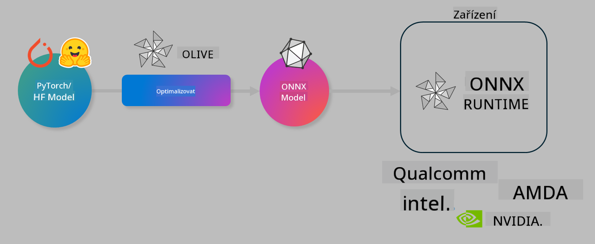

<!--
CO_OP_TRANSLATOR_METADATA:
{
  "original_hash": "6bbe47de3b974df7eea29dfeccf6032b",
  "translation_date": "2025-07-16T15:57:29+00:00",
  "source_file": "code/03.Finetuning/olive-lab/readme.md",
  "language_code": "cs"
}
-->
# Lab. Optimalizace AI modelů pro inferenci přímo na zařízení

## Úvod

> [!IMPORTANT]
> Tento lab vyžaduje **Nvidia A10 nebo A100 GPU** s nainstalovanými příslušnými ovladači a CUDA toolkit (verze 12+).

> [!NOTE]
> Tento lab trvá **35 minut** a poskytne vám praktický úvod do základních konceptů optimalizace modelů pro inferenci přímo na zařízení pomocí OLIVE.

## Cíle učení

Na konci tohoto labu budete umět pomocí OLIVE:

- Kvantizovat AI model pomocí metody kvantizace AWQ.
- Doladit AI model pro konkrétní úlohu.
- Generovat LoRA adaptéry (doladěný model) pro efektivní inferenci přímo na zařízení pomocí ONNX Runtime.

### Co je Olive

Olive (*O*NNX *live*) je nástroj pro optimalizaci modelů s doprovodným CLI, který vám umožní nasadit modely pro ONNX runtime +++https://onnxruntime.ai+++ s důrazem na kvalitu a výkon.



Vstupem do Olive je obvykle model z PyTorch nebo Hugging Face a výstupem je optimalizovaný ONNX model, který je spuštěn na zařízení (cílové nasazení) s ONNX runtime. Olive optimalizuje model pro AI akcelerátor cílového zařízení (NPU, GPU, CPU) dodaný výrobcem hardwaru jako Qualcomm, AMD, Nvidia nebo Intel.

Olive provádí *workflow*, což je uspořádaná posloupnost jednotlivých úkolů optimalizace modelu nazývaných *passes* – příklady passů jsou: komprese modelu, zachycení grafu, kvantizace, optimalizace grafu. Každý pass má sadu parametrů, které lze ladit pro dosažení nejlepších metrik, například přesnosti a latence, které vyhodnocuje příslušný evaluátor. Olive používá vyhledávací strategii, která pomocí algoritmu automaticky ladí každý pass jednotlivě nebo sadu passů společně.

#### Výhody Olive

- **Snižuje frustraci a čas** spojený s manuálním experimentováním metodou pokus-omyl u různých technik optimalizace grafu, komprese a kvantizace. Definujte své požadavky na kvalitu a výkon a nechte Olive automaticky najít nejlepší model pro vás.
- **Více než 40 vestavěných komponent pro optimalizaci modelů** pokrývajících nejmodernější techniky kvantizace, komprese, optimalizace grafu a doladění.
- **Snadno použitelný CLI** pro běžné úkoly optimalizace modelů. Například: olive quantize, olive auto-opt, olive finetune.
- Vestavěné balení a nasazení modelů.
- Podpora generování modelů pro **Multi LoRA serving**.
- Možnost vytvářet workflow pomocí YAML/JSON pro orchestraci úkolů optimalizace a nasazení modelů.
- Integrace s **Hugging Face** a **Azure AI**.
- Vestavěný **cache** mechanismus pro **úsporu nákladů**.

## Instrukce k labu
> [!NOTE]
> Ujistěte se, že máte připravený Azure AI Hub a projekt a nastavili jste výpočetní prostředí A100 podle Lab 1.

### Krok 0: Připojení k Azure AI Compute

Připojíte se k Azure AI compute pomocí vzdálené funkce ve **VS Code**.

1. Otevřete desktopovou aplikaci **VS Code**:
1. Otevřete **příkazovou paletu** pomocí **Shift+Ctrl+P**
1. V příkazové paletě vyhledejte **AzureML - remote: Connect to compute instance in New Window**.
1. Postupujte podle pokynů na obrazovce pro připojení k výpočetnímu uzlu. Budete vybírat svou Azure Subscription, Resource Group, projekt a název Compute, který jste nastavili v Lab 1.
1. Po připojení k Azure ML Compute uzlu se v levém dolním rohu Visual Studio Code zobrazí `><Azure ML: Compute Name`.

### Krok 1: Klonování tohoto repozitáře

Ve VS Code otevřete nový terminál pomocí **Ctrl+J** a naklonujte tento repozitář:

V terminálu byste měli vidět prompt

```
azureuser@computername:~/cloudfiles/code$ 
```
Klonujte řešení

```bash
cd ~/localfiles
git clone https://github.com/microsoft/phi-3cookbook.git
```

### Krok 2: Otevření složky ve VS Code

Pro otevření VS Code ve správné složce spusťte v terminálu následující příkaz, který otevře nové okno:

```bash
code phi-3cookbook/code/04.Finetuning/Olive-lab
```

Alternativně můžete složku otevřít přes **Soubor** > **Otevřít složku**.

### Krok 3: Závislosti

Otevřete terminál ve VS Code ve vašem Azure AI Compute Instance (tip: **Ctrl+J**) a spusťte následující příkazy pro instalaci závislostí:

```bash
conda create -n olive-ai python=3.11 -y
conda activate olive-ai
pip install -r requirements.txt
az extension remove -n azure-cli-ml
az extension add -n ml
```

> [!NOTE]
> Instalace všech závislostí zabere přibližně 5 minut.

V tomto labu budete stahovat a nahrávat modely do Azure AI katalogu modelů. Pro přístup do katalogu se přihlaste do Azure pomocí:

```bash
az login
```

> [!NOTE]
> Při přihlašování budete vyzváni k výběru předplatného. Ujistěte se, že vyberete předplatné přidělené pro tento lab.

### Krok 4: Spuštění příkazů Olive

Otevřete terminál ve VS Code ve vašem Azure AI Compute Instance (tip: **Ctrl+J**) a ujistěte se, že je aktivní conda prostředí `olive-ai`:

```bash
conda activate olive-ai
```

Poté spusťte následující příkazy Olive v příkazové řádce.

1. **Prohlédněte si data:** V tomto příkladu budete doladit model Phi-3.5-Mini tak, aby byl specializovaný na odpovídání na otázky týkající se cestování. Níže uvedený kód zobrazí prvních několik záznamů datové sady ve formátu JSON lines:

    ```bash
    head data/data_sample_travel.jsonl
    ```
1. **Kvantizujte model:** Před tréninkem modelu jej nejprve kvantizujte pomocí příkazu, který využívá techniku zvanou Active Aware Quantization (AWQ) +++https://arxiv.org/abs/2306.00978+++. AWQ kvantizuje váhy modelu s ohledem na aktivace vznikající během inference. To znamená, že proces kvantizace bere v úvahu skutečné rozložení dat v aktivacích, což vede k lepšímu zachování přesnosti modelu ve srovnání s tradičními metodami kvantizace vah.

    ```bash
    olive quantize \
       --model_name_or_path microsoft/Phi-3.5-mini-instruct \
       --trust_remote_code \
       --algorithm awq \
       --output_path models/phi/awq \
       --log_level 1
    ```

    Dokončení kvantizace AWQ trvá přibližně **8 minut** a **sníží velikost modelu z ~7,5GB na ~2,5GB**.

    V tomto labu ukazujeme, jak načíst modely z Hugging Face (například: `microsoft/Phi-3.5-mini-instruct`). Olive však také umožňuje načítat modely z Azure AI katalogu aktualizací argumentu `model_name_or_path` na Azure AI asset ID (například: `azureml://registries/azureml/models/Phi-3.5-mini-instruct/versions/4`).

1. **Trénujte model:** Následující příkaz `olive finetune` doladí kvantizovaný model. Kvantizace modelu *před* doladěním místo po něm zajišťuje lepší přesnost, protože proces doladění částečně kompenzuje ztrátu způsobenou kvantizací.

    ```bash
    olive finetune \
        --method lora \
        --model_name_or_path models/phi/awq \
        --data_files "data/data_sample_travel.jsonl" \
        --data_name "json" \
        --text_template "<|user|>\n{prompt}<|end|>\n<|assistant|>\n{response}<|end|>" \
        --max_steps 100 \
        --output_path ./models/phi/ft \
        --log_level 1
    ```

    Doladění (s 100 kroky) trvá přibližně **6 minut**.

1. **Optimalizujte:** Po natrénování modelu jej optimalizujte pomocí příkazu `auto-opt` v Olive, který zachytí ONNX graf a automaticky provede řadu optimalizací pro zlepšení výkonu modelu na CPU kompresí a fúzemi. Je třeba poznamenat, že můžete optimalizovat i pro jiná zařízení, jako jsou NPU nebo GPU, jednoduše aktualizací argumentů `--device` a `--provider` – ale pro účely tohoto labu použijeme CPU.

    ```bash
    olive auto-opt \
       --model_name_or_path models/phi/ft/model \
       --adapter_path models/phi/ft/adapter \
       --device cpu \
       --provider CPUExecutionProvider \
       --use_ort_genai \
       --output_path models/phi/onnx-ao \
       --log_level 1
    ```

    Optimalizace trvá přibližně **5 minut**.

### Krok 5: Rychlý test inferencí modelu

Pro otestování inferencí modelu vytvořte ve své složce Python soubor s názvem **app.py** a zkopírujte do něj následující kód:

```python
import onnxruntime_genai as og
import numpy as np

print("loading model and adapters...", end="", flush=True)
model = og.Model("models/phi/onnx-ao/model")
adapters = og.Adapters(model)
adapters.load("models/phi/onnx-ao/model/adapter_weights.onnx_adapter", "travel")
print("DONE!")

tokenizer = og.Tokenizer(model)
tokenizer_stream = tokenizer.create_stream()

params = og.GeneratorParams(model)
params.set_search_options(max_length=100, past_present_share_buffer=False)
user_input = "what is the best thing to see in chicago"
params.input_ids = tokenizer.encode(f"<|user|>\n{user_input}<|end|>\n<|assistant|>\n")

generator = og.Generator(model, params)

generator.set_active_adapter(adapters, "travel")

print(f"{user_input}")

while not generator.is_done():
    generator.compute_logits()
    generator.generate_next_token()

    new_token = generator.get_next_tokens()[0]
    print(tokenizer_stream.decode(new_token), end='', flush=True)

print("\n")
```

Kód spusťte pomocí:

```bash
python app.py
```

### Krok 6: Nahrání modelu do Azure AI

Nahrání modelu do Azure AI repozitáře umožňuje sdílet model s ostatními členy vašeho vývojového týmu a zároveň zajišťuje správu verzí modelu. Pro nahrání modelu spusťte následující příkaz:

> [!NOTE]
> Nahraďte `{}` názvem vaší resource group a názvem Azure AI projektu.

Pro zjištění názvu resource group `"resourceGroup"` a Azure AI projektu spusťte následující příkaz:

```
az ml workspace show
```

Nebo přejděte na +++ai.azure.com+++ a vyberte **management center** > **project** > **overview**

Nahraďte `{}` názvy vaší resource group a Azure AI projektu.

```bash
az ml model create \
    --name ft-for-travel \
    --version 1 \
    --path ./models/phi/onnx-ao \
    --resource-group {RESOURCE_GROUP_NAME} \
    --workspace-name {PROJECT_NAME}
```

Nahraný model pak můžete vidět a nasadit na https://ml.azure.com/model/list

**Prohlášení o vyloučení odpovědnosti**:  
Tento dokument byl přeložen pomocí AI překladatelské služby [Co-op Translator](https://github.com/Azure/co-op-translator). I když usilujeme o přesnost, mějte prosím na paměti, že automatické překlady mohou obsahovat chyby nebo nepřesnosti. Původní dokument v jeho mateřském jazyce by měl být považován za autoritativní zdroj. Pro důležité informace se doporučuje profesionální lidský překlad. Nejsme odpovědní za jakékoliv nedorozumění nebo nesprávné výklady vyplývající z použití tohoto překladu.