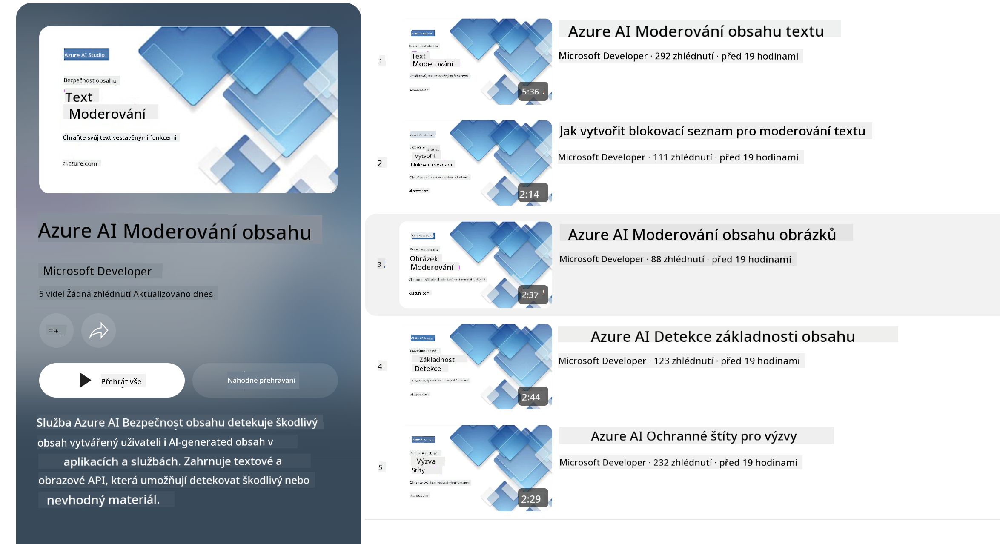

<!--
CO_OP_TRANSLATOR_METADATA:
{
  "original_hash": "c8273672cc57df2be675407a1383aaf0",
  "translation_date": "2025-05-09T06:19:11+00:00",
  "source_file": "md/01.Introduction/01/01.AISafety.md",
  "language_code": "cs"
}
-->
# AI güvenliği Phi modelleri için  
Phi model ailesi, aşağıdaki altı ilkeye dayanan şirket çapında gereksinimlerden oluşan [Microsoft Sorumlu AI Standardı](https://query.prod.cms.rt.microsoft.com/cms/api/am/binary/RE5cmFl) doğrultusunda geliştirilmiştir: hesap verebilirlik, şeffaflık, adillik, güvenilirlik ve güvenlik, gizlilik ve güvenlik ile kapsayıcılık; bunlar [Microsoft’un Sorumlu AI ilkelerini](https://www.microsoft.com/ai/responsible-ai) oluşturur.

Önceki Phi modellerinde olduğu gibi, çok yönlü bir güvenlik değerlendirmesi ve güvenlik sonrası eğitim yaklaşımı benimsendi; bu sürümün çok dilli yetenekleri de dikkate alınarak ek önlemler alındı. Güvenlik eğitimi ve değerlendirmelerimize, çoklu dil ve risk kategorilerinde testleri içeren yaklaşımımız [Phi Safety Post-Training Paper](https://arxiv.org/abs/2407.13833) dokümanında özetlenmiştir. Phi modelleri bu yaklaşımdan faydalansa da, geliştiriciler kendi kullanım durumları ve kültürel ile dilsel bağlamlarına bağlı riskleri haritalandırmalı, ölçmeli ve azaltmalı; sorumlu AI en iyi uygulamalarını uygulamalıdır.

## En İyi Uygulamalar  

Diğer modeller gibi, Phi model ailesi de adaletsiz, güvenilmez veya rahatsız edici davranışlar sergileyebilir.

SLM ve LLM'nin bazı sınırlayıcı davranışları şunlardır:

- **Hizmet Kalitesi:** Phi modelleri öncelikle İngilizce metin üzerinde eğitilmiştir. İngilizce dışındaki dillerde performans daha düşük olabilir. Eğitim verisinde daha az temsil edilen İngilizce dil çeşitleri, standart Amerikan İngilizcesine göre daha kötü performans gösterebilir.
- **Zararların Temsili ve Stereotiplerin Sürdürülmesi:** Bu modeller bazı insan gruplarını fazla veya az temsil edebilir, bazı grupların temsilini yok sayabilir veya küçültücü ya da olumsuz stereotipleri pekiştirebilir. Güvenlik sonrası eğitim yapılmasına rağmen, bu sınırlamalar farklı grupların temsil seviyelerindeki farklılıklar veya eğitim verisinde gerçek dünya kalıplarını ve toplumsal önyargıları yansıtan olumsuz stereotip örneklerinin yaygınlığı nedeniyle devam edebilir.
- **Uygunsuz veya Rahatsız Edici İçerik:** Bu modeller, kullanım durumuna özgü ek önlemler alınmadan hassas bağlamlarda kullanımı uygun olmayan başka tür uygunsuz veya rahatsız edici içerikler üretebilir.
- **Bilgi Güvenilirliği:** Dil modelleri anlamsız içerik üretebilir veya mantıklı gibi görünen ancak yanlış ya da güncel olmayan içerikler yaratabilir.
- **Kod için Sınırlı Kapsam:** Phi-3 eğitim verisinin çoğunluğu Python tabanlıdır ve "typing, math, random, collections, datetime, itertools" gibi yaygın paketleri kullanır. Model, başka paketleri veya diğer dillerdeki betikleri üretirse, kullanıcıların tüm API kullanımlarını manuel olarak doğrulamaları şiddetle tavsiye edilir.

Geliştiriciler sorumlu AI en iyi uygulamalarını uygulamalı ve belirli kullanım durumlarının ilgili yasa ve yönetmeliklere (örneğin gizlilik, ticaret vb.) uygunluğunu sağlamaktan sorumludur.

## Sorumlu AI Dikkat Edilmesi Gerekenler  

Diğer dil modellerinde olduğu gibi, Phi serisi modeller adaletsiz, güvenilmez veya rahatsız edici davranışlar sergileyebilir. Dikkat edilmesi gereken bazı sınırlayıcı davranışlar şunlardır:

**Hizmet Kalitesi:** Phi modelleri öncelikle İngilizce metin üzerinde eğitilmiştir. İngilizce dışındaki dillerde performans daha düşük olabilir. Eğitim verisinde daha az temsil edilen İngilizce dil çeşitleri, standart Amerikan İngilizcesine göre daha kötü performans gösterebilir.

**Zararların Temsili ve Stereotiplerin Sürdürülmesi:** Bu modeller bazı insan gruplarını fazla veya az temsil edebilir, bazı grupların temsilini yok sayabilir veya küçültücü ya da olumsuz stereotipleri pekiştirebilir. Güvenlik sonrası eğitim yapılmasına rağmen, bu sınırlamalar farklı grupların temsil seviyelerindeki farklılıklar veya eğitim verisinde gerçek dünya kalıplarını ve toplumsal önyargıları yansıtan olumsuz stereotip örneklerinin yaygınlığı nedeniyle devam edebilir.

**Uygunsuz veya Rahatsız Edici İçerik:** Bu modeller, kullanım durumuna özgü ek önlemler alınmadan hassas bağlamlarda kullanımı uygun olmayan başka tür uygunsuz veya rahatsız edici içerikler üretebilir.

Bilgi Güvenilirliği: Dil modelleri anlamsız içerik üretebilir veya mantıklı gibi görünen ancak yanlış ya da güncel olmayan içerikler yaratabilir.

**Kod için Sınırlı Kapsam:** Phi-3 eğitim verisinin çoğunluğu Python tabanlıdır ve "typing, math, random, collections, datetime, itertools" gibi yaygın paketleri kullanır. Model, başka paketleri veya diğer dillerdeki betikleri üretirse, kullanıcıların tüm API kullanımlarını manuel olarak doğrulamaları şiddetle tavsiye edilir.

Geliştiriciler sorumlu AI en iyi uygulamalarını uygulamalı ve belirli kullanım durumlarının ilgili yasa ve yönetmeliklere (örneğin gizlilik, ticaret vb.) uygunluğunu sağlamaktan sorumludur. Dikkat edilmesi gereken önemli alanlar şunlardır:

**Tahsis:** Modeller, yasal statü veya kaynakların ya da yaşam fırsatlarının tahsisi (örneğin: konut, istihdam, kredi vb.) üzerinde önemli etkisi olabilecek senaryolarda uygun olmayabilir; bu tür durumlarda ek değerlendirmeler ve önyargı giderme teknikleri gereklidir.

**Yüksek Riskli Senaryolar:** Geliştiriciler, adaletsiz, güvenilmez veya rahatsız edici çıktılarının çok maliyetli veya zararlı olabileceği yüksek riskli senaryolarda modellerin uygunluğunu değerlendirmelidir. Bu, doğruluk ve güvenilirliğin kritik olduğu hassas veya uzman alanlarda (örneğin: hukuk veya sağlık danışmanlığı) öneri sunmayı içerir. Uygulama düzeyinde, dağıtım bağlamına göre ek güvenlik önlemleri uygulanmalıdır.

**Yanlış Bilgi:** Modeller yanlış bilgi üretebilir. Geliştiriciler şeffaflık en iyi uygulamalarını takip etmeli ve son kullanıcıları AI sistemiyle etkileşimde oldukları konusunda bilgilendirmelidir. Uygulama düzeyinde, geliştiriciler geri bildirim mekanizmaları ve kullanım durumuna özgü, bağlamsal bilgiye dayalı yanıtlar oluşturmak için Retrieval Augmented Generation (RAG) olarak bilinen teknikler kullanabilir.

**Zararlı İçerik Üretimi:** Geliştiriciler, çıktıları bağlamlarına göre değerlendirmeli ve kullanım durumlarına uygun mevcut güvenlik sınıflandırıcıları veya özel çözümler kullanmalıdır.

**Kötüye Kullanım:** Dolandırıcılık, spam veya kötü amaçlı yazılım üretimi gibi diğer kötüye kullanım biçimleri mümkün olabilir; geliştiriciler uygulamalarının geçerli yasa ve yönetmeliklere aykırı olmadığından emin olmalıdır.

### İnce Ayar ve AI İçerik Güvenliği  

Bir modeli ince ayar yaptıktan sonra, modeller tarafından oluşturulan içeriği izlemek, potansiyel riskleri, tehditleri ve kalite sorunlarını belirlemek ve engellemek için [Azure AI Content Safety](https://learn.microsoft.com/azure/ai-services/content-safety/overview) önlemlerini kullanmanızı şiddetle tavsiye ederiz.

[Azure AI Content Safety](https://learn.microsoft.com/azure/ai-services/content-safety/overview) hem metin hem de görsel içerikleri destekler. Bulutta, bağlantısız konteynerlerde ve uç/gömülü cihazlarda dağıtılabilir.

## Azure AI Content Safety Genel Bakış  

Azure AI Content Safety tek tip bir çözüm değildir; işletmelerin özel politikalarına uyacak şekilde özelleştirilebilir. Ayrıca, çok dilli modelleri sayesinde birden fazla dili aynı anda anlayabilir.

- **Azure AI Content Safety**  
- **Microsoft Developer**  
- **5 video**

Azure AI Content Safety servisi, uygulamalarda ve hizmetlerde zararlı kullanıcı tarafından oluşturulan ve AI tarafından oluşturulan içerikleri algılar. Zararlı veya uygunsuz materyalleri tespit etmeye olanak sağlayan metin ve görsel API’lerini içerir.

[AI Content Safety Playlist](https://www.youtube.com/playlist?list=PLlrxD0HtieHjaQ9bJjyp1T7FeCbmVcPkQ)

**Prohlášení o vyloučení odpovědnosti**:  
Tento dokument byl přeložen pomocí AI překladatelské služby [Co-op Translator](https://github.com/Azure/co-op-translator). I když usilujeme o přesnost, mějte prosím na paměti, že automatizované překlady mohou obsahovat chyby nebo nepřesnosti. Původní dokument v jeho mateřském jazyce by měl být považován za autoritativní zdroj. Pro důležité informace se doporučuje profesionální lidský překlad. Nejsme odpovědní za jakákoliv nedorozumění nebo nesprávné výklady vyplývající z použití tohoto překladu.