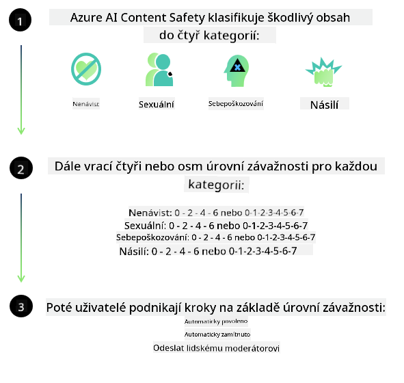
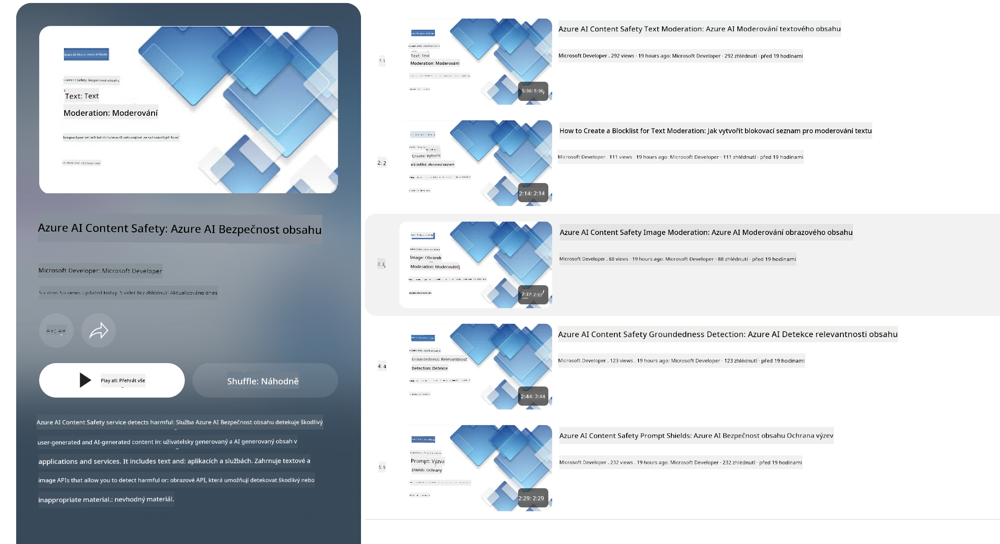

<!--
CO_OP_TRANSLATOR_METADATA:
{
  "original_hash": "c8273672cc57df2be675407a1383aaf0",
  "translation_date": "2025-07-16T17:52:26+00:00",
  "source_file": "md/01.Introduction/01/01.AISafety.md",
  "language_code": "cs"
}
-->
# Bezpečnost AI pro modely Phi  
Rodina modelů Phi byla vyvinuta v souladu s [Microsoft Responsible AI Standard](https://query.prod.cms.rt.microsoft.com/cms/api/am/binary/RE5cmFl), což je firemní soubor požadavků založený na šesti principech: odpovědnost, transparentnost, spravedlnost, spolehlivost a bezpečnost, ochrana soukromí a zabezpečení a inkluzivita, které tvoří [zásady odpovědné AI společnosti Microsoft](https://www.microsoft.com/ai/responsible-ai).

Stejně jako u předchozích modelů Phi byl přijat komplexní přístup k hodnocení bezpečnosti a bezpečnostnímu doladění po tréninku, přičemž byly přijaty další opatření zohledňující vícejazyčné schopnosti této verze. Náš přístup k bezpečnostnímu tréninku a hodnocení, včetně testování napříč více jazyky a kategoriemi rizik, je popsán v [Phi Safety Post-Training Paper](https://arxiv.org/abs/2407.13833). I když modely Phi z tohoto přístupu těží, vývojáři by měli uplatňovat osvědčené postupy odpovědné AI, včetně mapování, měření a zmírňování rizik spojených s jejich konkrétním případem použití a kulturním a jazykovým kontextem.

## Nejlepší postupy

Stejně jako jiné modely, i rodina modelů Phi může potenciálně vykazovat chování, které je nespravedlivé, nespolehlivé nebo urážlivé.

Některé z omezení chování SLM a LLM, na které byste měli dávat pozor, zahrnují:

- **Kvalita služby:** Modely Phi jsou trénovány převážně na anglickém textu. Jazyky jiné než angličtina budou mít horší výkon. Varianty angličtiny s menší zastoupeností v tréninkových datech mohou mít horší výsledky než standardní americká angličtina.  
- **Zastoupení škod a upevňování stereotypů:** Tyto modely mohou některé skupiny lidí přeceňovat nebo podceňovat, vymazávat zastoupení některých skupin nebo posilovat ponižující či negativní stereotypy. Navzdory bezpečnostnímu doladění po tréninku mohou tato omezení přetrvávat kvůli rozdílné míře zastoupení různých skupin nebo četnosti negativních stereotypů v tréninkových datech, které odrážejí skutečné vzorce a společenské předsudky.  
- **Nevhodný nebo urážlivý obsah:** Tyto modely mohou generovat i jiné typy nevhodného nebo urážlivého obsahu, což může znamenat, že nejsou vhodné pro nasazení v citlivých kontextech bez dalších opatření specifických pro daný případ použití.  
- **Spolehlivost informací:** Jazykové modely mohou generovat nesmyslný obsah nebo vytvářet informace, které mohou znít věrohodně, ale jsou nepřesné nebo zastaralé.  
- **Omezený rozsah pro kód:** Většina tréninkových dat Phi-3 je založena na Pythonu a používá běžné balíčky jako "typing, math, random, collections, datetime, itertools". Pokud model generuje Python skripty využívající jiné balíčky nebo skripty v jiných jazycích, důrazně doporučujeme uživatelům manuálně ověřit všechny použití API.

Vývojáři by měli uplatňovat osvědčené postupy odpovědné AI a jsou odpovědní za to, že konkrétní případ použití bude v souladu s příslušnými zákony a předpisy (např. ochrana soukromí, obchodní předpisy apod.).

## Úvahy o odpovědné AI

Stejně jako jiné jazykové modely, i modely řady Phi mohou potenciálně vykazovat chování, které je nespravedlivé, nespolehlivé nebo urážlivé. Některá omezení, na která je třeba dávat pozor, zahrnují:

**Kvalita služby:** Modely Phi jsou trénovány převážně na anglickém textu. Jazyky jiné než angličtina budou mít horší výkon. Varianty angličtiny s menší zastoupeností v tréninkových datech mohou mít horší výsledky než standardní americká angličtina.

**Zastoupení škod a upevňování stereotypů:** Tyto modely mohou některé skupiny lidí přeceňovat nebo podceňovat, vymazávat zastoupení některých skupin nebo posilovat ponižující či negativní stereotypy. Navzdory bezpečnostnímu doladění po tréninku mohou tato omezení přetrvávat kvůli rozdílné míře zastoupení různých skupin nebo četnosti negativních stereotypů v tréninkových datech, které odrážejí skutečné vzorce a společenské předsudky.

**Nevhodný nebo urážlivý obsah:** Tyto modely mohou generovat i jiné typy nevhodného nebo urážlivého obsahu, což může znamenat, že nejsou vhodné pro nasazení v citlivých kontextech bez dalších opatření specifických pro daný případ použití.  
Spolehlivost informací: Jazykové modely mohou generovat nesmyslný obsah nebo vytvářet informace, které mohou znít věrohodně, ale jsou nepřesné nebo zastaralé.

**Omezený rozsah pro kód:** Většina tréninkových dat Phi-3 je založena na Pythonu a používá běžné balíčky jako "typing, math, random, collections, datetime, itertools". Pokud model generuje Python skripty využívající jiné balíčky nebo skripty v jiných jazycích, důrazně doporučujeme uživatelům manuálně ověřit všechny použití API.

Vývojáři by měli uplatňovat osvědčené postupy odpovědné AI a jsou odpovědní za to, že konkrétní případ použití bude v souladu s příslušnými zákony a předpisy (např. ochrana soukromí, obchodní předpisy apod.). Mezi důležité oblasti k zvážení patří:

**Přidělování:** Modely nemusí být vhodné pro scénáře, které by mohly mít zásadní dopad na právní status nebo přidělování zdrojů či životních příležitostí (např. bydlení, zaměstnání, úvěr apod.) bez dalších hodnocení a technik odstraňování zkreslení.

**Vysoce rizikové scénáře:** Vývojáři by měli posoudit vhodnost použití modelů ve vysoce rizikových scénářích, kde by nespravedlivé, nespolehlivé nebo urážlivé výstupy mohly mít extrémně nákladné důsledky nebo vést k újmě. To zahrnuje poskytování rad v citlivých nebo odborných oblastech, kde je přesnost a spolehlivost klíčová (např. právní nebo zdravotní poradenství). Na úrovni aplikace by měly být implementovány další ochranné mechanismy podle kontextu nasazení.

**Dezinformace:** Modely mohou produkovat nepřesné informace. Vývojáři by měli dodržovat nejlepší postupy transparentnosti a informovat koncové uživatele, že komunikují s AI systémem. Na úrovni aplikace mohou vývojáři vytvářet zpětnovazební mechanismy a procesy, které zakládají odpovědi na specifických, kontextuálních informacích pro daný případ použití, což je technika známá jako Retrieval Augmented Generation (RAG).

**Generování škodlivého obsahu:** Vývojáři by měli posuzovat výstupy v jejich kontextu a využívat dostupné bezpečnostní klasifikátory nebo vlastní řešení vhodná pro jejich případ použití.

**Zneužití:** Mohou být možné i jiné formy zneužití, jako je podvod, spam nebo tvorba malwaru, a vývojáři by měli zajistit, že jejich aplikace neporušují platné zákony a předpisy.

### Doladění a bezpečnost AI obsahu

Po doladění modelu důrazně doporučujeme využít opatření [Azure AI Content Safety](https://learn.microsoft.com/azure/ai-services/content-safety/overview) k monitorování obsahu generovaného modely, identifikaci a blokování potenciálních rizik, hrozeb a problémů s kvalitou.

[Azure AI Content Safety](https://learn.microsoft.com/azure/ai-services/content-safety/overview) podporuje jak textový, tak obrazový obsah. Lze jej nasadit v cloudu, v odpojených kontejnerech i na edge/vestavěných zařízeních.

## Přehled Azure AI Content Safety

Azure AI Content Safety není univerzální řešení; lze jej přizpůsobit tak, aby odpovídalo specifickým politikám podniků. Navíc jeho vícejazyčné modely umožňují současné porozumění více jazykům.

- **Azure AI Content Safety**  
- **Microsoft Developer**  
- **5 videí**

Služba Azure AI Content Safety detekuje škodlivý obsah vytvářený uživateli i AI v aplikacích a službách. Zahrnuje textová a obrazová API, která umožňují detekovat škodlivý nebo nevhodný materiál.

[AI Content Safety Playlist](https://www.youtube.com/playlist?list=PLlrxD0HtieHjaQ9bJjyp1T7FeCbmVcPkQ)

**Prohlášení o vyloučení odpovědnosti**:  
Tento dokument byl přeložen pomocí AI překladatelské služby [Co-op Translator](https://github.com/Azure/co-op-translator). I když usilujeme o přesnost, mějte prosím na paměti, že automatické překlady mohou obsahovat chyby nebo nepřesnosti. Původní dokument v jeho mateřském jazyce by měl být považován za autoritativní zdroj. Pro důležité informace se doporučuje profesionální lidský překlad. Nejsme odpovědní za jakékoliv nedorozumění nebo nesprávné výklady vyplývající z použití tohoto překladu.