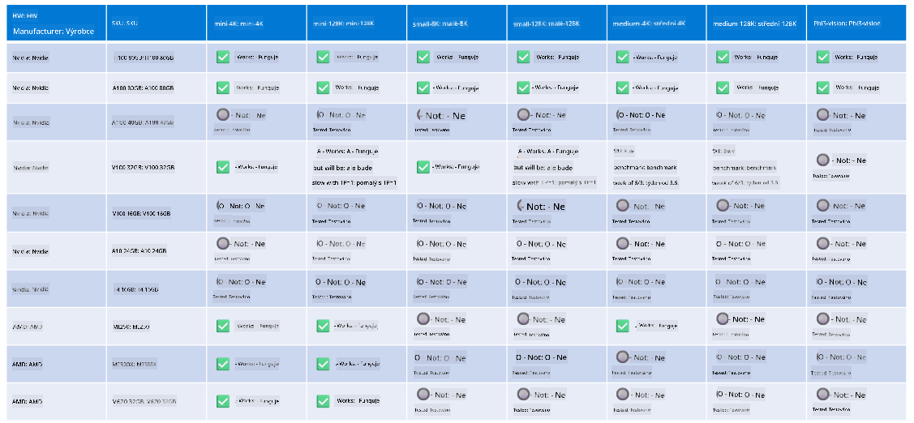

<!--
CO_OP_TRANSLATOR_METADATA:
{
  "original_hash": "8cdc17ce0f10535da30b53d23fe1a795",
  "translation_date": "2025-07-16T18:26:52+00:00",
  "source_file": "md/01.Introduction/01/01.Hardwaresupport.md",
  "language_code": "cs"
}
-->
# Podpora hardwaru Phi

Microsoft Phi byl optimalizován pro ONNX Runtime a podporuje Windows DirectML. Funguje dobře na různých typech hardwaru, včetně GPU, CPU a dokonce i mobilních zařízení.

## Hardwarové zařízení  
Konkrétně podporovaný hardware zahrnuje:

- GPU SKU: RTX 4090 (DirectML)
- GPU SKU: 1 A100 80GB (CUDA)
- CPU SKU: Standard F64s v2 (64 vCPU, 128 GiB paměti)

## Mobilní SKU

- Android – Samsung Galaxy S21
- Apple iPhone 14 nebo vyšší s procesorem A16/A17

## Specifikace hardwaru Phi

- Minimální požadovaná konfigurace.
- Windows: GPU s podporou DirectX 12 a minimálně 4 GB celkové RAM

CUDA: NVIDIA GPU s Compute Capability >= 7.02



## Spuštění onnxruntime na více GPU

Aktuálně dostupné Phi ONNX modely jsou určeny pouze pro 1 GPU. Podpora více GPU pro Phi model je možná, ale ORT s 2 GPU nezaručuje vyšší propustnost než 2 instance ORT. Pro nejnovější informace navštivte [ONNX Runtime](https://onnxruntime.ai/).

Na [Build 2024 tým GenAI ONNX](https://youtu.be/WLW4SE8M9i8?si=EtG04UwDvcjunyfC) oznámil, že místo multi-GPU povolili multi-instance pro Phi modely.

V současnosti to umožňuje spustit jednu instanci onnxruntime nebo onnxruntime-genai s proměnnou prostředí CUDA_VISIBLE_DEVICES takto.

```Python
CUDA_VISIBLE_DEVICES=0 python infer.py
CUDA_VISIBLE_DEVICES=1 python infer.py
```

Neváhejte dále zkoumat Phi v [Azure AI Foundry](https://ai.azure.com)

**Prohlášení o vyloučení odpovědnosti**:  
Tento dokument byl přeložen pomocí AI překladatelské služby [Co-op Translator](https://github.com/Azure/co-op-translator). I když usilujeme o přesnost, mějte prosím na paměti, že automatizované překlady mohou obsahovat chyby nebo nepřesnosti. Původní dokument v jeho mateřském jazyce by měl být považován za autoritativní zdroj. Pro důležité informace se doporučuje profesionální lidský překlad. Nejsme odpovědní za jakékoliv nedorozumění nebo nesprávné výklady vyplývající z použití tohoto překladu.