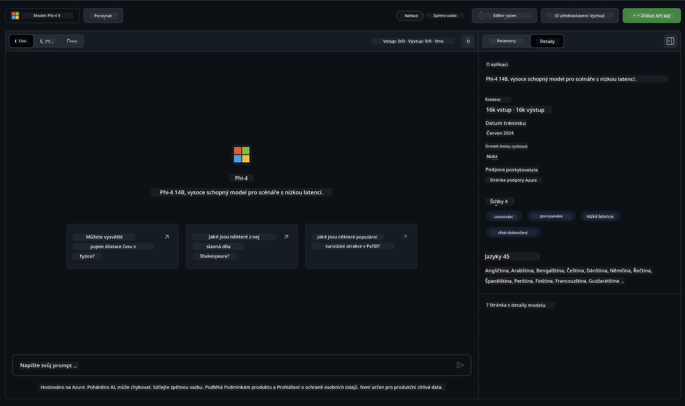

## Rodina Phi v GitHub Modelech

Vítejte na [GitHub Modelech](https://github.com/marketplace/models)! Máme vše připravené, abyste mohli prozkoumat AI modely hostované na Azure AI.


Pro více informací o modelech dostupných na GitHub Modelech navštivte [GitHub Model Marketplace](https://github.com/marketplace/models)

## Dostupné modely

Každý model má vlastní playground a ukázkový kód



### Rodina Phi v katalogu GitHub modelů

- [Phi-4](https://github.com/marketplace/models/azureml/Phi-4)

- [Phi-3.5-MoE instruct (128k)](https://github.com/marketplace/models/azureml/Phi-3-5-MoE-instruct)

- [Phi-3.5-vision instruct (128k)](https://github.com/marketplace/models/azureml/Phi-3-5-vision-instruct)

- [Phi-3.5-mini instruct (128k)](https://github.com/marketplace/models/azureml/Phi-3-5-mini-instruct)

- [Phi-3-Medium-128k-Instruct](https://github.com/marketplace/models/azureml/Phi-3-medium-128k-instruct)

- [Phi-3-medium-4k-instruct](https://github.com/marketplace/models/azureml/Phi-3-medium-4k-instruct)

- [Phi-3-mini-128k-instruct](https://github.com/marketplace/models/azureml/Phi-3-mini-128k-instruct)

- [Phi-3-mini-4k-instruct](https://github.com/marketplace/models/azureml/Phi-3-mini-4k-instruct)

- [Phi-3-small-128k-instruct](https://github.com/marketplace/models/azureml/Phi-3-small-128k-instruct)

- [Phi-3-small-8k-instruct](https://github.com/marketplace/models/azureml/Phi-3-small-8k-instruct)

## Začínáme

K dispozici je několik základních příkladů, které jsou připravené k spuštění. Najdete je ve složce samples. Pokud chcete rovnou přejít na svůj oblíbený jazyk, příklady najdete v těchto jazycích:

- Python
- JavaScript
- C#
- Java
- cURL

K dispozici je také speciální prostředí Codespaces pro spouštění ukázek a modelů.


## Ukázkový kód

Níže jsou příklady kódu pro několik scénářů použití. Pro další informace o Azure AI Inference SDK si prohlédněte kompletní dokumentaci a ukázky.

## Nastavení

1. Vytvořte osobní přístupový token  
Nemusíte tokenu udělovat žádná oprávnění. Upozorňujeme, že token bude odeslán do služby Microsoft.

Pro použití níže uvedených ukázek kódu si vytvořte proměnnou prostředí, kde nastavíte svůj token jako klíč pro klientský kód.

Pokud používáte bash:  
```
export GITHUB_TOKEN="<your-github-token-goes-here>"
```  
Pokud jste v powershellu:  

```
$Env:GITHUB_TOKEN="<your-github-token-goes-here>"
```  

Pokud používáte Windows příkazový řádek:  

```
set GITHUB_TOKEN=<your-github-token-goes-here>
```  

## Ukázka v Pythonu

### Instalace závislostí  
Nainstalujte Azure AI Inference SDK pomocí pip (vyžaduje Python >=3.8):

```
pip install azure-ai-inference
```  
### Spuštění základního příkladu kódu

Tento příklad ukazuje základní volání API pro chat completion. Využívá GitHub AI model inference endpoint a váš GitHub token. Volání je synchronní.

```python
import os
from azure.ai.inference import ChatCompletionsClient
from azure.ai.inference.models import SystemMessage, UserMessage
from azure.core.credentials import AzureKeyCredential

endpoint = "https://models.inference.ai.azure.com"
model_name = "Phi-4"
token = os.environ["GITHUB_TOKEN"]

client = ChatCompletionsClient(
    endpoint=endpoint,
    credential=AzureKeyCredential(token),
)

response = client.complete(
    messages=[
        UserMessage(content="I have $20,000 in my savings account, where I receive a 4% profit per year and payments twice a year. Can you please tell me how long it will take for me to become a millionaire? Also, can you please explain the math step by step as if you were explaining it to an uneducated person?"),
    ],
    temperature=0.4,
    top_p=1.0,
    max_tokens=2048,
    model=model_name
)

print(response.choices[0].message.content)
```

### Spuštění vícetahové konverzace

Tento příklad ukazuje vícetahovou konverzaci s chat completion API. Při použití modelu pro chatovací aplikaci je potřeba spravovat historii konverzace a posílat modelu nejnovější zprávy.

```
import os
from azure.ai.inference import ChatCompletionsClient
from azure.ai.inference.models import AssistantMessage, SystemMessage, UserMessage
from azure.core.credentials import AzureKeyCredential

token = os.environ["GITHUB_TOKEN"]
endpoint = "https://models.inference.ai.azure.com"
# Replace Model_Name
model_name = "Phi-4"

client = ChatCompletionsClient(
    endpoint=endpoint,
    credential=AzureKeyCredential(token),
)

messages = [
    SystemMessage(content="You are a helpful assistant."),
    UserMessage(content="What is the capital of France?"),
    AssistantMessage(content="The capital of France is Paris."),
    UserMessage(content="What about Spain?"),
]

response = client.complete(messages=messages, model=model_name)

print(response.choices[0].message.content)
```

### Streamování výstupu

Pro lepší uživatelský zážitek je vhodné streamovat odpověď modelu, aby se první token zobrazil co nejdříve a vy jste nemuseli čekat na dlouhé odpovědi.

```
import os
from azure.ai.inference import ChatCompletionsClient
from azure.ai.inference.models import SystemMessage, UserMessage
from azure.core.credentials import AzureKeyCredential

token = os.environ["GITHUB_TOKEN"]
endpoint = "https://models.inference.ai.azure.com"
# Replace Model_Name
model_name = "Phi-4"

client = ChatCompletionsClient(
    endpoint=endpoint,
    credential=AzureKeyCredential(token),
)

response = client.complete(
    stream=True,
    messages=[
        SystemMessage(content="You are a helpful assistant."),
        UserMessage(content="Give me 5 good reasons why I should exercise every day."),
    ],
    model=model_name,
)

for update in response:
    if update.choices:
        print(update.choices[0].delta.content or "", end="")

client.close()
```

## BEZPLATNÉ použití a limity pro GitHub Modely


[Limity pro playground a bezplatné API použití](https://docs.github.com/en/github-models/prototyping-with-ai-models#rate-limits) jsou navrženy tak, aby vám umožnily experimentovat s modely a prototypovat vaši AI aplikaci. Pro použití nad rámec těchto limitů a pro škálování aplikace je nutné zajistit zdroje z Azure účtu a autentizovat se tam místo pomocí osobního GitHub tokenu. V kódu není potřeba nic dalšího měnit. Použijte tento odkaz, kde zjistíte, jak překročit limity bezplatné úrovně v Azure AI.

### Upozornění

Pamatujte, že při práci s modelem experimentujete s AI, takže se mohou vyskytnout chyby v obsahu.

Funkce podléhá různým omezením (včetně počtu požadavků za minutu, za den, tokenů na požadavek a současných požadavků) a není určena pro produkční použití.

GitHub Models využívá Azure AI Content Safety. Tyto filtry nelze v rámci GitHub Models vypnout. Pokud se rozhodnete používat modely přes placenou službu, nakonfigurujte si filtry obsahu podle svých potřeb.

Tato služba je poskytována podle GitHub Pre-release Terms.

**Prohlášení o vyloučení odpovědnosti**:  
Tento dokument byl přeložen pomocí AI překladatelské služby [Co-op Translator](https://github.com/Azure/co-op-translator). I když usilujeme o přesnost, mějte prosím na paměti, že automatické překlady mohou obsahovat chyby nebo nepřesnosti. Původní dokument v jeho mateřském jazyce by měl být považován za závazný zdroj. Pro důležité informace se doporučuje profesionální lidský překlad. Nejsme odpovědní za jakékoliv nedorozumění nebo nesprávné výklady vyplývající z použití tohoto překladu.