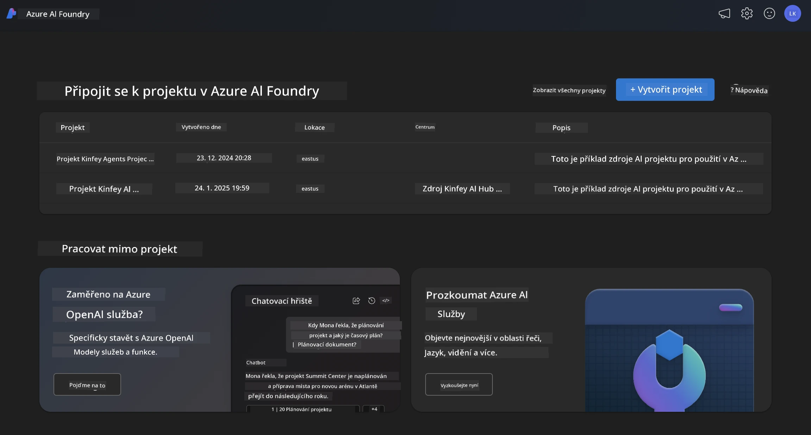
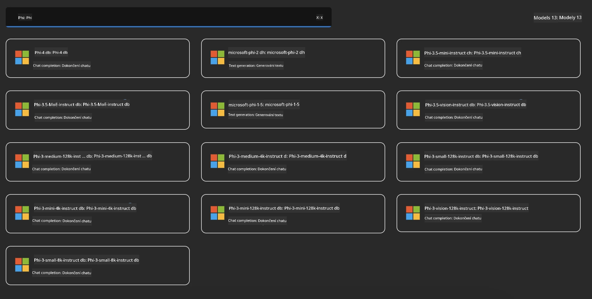
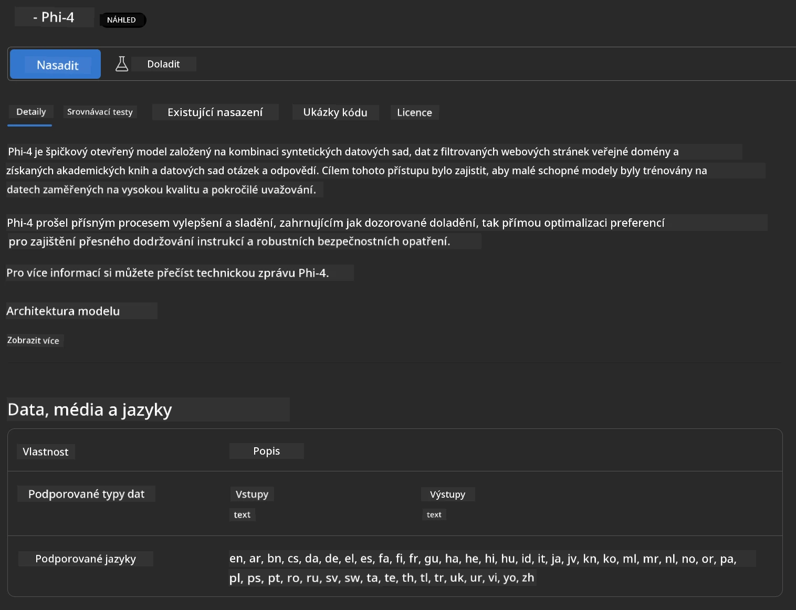
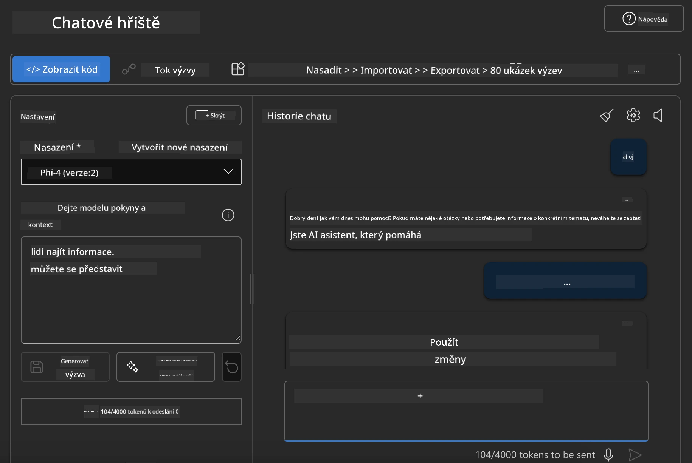

## Rodina Phi v Azure AI Foundry

[Azure AI Foundry](https://ai.azure.com) je důvěryhodná platforma, která umožňuje vývojářům přinášet inovace a formovat budoucnost s AI bezpečným, zabezpečeným a odpovědným způsobem.

[Azure AI Foundry](https://ai.azure.com) je navržena pro vývojáře, aby:

- Vytvářeli generativní AI aplikace na podnikové úrovni.
- Prozkoumávali, vytvářeli, testovali a nasazovali pomocí nejmodernějších AI nástrojů a ML modelů, založených na principech odpovědné AI.
- Spolupracovali v týmu během celého životního cyklu vývoje aplikace.

S Azure AI Foundry můžete prozkoumat širokou škálu modelů, služeb a funkcí a začít vytvářet AI aplikace, které nejlépe odpovídají vašim cílům. Platforma Azure AI Foundry usnadňuje škálovatelnost při přeměně konceptů na plnohodnotné produkční aplikace. Neustálé sledování a vylepšování podporují dlouhodobý úspěch.



Kromě využití Azure AOAI Service v Azure AI Foundry můžete také použít modely třetích stran v Azure AI Foundry Model Catalog. To je dobrá volba, pokud chcete používat Azure AI Foundry jako platformu pro vaše AI řešení.

Modely rodiny Phi lze rychle nasadit prostřednictvím Model Catalog v Azure AI Foundry

[Microsoft Phi Models v Azure AI Foundry Models](https://ai.azure.com/explore/models/?selectedCollection=phi)



### **Nasazení Phi-4 v Azure AI Foundry**



### **Testování Phi-4 v Azure AI Foundry Playground**



### **Spuštění Python kódu pro volání Azure AI Foundry Phi-4**

```python

import os  
import base64
from openai import AzureOpenAI  
from azure.identity import DefaultAzureCredential, get_bearer_token_provider  
        
endpoint = os.getenv("ENDPOINT_URL", "Your Azure AOAI Service Endpoint")  
deployment = os.getenv("DEPLOYMENT_NAME", "Phi-4")  
      
token_provider = get_bearer_token_provider(  
    DefaultAzureCredential(),  
    "https://cognitiveservices.azure.com/.default"  
)  
  
client = AzureOpenAI(  
    azure_endpoint=endpoint,  
    azure_ad_token_provider=token_provider,  
    api_version="2024-05-01-preview",  
)  
  

chat_prompt = [
    {
        "role": "system",
        "content": "You are an AI assistant that helps people find information."
    },
    {
        "role": "user",
        "content": "can you introduce yourself"
    }
] 
    
# Include speech result if speech is enabled  
messages = chat_prompt 

completion = client.chat.completions.create(  
    model=deployment,  
    messages=messages,
    max_tokens=800,  
    temperature=0.7,  
    top_p=0.95,  
    frequency_penalty=0,  
    presence_penalty=0,
    stop=None,  
    stream=False  
)  
  
print(completion.to_json())  

```

**Prohlášení o vyloučení odpovědnosti**:  
Tento dokument byl přeložen pomocí AI překladatelské služby [Co-op Translator](https://github.com/Azure/co-op-translator). I když usilujeme o přesnost, mějte prosím na paměti, že automatické překlady mohou obsahovat chyby nebo nepřesnosti. Původní dokument v jeho mateřském jazyce by měl být považován za autoritativní zdroj. Pro důležité informace se doporučuje profesionální lidský překlad. Nejsme odpovědní za jakékoliv nedorozumění nebo nesprávné výklady vyplývající z použití tohoto překladu.