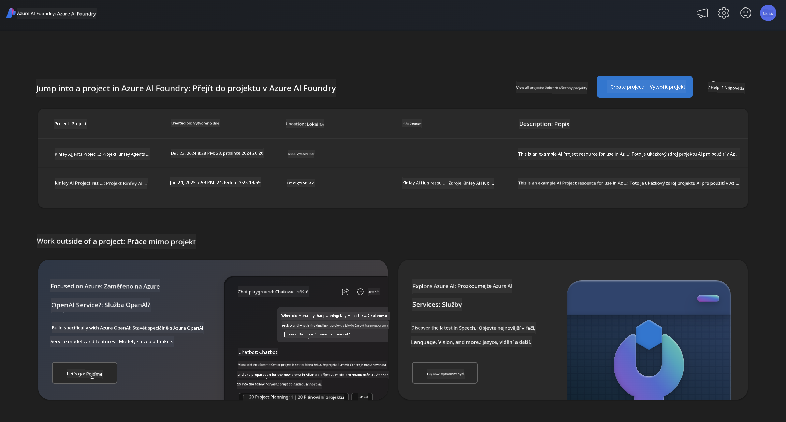
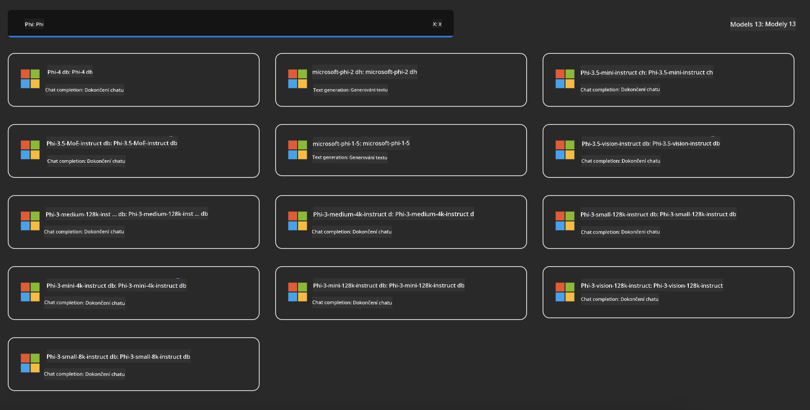
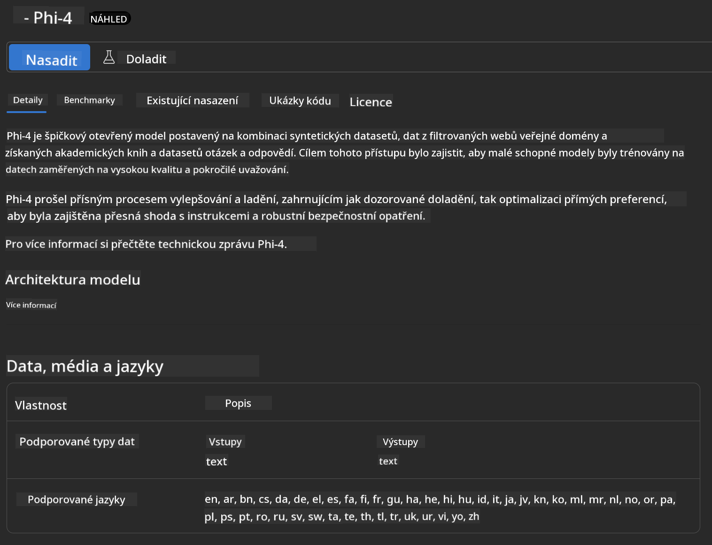
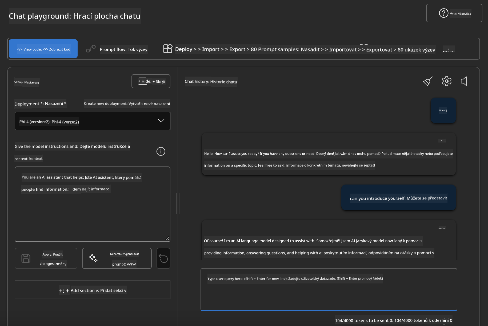

<!--
CO_OP_TRANSLATOR_METADATA:
{
  "original_hash": "3ae21dc5554e888defbe57946ee995ee",
  "translation_date": "2025-05-09T09:09:08+00:00",
  "source_file": "md/01.Introduction/02/03.AzureAIFoundry.md",
  "language_code": "cs"
}
-->
## Phi Family in Azure AI Foundry

[Azure AI Foundry](https://ai.azure.com) は、安全で安心かつ責任ある方法でAIを活用し、開発者がイノベーションを推進し未来を切り拓くための信頼できるプラットフォームです。

[Azure AI Foundry](https://ai.azure.com) は開発者向けに以下を提供します：

- エンタープライズグレードのプラットフォーム上で生成AIアプリケーションを構築する。
- 最先端のAIツールとMLモデルを活用し、責任あるAIの実践に基づいて探索、構築、テスト、デプロイを行う。
- アプリケーション開発のライフサイクル全体を通じてチームで協力する。

Azure AI Foundryを使えば、多様なモデルやサービス、機能を探索し、目的に最適なAIアプリケーションの構築に取り組めます。Azure AI Foundryプラットフォームは、概念実証から本格的な本番アプリケーションへのスケールアップを容易にし、継続的な監視と改善により長期的な成功を支援します。



Azure AI FoundryでAzure AOAI Serviceを使うだけでなく、サードパーティのモデルもAzure AI Foundry Model Catalogで利用可能です。Azure AI FoundryをAIソリューションプラットフォームとして活用したい場合に適した選択肢です。

Azure AI FoundryのModel Catalogを通じてPhi Family Modelsを迅速にデプロイできます。

[Microsoft Phi Models in Azure AI Foundry Models](https://ai.azure.com/explore/models/?selectedCollection=phi)



### **Azure AI FoundryでPhi-4をデプロイする**



### **Azure AI Foundry PlaygroundでPhi-4をテストする**



### **Azure AI Foundry Phi-4を呼び出すPythonコードの実行**

```python

import os  
import base64
from openai import AzureOpenAI  
from azure.identity import DefaultAzureCredential, get_bearer_token_provider  
        
endpoint = os.getenv("ENDPOINT_URL", "Your Azure AOAI Service Endpoint")  
deployment = os.getenv("DEPLOYMENT_NAME", "Phi-4")  
      
token_provider = get_bearer_token_provider(  
    DefaultAzureCredential(),  
    "https://cognitiveservices.azure.com/.default"  
)  
  
client = AzureOpenAI(  
    azure_endpoint=endpoint,  
    azure_ad_token_provider=token_provider,  
    api_version="2024-05-01-preview",  
)  
  

chat_prompt = [
    {
        "role": "system",
        "content": "You are an AI assistant that helps people find information."
    },
    {
        "role": "user",
        "content": "can you introduce yourself"
    }
] 
    
# Include speech result if speech is enabled  
messages = chat_prompt 

completion = client.chat.completions.create(  
    model=deployment,  
    messages=messages,
    max_tokens=800,  
    temperature=0.7,  
    top_p=0.95,  
    frequency_penalty=0,  
    presence_penalty=0,
    stop=None,  
    stream=False  
)  
  
print(completion.to_json())  

```

**Prohlášení o vyloučení odpovědnosti**:  
Tento dokument byl přeložen pomocí AI překladatelské služby [Co-op Translator](https://github.com/Azure/co-op-translator). Přestože usilujeme o přesnost, mějte prosím na paměti, že automatické překlady mohou obsahovat chyby nebo nepřesnosti. Původní dokument v jeho mateřském jazyce by měl být považován za autoritativní zdroj. Pro důležité informace se doporučuje profesionální lidský překlad. Nejsme odpovědní za jakékoliv nedorozumění nebo nesprávné výklady vyplývající z použití tohoto překladu.