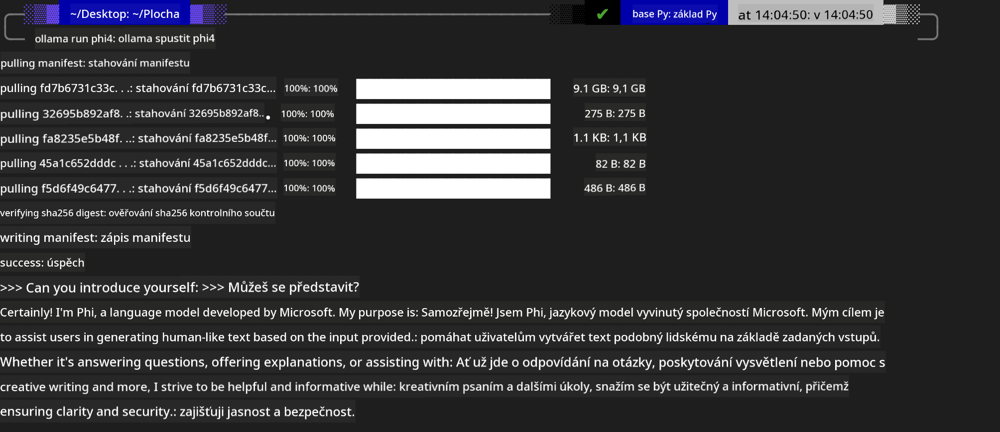
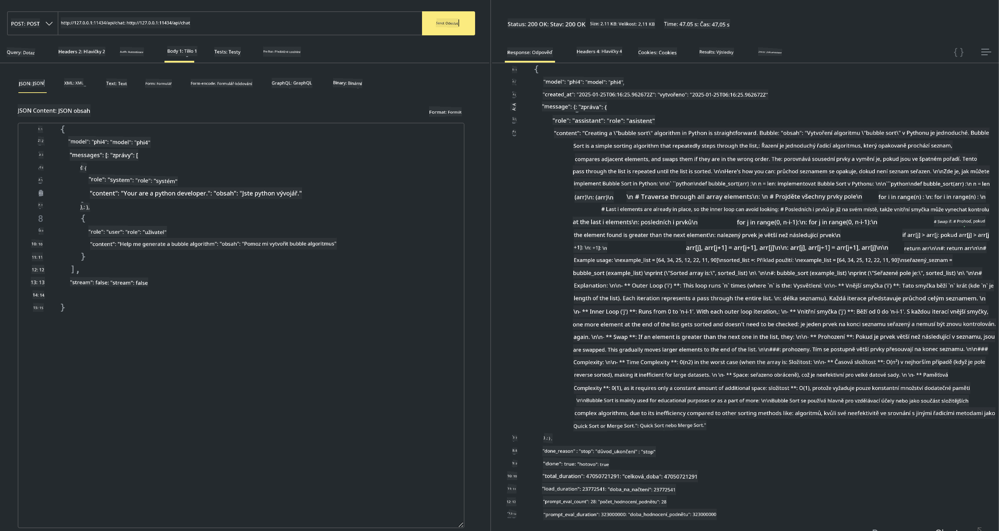

<!--
CO_OP_TRANSLATOR_METADATA:
{
  "original_hash": "2aa35f3c8b437fd5dc9995d53909d495",
  "translation_date": "2025-12-21T13:22:53+00:00",
  "source_file": "md/01.Introduction/02/04.Ollama.md",
  "language_code": "cs"
}
-->
## Rodina Phi v Ollama


[Ollama](https://ollama.com) umožňuje více lidem přímo nasadit otevřené LLM nebo SLM pomocí jednoduchých skriptů, a také může vytvářet API pro podporu lokálních scénářů aplikace Copilot.

## **1. Instalace**

Ollama podporuje spuštění na Windows, macOS a Linuxu. Ollama můžete nainstalovat přes tento odkaz ([https://ollama.com/download](https://ollama.com/download)). Po úspěšné instalaci můžete přímo z terminálu použít skript Ollama k zavolání Phi-3. Všechny [dostupné knihovny v Ollama](https://ollama.com/library) si můžete prohlédnout. Pokud otevřete toto úložiště v Codespace, bude mít Ollama již nainstalovaný.

```bash

ollama run phi4

```

> [!NOTE]
> Model bude při prvním spuštění nejprve stažen. Samozřejmě můžete také přímo zadat již stažený model Phi-4. Jako příklad spouštění příkazu uvádíme WSL. Po úspěšném stažení modelu můžete přímo komunikovat v terminálu.



## **2. Volání phi-4 API z Ollama**

Pokud chcete volat API Phi-4 generované ollama, můžete v terminálu použít tento příkaz ke spuštění serveru Ollama.

```bash

ollama serve

```

> [!NOTE]
> Pokud provozujete macOS nebo Linux, vezměte prosím na vědomí, že se může objevit následující chyba **"Error: listen tcp 127.0.0.1:11434: bind: address already in use"**. Tuto chybu můžete dostat při spuštění příkazu. Buď ji můžete ignorovat, protože obvykle znamená, že server již běží, nebo můžete Ollama zastavit a znovu spustit:

**macOS**

```bash

brew services restart ollama

```

**Linux**

```bash

sudo systemctl stop ollama

```

Ollama podporuje dvě rozhraní API: generate a chat. Podle svých potřeb můžete volat API modelu poskytované Ollama odesíláním požadavků na lokální službu běžící na portu 11434.

**Chat**

```bash

curl http://127.0.0.1:11434/api/chat -d '{
  "model": "phi3",
  "messages": [
    {
      "role": "system",
      "content": "Your are a python developer."
    },
    {
      "role": "user",
      "content": "Help me generate a bubble algorithm"
    }
  ],
  "stream": false
  
}'
```

Toto je výsledek v Postmanu



## Další zdroje

Zkontrolujte seznam dostupných modelů v Ollama v [jejich knihovně](https://ollama.com/library).

Stáhněte svůj model ze serveru Ollama pomocí tohoto příkazu

```bash
ollama pull phi4
```

Spusťte model pomocí tohoto příkazu

```bash
ollama run phi4
```

***Poznámka:*** Navštivte tento odkaz [https://github.com/ollama/ollama/blob/main/docs/api.md](https://github.com/ollama/ollama/blob/main/docs/api.md) pro více informací

## Volání Ollama z Pythonu

Můžete použít `requests` nebo `urllib3` k odesílání požadavků na lokální koncové body serveru uvedené výše. Oblíbeným způsobem, jak používat Ollama v Pythonu, je však přes SDK [openai](https://pypi.org/project/openai/), protože Ollama také poskytuje koncové body kompatibilní s OpenAI.

Zde je příklad pro phi3-mini:

```python
import openai

client = openai.OpenAI(
    base_url="http://localhost:11434/v1",
    api_key="nokeyneeded",
)

response = client.chat.completions.create(
    model="phi4",
    temperature=0.7,
    n=1,
    messages=[
        {"role": "system", "content": "You are a helpful assistant."},
        {"role": "user", "content": "Write a haiku about a hungry cat"},
    ],
)

print("Response:")
print(response.choices[0].message.content)
```

## Volání Ollama z JavaScriptu 
```javascript
// Příklad shrnutí souboru s Phi-4
script({
    model: "ollama:phi4",
    title: "Summarize with Phi-4",
    system: ["system"],
})

// Příklad shrnutí
const file = def("FILE", env.files)
$`Summarize ${file} in a single paragraph.`
```

## Volání Ollama z C#

Vytvořte novou C# konzolovou aplikaci a přidejte následující balíček NuGet:

```bash
dotnet add package Microsoft.SemanticKernel --version 1.34.0
```

Poté nahraďte tento kód v souboru `Program.cs`

```csharp
using Microsoft.SemanticKernel;
using Microsoft.SemanticKernel.ChatCompletion;

// add chat completion service using the local ollama server endpoint
#pragma warning disable SKEXP0001, SKEXP0003, SKEXP0010, SKEXP0011, SKEXP0050, SKEXP0052
builder.AddOpenAIChatCompletion(
    modelId: "phi4",
    endpoint: new Uri("http://localhost:11434/"),
    apiKey: "non required");

// invoke a simple prompt to the chat service
string prompt = "Write a joke about kittens";
var response = await kernel.InvokePromptAsync(prompt);
Console.WriteLine(response.GetValue<string>());
```

Spusťte aplikaci pomocí příkazu:

```bash
dotnet run
```

---

<!-- CO-OP TRANSLATOR DISCLAIMER START -->
Prohlášení o vyloučení odpovědnosti:
Tento dokument byl přeložen pomocí služby strojového překladu AI Co‑op Translator (https://github.com/Azure/co-op-translator). I když usilujeme o co nejvyšší přesnost, mějte prosím na paměti, že automatické překlady mohou obsahovat chyby nebo nepřesnosti. Původní dokument v jeho původním jazyce by měl být považován za závazný zdroj. U kritických informací se doporučuje profesionální lidský překlad. Za jakékoli nedorozumění nebo mylné výklady vzniklé v důsledku použití tohoto překladu neneseme odpovědnost.
<!-- CO-OP TRANSLATOR DISCLAIMER END -->