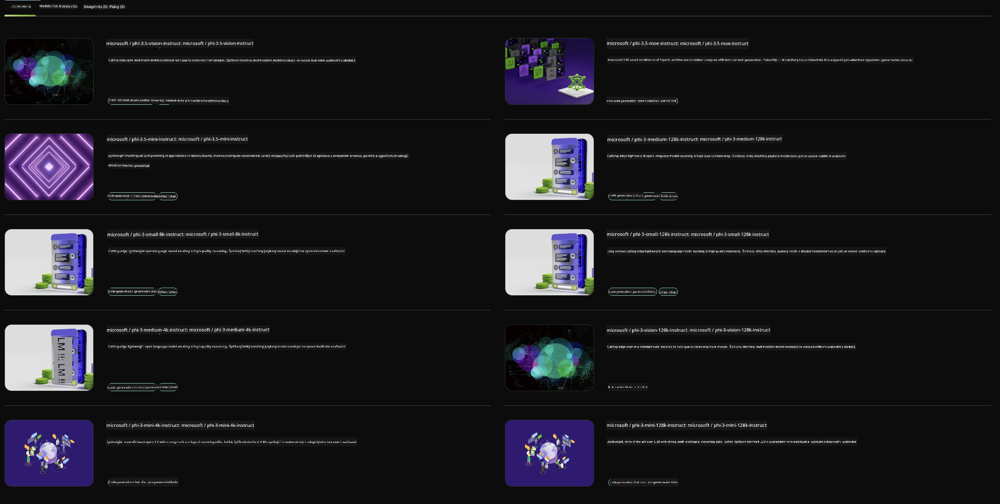

<!--
CO_OP_TRANSLATOR_METADATA:
{
  "original_hash": "7b08e277df2a9307f861ae54bc30c772",
  "translation_date": "2025-05-09T10:01:19+00:00",
  "source_file": "md/01.Introduction/02/06.NVIDIA.md",
  "language_code": "cs"
}
-->
## Phi Family in NVIDIA NIM

NVIDIA NIM – это набор удобных микросервисов, предназначенных для ускорения развертывания моделей генеративного ИИ в облаке, дата-центрах и рабочих станциях. NIM классифицируются по семействам моделей и по каждой модели отдельно. Например, NVIDIA NIM для больших языковых моделей (LLM) предоставляет мощь передовых LLM для корпоративных приложений, обеспечивая непревзойденные возможности обработки и понимания естественного языка.

NIM упрощает работу ИТ- и DevOps-команд, позволяя им самостоятельно размещать большие языковые модели (LLM) в управляемых ими средах, при этом предоставляя разработчикам стандартные API, с помощью которых они могут создавать мощных помощников, чат-ботов и ИИ-ассистентов, способных трансформировать бизнес. Используя передовое GPU-ускорение NVIDIA и масштабируемое развертывание, NIM предлагает самый быстрый путь к инференсу с непревзойденной производительностью.

Вы можете использовать NVIDIA NIM для инференса моделей семейства Phi



### **Примеры – Phi-3-Vision в NVIDIA NIM**

Представьте, что у вас есть изображение (`demo.png`), и вы хотите сгенерировать Python-код, который обработает это изображение и сохранит новую версию (`phi-3-vision.jpg`).

Приведённый выше код автоматизирует этот процесс, выполняя следующие шаги:

1. Настройка окружения и необходимых конфигураций.
2. Создание подсказки, которая инструктирует модель сгенерировать нужный Python-код.
3. Отправка подсказки модели и получение сгенерированного кода.
4. Извлечение и запуск сгенерированного кода.
5. Отображение исходного и обработанного изображений.

Этот подход использует возможности ИИ для автоматизации задач обработки изображений, делая процесс проще и быстрее.

[Sample Code Solution](../../../../../code/06.E2E/E2E_Nvidia_NIM_Phi3_Vision.ipynb)

Давайте разберём, что делает весь код шаг за шагом:

1. **Установка необходимого пакета**:
    ```python
    !pip install langchain_nvidia_ai_endpoints -U
    ```  
    Эта команда устанавливает пакет `langchain_nvidia_ai_endpoints`, гарантируя, что установлена последняя версия.

2. **Импорт необходимых модулей**:
    ```python
    from langchain_nvidia_ai_endpoints import ChatNVIDIA
    import getpass
    import os
    import base64
    ```  
    Эти импорты подключают необходимые модули для взаимодействия с NVIDIA AI endpoints, безопасного ввода паролей, работы с операционной системой и кодирования/декодирования данных в формате base64.

3. **Настройка API-ключа**:
    ```python
    if not os.getenv("NVIDIA_API_KEY"):
        os.environ["NVIDIA_API_KEY"] = getpass.getpass("Enter your NVIDIA API key: ")
    ```  
    Этот код проверяет, установлен ли в переменных окружения ключ `NVIDIA_API_KEY`. Если нет, запрашивает его у пользователя в безопасном режиме.

4. **Определение модели и пути к изображению**:
    ```python
    model = 'microsoft/phi-3-vision-128k-instruct'
    chat = ChatNVIDIA(model=model)
    img_path = './imgs/demo.png'
    ```  
    Здесь задаётся модель для использования, создаётся экземпляр `ChatNVIDIA` с указанной моделью и определяется путь к файлу изображения.

5. **Создание текстовой подсказки**:
    ```python
    text = "Please create Python code for image, and use plt to save the new picture under imgs/ and name it phi-3-vision.jpg."
    ```  
    Определяется текстовая подсказка, которая инструктирует модель сгенерировать Python-код для обработки изображения.

6. **Кодирование изображения в base64**:
    ```python
    with open(img_path, "rb") as f:
        image_b64 = base64.b64encode(f.read()).decode()
    image = f''
    ```  
    Этот код читает файл изображения, кодирует его в base64 и создаёт HTML-тег изображения с закодированными данными.

7. **Объединение текста и изображения в одну подсказку**:
    ```python
    prompt = f"{text} {image}"
    ```  
    Текстовая подсказка и HTML-тег изображения объединяются в одну строку.

8. **Генерация кода с помощью ChatNVIDIA**:
    ```python
    code = ""
    for chunk in chat.stream(prompt):
        print(chunk.content, end="")
        code += chunk.content
    ```  
    Этот код отправляет подсказку в `ChatNVIDIA` и получает сгенерированный код в строке `code`.

9. **Извлечение Python-кода из сгенерированного содержимого**:
    ```python
    begin = code.index('```python') + 9  
    code = code[begin:]  
    end = code.index('```')
    code = code[:end]
    ```  
    Здесь из сгенерированного содержимого удаляется markdown-разметка, чтобы получить чистый Python-код.

10. **Запуск сгенерированного кода**:
    ```python
    import subprocess
    result = subprocess.run(["python", "-c", code], capture_output=True)
    ```  
    Этот блок запускает извлечённый Python-код как подпроцесс и захватывает его вывод.

11. **Отображение изображений**:
    ```python
    from IPython.display import Image, display
    display(Image(filename='./imgs/phi-3-vision.jpg'))
    display(Image(filename='./imgs/demo.png'))
    ```  
    Эти строки показывают изображения с помощью модуля `IPython.display`.

**Prohlášení o vyloučení odpovědnosti**:  
Tento dokument byl přeložen pomocí AI překladatelské služby [Co-op Translator](https://github.com/Azure/co-op-translator). I když usilujeme o přesnost, mějte prosím na paměti, že automatické překlady mohou obsahovat chyby nebo nepřesnosti. Původní dokument v jeho mateřském jazyce by měl být považován za závazný zdroj. Pro důležité informace se doporučuje využít profesionální lidský překlad. Nejsme odpovědní za jakékoliv nedorozumění nebo nesprávné výklady vyplývající z použití tohoto překladu.