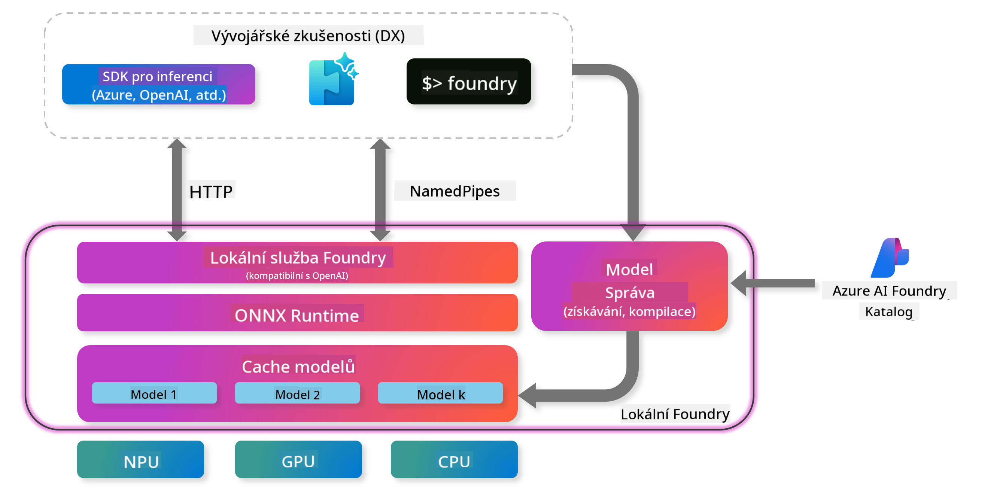

<!--
CO_OP_TRANSLATOR_METADATA:
{
  "original_hash": "52973a5680a65a810aa80b7036afd31f",
  "translation_date": "2025-07-16T19:50:21+00:00",
  "source_file": "md/01.Introduction/02/07.FoundryLocal.md",
  "language_code": "cs"
}
-->
## Začínáme s modely Phi-Family ve Foundry Local

### Úvod do Foundry Local

Foundry Local je výkonné řešení pro AI inferenci přímo na zařízení, které přináší podnikové AI schopnosti přímo do vašeho lokálního hardwaru. Tento návod vás provede nastavením a používáním modelů Phi-Family ve Foundry Local, což vám umožní plnou kontrolu nad vašimi AI úlohami při zachování soukromí a snížení nákladů.

Foundry Local nabízí výhody v oblasti výkonu, soukromí, přizpůsobení a nákladové efektivity tím, že AI modely běží přímo na vašem zařízení. Bezproblémově se integruje do vašich stávajících pracovních postupů a aplikací prostřednictvím intuitivního CLI, SDK a REST API.




### Proč zvolit Foundry Local?

Pochopení výhod Foundry Local vám pomůže učinit informovaná rozhodnutí ohledně vaší AI strategie nasazení:

- **Inferenční výpočty na zařízení:** Spouštějte modely přímo na vlastním hardwaru, snižujte náklady a zároveň uchovávejte všechna data lokálně.

- **Přizpůsobení modelů:** Vyberte si z přednastavených modelů nebo použijte vlastní, aby vyhovovaly specifickým požadavkům a scénářům.

- **Nákladová efektivita:** Odstraňte opakující se náklady na cloudové služby využitím stávajícího hardwaru, což zpřístupňuje AI širšímu okruhu uživatelů.

- **Bezproblémová integrace:** Připojte se k aplikacím přes SDK, API koncové body nebo CLI, s možností snadného škálování na Azure AI Foundry podle rostoucích potřeb.

> **Poznámka k začátkům:** Tento návod se zaměřuje na používání Foundry Local přes CLI a SDK rozhraní. Naučíte se oba způsoby, abyste si mohli vybrat ten nejlepší pro váš případ použití.

## Část 1: Nastavení Foundry Local CLI

### Krok 1: Instalace

Foundry Local CLI je vaše brána k správě a spouštění AI modelů lokálně. Začněme jeho instalací na vašem systému.

**Podporované platformy:** Windows a macOS

Pro podrobné instalační instrukce navštivte prosím [oficiální dokumentaci Foundry Local](https://github.com/microsoft/Foundry-Local/blob/main/README.md).

### Krok 2: Prozkoumání dostupných modelů

Jakmile máte Foundry Local CLI nainstalované, můžete zjistit, jaké modely jsou k dispozici pro váš případ použití. Tento příkaz vám ukáže všechny podporované modely:


```bash
foundry model list
```

### Krok 3: Seznámení s modely Phi Family

Phi Family nabízí řadu modelů optimalizovaných pro různé scénáře a hardwarové konfigurace. Zde jsou modely Phi dostupné ve Foundry Local:

**Dostupné Phi modely:** 

- **phi-3.5-mini** - Kompaktní model pro základní úkoly
- **phi-3-mini-128k** - Verze s rozšířeným kontextem pro delší konverzace
- **phi-3-mini-4k** - Standardní model s kontextem pro obecné použití
- **phi-4** - Pokročilý model s vylepšenými schopnostmi
- **phi-4-mini** - Odlehčená verze Phi-4
- **phi-4-mini-reasoning** - Specializovaný na složité úlohy vyžadující logické uvažování

> **Kompatibilita s hardwarem:** Každý model lze nakonfigurovat pro různé hardwarové akcelerace (CPU, GPU) podle možností vašeho systému.

### Krok 4: Spuštění prvního Phi modelu

Začněme praktickým příkladem. Spustíme model `phi-4-mini-reasoning`, který vyniká v řešení složitých problémů krok za krokem.


**Příkaz pro spuštění modelu:**

```bash
foundry model run Phi-4-mini-reasoning-generic-cpu
```

> **První spuštění:** Při prvním spuštění modelu Foundry Local automaticky stáhne model do vašeho zařízení. Doba stahování závisí na rychlosti vaší sítě, proto prosím buďte trpěliví během počátečního nastavení.

### Krok 5: Testování modelu na reálném problému

Nyní otestujeme náš model na klasickém logickém problému, abychom viděli, jak zvládá krokové uvažování:

**Příklad problému:**

```txt
Please calculate the following step by step: Now there are pheasants and rabbits in the same cage, there are thirty-five heads on top and ninety-four legs on the bottom, how many pheasants and rabbits are there?
```

**Očekávané chování:** Model by měl rozložit problém na logické kroky, využít fakt, že bažanti mají 2 nohy a králíci 4 nohy, a vyřešit soustavu rovnic.

**Výsledky:**


## Část 2: Vytváření aplikací s Foundry Local SDK

### Proč používat SDK?

Zatímco CLI je ideální pro testování a rychlé interakce, SDK vám umožní programově integrovat Foundry Local do vašich aplikací. To otevírá možnosti pro:

- Vytváření vlastních AI aplikací
- Automatizaci pracovních postupů
- Integraci AI funkcí do stávajících systémů
- Vývoj chatbotů a interaktivních nástrojů

### Podporované programovací jazyky

Foundry Local nabízí SDK podporu pro několik programovacích jazyků, aby vyhověla vašim vývojovým preferencím:

**📦 Dostupná SDK:**

- **C# (.NET):** [Dokumentace a příklady SDK](https://github.com/microsoft/Foundry-Local/tree/main/sdk/cs)
- **Python:** [Dokumentace a příklady SDK](https://github.com/microsoft/Foundry-Local/tree/main/sdk/python)
- **JavaScript:** [Dokumentace a příklady SDK](https://github.com/microsoft/Foundry-Local/tree/main/sdk/js)
- **Rust:** [Dokumentace a příklady SDK](https://github.com/microsoft/Foundry-Local/tree/main/sdk/rust)

### Další kroky

1. **Vyberte si preferované SDK** podle vašeho vývojového prostředí
2. **Postupujte podle dokumentace specifické pro SDK** pro podrobné návody k implementaci
3. **Začněte s jednoduchými příklady** předtím, než vytvoříte složité aplikace
4. **Prozkoumejte ukázkový kód** dostupný v každém repozitáři SDK

## Závěr

Nyní jste se naučili:
- ✅ Jak nainstalovat a nastavit Foundry Local CLI
- ✅ Jak objevovat a spouštět modely Phi Family
- ✅ Jak testovat modely na reálných problémech
- ✅ Jak porozumět možnostem SDK pro vývoj aplikací

Foundry Local poskytuje silný základ pro přenesení AI schopností přímo do vašeho lokálního prostředí, dává vám kontrolu nad výkonem, soukromím a náklady a zároveň zachovává flexibilitu škálování do cloudových řešení podle potřeby.

**Prohlášení o vyloučení odpovědnosti**:  
Tento dokument byl přeložen pomocí AI překladatelské služby [Co-op Translator](https://github.com/Azure/co-op-translator). I když usilujeme o přesnost, mějte prosím na paměti, že automatické překlady mohou obsahovat chyby nebo nepřesnosti. Původní dokument v jeho mateřském jazyce by měl být považován za autoritativní zdroj. Pro důležité informace se doporučuje profesionální lidský překlad. Nejsme odpovědní za jakékoliv nedorozumění nebo nesprávné výklady vyplývající z použití tohoto překladu.