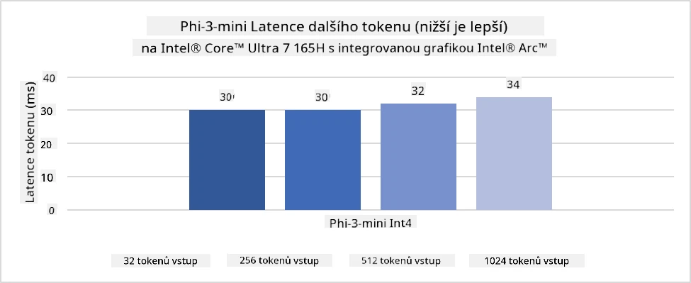
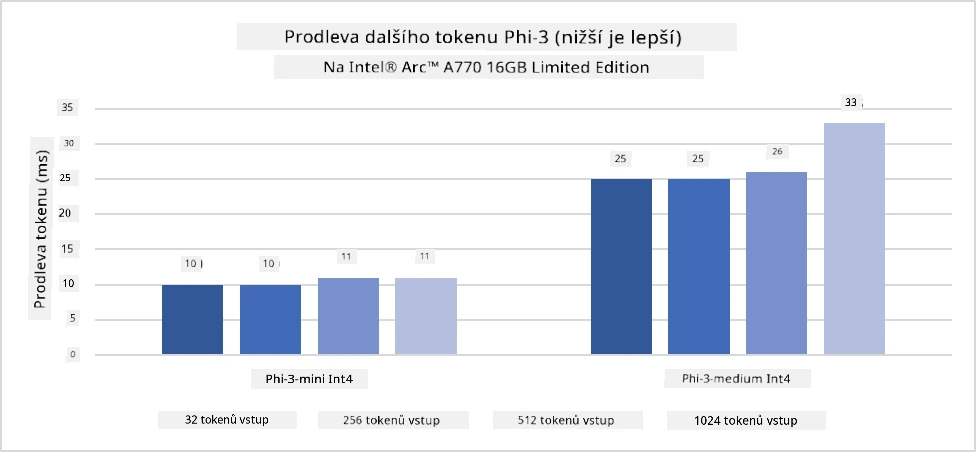
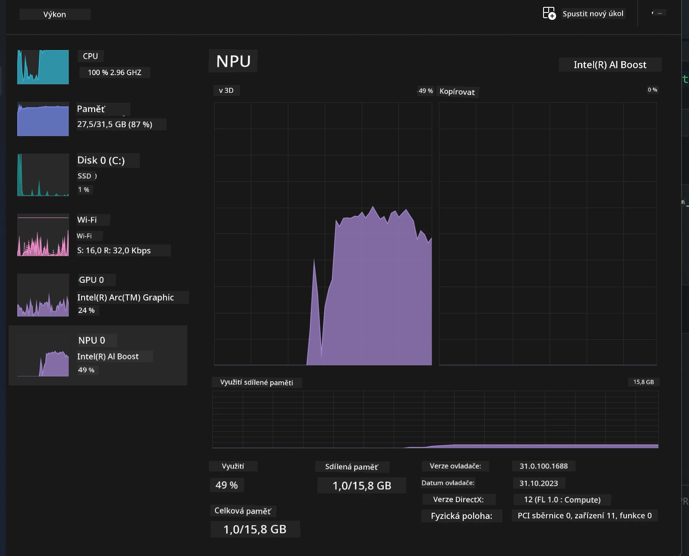
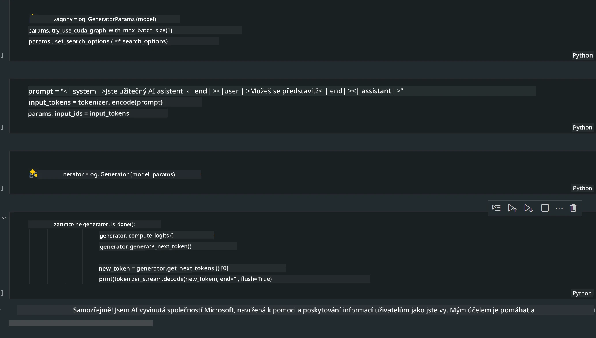

<!--
CO_OP_TRANSLATOR_METADATA:
{
  "original_hash": "e08ce816e23ad813244a09ca34ebb8ac",
  "translation_date": "2025-07-16T20:06:44+00:00",
  "source_file": "md/01.Introduction/03/AIPC_Inference.md",
  "language_code": "cs"
}
-->
# **Inference Phi-3 na AI PC**

S rozvojem generativní AI a zlepšováním hardwarových schopností edge zařízení může být stále více generativních AI modelů integrováno do uživatelských zařízení typu Bring Your Own Device (BYOD). AI PC patří mezi tyto modely. Od roku 2024 spolupracují Intel, AMD a Qualcomm s výrobci PC na zavedení AI PC, která usnadňují nasazení lokalizovaných generativních AI modelů prostřednictvím hardwarových úprav. V této diskusi se zaměříme na Intel AI PC a prozkoumáme, jak nasadit Phi-3 na Intel AI PC.

### Co je NPU

NPU (Neural Processing Unit) je specializovaný procesor nebo výpočetní jednotka na větším SoC, navržená speciálně pro zrychlení operací neuronových sítí a AI úloh. Na rozdíl od univerzálních CPU a GPU jsou NPUs optimalizovány pro paralelní výpočty založené na datech, což je činí velmi efektivními při zpracování obrovského množství multimediálních dat, jako jsou videa a obrázky, a při zpracování dat pro neuronové sítě. Jsou obzvláště schopné zvládat AI úkoly, jako je rozpoznávání řeči, rozostření pozadí během videohovorů nebo procesy úprav fotografií či videí, například detekce objektů.

## NPU vs GPU

I když mnoho AI a strojového učení běží na GPU, existuje zásadní rozdíl mezi GPU a NPU.  
GPU jsou známé svými paralelními výpočetními schopnostmi, ale ne všechny GPU jsou stejně efektivní mimo oblast zpracování grafiky. NPU jsou naopak navrženy přímo pro složité výpočty spojené s operacemi neuronových sítí, což je činí velmi efektivními pro AI úkoly.

Stručně řečeno, NPUs jsou matematickými experty, kteří výrazně zrychlují AI výpočty, a hrají klíčovou roli v nastupující éře AI PC!

***Tento příklad je založen na nejnovějším procesoru Intel Core Ultra***

## **1. Použití NPU pro spuštění modelu Phi-3**

Zařízení Intel® NPU je AI inference akcelerátor integrovaný s Intel klientskými CPU, počínaje generací Intel® Core™ Ultra (dříve známou jako Meteor Lake). Umožňuje energeticky efektivní provádění úloh umělých neuronových sítí.





**Intel NPU Acceleration Library**

Knihovna Intel NPU Acceleration Library [https://github.com/intel/intel-npu-acceleration-library](https://github.com/intel/intel-npu-acceleration-library) je Python knihovna navržená pro zvýšení efektivity vašich aplikací využitím výkonu Intel Neural Processing Unit (NPU) k provádění rychlých výpočtů na kompatibilním hardwaru.

Příklad Phi-3-mini na AI PC poháněném procesory Intel® Core™ Ultra.


Nainstalujte Python knihovnu pomocí pip

```bash

   pip install intel-npu-acceleration-library

```

***Poznámka*** Projekt je stále ve vývoji, ale referenční model je již velmi kompletní.

### **Spuštění Phi-3 s Intel NPU Acceleration Library**

Při použití Intel NPU akcelerace tato knihovna neovlivňuje tradiční proces kódování. Stačí použít tuto knihovnu k kvantizaci původního modelu Phi-3, například FP16, INT8, INT4, například

```python
from transformers import AutoTokenizer, pipeline,TextStreamer
from intel_npu_acceleration_library import NPUModelForCausalLM, int4
from intel_npu_acceleration_library.compiler import CompilerConfig
import warnings

model_id = "microsoft/Phi-3-mini-4k-instruct"

compiler_conf = CompilerConfig(dtype=int4)
model = NPUModelForCausalLM.from_pretrained(
    model_id, use_cache=True, config=compiler_conf, attn_implementation="sdpa"
).eval()

tokenizer = AutoTokenizer.from_pretrained(model_id)

text_streamer = TextStreamer(tokenizer, skip_prompt=True)
```

Po úspěšné kvantizaci pokračujte ve spuštění, které zavolá NPU pro běh modelu Phi-3.

```python
generation_args = {
   "max_new_tokens": 1024,
   "return_full_text": False,
   "temperature": 0.3,
   "do_sample": False,
   "streamer": text_streamer,
}

pipe = pipeline(
   "text-generation",
   model=model,
   tokenizer=tokenizer,
)

query = "<|system|>You are a helpful AI assistant.<|end|><|user|>Can you introduce yourself?<|end|><|assistant|>"

with warnings.catch_warnings():
    warnings.simplefilter("ignore")
    pipe(query, **generation_args)
```

Při spouštění kódu můžeme sledovat stav běhu NPU přes Správce úloh



***Ukázky*** : [AIPC_NPU_DEMO.ipynb](../../../../../code/03.Inference/AIPC/AIPC_NPU_DEMO.ipynb)

## **2. Použití DirectML + ONNX Runtime pro spuštění modelu Phi-3**

### **Co je DirectML**

[DirectML](https://github.com/microsoft/DirectML) je vysoce výkonná, hardwarově akcelerovaná knihovna DirectX 12 pro strojové učení. DirectML poskytuje GPU akceleraci pro běžné úlohy strojového učení na široké škále podporovaného hardwaru a ovladačů, včetně všech GPU kompatibilních s DirectX 12 od výrobců jako AMD, Intel, NVIDIA a Qualcomm.

Používaný samostatně je DirectML API nízkoúrovňová knihovna DirectX 12 vhodná pro vysoce výkonné aplikace s nízkou latencí, jako jsou frameworky, hry a další aplikace v reálném čase. Bezproblémová interoperabilita DirectML s Direct3D 12, nízká režie a konzistence napříč hardwarem činí DirectML ideálním pro zrychlení strojového učení, když je požadován vysoký výkon a spolehlivost výsledků napříč různým hardwarem.

***Poznámka*** : Nejnovější DirectML již podporuje NPU (https://devblogs.microsoft.com/directx/introducing-neural-processor-unit-npu-support-in-directml-developer-preview/)

### DirectML a CUDA z hlediska schopností a výkonu:

**DirectML** je knihovna pro strojové učení vyvinutá společností Microsoft. Je navržena pro zrychlení úloh strojového učení na zařízeních s Windows, včetně desktopů, notebooků a edge zařízení.  
- Založeno na DX12: DirectML je postaveno na DirectX 12 (DX12), který poskytuje širokou podporu hardwaru napříč GPU, včetně NVIDIA a AMD.  
- Širší podpora: Díky využití DX12 může DirectML pracovat s jakýmkoli GPU podporujícím DX12, včetně integrovaných GPU.  
- Zpracování obrazu: DirectML zpracovává obrázky a další data pomocí neuronových sítí, což je vhodné pro úlohy jako rozpoznávání obrazu, detekce objektů a další.  
- Snadná instalace: Nastavení DirectML je jednoduché a nevyžaduje specifické SDK nebo knihovny od výrobců GPU.  
- Výkon: V některých případech DirectML dosahuje dobrého výkonu a může být rychlejší než CUDA, zejména u určitých úloh.  
- Omezení: Nicméně existují situace, kdy může být DirectML pomalejší, zejména u velkých dávkových velikostí ve formátu float16.

**CUDA** je paralelní výpočetní platforma a programovací model od NVIDIA. Umožňuje vývojářům využít výkon NVIDIA GPU pro obecné výpočty, včetně strojového učení a vědeckých simulací.  
- Specifické pro NVIDIA: CUDA je úzce integrováno s NVIDIA GPU a je pro ně speciálně navrženo.  
- Vysoce optimalizované: Poskytuje vynikající výkon pro úlohy akcelerované GPU, zejména na NVIDIA GPU.  
- Široce používané: Mnoho frameworků a knihoven pro strojové učení (např. TensorFlow a PyTorch) podporuje CUDA.  
- Přizpůsobení: Vývojáři mohou ladit nastavení CUDA pro konkrétní úlohy, což může vést k optimálnímu výkonu.  
- Omezení: Závislost na hardwaru NVIDIA může být omezující, pokud chcete širší kompatibilitu s různými GPU.

### Výběr mezi DirectML a CUDA

Volba mezi DirectML a CUDA závisí na vašem konkrétním použití, dostupném hardwaru a preferencích.  
Pokud hledáte širší kompatibilitu a snadnou instalaci, může být DirectML dobrou volbou. Pokud však máte NVIDIA GPU a potřebujete vysoce optimalizovaný výkon, CUDA zůstává silným kandidátem. Obě technologie mají své výhody i nevýhody, proto zvažte své požadavky a dostupný hardware při rozhodování.

### **Generativní AI s ONNX Runtime**

V éře AI je přenositelnost AI modelů velmi důležitá. ONNX Runtime umožňuje snadné nasazení natrénovaných modelů na různá zařízení. Vývojáři nemusí řešit konkrétní inference framework a používají jednotné API pro dokončení inference modelu. V éře generativní AI také ONNX Runtime provádí optimalizaci kódu (https://onnxruntime.ai/docs/genai/). Díky optimalizovanému ONNX Runtime může být kvantizovaný generativní AI model inferován na různých koncových zařízeních. V Generative AI s ONNX Runtime můžete inference AI modelu provádět přes Python, C#, C/C++. Nasazení na iPhone může využít C++ API Generative AI s ONNX Runtime.

[Ukázkový kód](https://github.com/Azure-Samples/Phi-3MiniSamples/tree/main/onnx)

***Kompilace generativní AI s ONNX Runtime knihovnou***

```bash

winget install --id=Kitware.CMake  -e

git clone https://github.com/microsoft/onnxruntime.git

cd .\onnxruntime\

./build.bat --build_shared_lib --skip_tests --parallel --use_dml --config Release

cd ../

git clone https://github.com/microsoft/onnxruntime-genai.git

cd .\onnxruntime-genai\

mkdir ort

cd ort

mkdir include

mkdir lib

copy ..\onnxruntime\include\onnxruntime\core\providers\dml\dml_provider_factory.h ort\include

copy ..\onnxruntime\include\onnxruntime\core\session\onnxruntime_c_api.h ort\include

copy ..\onnxruntime\build\Windows\Release\Release\*.dll ort\lib

copy ..\onnxruntime\build\Windows\Release\Release\onnxruntime.lib ort\lib

python build.py --use_dml


```

**Instalace knihovny**

```bash

pip install .\onnxruntime_genai_directml-0.3.0.dev0-cp310-cp310-win_amd64.whl

```

Toto je výsledek běhu



***Ukázky*** : [AIPC_DirectML_DEMO.ipynb](../../../../../code/03.Inference/AIPC/AIPC_DirectML_DEMO.ipynb)

## **3. Použití Intel OpenVino pro spuštění modelu Phi-3**

### **Co je OpenVINO**

[OpenVINO](https://github.com/openvinotoolkit/openvino) je open-source nástrojový balík pro optimalizaci a nasazení modelů hlubokého učení. Poskytuje zrychlení výkonu hlubokého učení pro modely z oblasti vidění, zvuku a jazyka z populárních frameworků jako TensorFlow, PyTorch a dalších. Začněte s OpenVINO. OpenVINO lze také použít v kombinaci s CPU a GPU pro spuštění modelu Phi-3.

***Poznámka***: V současné době OpenVINO nepodporuje NPU.

### **Instalace OpenVINO knihovny**

```bash

 pip install git+https://github.com/huggingface/optimum-intel.git

 pip install git+https://github.com/openvinotoolkit/nncf.git

 pip install openvino-nightly

```

### **Spuštění Phi-3 s OpenVINO**

Stejně jako u NPU, OpenVINO provádí volání generativních AI modelů spuštěním kvantizovaných modelů. Nejprve je potřeba model Phi-3 kvantizovat a dokončit kvantizaci modelu přes příkazový řádek pomocí optimum-cli.

**INT4**

```bash

optimum-cli export openvino --model "microsoft/Phi-3-mini-4k-instruct" --task text-generation-with-past --weight-format int4 --group-size 128 --ratio 0.6  --sym  --trust-remote-code ./openvinomodel/phi3/int4

```

**FP16**

```bash

optimum-cli export openvino --model "microsoft/Phi-3-mini-4k-instruct" --task text-generation-with-past --weight-format fp16 --trust-remote-code ./openvinomodel/phi3/fp16

```

převedený formát vypadá takto


Načtěte cesty k modelu (model_dir), související konfigurace (ov_config = {"PERFORMANCE_HINT": "LATENCY", "NUM_STREAMS": "1", "CACHE_DIR": ""}) a hardwarově akcelerovaná zařízení (GPU.0) přes OVModelForCausalLM

```python

ov_model = OVModelForCausalLM.from_pretrained(
     model_dir,
     device='GPU.0',
     ov_config=ov_config,
     config=AutoConfig.from_pretrained(model_dir, trust_remote_code=True),
     trust_remote_code=True,
)

```

Při spouštění kódu můžeme sledovat stav běhu GPU přes Správce úloh


***Ukázky*** : [AIPC_OpenVino_Demo.ipynb](../../../../../code/03.Inference/AIPC/AIPC_OpenVino_Demo.ipynb)

### ***Poznámka*** : Výše uvedené tři metody mají každá své výhody, ale pro inference na AI PC se doporučuje použít akceleraci NPU.

**Prohlášení o vyloučení odpovědnosti**:  
Tento dokument byl přeložen pomocí AI překladatelské služby [Co-op Translator](https://github.com/Azure/co-op-translator). I když usilujeme o přesnost, mějte prosím na paměti, že automatizované překlady mohou obsahovat chyby nebo nepřesnosti. Původní dokument v jeho mateřském jazyce by měl být považován za autoritativní zdroj. Pro důležité informace se doporučuje profesionální lidský překlad. Nejsme odpovědní za jakékoliv nedorozumění nebo nesprávné výklady vyplývající z použití tohoto překladu.