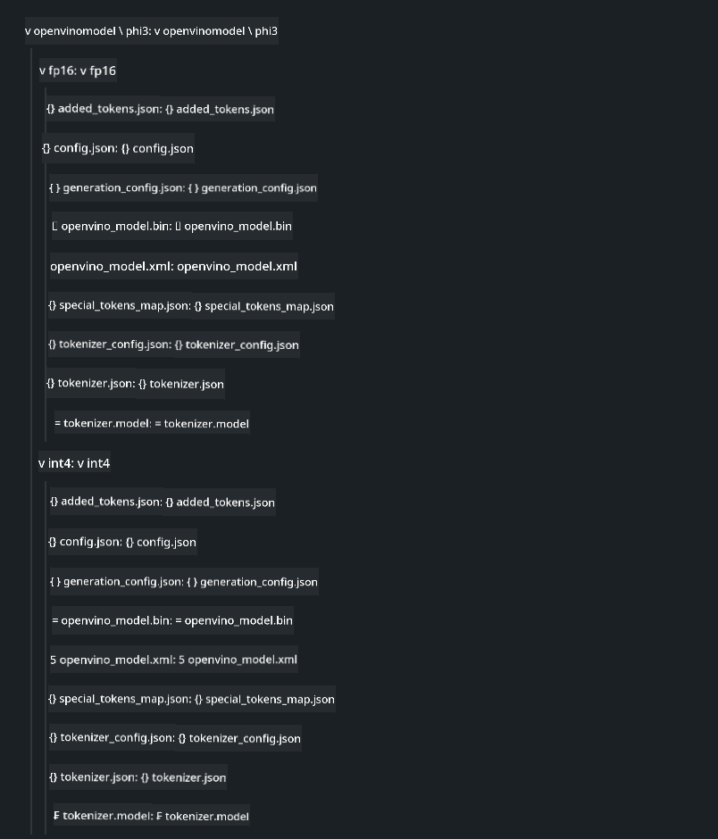

<!--
CO_OP_TRANSLATOR_METADATA:
{
  "original_hash": "e08ce816e23ad813244a09ca34ebb8ac",
  "translation_date": "2025-05-09T10:34:12+00:00",
  "source_file": "md/01.Introduction/03/AIPC_Inference.md",
  "language_code": "cs"
}
-->
# **推理 Phi-3 在 AI PC 上的应用**

随着生成式 AI 的进步以及边缘设备硬件性能的提升，越来越多的生成式 AI 模型可以集成到用户自带设备（BYOD）中。AI PC 就是其中一种。从 2024 年起，Intel、AMD 和 Qualcomm 与 PC 制造商合作，通过硬件改进推出支持本地化生成式 AI 模型部署的 AI PC。本节将重点介绍 Intel AI PC 以及如何在 Intel AI PC 上部署 Phi-3。

### 什么是 NPU

NPU（神经网络处理单元）是集成在更大 SoC 中的专用处理器，专门用于加速神经网络运算和 AI 任务。与通用 CPU 和 GPU 不同，NPU 针对数据驱动的并行计算进行了优化，非常高效地处理大量多媒体数据，如视频和图像，以及神经网络的数据处理。它们特别擅长处理 AI 相关任务，例如语音识别、视频通话中的背景虚化，以及照片或视频编辑中的目标检测等。

## NPU 与 GPU 的区别

虽然许多 AI 和机器学习任务都运行在 GPU 上，但 GPU 与 NPU 之间存在关键区别。
GPU 以其并行计算能力著称，但并非所有 GPU 在图形处理之外的任务中效率都很高。相比之下，NPU 是专为神经网络复杂计算设计的，因此在 AI 任务中表现尤为出色。

总结来说，NPU 是推动 AI 计算加速的数学高手，在 AI PC 的新时代中扮演着关键角色！

***本示例基于 Intel 最新的 Intel Core Ultra 处理器***

## **1. 使用 NPU 运行 Phi-3 模型**

Intel® NPU 设备是集成在 Intel 客户端 CPU 中的 AI 推理加速器，从 Intel® Core™ Ultra 代（前称 Meteor Lake）开始支持。它支持能效高的人工神经网络任务执行。


**Intel NPU 加速库**

Intel NPU 加速库 [https://github.com/intel/intel-npu-acceleration-library](https://github.com/intel/intel-npu-acceleration-library) 是一个 Python 库，旨在利用 Intel 神经网络处理单元（NPU）的计算能力，提高应用程序的运行效率。

在搭载 Intel® Core™ Ultra 处理器的 AI PC 上运行 Phi-3-mini 示例。


使用 pip 安装 Python 库

```bash

   pip install intel-npu-acceleration-library

```

***注意*** 项目仍在开发中，但参考模型已相当完善。

### **使用 Intel NPU 加速库运行 Phi-3**

使用 Intel NPU 加速时，该库不会影响传统的编码流程。你只需使用该库对原始 Phi-3 模型进行量化，如 FP16、INT8、INT4 等，例如：

```python
from transformers import AutoTokenizer, pipeline,TextStreamer
from intel_npu_acceleration_library import NPUModelForCausalLM, int4
from intel_npu_acceleration_library.compiler import CompilerConfig
import warnings

model_id = "microsoft/Phi-3-mini-4k-instruct"

compiler_conf = CompilerConfig(dtype=int4)
model = NPUModelForCausalLM.from_pretrained(
    model_id, use_cache=True, config=compiler_conf, attn_implementation="sdpa"
).eval()

tokenizer = AutoTokenizer.from_pretrained(model_id)

text_streamer = TextStreamer(tokenizer, skip_prompt=True)
```

量化成功后，继续调用 NPU 运行 Phi-3 模型。

```python
generation_args = {
   "max_new_tokens": 1024,
   "return_full_text": False,
   "temperature": 0.3,
   "do_sample": False,
   "streamer": text_streamer,
}

pipe = pipeline(
   "text-generation",
   model=model,
   tokenizer=tokenizer,
)

query = "<|system|>You are a helpful AI assistant.<|end|><|user|>Can you introduce yourself?<|end|><|assistant|>"

with warnings.catch_warnings():
    warnings.simplefilter("ignore")
    pipe(query, **generation_args)
```

执行时，可以通过任务管理器查看 NPU 的运行状态。


***示例*** ：[AIPC_NPU_DEMO.ipynb](../../../../../code/03.Inference/AIPC/AIPC_NPU_DEMO.ipynb)

## **2. 使用 DirectML + ONNX Runtime 运行 Phi-3 模型**

### **什么是 DirectML**

[DirectML](https://github.com/microsoft/DirectML) 是一个高性能的硬件加速 DirectX 12 机器学习库。DirectML 为广泛支持的硬件和驱动提供 GPU 加速，支持包括 AMD、Intel、NVIDIA 和 Qualcomm 等厂商的所有支持 DirectX 12 的 GPU。

作为独立使用时，DirectML API 是低级别的 DirectX 12 库，适合高性能、低延迟的应用，如框架、游戏及其他实时应用。DirectML 与 Direct3D 12 的无缝互操作性、低开销及跨硬件的兼容性，使其非常适合在追求高性能且需要结果可靠可预测的机器学习加速场景。

***注意*** ：最新的 DirectML 已支持 NPU(https://devblogs.microsoft.com/directx/introducing-neural-processor-unit-npu-support-in-directml-developer-preview/)

### DirectML 与 CUDA 的能力和性能比较：

**DirectML** 是微软开发的机器学习库，旨在加速 Windows 设备上的机器学习任务，包括台式机、笔记本和边缘设备。
- 基于 DX12：DirectML 构建于 DirectX 12 之上，支持广泛的 GPU，包括 NVIDIA 和 AMD。
- 支持范围广：利用 DX12，DirectML 可在任何支持 DX12 的 GPU 上运行，包括集成 GPU。
- 图像处理：DirectML 通过神经网络处理图像及其他数据，适用于图像识别、目标检测等任务。
- 安装简单：配置 DirectML 简单，无需 GPU 厂商特定的 SDK 或库。
- 性能表现：某些情况下，DirectML 性能优异，甚至比 CUDA 更快，尤其是特定工作负载。
- 限制：但在某些情况下，尤其是 float16 大批量处理时，性能可能不及 CUDA。

**CUDA** 是 NVIDIA 的并行计算平台和编程模型，使开发者能利用 NVIDIA GPU 的强大计算能力进行通用计算，包括机器学习和科学模拟。
- NVIDIA 专属：CUDA 紧密集成 NVIDIA GPU，专为其设计。
- 高度优化：针对 GPU 加速任务性能卓越，尤其是 NVIDIA GPU。
- 广泛使用：许多机器学习框架和库（如 TensorFlow、PyTorch）支持 CUDA。
- 可定制性：开发者可针对特定任务调优 CUDA 设置，获得最佳性能。
- 限制：依赖 NVIDIA 硬件，限制了跨不同 GPU 的兼容性。

### 选择 DirectML 还是 CUDA

选择 DirectML 或 CUDA 取决于具体使用场景、硬件条件和偏好。
若追求更广泛的兼容性和简易配置，DirectML 是不错选择；如果拥有 NVIDIA GPU 且需要极致性能，CUDA 仍是强有力的方案。总之，两者各有优缺点，建议根据需求和硬件环境权衡选择。

### **使用 ONNX Runtime 实现生成式 AI**

在 AI 时代，模型的可移植性至关重要。ONNX Runtime 可轻松将训练好的模型部署到不同设备。开发者无需关心推理框架，使用统一的 API 即可完成模型推理。在生成式 AI 领域，ONNX Runtime 也进行了代码优化 (https://onnxruntime.ai/docs/genai/)。通过优化后的 ONNX Runtime，量化的生成式 AI 模型可在不同终端推理。ONNX Runtime 支持通过 Python、C#、C / C++ 调用生成式 AI 模型 API，iPhone 部署则可利用 C++ 版本的 ONNX Runtime API。

[示例代码](https://github.com/Azure-Samples/Phi-3MiniSamples/tree/main/onnx)

***编译生成式 AI 的 ONNX Runtime 库***

```bash

winget install --id=Kitware.CMake  -e

git clone https://github.com/microsoft/onnxruntime.git

cd .\onnxruntime\

./build.bat --build_shared_lib --skip_tests --parallel --use_dml --config Release

cd ../

git clone https://github.com/microsoft/onnxruntime-genai.git

cd .\onnxruntime-genai\

mkdir ort

cd ort

mkdir include

mkdir lib

copy ..\onnxruntime\include\onnxruntime\core\providers\dml\dml_provider_factory.h ort\include

copy ..\onnxruntime\include\onnxruntime\core\session\onnxruntime_c_api.h ort\include

copy ..\onnxruntime\build\Windows\Release\Release\*.dll ort\lib

copy ..\onnxruntime\build\Windows\Release\Release\onnxruntime.lib ort\lib

python build.py --use_dml


```

**安装库**

```bash

pip install .\onnxruntime_genai_directml-0.3.0.dev0-cp310-cp310-win_amd64.whl

```

运行效果如下


***示例*** ：[AIPC_DirectML_DEMO.ipynb](../../../../../code/03.Inference/AIPC/AIPC_DirectML_DEMO.ipynb)

## **3. 使用 Intel OpenVINO 运行 Phi-3 模型**

### **什么是 OpenVINO**

[OpenVINO](https://github.com/openvinotoolkit/openvino) 是一个开源工具包，用于优化和部署深度学习模型。它提升了来自 TensorFlow、PyTorch 等主流框架的视觉、音频和语言模型的深度学习性能。OpenVINO 支持 CPU 和 GPU 组合运行 Phi-3 模型。

***注意*** ：目前 OpenVINO 尚不支持 NPU。

### **安装 OpenVINO 库**

```bash

 pip install git+https://github.com/huggingface/optimum-intel.git

 pip install git+https://github.com/openvinotoolkit/nncf.git

 pip install openvino-nightly

```

### **使用 OpenVINO 运行 Phi-3**

与 NPU 类似，OpenVINO 通过运行量化模型完成生成式 AI 模型调用。首先需要对 Phi-3 模型进行量化，并通过命令行工具 optimum-cli 完成模型量化。

**INT4**

```bash

optimum-cli export openvino --model "microsoft/Phi-3-mini-4k-instruct" --task text-generation-with-past --weight-format int4 --group-size 128 --ratio 0.6  --sym  --trust-remote-code ./openvinomodel/phi3/int4

```

**FP16**

```bash

optimum-cli export openvino --model "microsoft/Phi-3-mini-4k-instruct" --task text-generation-with-past --weight-format fp16 --trust-remote-code ./openvinomodel/phi3/fp16

```

转换后的格式示例如下



通过 OVModelForCausalLM 加载模型路径(model_dir)、相关配置(ov_config = {"PERFORMANCE_HINT": "LATENCY", "NUM_STREAMS": "1", "CACHE_DIR": ""}) 和硬件加速设备(GPU.0)

```python

ov_model = OVModelForCausalLM.from_pretrained(
     model_dir,
     device='GPU.0',
     ov_config=ov_config,
     config=AutoConfig.from_pretrained(model_dir, trust_remote_code=True),
     trust_remote_code=True,
)

```

执行时，可通过任务管理器查看 GPU 的运行状态


***示例*** ：[AIPC_OpenVino_Demo.ipynb](../../../../../code/03.Inference/AIPC/AIPC_OpenVino_Demo.ipynb)

### ***注意*** ：上述三种方法各有优势，但建议在 AI PC 推理中优先使用 NPU 加速。

**Prohlášení o vyloučení odpovědnosti**:  
Tento dokument byl přeložen pomocí AI překladatelské služby [Co-op Translator](https://github.com/Azure/co-op-translator). I když usilujeme o přesnost, mějte prosím na paměti, že automatizované překlady mohou obsahovat chyby nebo nepřesnosti. Původní dokument v jeho mateřském jazyce by měl být považován za závazný zdroj. Pro důležité informace se doporučuje profesionální lidský překlad. Nejsme odpovědní za jakékoli nedorozumění nebo chybné výklady vyplývající z použití tohoto překladu.