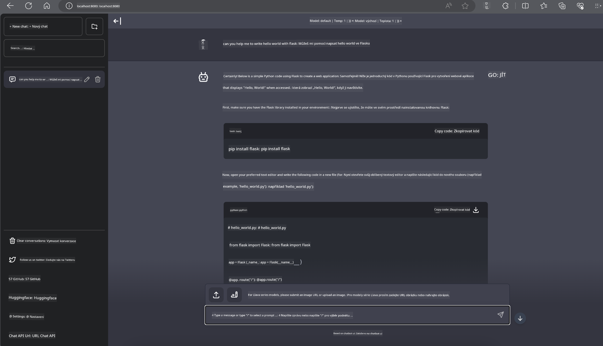

<!--
CO_OP_TRANSLATOR_METADATA:
{
  "original_hash": "be4101a30d98e95a71d42c276e8bcd37",
  "translation_date": "2025-05-09T11:44:47+00:00",
  "source_file": "md/01.Introduction/03/Jetson_Inference.md",
  "language_code": "cs"
}
-->
// **Inference Phi-3 in Nvidia Jetson**

Nvidia Jetson은 Nvidia에서 만든 임베디드 컴퓨팅 보드 시리즈입니다. Jetson TK1, TX1, TX2 모델은 모두 ARM 아키텍처 CPU가 통합된 Nvidia의 Tegra 프로세서(또는 SoC)를 탑재하고 있습니다. Jetson은 저전력 시스템으로 머신러닝 애플리케이션 가속화를 위해 설계되었습니다. Nvidia Jetson은 전문 개발자들이 다양한 산업 분야에서 혁신적인 AI 제품을 만들기 위해 사용하며, 학생과 취미로 AI를 배우고 멋진 프로젝트를 만드는 사람들도 활용합니다. SLM은 Jetson과 같은 엣지 디바이스에 배포되어 산업용 생성 AI 응용 시나리오 구현을 향상시킵니다.

#region Deployment on NVIDIA Jetson
// 자율 로봇 및 임베디드 장치 개발자는 Phi-3 Mini를 활용할 수 있습니다. Phi-3는 비교적 작은 크기로 엣지 배포에 이상적입니다. 학습 과정에서 파라미터가 정교하게 조정되어 높은 응답 정확도를 보장합니다.
#endregion

#region TensorRT-LLM Optimization
// NVIDIA의 TensorRT-LLM 라이브러리는 대형 언어 모델 추론을 최적화합니다. Phi-3 Mini의 긴 컨텍스트 윈도우를 지원하여 처리량과 지연 시간을 모두 향상시킵니다. 최적화 기법으로 LongRoPE, FP8, 인플라이트 배칭 등이 포함됩니다.
#endregion

#region Availability and Deployment
// 개발자는 128K 컨텍스트 윈도우를 가진 Phi-3 Mini를 NVIDIA AI에서 탐색할 수 있습니다. 이는 표준 API를 갖춘 마이크로서비스인 NVIDIA NIM으로 패키징되어 어디서나 배포할 수 있습니다. 또한 GitHub의 TensorRT-LLM 구현도 참고할 수 있습니다.
#endregion


#region 1. Preparation

// a. Jetson Orin NX / Jetson NX
// b. JetPack 5.1.2+
// c. Cuda 11.8
// d. Python 3.8+
#endregion


#region 2. Running Phi-3 in Jetson

// Ollama 또는 LlamaEdge 중 선택할 수 있습니다.

// 클라우드와 엣지 디바이스에서 동시에 gguf를 사용하고 싶다면, LlamaEdge는 WasmEdge로 이해할 수 있습니다. (WasmEdge는 클라우드 네이티브, 엣지, 분산 애플리케이션에 적합한 경량, 고성능, 확장 가능한 WebAssembly 런타임입니다. 서버리스 애플리케이션, 임베디드 함수, 마이크로서비스, 스마트 계약, IoT 디바이스를 지원합니다. LlamaEdge를 통해 gguf의 정량화 모델을 엣지 디바이스와 클라우드에 배포할 수 있습니다.)
#endregion

// 

// 사용 절차는 다음과 같습니다.

// 1. 관련 라이브러리와 파일 설치 및 다운로드

```bash

curl -sSf https://raw.githubusercontent.com/WasmEdge/WasmEdge/master/utils/install.sh | bash -s -- --plugin wasi_nn-ggml

curl -LO https://github.com/LlamaEdge/LlamaEdge/releases/latest/download/llama-api-server.wasm

curl -LO https://github.com/LlamaEdge/chatbot-ui/releases/latest/download/chatbot-ui.tar.gz

tar xzf chatbot-ui.tar.gz

```

// **Note**: llama-api-server.wasm과 chatbot-ui는 동일한 디렉터리에 있어야 합니다.

// 2. 터미널에서 스크립트 실행

```bash

wasmedge --dir .:. --nn-preload default:GGML:AUTO:{Your gguf path} llama-api-server.wasm -p phi-3-chat

```

// 실행 결과는 다음과 같습니다.

// 

// ***Sample code*** [Phi-3 mini WASM Notebook Sample](https://github.com/Azure-Samples/Phi-3MiniSamples/tree/main/wasm)

// 요약하면, Phi-3 Mini는 효율성, 컨텍스트 인식, NVIDIA의 최적화 기술을 결합한 언어 모델링의 도약입니다. 로봇을 만들거나 엣지 애플리케이션을 개발할 때 Phi-3 Mini는 주목할 만한 강력한 도구입니다.

**Prohlášení o vyloučení odpovědnosti**:  
Tento dokument byl přeložen pomocí AI překladatelské služby [Co-op Translator](https://github.com/Azure/co-op-translator). Přestože usilujeme o přesnost, mějte prosím na paměti, že automatické překlady mohou obsahovat chyby nebo nepřesnosti. Originální dokument v jeho původním jazyce by měl být považován za autoritativní zdroj. Pro důležité informace se doporučuje profesionální lidský překlad. Nejsme odpovědní za jakékoli nedorozumění nebo mylné výklady vyplývající z použití tohoto překladu.