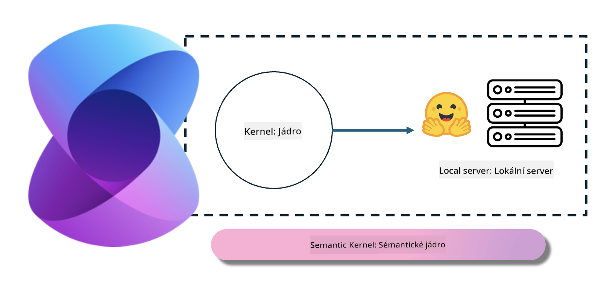
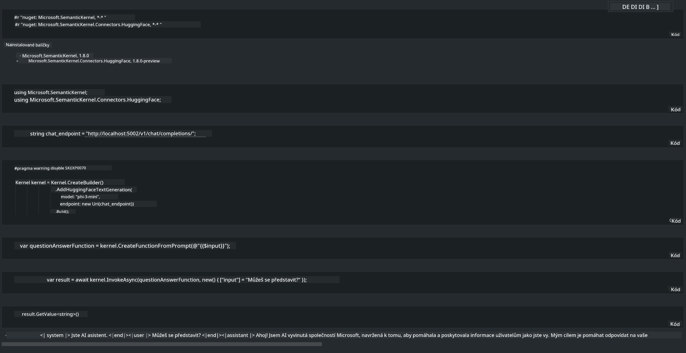

<!--
CO_OP_TRANSLATOR_METADATA:
{
  "original_hash": "bcf5dd7031db0031abdb9dd0c05ba118",
  "translation_date": "2025-07-16T20:58:58+00:00",
  "source_file": "md/01.Introduction/03/Local_Server_Inference.md",
  "language_code": "cs"
}
-->
# **Inference Phi-3 na lokálním serveru**

Phi-3 můžeme nasadit na lokální server. Uživatelé si mohou vybrat řešení [Ollama](https://ollama.com) nebo [LM Studio](https://llamaedge.com), případně si napsat vlastní kód. Lokální služby Phi-3 lze propojit přes [Semantic Kernel](https://github.com/microsoft/semantic-kernel?WT.mc_id=aiml-138114-kinfeylo) nebo [Langchain](https://www.langchain.com/) pro tvorbu aplikací Copilot.

## **Použití Semantic Kernel pro přístup k Phi-3-mini**

V aplikaci Copilot vytváříme aplikace pomocí Semantic Kernel / LangChain. Tento typ aplikačního rámce je obecně kompatibilní se službou Azure OpenAI / modely OpenAI a zároveň podporuje open source modely na Hugging Face i lokální modely. Co dělat, pokud chceme použít Semantic Kernel pro přístup k Phi-3-mini? Jako příklad v .NET jej můžeme zkombinovat s Hugging Face Connector v Semantic Kernel. Ve výchozím nastavení odpovídá modelu na Hugging Face (při prvním použití se model stáhne z Hugging Face, což trvá delší dobu). Můžete se také připojit k lokálně postavené službě. Mezi těmito dvěma možnostmi doporučujeme tu druhou, protože nabízí vyšší míru autonomie, zejména v podnikových aplikacích.

Z obrázku je vidět, že přístup k lokálním službám přes Semantic Kernel umožňuje snadné připojení k vlastnímu serveru modelu Phi-3-mini. Zde je výsledek běhu:

***Ukázkový kód*** https://github.com/kinfey/Phi3MiniSamples/tree/main/semantickernel

**Prohlášení o vyloučení odpovědnosti**:  
Tento dokument byl přeložen pomocí AI překladatelské služby [Co-op Translator](https://github.com/Azure/co-op-translator). I když usilujeme o přesnost, mějte prosím na paměti, že automatizované překlady mohou obsahovat chyby nebo nepřesnosti. Původní dokument v jeho mateřském jazyce by měl být považován za autoritativní zdroj. Pro důležité informace se doporučuje profesionální lidský překlad. Nejsme odpovědní za jakékoliv nedorozumění nebo nesprávné výklady vyplývající z použití tohoto překladu.