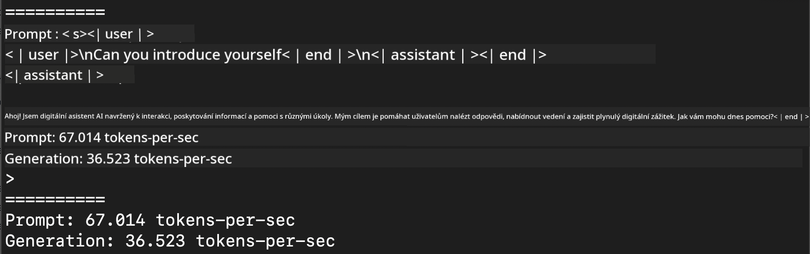
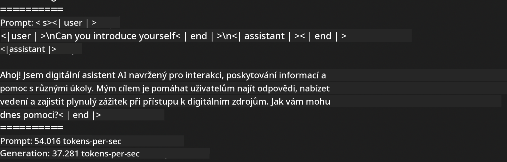
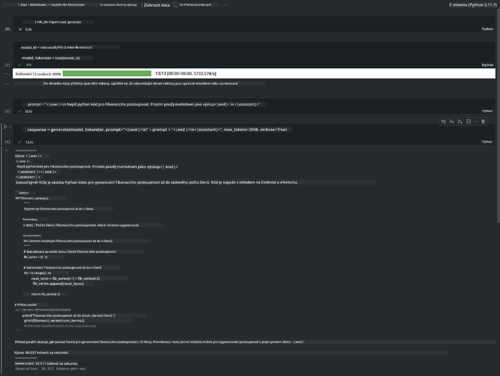

<!--
CO_OP_TRANSLATOR_METADATA:
{
  "original_hash": "dcb656f3d206fc4968e236deec5d4384",
  "translation_date": "2025-05-09T12:18:46+00:00",
  "source_file": "md/01.Introduction/03/MLX_Inference.md",
  "language_code": "cs"
}
-->
# **Inference Phi-3 with Apple MLX Framework**

## **什么是 MLX Framework**

MLX 是苹果硅芯片上用于机器学习研究的数组框架，由苹果机器学习研究团队开发。

MLX 由机器学习研究人员为机器学习研究人员设计。该框架旨在用户友好，同时仍然高效，便于训练和部署模型。框架本身的设计也很简洁。我们的目标是让研究人员能够轻松扩展和改进 MLX，以便快速探索新想法。

通过 MLX，LLM 可以在苹果硅芯片设备上加速运行，且模型可以非常方便地在本地运行。

## **使用 MLX 推理 Phi-3-mini**

### **1. 设置你的 MLX 环境**

1. Python 3.11.x  
2. 安装 MLX 库


```bash

pip install mlx-lm

```

### **2. 在终端使用 MLX 运行 Phi-3-mini**


```bash

python -m mlx_lm.generate --model microsoft/Phi-3-mini-4k-instruct --max-token 2048 --prompt  "<|user|>\nCan you introduce yourself<|end|>\n<|assistant|>"

```

结果（我的环境是 Apple M1 Max，64GB）如下



### **3. 在终端使用 MLX 对 Phi-3-mini 进行量化**


```bash

python -m mlx_lm.convert --hf-path microsoft/Phi-3-mini-4k-instruct

```

***Note：*** 可以通过 mlx_lm.convert 对模型进行量化，默认量化格式是 INT4。此示例将 Phi-3-mini 量化为 INT4。

模型可以通过 mlx_lm.convert 进行量化，默认是 INT4。本例是将 Phi-3-mini 量化成 INT4。量化后，模型会存储在默认目录 ./mlx_model。

我们可以从终端测试用 MLX 量化后的模型


```bash

python -m mlx_lm.generate --model ./mlx_model/ --max-token 2048 --prompt  "<|user|>\nCan you introduce yourself<|end|>\n<|assistant|>"

```

结果如下




### **4. 在 Jupyter Notebook 中使用 MLX 运行 Phi-3-mini**




***Note:*** 请阅读此示例 [点击此链接](../../../../../code/03.Inference/MLX/MLX_DEMO.ipynb)


## **资源**

1. 了解 Apple MLX Framework [https://ml-explore.github.io](https://ml-explore.github.io/mlx/build/html/index.html)

2. Apple MLX GitHub 仓库 [https://github.com/ml-explore](https://github.com/ml-explore)

**Prohlášení o vyloučení odpovědnosti**:  
Tento dokument byl přeložen pomocí AI překladatelské služby [Co-op Translator](https://github.com/Azure/co-op-translator). Přestože usilujeme o přesnost, mějte prosím na paměti, že automatické překlady mohou obsahovat chyby nebo nepřesnosti. Původní dokument v jeho mateřském jazyce by měl být považován za závazný zdroj. Pro kritické informace se doporučuje profesionální lidský překlad. Nejsme odpovědní za jakékoliv nedorozumění nebo nesprávné výklady vyplývající z použití tohoto překladu.