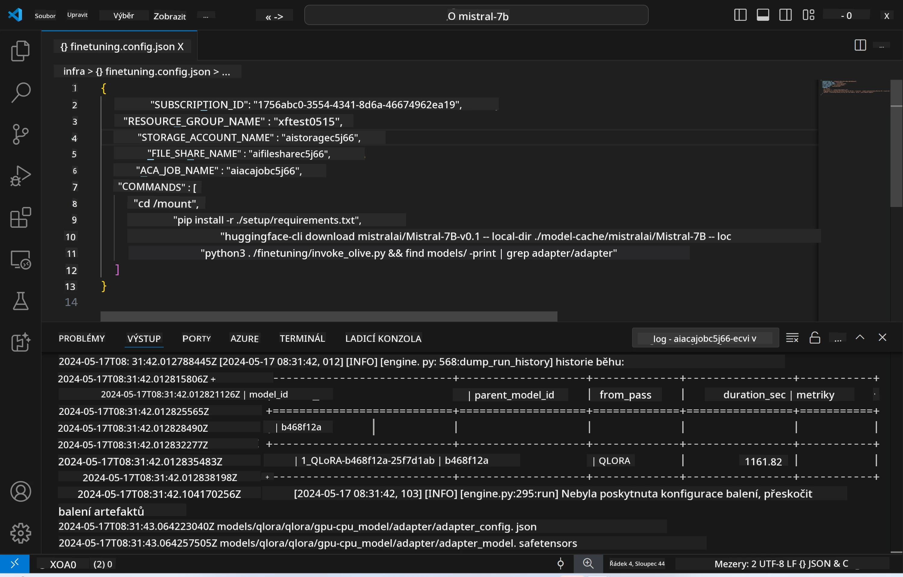
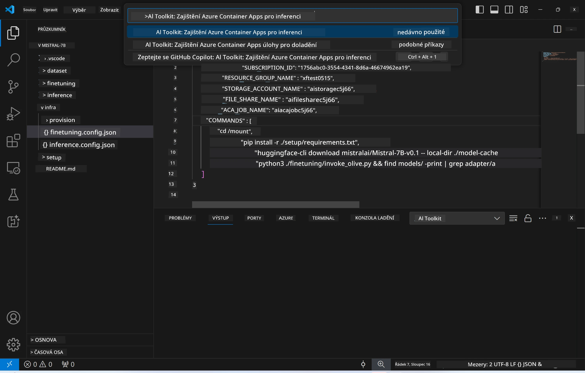
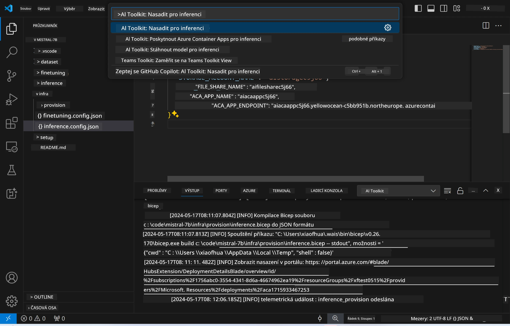
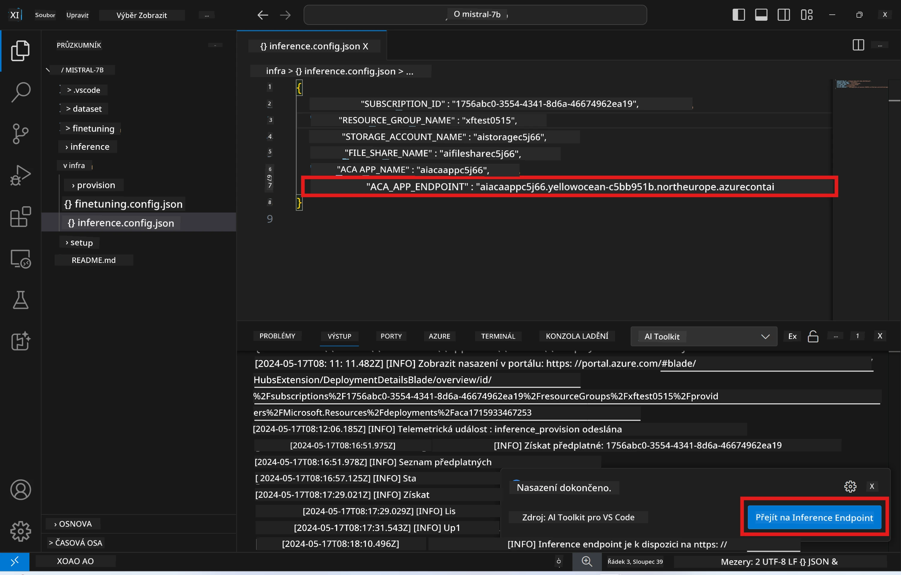

<!--
CO_OP_TRANSLATOR_METADATA:
{
  "original_hash": "a54cd3d65b6963e4e8ce21e143c3ab04",
  "translation_date": "2025-07-16T21:21:50+00:00",
  "source_file": "md/01.Introduction/03/Remote_Interence.md",
  "language_code": "cs"
}
-->
# Vzdálené inferování s doladěným modelem

Po natrénování adapterů v vzdáleném prostředí použijte jednoduchou aplikaci Gradio pro interakci s modelem.



### Zajištění Azure zdrojů
Pro vzdálené inferování je potřeba nastavit Azure zdroje spuštěním příkazu `AI Toolkit: Provision Azure Container Apps for inference` z příkazové palety. Během tohoto nastavení budete vyzváni k výběru Azure Subscription a resource group.  

   
Ve výchozím nastavení by měla subscription a resource group pro inferování odpovídat těm, které byly použity při doladění modelu. Inferování bude využívat stejné Azure Container App Environment a přistupovat k modelu a adapteru uloženým v Azure Files, které byly vytvořeny během kroku doladění.

## Použití AI Toolkit

### Nasazení pro inferování  
Pokud chcete upravit inferenční kód nebo znovu načíst inferenční model, spusťte příkaz `AI Toolkit: Deploy for inference`. Tím se synchronizuje váš nejnovější kód s ACA a restartuje se replika.



Po úspěšném dokončení nasazení je model připraven k vyhodnocení přes tento endpoint.

### Přístup k inferenčnímu API

K inferenčnímu API se dostanete kliknutím na tlačítko „*Go to Inference Endpoint*“ zobrazené v notifikaci VSCode. Alternativně lze webový API endpoint najít v `ACA_APP_ENDPOINT` v souboru `./infra/inference.config.json` a také v panelu výstupu.



> **Poznámka:** Inferenční endpoint může chvíli trvat, než bude plně funkční.

## Komponenty inferování zahrnuté v šabloně

| Složka | Obsah |
| ------ |--------- |
| `infra` | Obsahuje všechny potřebné konfigurace pro vzdálený provoz. |
| `infra/provision/inference.parameters.json` | Obsahuje parametry pro bicep šablony, které se používají k zajištění Azure zdrojů pro inferování. |
| `infra/provision/inference.bicep` | Obsahuje šablony pro zajištění Azure zdrojů pro inferování. |
| `infra/inference.config.json` | Konfigurační soubor, vytvořený příkazem `AI Toolkit: Provision Azure Container Apps for inference`. Slouží jako vstup pro další příkazy v příkazové paletě. |

### Použití AI Toolkit pro konfiguraci zajištění Azure zdrojů
Nakonfigurujte [AI Toolkit](https://marketplace.visualstudio.com/items?itemName=ms-windows-ai-studio.windows-ai-studio)

Spusťte příkaz `Provision Azure Container Apps for inference`.

Konfigurační parametry najdete v souboru `./infra/provision/inference.parameters.json`. Zde jsou podrobnosti:
| Parametr | Popis |
| --------- |------------ |
| `defaultCommands` | Příkazy pro spuštění webového API. |
| `maximumInstanceCount` | Nastavuje maximální počet GPU instancí. |
| `location` | Místo, kde jsou Azure zdroje zajišťovány. Výchozí hodnota odpovídá lokaci vybrané resource group. |
| `storageAccountName`, `fileShareName`, `acaEnvironmentName`, `acaEnvironmentStorageName`, `acaAppName`, `acaLogAnalyticsName` | Tyto parametry slouží k pojmenování Azure zdrojů pro zajištění. Ve výchozím nastavení odpovídají názvům zdrojů použitých při doladění. Můžete zadat nový, nepoužitý název zdroje pro vlastní pojmenování, nebo název již existujícího Azure zdroje, pokud chcete použít ten. Podrobnosti najdete v sekci [Použití existujících Azure zdrojů](../../../../../md/01.Introduction/03). |

### Použití existujících Azure zdrojů

Ve výchozím nastavení provision pro inferování používá stejné Azure Container App Environment, Storage Account, Azure File Share a Azure Log Analytics, které byly použity při doladění. Pro inferenční API je vytvořena samostatná Azure Container App.

Pokud jste během doladění upravili Azure zdroje nebo chcete použít vlastní existující Azure zdroje pro inferování, zadejte jejich názvy do souboru `./infra/inference.parameters.json`. Poté spusťte příkaz `AI Toolkit: Provision Azure Container Apps for inference` z příkazové palety. Tento příkaz aktualizuje zadané zdroje a vytvoří chybějící.

Například pokud máte existující Azure container environment, váš soubor `./infra/finetuning.parameters.json` by měl vypadat takto:

```json
{
    "$schema": "https://schema.management.azure.com/schemas/2019-04-01/deploymentParameters.json#",
    "contentVersion": "1.0.0.0",
    "parameters": {
      ...
      "acaEnvironmentName": {
        "value": "<your-aca-env-name>"
      },
      "acaEnvironmentStorageName": {
        "value": null
      },
      ...
    }
  }
```

### Ruční zajištění  
Pokud preferujete ruční konfiguraci Azure zdrojů, můžete použít bicep soubory v adresáři `./infra/provision`. Pokud jste již Azure zdroje nastavili a nakonfigurovali bez použití příkazové palety AI Toolkit, stačí zadat názvy zdrojů do souboru `inference.config.json`.

Například:

```json
{
  "SUBSCRIPTION_ID": "<your-subscription-id>",
  "RESOURCE_GROUP_NAME": "<your-resource-group-name>",
  "STORAGE_ACCOUNT_NAME": "<your-storage-account-name>",
  "FILE_SHARE_NAME": "<your-file-share-name>",
  "ACA_APP_NAME": "<your-aca-name>",
  "ACA_APP_ENDPOINT": "<your-aca-endpoint>"
}
```

**Prohlášení o vyloučení odpovědnosti**:  
Tento dokument byl přeložen pomocí AI překladatelské služby [Co-op Translator](https://github.com/Azure/co-op-translator). I když usilujeme o přesnost, mějte prosím na paměti, že automatizované překlady mohou obsahovat chyby nebo nepřesnosti. Původní dokument v jeho mateřském jazyce by měl být považován za autoritativní zdroj. Pro důležité informace se doporučuje profesionální lidský překlad. Nejsme odpovědní za jakékoliv nedorozumění nebo nesprávné výklady vyplývající z použití tohoto překladu.