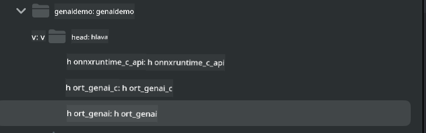

<!--
CO_OP_TRANSLATOR_METADATA:
{
  "original_hash": "82af197df38d25346a98f1f0e84d1698",
  "translation_date": "2025-05-09T11:05:10+00:00",
  "source_file": "md/01.Introduction/03/iOS_Inference.md",
  "language_code": "cs"
}
-->
# **Inference Phi-3 en iOS**

Phi-3-mini es una nueva serie de modelos de Microsoft que permite el despliegue de Large Language Models (LLMs) en dispositivos edge y dispositivos IoT. Phi-3-mini está disponible para despliegues en iOS, Android y Edge Device, permitiendo que la IA generativa se implemente en entornos BYOD. El siguiente ejemplo muestra cómo desplegar Phi-3-mini en iOS.

## **1. Preparación**

- **a.** macOS 14+
- **b.** Xcode 15+
- **c.** iOS SDK 17.x (iPhone 14 A16 o superior)
- **d.** Instalar Python 3.10+ (se recomienda Conda)
- **e.** Instalar la librería de Python: `python-flatbuffers`
- **f.** Instalar CMake

### Semantic Kernel e Inferencia

Semantic Kernel es un framework de aplicaciones que te permite crear apps compatibles con Azure OpenAI Service, modelos OpenAI e incluso modelos locales. Acceder a servicios locales a través de Semantic Kernel facilita la integración con tu servidor de modelos Phi-3-mini auto hospedado.

### Llamar a modelos cuantificados con Ollama o LlamaEdge

Muchos usuarios prefieren usar modelos cuantificados para ejecutar modelos localmente. [Ollama](https://ollama.com) y [LlamaEdge](https://llamaedge.com) permiten a los usuarios llamar a diferentes modelos cuantificados:

#### **Ollama**

Puedes ejecutar `ollama run phi3` directamente o configurarlo en modo offline. Crea un Modelfile con la ruta a tu archivo `gguf`. Código de ejemplo para ejecutar el modelo cuantificado Phi-3-mini:

```gguf
FROM {Add your gguf file path}
TEMPLATE \"\"\"<|user|> .Prompt<|end|> <|assistant|>\"\"\"
PARAMETER stop <|end|>
PARAMETER num_ctx 4096
```

#### **LlamaEdge**

Si quieres usar `gguf` tanto en la nube como en dispositivos edge al mismo tiempo, LlamaEdge es una excelente opción.

## **2. Compilar ONNX Runtime para iOS**

```bash

git clone https://github.com/microsoft/onnxruntime.git

cd onnxruntime

./build.sh --build_shared_lib --ios --skip_tests --parallel --build_dir ./build_ios --ios --apple_sysroot iphoneos --osx_arch arm64 --apple_deploy_target 17.5 --cmake_generator Xcode --config Release

cd ../

```

### **Aviso**

- **a.** Antes de compilar, asegúrate de que Xcode esté configurado correctamente y establece el directorio activo de desarrollo en la terminal:

    ```bash
    sudo xcode-select -switch /Applications/Xcode.app/Contents/Developer
    ```

- **b.** ONNX Runtime debe compilarse para diferentes plataformas. Para iOS, puedes compilar para `arm64` or `x86_64`.

- **c.** Se recomienda usar la versión más reciente del iOS SDK para la compilación. Sin embargo, también puedes usar una versión anterior si necesitas compatibilidad con SDKs previos.

## **3. Compilar Generative AI con ONNX Runtime para iOS**

> **Note:** Debido a que Generative AI con ONNX Runtime está en vista previa, ten en cuenta posibles cambios.

```bash

git clone https://github.com/microsoft/onnxruntime-genai
 
cd onnxruntime-genai
 
mkdir ort
 
cd ort
 
mkdir include
 
mkdir lib
 
cd ../
 
cp ../onnxruntime/include/onnxruntime/core/session/onnxruntime_c_api.h ort/include
 
cp ../onnxruntime/build_ios/Release/Release-iphoneos/libonnxruntime*.dylib* ort/lib
 
export OPENCV_SKIP_XCODEBUILD_FORCE_TRYCOMPILE_DEBUG=1
 
python3 build.py --parallel --build_dir ./build_ios --ios --ios_sysroot iphoneos --ios_arch arm64 --ios_deployment_target 17.5 --cmake_generator Xcode --cmake_extra_defines CMAKE_XCODE_ATTRIBUTE_CODE_SIGNING_ALLOWED=NO

```

## **4. Crear una aplicación App en Xcode**

Elegí Objective-C como método de desarrollo de la App, porque al usar Generative AI con la API C++ de ONNX Runtime, Objective-C es más compatible. Por supuesto, también puedes realizar las llamadas correspondientes mediante bridging con Swift.


## **5. Copiar el modelo cuantificado INT4 ONNX al proyecto de la App**

Necesitamos importar el modelo de cuantificación INT4 en formato ONNX, que debe descargarse primero.


Después de descargarlo, debes añadirlo al directorio Resources del proyecto en Xcode.


## **6. Añadir la API C++ en ViewControllers**

> **Aviso:**

- **a.** Añade los archivos de encabezado C++ correspondientes al proyecto.

  

- **b.** Incluye `onnxruntime-genai` dynamic library in Xcode.

  

- **c.** Use the C Samples code for testing. You can also add additional features like ChatUI for more functionality.

- **d.** Since you need to use C++ in your project, rename `ViewController.m` to `ViewController.mm` para habilitar soporte Objective-C++.

```objc

    NSString *llmPath = [[NSBundle mainBundle] resourcePath];
    char const *modelPath = llmPath.cString;

    auto model =  OgaModel::Create(modelPath);

    auto tokenizer = OgaTokenizer::Create(*model);

    const char* prompt = "<|system|>You are a helpful AI assistant.<|end|><|user|>Can you introduce yourself?<|end|><|assistant|>";

    auto sequences = OgaSequences::Create();
    tokenizer->Encode(prompt, *sequences);

    auto params = OgaGeneratorParams::Create(*model);
    params->SetSearchOption("max_length", 100);
    params->SetInputSequences(*sequences);

    auto output_sequences = model->Generate(*params);
    const auto output_sequence_length = output_sequences->SequenceCount(0);
    const auto* output_sequence_data = output_sequences->SequenceData(0);
    auto out_string = tokenizer->Decode(output_sequence_data, output_sequence_length);
    
    auto tmp = out_string;

```

## **7. Ejecutar la Aplicación**

Una vez completada la configuración, puedes ejecutar la aplicación para ver los resultados de la inferencia del modelo Phi-3-mini.


Para más ejemplos de código e instrucciones detalladas, visita el [repositorio Phi-3 Mini Samples](https://github.com/Azure-Samples/Phi-3MiniSamples/tree/main/ios).

**Prohlášení o vyloučení odpovědnosti**:  
Tento dokument byl přeložen pomocí AI překladatelské služby [Co-op Translator](https://github.com/Azure/co-op-translator). I když usilujeme o přesnost, mějte prosím na paměti, že automatizované překlady mohou obsahovat chyby nebo nepřesnosti. Původní dokument v jeho rodném jazyce by měl být považován za autoritativní zdroj. Pro důležité informace se doporučuje profesionální lidský překlad. Nejsme odpovědni za jakékoli nedorozumění nebo nesprávné výklady vyplývající z použití tohoto překladu.