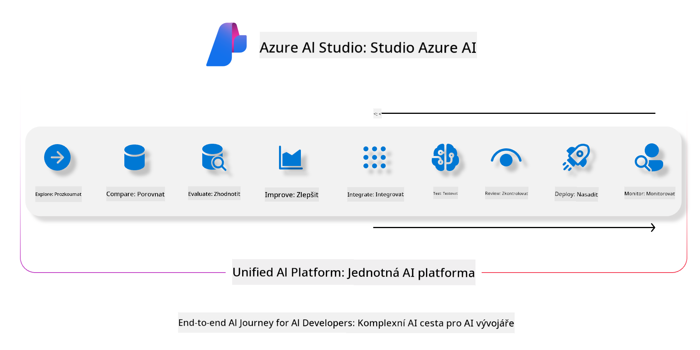
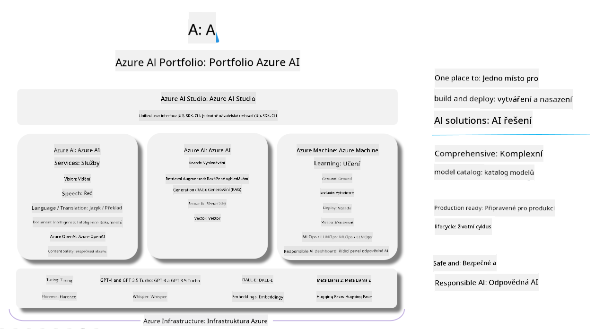

<!--
CO_OP_TRANSLATOR_METADATA:
{
  "original_hash": "7b4235159486df4000e16b7b46ddfec3",
  "translation_date": "2025-05-09T15:03:07+00:00",
  "source_file": "md/01.Introduction/05/AIFoundry.md",
  "language_code": "cs"
}
-->
# **Использование Azure AI Foundry для оценки**

Как оценить ваше приложение генеративного ИИ с помощью [Azure AI Foundry](https://ai.azure.com?WT.mc_id=aiml-138114-kinfeylo). Независимо от того, оцениваете ли вы односторонние или многосторонние диалоги, Azure AI Foundry предоставляет инструменты для проверки производительности модели и её безопасности.

## Как оценивать генеративные AI-приложения с помощью Azure AI Foundry
Для более подробной инструкции смотрите [документацию Azure AI Foundry](https://learn.microsoft.com/azure/ai-studio/how-to/evaluate-generative-ai-app?WT.mc_id=aiml-138114-kinfeylo)

Вот шаги для начала работы:

## Оценка генеративных AI-моделей в Azure AI Foundry

**Требования**

- Тестовый набор данных в формате CSV или JSON.
- Развернутая генеративная AI-модель (например, Phi-3, GPT 3.5, GPT 4 или модели Davinci).
- Среда выполнения с вычислительным экземпляром для проведения оценки.

## Встроенные метрики оценки

Azure AI Foundry позволяет оценивать как односторонние, так и сложные многосторонние диалоги.  
Для сценариев Retrieval Augmented Generation (RAG), где модель опирается на конкретные данные, можно использовать встроенные метрики для оценки производительности.  
Также поддерживается оценка общих сценариев односторонних вопросов и ответов (без RAG).

## Создание оценки

В интерфейсе Azure AI Foundry перейдите на страницу Evaluate или Prompt Flow.  
Следуйте мастеру создания оценки, чтобы настроить процесс. Можно указать имя оценки по желанию.  
Выберите сценарий, который соответствует целям вашего приложения.  
Выберите одну или несколько метрик для оценки результатов модели.

## Кастомный процесс оценки (по желанию)

Для большей гибкости можно настроить собственный процесс оценки, адаптируя его под ваши конкретные требования.

## Просмотр результатов

После завершения оценки просматривайте, анализируйте и сохраняйте подробные метрики в Azure AI Foundry. Получайте представление о возможностях и ограничениях вашего приложения.

**Note** Azure AI Foundry сейчас находится в публичном превью, поэтому используйте его для экспериментов и разработки. Для производственных задач рассмотрите другие варианты. Изучите официальную [документацию AI Foundry](https://learn.microsoft.com/azure/ai-studio/?WT.mc_id=aiml-138114-kinfeylo) для подробностей и пошаговых инструкций.

**Prohlášení o vyloučení odpovědnosti**:  
Tento dokument byl přeložen pomocí AI překladatelské služby [Co-op Translator](https://github.com/Azure/co-op-translator). Přestože usilujeme o přesnost, mějte prosím na paměti, že automatizované překlady mohou obsahovat chyby nebo nepřesnosti. Původní dokument v jeho mateřském jazyce by měl být považován za závazný zdroj. Pro důležité informace se doporučuje profesionální lidský překlad. Nejsme odpovědní za jakékoli nedorozumění nebo nesprávné výklady vzniklé použitím tohoto překladu.