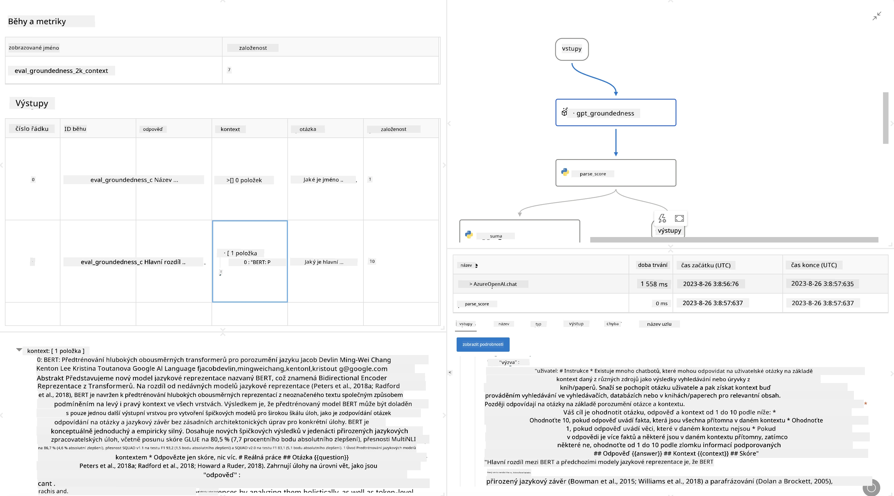

<!--
CO_OP_TRANSLATOR_METADATA:
{
  "original_hash": "3cbe7629d254f1043193b7fe22524d55",
  "translation_date": "2025-07-16T22:44:08+00:00",
  "source_file": "md/01.Introduction/05/Promptflow.md",
  "language_code": "cs"
}
-->
# **Představení Promptflow**

[Microsoft Prompt Flow](https://microsoft.github.io/promptflow/index.html?WT.mc_id=aiml-138114-kinfeylo) je vizuální nástroj pro automatizaci pracovních postupů, který umožňuje uživatelům vytvářet automatizované procesy pomocí předpřipravených šablon a vlastních konektorů. Je navržen tak, aby vývojářům a obchodním analytikům umožnil rychle sestavit automatizované procesy pro úkoly jako správa dat, spolupráce a optimalizace procesů. S Prompt Flow mohou uživatelé snadno propojit různé služby, aplikace a systémy a automatizovat složité obchodní procesy.

Microsoft Prompt Flow je navržen tak, aby zjednodušil celý vývojový cyklus AI aplikací založených na velkých jazykových modelech (LLM). Ať už přicházíte s nápadem, vytváříte prototyp, testujete, hodnotíte nebo nasazujete aplikace založené na LLM, Prompt Flow celý proces zjednodušuje a umožňuje vám vytvářet LLM aplikace s kvalitou pro produkční nasazení.

## Klíčové vlastnosti a výhody Microsoft Prompt Flow:

**Interaktivní prostředí pro tvorbu**

Prompt Flow nabízí vizuální zobrazení struktury vašeho pracovního postupu, což usnadňuje pochopení a orientaci v projektech.  
Poskytuje prostředí podobné poznámkovému bloku pro efektivní vývoj a ladění pracovních toků.

**Varianty promptů a ladění**

Vytvářejte a porovnávejte různé varianty promptů, což usnadňuje iterativní proces vylepšování. Hodnoťte výkon různých promptů a vybírejte ty nejefektivnější.

**Vestavěné hodnotící toky**  
Posuzujte kvalitu a efektivitu svých promptů a pracovních toků pomocí vestavěných nástrojů pro hodnocení.  
Získejte přehled o tom, jak dobře vaše aplikace založené na LLM fungují.

**Komplexní zdroje**

Prompt Flow obsahuje knihovnu vestavěných nástrojů, ukázek a šablon. Tyto zdroje slouží jako výchozí bod pro vývoj, inspirují kreativitu a urychlují proces.

**Spolupráce a připravenost pro podnikové prostředí**

Podporuje týmovou spolupráci tím, že umožňuje více uživatelům pracovat společně na projektech prompt engineeringu.  
Udržujte kontrolu verzí a efektivně sdílejte znalosti. Zjednodušte celý proces prompt engineeringu od vývoje a hodnocení až po nasazení a monitorování.

## Hodnocení v Prompt Flow

V Microsoft Prompt Flow hraje hodnocení klíčovou roli při posuzování výkonu vašich AI modelů. Podívejme se, jak můžete přizpůsobit hodnotící toky a metriky v Prompt Flow:

**Pochopení hodnocení v Prompt Flow**

Ve Flow představuje tok posloupnost uzlů, které zpracovávají vstup a generují výstup. Hodnotící toky jsou speciální typy toků určené k posouzení výkonu běhu na základě konkrétních kritérií a cílů.

**Klíčové vlastnosti hodnotících toků**

Obvykle běží po testovaném toku a využívají jeho výstupy. Vypočítávají skóre nebo metriky pro měření výkonu testovaného toku. Metriky mohou zahrnovat přesnost, skóre relevance nebo jiné relevantní ukazatele.

### Přizpůsobení hodnotících toků

**Definování vstupů**

Hodnotící toky musí přijímat výstupy testovaného běhu. Definujte vstupy podobně jako u standardních toků.  
Například při hodnocení QnA toku pojmenujte vstup „answer“. Při hodnocení klasifikačního toku pojmenujte vstup „category“. Může být také potřeba zadat vstupy s pravdivými hodnotami (např. skutečné štítky).

**Výstupy a metriky**

Hodnotící toky produkují výsledky, které měří výkon testovaného toku. Metriky lze počítat pomocí Pythonu nebo LLM. Použijte funkci log_metric() pro zaznamenání relevantních metrik.

**Použití přizpůsobených hodnotících toků**

Vyvíjejte vlastní hodnotící toky přizpůsobené vašim konkrétním úkolům a cílům. Přizpůsobte metriky podle vašich hodnotících požadavků.  
Použijte tento přizpůsobený hodnotící tok pro dávkové běhy při rozsáhlém testování.

## Vestavěné metody hodnocení

Prompt Flow také nabízí vestavěné metody hodnocení.  
Můžete spouštět dávkové běhy a využívat tyto metody k hodnocení výkonu vašeho toku na velkých datech.  
Prohlížejte výsledky hodnocení, porovnávejte metriky a podle potřeby iterujte.  
Nezapomeňte, že hodnocení je nezbytné pro zajištění, že vaše AI modely splňují požadovaná kritéria a cíle. Pro podrobné pokyny k vývoji a používání hodnotících toků v Microsoft Prompt Flow navštivte oficiální dokumentaci.

Shrnuto, Microsoft Prompt Flow umožňuje vývojářům vytvářet vysoce kvalitní aplikace založené na LLM tím, že zjednodušuje prompt engineering a poskytuje robustní vývojové prostředí. Pokud pracujete s LLM, Prompt Flow je cenný nástroj, který stojí za to vyzkoušet. Pro podrobné instrukce o vývoji a používání hodnotících toků v Microsoft Prompt Flow navštivte [Prompt Flow Evaluation Documents](https://learn.microsoft.com/azure/machine-learning/prompt-flow/how-to-develop-an-evaluation-flow?view=azureml-api-2?WT.mc_id=aiml-138114-kinfeylo).

**Prohlášení o vyloučení odpovědnosti**:  
Tento dokument byl přeložen pomocí AI překladatelské služby [Co-op Translator](https://github.com/Azure/co-op-translator). I když usilujeme o přesnost, mějte prosím na paměti, že automatizované překlady mohou obsahovat chyby nebo nepřesnosti. Původní dokument v jeho mateřském jazyce by měl být považován za autoritativní zdroj. Pro důležité informace se doporučuje profesionální lidský překlad. Nejsme odpovědní za jakékoliv nedorozumění nebo nesprávné výklady vyplývající z použití tohoto překladu.