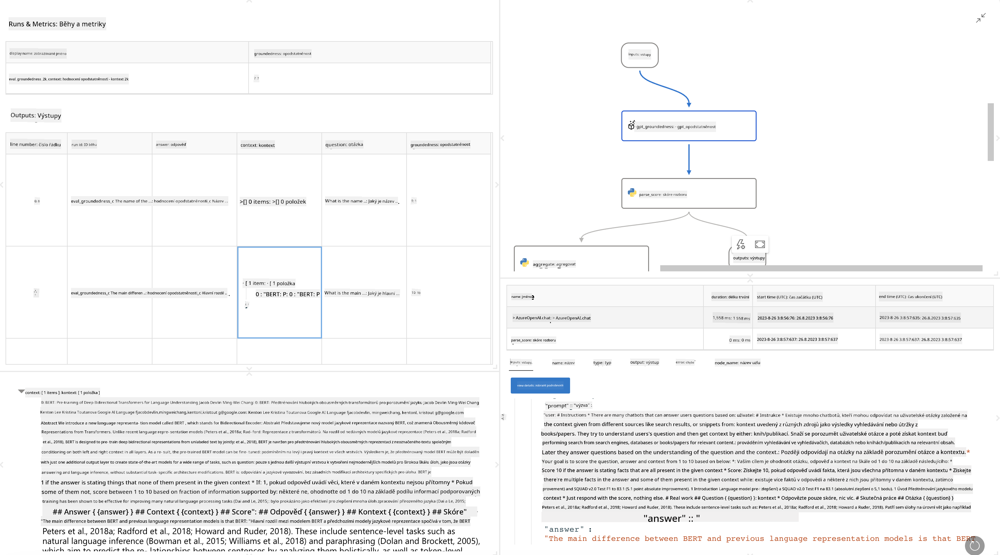

<!--
CO_OP_TRANSLATOR_METADATA:
{
  "original_hash": "3cbe7629d254f1043193b7fe22524d55",
  "translation_date": "2025-05-09T15:20:42+00:00",
  "source_file": "md/01.Introduction/05/Promptflow.md",
  "language_code": "cs"
}
-->
# **介绍 Promptflow**

[Microsoft Prompt Flow](https://microsoft.github.io/promptflow/index.html?WT.mc_id=aiml-138114-kinfeylo) 是一款可视化工作流自动化工具，允许用户使用预构建的模板和自定义连接器创建自动化工作流。它旨在帮助开发人员和业务分析师快速构建自动化流程，适用于数据管理、协作和流程优化等任务。通过 Prompt Flow，用户可以轻松连接不同的服务、应用和系统，实现复杂业务流程的自动化。

Microsoft Prompt Flow 专为简化由大型语言模型（LLMs）驱动的 AI 应用端到端开发周期而设计。无论你是在构思、原型设计、测试、评估还是部署基于 LLM 的应用，Prompt Flow 都能简化流程，助你构建具备生产质量的 LLM 应用。

## 以下是使用 Microsoft Prompt Flow 的主要功能和优势：

**交互式创作体验**

Prompt Flow 提供流结构的可视化展示，使项目结构一目了然，便于导航。
它还提供类似笔记本的编码体验，提升流程开发和调试效率。

**提示变体与调优**

创建并比较多个提示变体，促进迭代优化过程。评估不同提示的表现，选择最有效的版本。

**内置评估流程**

利用内置评估工具，评估提示和流程的质量与效果。
了解基于 LLM 的应用的实际表现。

**丰富资源库**

Prompt Flow 包含内置工具、示例和模板库。这些资源为开发提供起点，激发创意，加速开发进程。

**协作与企业级准备**

支持团队协作，允许多用户共同参与提示工程项目。
保持版本控制，有效共享知识。简化从开发、评估到部署和监控的整个提示工程流程。

## Prompt Flow 中的评估

在 Microsoft Prompt Flow 中，评估在衡量 AI 模型表现方面发挥着关键作用。下面介绍如何在 Prompt Flow 中自定义评估流程和指标：

**理解 Prompt Flow 中的评估**

在 Prompt Flow 中，flow 表示一系列处理输入并生成输出的节点。评估流程是专门用于根据特定标准和目标评估运行表现的特殊流程。

**评估流程的主要特点**

它们通常在被测试流程之后运行，使用其输出。通过计算分数或指标来衡量被测试流程的表现。指标可以包括准确率、相关性评分或其他相关测量。

### 自定义评估流程

**定义输入**

评估流程需要接收被测试运行的输出。输入定义方式与标准流程类似。
例如，评估 QnA 流时，将输入命名为 "answer"；评估分类流程时，将输入命名为 "category"。有时还需要提供真实标签（ground truth）输入。

**输出与指标**

评估流程产生衡量被测试流程表现的结果。指标可以通过 Python 或 LLM 计算。使用 log_metric() 函数记录相关指标。

**使用自定义评估流程**

根据具体任务和目标开发专属评估流程。根据评估目标自定义指标。
将此自定义评估流程应用于批量运行，实现大规模测试。

## 内置评估方法

Prompt Flow 还提供内置评估方法。
你可以提交批量运行，使用这些方法评估流程在大规模数据集上的表现。
查看评估结果，比较指标，并根据需要迭代优化。
请记住，评估对于确保 AI 模型达到预期标准和目标至关重要。请查阅官方文档，获取有关在 Microsoft Prompt Flow 中开发和使用评估流程的详细说明。

总结来说，Microsoft Prompt Flow 通过简化提示工程和提供强大的开发环境，帮助开发者打造高质量的 LLM 应用。如果你正在使用 LLM，Prompt Flow 是一个值得探索的有力工具。探索 [Prompt Flow Evaluation Documents](https://learn.microsoft.com/azure/machine-learning/prompt-flow/how-to-develop-an-evaluation-flow?view=azureml-api-2?WT.mc_id=aiml-138114-kinfeylo) 获取关于开发和使用评估流程的详细指导。

**Prohlášení o vyloučení odpovědnosti**:  
Tento dokument byl přeložen pomocí AI překladatelské služby [Co-op Translator](https://github.com/Azure/co-op-translator). Přestože usilujeme o přesnost, mějte prosím na paměti, že automatizované překlady mohou obsahovat chyby nebo nepřesnosti. Původní dokument v jeho rodném jazyce by měl být považován za závazný zdroj. Pro důležité informace se doporučuje profesionální lidský překlad. Nejsme odpovědní za jakékoliv nedorozumění nebo nesprávné výklady vyplývající z použití tohoto překladu.