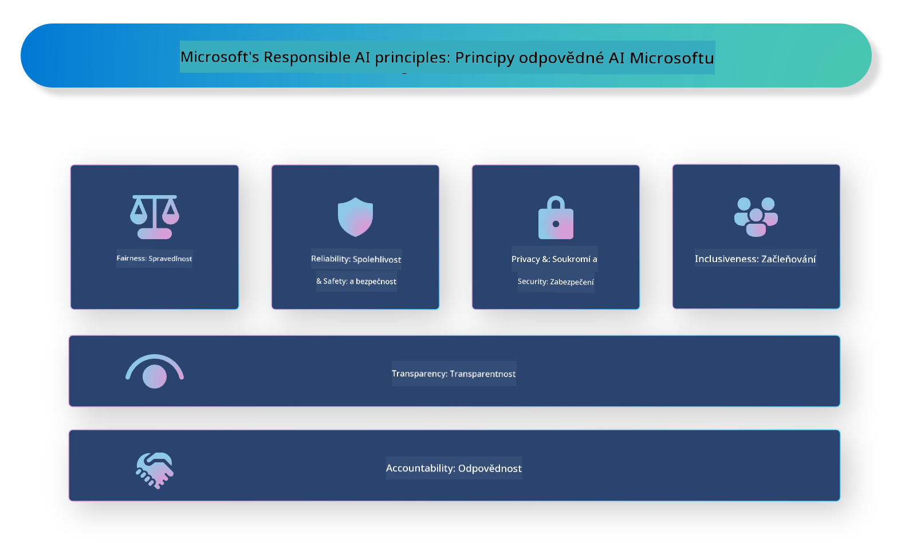

<!--
CO_OP_TRANSLATOR_METADATA:
{
  "original_hash": "805b96b20152936d8f4c587d90d6e06e",
  "translation_date": "2025-05-09T15:45:49+00:00",
  "source_file": "md/01.Introduction/05/ResponsibleAI.md",
  "language_code": "cs"
}
-->
# **Introducir IA Responsable**

[Microsoft Responsible AI](https://www.microsoft.com/ai/responsible-ai?WT.mc_id=aiml-138114-kinfeylo) es una iniciativa que busca ayudar a desarrolladores y organizaciones a crear sistemas de IA que sean transparentes, confiables y responsables. La iniciativa ofrece orientación y recursos para desarrollar soluciones de IA responsables que se alineen con principios éticos, como la privacidad, la equidad y la transparencia. También exploraremos algunos de los desafíos y mejores prácticas relacionados con la construcción de sistemas de IA responsables.

## Visión general de Microsoft Responsible AI

**Principios éticos**

Microsoft Responsible AI se guía por un conjunto de principios éticos, como privacidad, equidad, transparencia, responsabilidad y seguridad. Estos principios están diseñados para asegurar que los sistemas de IA se desarrollen de manera ética y responsable.

**IA transparente**

Microsoft Responsible AI destaca la importancia de la transparencia en los sistemas de IA. Esto incluye proporcionar explicaciones claras sobre cómo funcionan los modelos de IA, así como garantizar que las fuentes de datos y los algoritmos estén disponibles públicamente.

**IA responsable**

[Microsoft Responsible AI](https://www.microsoft.com/ai/responsible-ai?WT.mc_id=aiml-138114-kinfeylo) fomenta el desarrollo de sistemas de IA responsables, que puedan ofrecer información sobre cómo los modelos de IA toman decisiones. Esto ayuda a los usuarios a comprender y confiar en los resultados de los sistemas de IA.

**Inclusividad**

Los sistemas de IA deben diseñarse para beneficiar a todos. Microsoft busca crear una IA inclusiva que considere diversas perspectivas y evite sesgos o discriminación.

**Confiabilidad y seguridad**

Garantizar que los sistemas de IA sean confiables y seguros es fundamental. Microsoft se enfoca en construir modelos robustos que funcionen de manera consistente y eviten resultados dañinos.

**Equidad en IA**

Microsoft Responsible AI reconoce que los sistemas de IA pueden perpetuar sesgos si se entrenan con datos o algoritmos sesgados. La iniciativa ofrece orientación para desarrollar sistemas de IA justos que no discriminen por factores como raza, género o edad.

**Privacidad y seguridad**

Microsoft Responsible AI enfatiza la importancia de proteger la privacidad del usuario y la seguridad de los datos en los sistemas de IA. Esto incluye implementar cifrado fuerte de datos y controles de acceso, así como auditar regularmente los sistemas de IA para detectar vulnerabilidades.

**Responsabilidad y rendición de cuentas**

Microsoft Responsible AI promueve la responsabilidad y rendición de cuentas en el desarrollo y despliegue de IA. Esto implica asegurar que los desarrolladores y organizaciones conozcan los riesgos potenciales asociados con los sistemas de IA y tomen medidas para mitigarlos.

## Mejores prácticas para construir sistemas de IA responsables

**Desarrollar modelos de IA usando conjuntos de datos diversos**

Para evitar sesgos en los sistemas de IA, es importante usar conjuntos de datos diversos que representen una variedad de perspectivas y experiencias.

**Usar técnicas de IA explicable**

Las técnicas de IA explicable pueden ayudar a los usuarios a entender cómo los modelos de IA toman decisiones, lo que puede aumentar la confianza en el sistema.

**Auditar regularmente los sistemas de IA en busca de vulnerabilidades**

Las auditorías periódicas de los sistemas de IA pueden ayudar a identificar riesgos y vulnerabilidades que deben ser abordados.

**Implementar cifrado fuerte de datos y controles de acceso**

El cifrado de datos y los controles de acceso ayudan a proteger la privacidad y seguridad del usuario en los sistemas de IA.

**Seguir principios éticos en el desarrollo de IA**

Seguir principios éticos, como equidad, transparencia y responsabilidad, puede ayudar a generar confianza en los sistemas de IA y asegurar que se desarrollen de manera responsable.

## Uso de AI Foundry para IA Responsable

[Azure AI Foundry](https://ai.azure.com?WT.mc_id=aiml-138114-kinfeylo) es una plataforma potente que permite a desarrolladores y organizaciones crear rápidamente aplicaciones inteligentes, innovadoras, listas para el mercado y responsables. Aquí algunas características y capacidades clave de Azure AI Foundry:

**APIs y modelos listos para usar**

Azure AI Foundry ofrece APIs y modelos preconstruidos y personalizables. Estos cubren una amplia gama de tareas de IA, incluyendo IA generativa, procesamiento de lenguaje natural para conversaciones, búsqueda, monitoreo, traducción, voz, visión y toma de decisiones.

**Prompt Flow**

Prompt flow en Azure AI Foundry permite crear experiencias de IA conversacional. Facilita diseñar y gestionar flujos conversacionales, haciendo más sencillo construir chatbots, asistentes virtuales y otras aplicaciones interactivas.

**Generación aumentada por recuperación (RAG)**

RAG es una técnica que combina enfoques basados en recuperación y generación. Mejora la calidad de las respuestas generadas aprovechando tanto el conocimiento preexistente (recuperación) como la generación creativa (generación).

**Métricas de evaluación y monitoreo para IA generativa**

Azure AI Foundry ofrece herramientas para evaluar y monitorear modelos de IA generativa. Puedes medir su desempeño, equidad y otras métricas importantes para asegurar un despliegue responsable. Además, si has creado un panel de control, puedes usar la interfaz sin código en Azure Machine Learning Studio para personalizar y generar un Panel de IA Responsable y su tarjeta de puntuación basada en las librerías Python del [Responsible AI Toolbox](https://responsibleaitoolbox.ai/?WT.mc_id=aiml-138114-kinfeylo). Esta tarjeta ayuda a compartir insights clave relacionados con equidad, importancia de características y otras consideraciones responsables con audiencias técnicas y no técnicas.

Para usar AI Foundry con IA responsable, puedes seguir estas mejores prácticas:

**Definir el problema y los objetivos de tu sistema de IA**

Antes de comenzar el desarrollo, es importante definir claramente el problema u objetivo que tu sistema de IA busca resolver. Esto ayudará a identificar los datos, algoritmos y recursos necesarios para construir un modelo efectivo.

**Recolectar y preprocesar datos relevantes**

La calidad y cantidad de datos usados para entrenar un sistema de IA tienen un impacto significativo en su desempeño. Por ello, es importante recolectar datos relevantes, limpiarlos, preprocesarlos y asegurarse de que representen la población o problema que se desea resolver.

**Elegir la evaluación apropiada**

Existen varios algoritmos de evaluación disponibles. Es fundamental elegir el más adecuado según tus datos y problema.

**Evaluar e interpretar el modelo**

Una vez construido un modelo de IA, es importante evaluar su desempeño usando métricas apropiadas e interpretar los resultados de forma transparente. Esto ayudará a identificar sesgos o limitaciones del modelo y a hacer mejoras cuando sea necesario.

**Garantizar transparencia y explicabilidad**

Los sistemas de IA deben ser transparentes y explicables para que los usuarios comprendan cómo funcionan y cómo se toman las decisiones. Esto es especialmente importante en aplicaciones con impactos significativos en la vida humana, como salud, finanzas y sistemas legales.

**Monitorear y actualizar el modelo**

Los sistemas de IA deben ser monitoreados y actualizados continuamente para asegurar que sigan siendo precisos y efectivos con el tiempo. Esto requiere mantenimiento, pruebas y reentrenamiento constantes.

En conclusión, Microsoft Responsible AI es una iniciativa que busca ayudar a desarrolladores y organizaciones a construir sistemas de IA que sean transparentes, confiables y responsables. Recuerda que la implementación responsable de IA es crucial, y Azure AI Foundry busca hacerla práctica para las organizaciones. Siguiendo principios éticos y mejores prácticas, podemos asegurar que los sistemas de IA se desarrollen y desplieguen de manera responsable, beneficiando a la sociedad en su conjunto.

**Prohlášení o vyloučení odpovědnosti**:  
Tento dokument byl přeložen pomocí AI překladatelské služby [Co-op Translator](https://github.com/Azure/co-op-translator). Přestože usilujeme o přesnost, mějte prosím na paměti, že automatické překlady mohou obsahovat chyby nebo nepřesnosti. Originální dokument v jeho původním jazyce by měl být považován za autoritativní zdroj. Pro důležité informace se doporučuje profesionální lidský překlad. Nejsme odpovědní za jakákoliv nedorozumění nebo nesprávné výklady vyplývající z použití tohoto překladu.