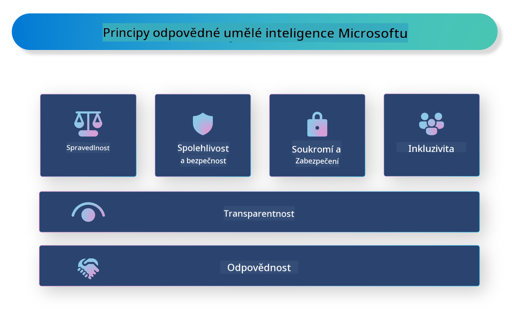

<!--
CO_OP_TRANSLATOR_METADATA:
{
  "original_hash": "805b96b20152936d8f4c587d90d6e06e",
  "translation_date": "2025-07-16T22:57:25+00:00",
  "source_file": "md/01.Introduction/05/ResponsibleAI.md",
  "language_code": "cs"
}
-->
# **Představení Responsible AI**

[Microsoft Responsible AI](https://www.microsoft.com/ai/responsible-ai?WT.mc_id=aiml-138114-kinfeylo) je iniciativa, která pomáhá vývojářům a organizacím vytvářet AI systémy, jež jsou transparentní, důvěryhodné a zodpovědné. Tato iniciativa poskytuje rady a zdroje pro vývoj odpovědných AI řešení, která jsou v souladu s etickými principy, jako jsou ochrana soukromí, spravedlnost a transparentnost. Také se podíváme na některé výzvy a osvědčené postupy spojené s tvorbou odpovědných AI systémů.

## Přehled Microsoft Responsible AI

**Etické principy**

Microsoft Responsible AI se řídí souborem etických principů, jako jsou ochrana soukromí, spravedlnost, transparentnost, odpovědnost a bezpečnost. Tyto principy mají zajistit, že AI systémy jsou vyvíjeny eticky a zodpovědně.

**Transparentní AI**

Microsoft Responsible AI klade důraz na transparentnost AI systémů. To zahrnuje poskytování jasných vysvětlení, jak AI modely fungují, a také zajištění veřejné dostupnosti datových zdrojů a algoritmů.

**Odpovědná AI**

[Microsoft Responsible AI](https://www.microsoft.com/ai/responsible-ai?WT.mc_id=aiml-138114-kinfeylo) podporuje vývoj odpovědných AI systémů, které dokážou poskytnout přehled o tom, jak AI modely přijímají rozhodnutí. To pomáhá uživatelům lépe porozumět a důvěřovat výstupům AI systémů.

**Inkluzivita**

AI systémy by měly být navrženy tak, aby přinášely užitek všem. Microsoft usiluje o vytváření inkluzivní AI, která zohledňuje různé pohledy a vyhýbá se zaujatosti či diskriminaci.

**Spolehlivost a bezpečnost**

Zajištění spolehlivosti a bezpečnosti AI systémů je klíčové. Microsoft se zaměřuje na tvorbu robustních modelů, které fungují konzistentně a vyhýbají se škodlivým výsledkům.

**Spravedlnost v AI**

Microsoft Responsible AI si uvědomuje, že AI systémy mohou přenášet předsudky, pokud jsou trénovány na zaujatých datech nebo algoritmech. Iniciativa poskytuje doporučení pro vývoj spravedlivých AI systémů, které nediskriminují na základě faktorů jako je rasa, pohlaví nebo věk.

**Ochrana soukromí a bezpečnost**

Microsoft Responsible AI zdůrazňuje důležitost ochrany soukromí uživatelů a bezpečnosti dat v AI systémech. To zahrnuje implementaci silného šifrování dat a kontrol přístupu, stejně jako pravidelné audity AI systémů na zranitelnosti.

**Odpovědnost a zodpovědnost**

Microsoft Responsible AI podporuje odpovědnost a zodpovědnost při vývoji a nasazení AI. To znamená, že vývojáři a organizace by měli být informováni o možných rizicích spojených s AI systémy a podnikat kroky k jejich minimalizaci.

## Osvědčené postupy pro tvorbu odpovědných AI systémů

**Vyvíjejte AI modely s využitím různorodých datových sad**

Aby se předešlo zaujatosti v AI systémech, je důležité používat různorodé datové sady, které reprezentují široké spektrum pohledů a zkušeností.

**Používejte techniky vysvětlitelné AI**

Techniky vysvětlitelné AI pomáhají uživatelům pochopit, jak AI modely přijímají rozhodnutí, což může zvýšit důvěru v systém.

**Pravidelně provádějte audity AI systémů na zranitelnosti**

Pravidelné audity AI systémů pomáhají odhalit potenciální rizika a zranitelnosti, které je třeba řešit.

**Implementujte silné šifrování dat a kontroly přístupu**

Šifrování dat a kontroly přístupu pomáhají chránit soukromí a bezpečnost uživatelů v AI systémech.

**Dodržujte etické principy při vývoji AI**

Dodržování etických principů, jako jsou spravedlnost, transparentnost a odpovědnost, pomáhá budovat důvěru v AI systémy a zajišťuje, že jsou vyvíjeny zodpovědně.

## Použití AI Foundry pro Responsible AI

[Azure AI Foundry](https://ai.azure.com?WT.mc_id=aiml-138114-kinfeylo) je výkonná platforma, která umožňuje vývojářům a organizacím rychle vytvářet inteligentní, moderní, na trh připravené a odpovědné aplikace. Zde jsou některé klíčové funkce a možnosti Azure AI Foundry:

**Předpřipravené API a modely**

Azure AI Foundry nabízí předpřipravená a přizpůsobitelná API a modely. Pokrývají širokou škálu AI úloh, včetně generativní AI, zpracování přirozeného jazyka pro konverzace, vyhledávání, monitorování, překladů, řeči, vidění a rozhodování.

**Prompt Flow**

Prompt flow v Azure AI Foundry umožňuje vytvářet konverzační AI zážitky. Umožňuje navrhovat a spravovat konverzační toky, což usnadňuje tvorbu chatbotů, virtuálních asistentů a dalších interaktivních aplikací.

**Retrieval Augmented Generation (RAG)**

RAG je technika, která kombinuje přístupy založené na vyhledávání a generování. Zlepšuje kvalitu generovaných odpovědí tím, že využívá jak předem existující znalosti (vyhledávání), tak kreativní generování (generování).

**Měření a monitorování generativní AI**

Azure AI Foundry poskytuje nástroje pro hodnocení a monitorování generativních AI modelů. Můžete hodnotit jejich výkon, spravedlnost a další důležité metriky, aby bylo zajištěno odpovědné nasazení. Navíc, pokud jste vytvořili dashboard, můžete použít no-code uživatelské rozhraní v Azure Machine Learning Studio k přizpůsobení a vytvoření Responsible AI Dashboard a přidružené scorecard založené na [Responsible AI Toolbox](https://responsibleaitoolbox.ai/?WT.mc_id=aiml-138114-kinfeylo) Python knihovnách. Tento scorecard pomáhá sdílet klíčové poznatky týkající se spravedlnosti, důležitosti funkcí a dalších aspektů odpovědného nasazení jak s technickými, tak netechnickými zainteresovanými stranami.

Pro použití AI Foundry s Responsible AI můžete dodržovat tyto osvědčené postupy:

**Definujte problém a cíle vašeho AI systému**

Před zahájením vývoje je důležité jasně definovat problém nebo cíl, který má váš AI systém řešit. To vám pomůže určit data, algoritmy a zdroje potřebné k vytvoření efektivního modelu.

**Shromážděte a předzpracujte relevantní data**

Kvalita a množství dat použitých k tréninku AI systému má zásadní vliv na jeho výkon. Proto je důležité shromáždit relevantní data, vyčistit je, předzpracovat a zajistit, aby byla reprezentativní pro populaci nebo problém, který se snažíte vyřešit.

**Vyberte vhodné hodnotící metody**

Existuje mnoho hodnotících algoritmů. Je důležité vybrat ten nejvhodnější podle vašich dat a problému.

**Vyhodnoťte a interpretujte model**

Jakmile máte AI model vytvořený, je důležité vyhodnotit jeho výkon pomocí vhodných metrik a transparentně interpretovat výsledky. To vám pomůže odhalit případné zaujatosti nebo omezení modelu a provést potřebná vylepšení.

**Zajistěte transparentnost a vysvětlitelnost**

AI systémy by měly být transparentní a vysvětlitelné, aby uživatelé mohli pochopit, jak fungují a jak jsou přijímána rozhodnutí. To je zvláště důležité u aplikací, které mají významný dopad na lidské životy, jako je zdravotnictví, finance nebo právní systémy.

**Monitorujte a aktualizujte model**

AI systémy by měly být průběžně monitorovány a aktualizovány, aby zůstaly přesné a efektivní v čase. To vyžaduje pravidelnou údržbu, testování a přeškolování modelu.

Na závěr, Microsoft Responsible AI je iniciativa, která pomáhá vývojářům a organizacím vytvářet AI systémy, jež jsou transparentní, důvěryhodné a zodpovědné. Pamatujte, že odpovědná implementace AI je klíčová a Azure AI Foundry usiluje o to, aby byla pro organizace praktická. Dodržováním etických principů a osvědčených postupů můžeme zajistit, že AI systémy budou vyvíjeny a nasazovány zodpovědně a ve prospěch celé společnosti.

**Prohlášení o vyloučení odpovědnosti**:  
Tento dokument byl přeložen pomocí AI překladatelské služby [Co-op Translator](https://github.com/Azure/co-op-translator). I když usilujeme o přesnost, mějte prosím na paměti, že automatické překlady mohou obsahovat chyby nebo nepřesnosti. Původní dokument v jeho mateřském jazyce by měl být považován za autoritativní zdroj. Pro důležité informace se doporučuje profesionální lidský překlad. Nejsme odpovědní za jakékoliv nedorozumění nebo nesprávné výklady vyplývající z použití tohoto překladu.