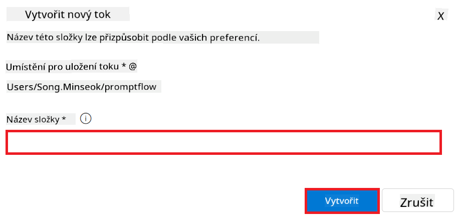

<!--
CO_OP_TRANSLATOR_METADATA:
{
  "original_hash": "80a853c08e4ee25ef9b4bfcedd8990da",
  "translation_date": "2025-05-09T17:13:14+00:00",
  "source_file": "md/02.Application/01.TextAndChat/Phi3/E2E_Phi-3-Evaluation_AIFoundry.md",
  "language_code": "cs"
}
-->
# Evaluate the Fine-tuned Phi-3 / Phi-3.5 Model in Azure AI Foundry Focusing on Microsoft's Responsible AI Principles

This end-to-end (E2E) sample is based on the guide "[Evaluate Fine-tuned Phi-3 / 3.5 Models in Azure AI Foundry Focusing on Microsoft's Responsible AI](https://techcommunity.microsoft.com/blog/educatordeveloperblog/evaluate-fine-tuned-phi-3--3-5-models-in-azure-ai-studio-focusing-on-microsofts-/4227850?WT.mc_id=aiml-137032-kinfeylo)" from the Microsoft Tech Community.

## Overview

### How can you evaluate the safety and performance of a fine-tuned Phi-3 / Phi-3.5 model in Azure AI Foundry?

Fine-tuning a model can sometimes result in unintended or undesired outputs. To ensure the model remains safe and effective, it’s essential to assess its potential for generating harmful content and its ability to produce accurate, relevant, and coherent responses. In this tutorial, you will learn how to evaluate the safety and performance of a fine-tuned Phi-3 / Phi-3.5 model integrated with Prompt flow in Azure AI Foundry.

Here is the evaluation process in Azure AI Foundry.


*Image Source: [Evaluation of generative AI applications](https://learn.microsoft.com/azure/ai-studio/concepts/evaluation-approach-gen-ai?wt.mc_id%3Dstudentamb_279723)*

> [!NOTE]
>
> For more detailed information and additional resources about Phi-3 / Phi-3.5, please visit the [Phi-3CookBook](https://github.com/microsoft/Phi-3CookBook?wt.mc_id=studentamb_279723).

### Prerequisites

- [Python](https://www.python.org/downloads)
- [Azure subscription](https://azure.microsoft.com/free?wt.mc_id=studentamb_279723)
- [Visual Studio Code](https://code.visualstudio.com)
- Fine-tuned Phi-3 / Phi-3.5 model

### Table of Contents

1. [**Scenario 1: Introduction to Azure AI Foundry's Prompt flow evaluation**](../../../../../../md/02.Application/01.TextAndChat/Phi3)

    - [Introduction to safety evaluation](../../../../../../md/02.Application/01.TextAndChat/Phi3)
    - [Introduction to performance evaluation](../../../../../../md/02.Application/01.TextAndChat/Phi3)

1. [**Scenario 2: Evaluating the Phi-3 / Phi-3.5 model in Azure AI Foundry**](../../../../../../md/02.Application/01.TextAndChat/Phi3)

    - [Before you begin](../../../../../../md/02.Application/01.TextAndChat/Phi3)
    - [Deploy Azure OpenAI to evaluate the Phi-3 / Phi-3.5 model](../../../../../../md/02.Application/01.TextAndChat/Phi3)
    - [Evaluate the fine-tuned Phi-3 / Phi-3.5 model using Azure AI Foundry's Prompt flow evaluation](../../../../../../md/02.Application/01.TextAndChat/Phi3)

1. [Congratulations!](../../../../../../md/02.Application/01.TextAndChat/Phi3)

## **Scenario 1: Introduction to Azure AI Foundry's Prompt flow evaluation**

### Introduction to safety evaluation

To ensure your AI model is ethical and safe, it’s vital to evaluate it against Microsoft's Responsible AI Principles. In Azure AI Foundry, safety evaluations allow you to assess your model’s vulnerability to jailbreak attacks and its potential to produce harmful content, directly aligned with these principles.


*Image Source: [Evaluation of generative AI applications](https://learn.microsoft.com/azure/ai-studio/concepts/evaluation-approach-gen-ai?wt.mc_id%3Dstudentamb_279723)*

#### Microsoft’s Responsible AI Principles

Before diving into the technical steps, it’s important to understand Microsoft's Responsible AI Principles, an ethical framework guiding the responsible development, deployment, and operation of AI systems. These principles ensure AI technologies are designed and built to be fair, transparent, and inclusive. They form the foundation for evaluating AI model safety.

Microsoft's Responsible AI Principles include:

- **Fairness and Inclusiveness**: AI systems should treat everyone fairly and avoid disparate treatment of similar groups. For example, when AI offers guidance on medical treatment, loan applications, or hiring, it should provide consistent recommendations to people with similar symptoms, financial situations, or qualifications.

- **Reliability and Safety**: To build trust, AI systems must operate reliably, safely, and consistently. They should function as intended, handle unexpected conditions safely, and resist harmful manipulation. Their behavior and range of handled conditions reflect the scenarios anticipated by developers during design and testing.

- **Transparency**: When AI impacts significant decisions in people’s lives, it’s critical that users understand how those decisions were made. For instance, a bank might use AI to determine creditworthiness or a company to select the best candidates for hiring.

- **Privacy and Security**: As AI becomes more widespread, protecting privacy and securing personal and business data grows more complex. Since AI requires data access to make accurate predictions and decisions, privacy and security deserve careful attention.

- **Accountability**: Designers and deployers of AI systems must be responsible for their operation. Organizations should apply industry standards to establish accountability norms, ensuring AI is not the sole authority in decisions affecting people’s lives and that humans retain meaningful control over highly autonomous AI systems.


*Image Source: [What is Responsible AI?](https://learn.microsoft.com/azure/machine-learning/concept-responsible-ai?view=azureml-api-2&viewFallbackFrom=azureml-api-2%253fwt.mc_id%3Dstudentamb_279723)*

> [!NOTE]
> To learn more about Microsoft's Responsible AI Principles, visit the [What is Responsible AI?](https://learn.microsoft.com/azure/machine-learning/concept-responsible-ai?view=azureml-api-2?wt.mc_id=studentamb_279723).

#### Safety metrics

In this tutorial, you will assess the safety of the fine-tuned Phi-3 model using Azure AI Foundry's safety metrics. These metrics help measure the model’s potential to generate harmful content and its vulnerability to jailbreak attacks. The safety metrics include:

- **Self-harm-related Content**: Checks if the model tends to generate content related to self-harm.
- **Hateful and Unfair Content**: Checks if the model tends to produce hateful or biased content.
- **Violent Content**: Checks if the model tends to generate violent content.
- **Sexual Content**: Checks if the model tends to produce inappropriate sexual content.

Evaluating these factors helps ensure the AI model avoids harmful or offensive content, aligning with societal values and regulatory standards.


### Introduction to performance evaluation

To confirm your AI model performs as expected, it’s important to evaluate its performance using specific metrics. In Azure AI Foundry, performance evaluations measure your model’s ability to generate accurate, relevant, and coherent responses.


*Image Source: [Evaluation of generative AI applications](https://learn.microsoft.com/azure/ai-studio/concepts/evaluation-approach-gen-ai?wt.mc_id%3Dstudentamb_279723)*

#### Performance metrics

In this tutorial, you will evaluate the performance of the fine-tuned Phi-3 / Phi-3.5 model using Azure AI Foundry's performance metrics. These metrics help assess the model’s effectiveness in producing accurate, relevant, and coherent answers. The performance metrics include:

- **Groundedness**: Measures how well the generated answers align with information from the input source.
- **Relevance**: Assesses how pertinent the generated responses are to the questions asked.
- **Coherence**: Evaluates how naturally the generated text flows and how human-like the language sounds.
- **Fluency**: Measures the language proficiency of the generated text.
- **GPT Similarity**: Compares the generated response to the ground truth for similarity.
- **F1 Score**: Calculates the ratio of overlapping words between the generated response and the source data.

These metrics help determine the model’s ability to deliver accurate, relevant, and coherent responses.


## **Scenario 2: Evaluating the Phi-3 / Phi-3.5 model in Azure AI Foundry**

### Before you begin

This tutorial builds on previous blog posts, "[Fine-Tune and Integrate Custom Phi-3 Models with Prompt Flow: Step-by-Step Guide](https://techcommunity.microsoft.com/t5/educator-developer-blog/fine-tune-and-integrate-custom-phi-3-models-with-prompt-flow/ba-p/4178612?wt.mc_id=studentamb_279723)" and "[Fine-Tune and Integrate Custom Phi-3 Models with Prompt Flow in Azure AI Foundry](https://techcommunity.microsoft.com/t5/educator-developer-blog/fine-tune-and-integrate-custom-phi-3-models-with-prompt-flow-in/ba-p/4191726?wt.mc_id=studentamb_279723)." These posts walked through fine-tuning a Phi-3 / Phi-3.5 model in Azure AI Foundry and integrating it with Prompt flow.

In this tutorial, you will deploy an Azure OpenAI model as an evaluator in Azure AI Foundry and use it to assess your fine-tuned Phi-3 / Phi-3.5 model.

Before starting, ensure you have the following prerequisites, as described in the previous tutorials:

1. A prepared dataset to evaluate the fine-tuned Phi-3 / Phi-3.5 model.
2. A Phi-3 / Phi-3.5 model that has been fine-tuned and deployed to Azure Machine Learning.
3. A Prompt flow integrated with your fine-tuned Phi-3 / Phi-3.5 model in Azure AI Foundry.

> [!NOTE]
> You will use the *test_data.jsonl* file, located in the data folder from the **ULTRACHAT_200k** dataset downloaded in the previous blog posts, as the dataset for evaluating the fine-tuned Phi-3 / Phi-3.5 model.

#### Integrate the custom Phi-3 / Phi-3.5 model with Prompt flow in Azure AI Foundry (Code first approach)

> [!NOTE]
> If you followed the low-code approach described in "[Fine-Tune and Integrate Custom Phi-3 Models with Prompt Flow in Azure AI Foundry](https://techcommunity.microsoft.com/t5/educator-developer-blog/fine-tune-and-integrate-custom-phi-3-models-with-prompt-flow-in/ba-p/4191726?wt.mc_id=studentamb_279723)", you can skip this exercise and proceed to the next one.
> However, if you followed the code-first approach described in "[Fine-Tune and Integrate Custom Phi-3 Models with Prompt Flow: Step-by-Step Guide](https://techcommunity.microsoft.com/t5/educator-developer-blog/fine-tune-and-integrate-custom-phi-3-models-with-prompt-flow/ba-p/4178612?wt.mc_id=studentamb_279723)" to fine-tune and deploy your Phi-3 / Phi-3.5 model, the process of connecting your model to Prompt flow is slightly different. You will learn this process in this exercise.

To continue, you need to integrate your fine-tuned Phi-3 / Phi-3.5 model into Prompt flow in Azure AI Foundry.

#### Create Azure AI Foundry Hub

You need to create a Hub before creating a Project. A Hub functions like a Resource Group, allowing you to organize and manage multiple Projects within Azure AI Foundry.

1. Sign in to [Azure AI Foundry](https://ai.azure.com/?wt.mc_id=studentamb_279723).

2. Select **All hubs** from the left-side menu.

3. Click **+ New hub** in the navigation bar.

    

4. Complete the following:

    - Enter a **Hub name**. It must be unique.
    - Select your Azure **Subscription**.
    - Choose the **Resource group** to use (create a new one if necessary).
    - Select the desired **Location**.
    - Choose the **Connect Azure AI Services** resource to use (create a new one if needed).
    - For **Connect Azure AI Search**, select **Skip connecting**.


1. Wählen Sie **Next** aus.

#### Azure AI Foundry-Projekt erstellen

1. Wählen Sie im erstellten Hub auf der linken Seitenleiste **All projects** aus.

1. Wählen Sie im Navigationsmenü **+ New project** aus.

    

1. Geben Sie einen **Project name** ein. Dieser muss eindeutig sein.

    

1. Wählen Sie **Create a project** aus.

#### Benutzerdefinierte Verbindung für das feinabgestimmte Phi-3 / Phi-3.5-Modell hinzufügen

Um Ihr benutzerdefiniertes Phi-3 / Phi-3.5-Modell in Prompt flow zu integrieren, müssen Sie den Endpunkt und den Schlüssel des Modells in einer benutzerdefinierten Verbindung speichern. So wird der Zugriff auf Ihr benutzerdefiniertes Phi-3 / Phi-3.5-Modell in Prompt flow gewährleistet.

#### API-Schlüssel und Endpunkt-URI des feinabgestimmten Phi-3 / Phi-3.5-Modells festlegen

1. Besuchen Sie [Azure ML Studio](https://ml.azure.com/home?wt.mc_id=studentamb_279723).

1. Navigieren Sie zum Azure Machine Learning-Arbeitsbereich, den Sie erstellt haben.

1. Wählen Sie auf der linken Seitenleiste **Endpoints** aus.

    

1. Wählen Sie den von Ihnen erstellten Endpunkt aus.

    

1. Wählen Sie im Navigationsmenü **Consume** aus.

1. Kopieren Sie Ihren **REST endpoint** und den **Primary key**.

    

#### Benutzerdefinierte Verbindung hinzufügen

1. Besuchen Sie [Azure AI Foundry](https://ai.azure.com/?wt.mc_id=studentamb_279723).

1. Navigieren Sie zum Azure AI Foundry-Projekt, das Sie erstellt haben.

1. Wählen Sie im Projekt auf der linken Seitenleiste **Settings** aus.

1. Wählen Sie **+ New connection** aus.

    

1. Wählen Sie im Navigationsmenü **Custom keys** aus.

    

1. Führen Sie die folgenden Schritte aus:

    - Wählen Sie **+ Add key value pairs**.
    - Geben Sie als Schlüsselname **endpoint** ein und fügen Sie den aus Azure ML Studio kopierten Endpunkt in das Wertefeld ein.
    - Wählen Sie erneut **+ Add key value pairs**.
    - Geben Sie als Schlüsselname **key** ein und fügen Sie den aus Azure ML Studio kopierten Schlüssel in das Wertefeld ein.
    - Aktivieren Sie nach dem Hinzufügen der Schlüssel die Option **is secret**, um den Schlüssel vor Offenlegung zu schützen.

    

1. Wählen Sie **Add connection** aus.

#### Prompt flow erstellen

Sie haben eine benutzerdefinierte Verbindung in Azure AI Foundry hinzugefügt. Erstellen wir nun einen Prompt flow mit den folgenden Schritten. Anschließend verbinden Sie diesen Prompt flow mit der benutzerdefinierten Verbindung, um das feinabgestimmte Modell im Prompt flow zu verwenden.

1. Navigieren Sie zum Azure AI Foundry-Projekt, das Sie erstellt haben.

1. Wählen Sie auf der linken Seitenleiste **Prompt flow** aus.

1. Wählen Sie im Navigationsmenü **+ Create** aus.

    

1. Wählen Sie im Navigationsmenü **Chat flow** aus.

    

1. Geben Sie den **Folder name** ein, den Sie verwenden möchten.

    

1. Wählen Sie **Create** aus.

#### Prompt flow einrichten, um mit Ihrem benutzerdefinierten Phi-3 / Phi-3.5-Modell zu chatten

Sie müssen das feinabgestimmte Phi-3 / Phi-3.5-Modell in einen Prompt flow integrieren. Der vorhandene Prompt flow ist dafür nicht ausgelegt. Daher müssen Sie den Prompt flow neu gestalten, um die Integration des benutzerdefinierten Modells zu ermöglichen.

1. Führen Sie im Prompt flow folgende Schritte aus, um den bestehenden Flow neu aufzubauen:

    - Wählen Sie **Raw file mode**.
    - Löschen Sie den gesamten vorhandenen Code in der Datei *flow.dag.yml*.
    - Fügen Sie den folgenden Code in *flow.dag.yml* ein.

        ```yml
        inputs:
          input_data:
            type: string
            default: "Who founded Microsoft?"

        outputs:
          answer:
            type: string
            reference: ${integrate_with_promptflow.output}

        nodes:
        - name: integrate_with_promptflow
          type: python
          source:
            type: code
            path: integrate_with_promptflow.py
          inputs:
            input_data: ${inputs.input_data}
        ```

    - Wählen Sie **Save** aus.

    

1. Fügen Sie den folgenden Code in *integrate_with_promptflow.py* ein, um das benutzerdefinierte Phi-3 / Phi-3.5-Modell in Prompt flow zu verwenden.

    ```python
    import logging
    import requests
    from promptflow import tool
    from promptflow.connections import CustomConnection

    # Logging setup
    logging.basicConfig(
        format="%(asctime)s - %(levelname)s - %(name)s - %(message)s",
        datefmt="%Y-%m-%d %H:%M:%S",
        level=logging.DEBUG
    )
    logger = logging.getLogger(__name__)

    def query_phi3_model(input_data: str, connection: CustomConnection) -> str:
        """
        Send a request to the Phi-3 / Phi-3.5 model endpoint with the given input data using Custom Connection.
        """

        # "connection" is the name of the Custom Connection, "endpoint", "key" are the keys in the Custom Connection
        endpoint_url = connection.endpoint
        api_key = connection.key

        headers = {
            "Content-Type": "application/json",
            "Authorization": f"Bearer {api_key}"
        }
    data = {
        "input_data": [input_data],
        "params": {
            "temperature": 0.7,
            "max_new_tokens": 128,
            "do_sample": True,
            "return_full_text": True
            }
        }
        try:
            response = requests.post(endpoint_url, json=data, headers=headers)
            response.raise_for_status()
            
            # Log the full JSON response
            logger.debug(f"Full JSON response: {response.json()}")

            result = response.json()["output"]
            logger.info("Successfully received response from Azure ML Endpoint.")
            return result
        except requests.exceptions.RequestException as e:
            logger.error(f"Error querying Azure ML Endpoint: {e}")
            raise

    @tool
    def my_python_tool(input_data: str, connection: CustomConnection) -> str:
        """
        Tool function to process input data and query the Phi-3 / Phi-3.5 model.
        """
        return query_phi3_model(input_data, connection)

    ```

    

> [!NOTE]
> Für detailliertere Informationen zur Verwendung von Prompt flow in Azure AI Foundry können Sie [Prompt flow in Azure AI Foundry](https://learn.microsoft.com/azure/ai-studio/how-to/prompt-flow) konsultieren.

1. Aktivieren Sie **Chat input** und **Chat output**, um den Chat mit Ihrem Modell zu ermöglichen.

    

1. Jetzt sind Sie bereit, mit Ihrem benutzerdefinierten Phi-3 / Phi-3.5-Modell zu chatten. In der nächsten Übung lernen Sie, wie Sie Prompt flow starten und es für den Chat mit Ihrem feinabgestimmten Phi-3 / Phi-3.5-Modell verwenden.

> [!NOTE]
>
> Der neu aufgebaute Flow sollte wie im folgenden Bild aussehen:
>
> 
>

#### Prompt flow starten

1. Wählen Sie **Start compute sessions**, um Prompt flow zu starten.

    

1. Wählen Sie **Validate and parse input**, um die Parameter zu erneuern.

    

1. Wählen Sie den **Value** der **connection** aus, der auf die von Ihnen erstellte benutzerdefinierte Verbindung verweist, z. B. *connection*.

    

#### Mit Ihrem benutzerdefinierten Phi-3 / Phi-3.5-Modell chatten

1. Wählen Sie **Chat** aus.

    

1. Hier sehen Sie ein Beispiel für die Ergebnisse: Nun können Sie mit Ihrem benutzerdefinierten Phi-3 / Phi-3.5-Modell chatten. Es empfiehlt sich, Fragen auf Grundlage der für das Fine-Tuning verwendeten Daten zu stellen.

    

### Azure OpenAI bereitstellen, um das Phi-3 / Phi-3.5-Modell zu bewerten

Um das Phi-3 / Phi-3.5-Modell in Azure AI Foundry zu bewerten, müssen Sie ein Azure OpenAI-Modell bereitstellen. Dieses Modell wird verwendet, um die Leistung des Phi-3 / Phi-3.5-Modells zu evaluieren.

#### Azure OpenAI bereitstellen

1. Melden Sie sich bei [Azure AI Foundry](https://ai.azure.com/?wt.mc_id=studentamb_279723) an.

1. Navigieren Sie zum Azure AI Foundry-Projekt, das Sie erstellt haben.

    

1. Wählen Sie im Projekt auf der linken Seitenleiste **Deployments** aus.

1. Wählen Sie im Navigationsmenü **+ Deploy model** aus.

1. Wählen Sie **Deploy base model** aus.

    

1. Wählen Sie das Azure OpenAI-Modell aus, das Sie verwenden möchten, z. B. **gpt-4o**.

    

1. Wählen Sie **Confirm** aus.

### Das feinabgestimmte Phi-3 / Phi-3.5-Modell mit der Prompt flow-Auswertung von Azure AI Foundry bewerten

### Neue Bewertung starten

1. Besuchen Sie [Azure AI Foundry](https://ai.azure.com/?wt.mc_id=studentamb_279723).

1. Navigieren Sie zum Azure AI Foundry-Projekt, das Sie erstellt haben.

    

1. Wählen Sie im Projekt auf der linken Seitenleiste **Evaluation** aus.

1. Wählen Sie im Navigationsmenü **+ New evaluation** aus.


1. Wybierz ocenę **Prompt flow**.

    

1. Wykonaj następujące zadania:

    - Wprowadź nazwę oceny. Musi to być unikalna wartość.
    - Wybierz **Question and answer without context** jako typ zadania. Ponieważ zestaw danych **UlTRACHAT_200k** używany w tym samouczku nie zawiera kontekstu.
    - Wybierz prompt flow, który chcesz ocenić.

    

1. Wybierz **Next**.

1. Wykonaj następujące zadania:

    - Wybierz **Add your dataset**, aby przesłać zestaw danych. Na przykład możesz przesłać plik testowy, taki jak *test_data.json1*, który jest dołączony podczas pobierania zestawu danych **ULTRACHAT_200k**.
    - Wybierz odpowiednią **Dataset column**, która odpowiada twojemu zestawowi danych. Na przykład, jeśli używasz zestawu **ULTRACHAT_200k**, wybierz **${data.prompt}** jako kolumnę zestawu danych.

    

1. Wybierz **Next**.

1. Wykonaj następujące zadania, aby skonfigurować metryki wydajności i jakości:

    - Wybierz metryki wydajności i jakości, które chcesz wykorzystać.
    - Wybierz model Azure OpenAI, który utworzyłeś do oceny. Na przykład wybierz **gpt-4o**.

    

1. Wykonaj następujące zadania, aby skonfigurować metryki ryzyka i bezpieczeństwa:

    - Wybierz metryki ryzyka i bezpieczeństwa, które chcesz wykorzystać.
    - Wybierz próg, którego chcesz użyć do obliczenia wskaźnika defektów. Na przykład wybierz **Medium**.
    - Dla **question** wybierz **Data source** jako **{$data.prompt}**.
    - Dla **answer** wybierz **Data source** jako **{$run.outputs.answer}**.
    - Dla **ground_truth** wybierz **Data source** jako **{$data.message}**.

    

1. Wybierz **Next**.

1. Wybierz **Submit**, aby rozpocząć ocenę.

1. Ocena potrwa chwilę. Możesz monitorować postęp na karcie **Evaluation**.

### Przejrzyj wyniki oceny

> [!NOTE]
> Poniższe wyniki mają na celu zilustrowanie procesu oceny. W tym samouczku użyliśmy modelu dostrojonego na stosunkowo małym zbiorze danych, co może prowadzić do wyników poniżej optymalnych. Rzeczywiste wyniki mogą się znacznie różnić w zależności od rozmiaru, jakości i różnorodności użytego zestawu danych oraz konkretnej konfiguracji modelu.

Po zakończeniu oceny możesz przejrzeć wyniki zarówno metryk wydajności, jak i bezpieczeństwa.

1. Metryki wydajności i jakości:

    - oceniają skuteczność modelu w generowaniu spójnych, płynnych i trafnych odpowiedzi.

    

1. Metryki ryzyka i bezpieczeństwa:

    - Zapewniają, że wyniki modelu są bezpieczne i zgodne z zasadami Responsible AI, unikając treści szkodliwych lub obraźliwych.

    

1. Możesz przewinąć w dół, aby zobaczyć **Szczegółowe wyniki metryk**.

    

1. Ocena własnego modelu Phi-3 / Phi-3.5 pod kątem zarówno metryk wydajności, jak i bezpieczeństwa pozwala potwierdzić, że model jest nie tylko skuteczny, ale także przestrzega zasad odpowiedzialnej sztucznej inteligencji, co czyni go gotowym do wdrożenia w rzeczywistych zastosowaniach.

## Gratulacje!

### Ukończyłeś ten samouczek

Pomyślnie oceniłeś dostrojony model Phi-3 zintegrowany z Prompt flow w Azure AI Foundry. To ważny krok, aby upewnić się, że twoje modele AI nie tylko działają efektywnie, ale także przestrzegają zasad Responsible AI Microsoftu, pomagając budować godne zaufania i niezawodne aplikacje AI.


## Sprzątanie zasobów Azure

Posprzątaj zasoby Azure, aby uniknąć dodatkowych opłat na twoim koncie. Przejdź do portalu Azure i usuń następujące zasoby:

- Zasób Azure Machine learning.
- Punkt końcowy modelu Azure Machine learning.
- Zasób projektu Azure AI Foundry.
- Zasób Prompt flow w Azure AI Foundry.

### Kolejne kroki

#### Dokumentacja

- [Assess AI systems by using the Responsible AI dashboard](https://learn.microsoft.com/azure/machine-learning/concept-responsible-ai-dashboard?view=azureml-api-2&source=recommendations?wt.mc_id=studentamb_279723)
- [Evaluation and monitoring metrics for generative AI](https://learn.microsoft.com/azure/ai-studio/concepts/evaluation-metrics-built-in?tabs=definition?wt.mc_id=studentamb_279723)
- [Azure AI Foundry documentation](https://learn.microsoft.com/azure/ai-studio/?wt.mc_id=studentamb_279723)
- [Prompt flow documentation](https://microsoft.github.io/promptflow/?wt.mc_id=studentamb_279723)

#### Materiały szkoleniowe

- [Introduction to Microsoft's Responsible AI Approach](https://learn.microsoft.com/training/modules/introduction-to-microsofts-responsible-ai-approach/?source=recommendations?wt.mc_id=studentamb_279723)
- [Introduction to Azure AI Foundry](https://learn.microsoft.com/training/modules/introduction-to-azure-ai-studio/?wt.mc_id=studentamb_279723)

### Źródła

- [What is Responsible AI?](https://learn.microsoft.com/azure/machine-learning/concept-responsible-ai?view=azureml-api-2?wt.mc_id=studentamb_279723)
- [Announcing new tools in Azure AI to help you build more secure and trustworthy generative AI applications](https://azure.microsoft.com/blog/announcing-new-tools-in-azure-ai-to-help-you-build-more-secure-and-trustworthy-generative-ai-applications/?wt.mc_id=studentamb_279723)
- [Evaluation of generative AI applications](https://learn.microsoft.com/azure/ai-studio/concepts/evaluation-approach-gen-ai?wt.mc_id%3Dstudentamb_279723)

**Prohlášení o vyloučení odpovědnosti**:  
Tento dokument byl přeložen pomocí AI překladatelské služby [Co-op Translator](https://github.com/Azure/co-op-translator). I když usilujeme o přesnost, mějte prosím na paměti, že automatizované překlady mohou obsahovat chyby nebo nepřesnosti. Originální dokument v jeho mateřském jazyce by měl být považován za autoritativní zdroj. Pro kritické informace se doporučuje profesionální lidský překlad. Nejsme odpovědní za jakékoli nedorozumění nebo chybné výklady vyplývající z použití tohoto překladu.