<!--
CO_OP_TRANSLATOR_METADATA:
{
  "original_hash": "455be2b7b9c3390d367d528f8fab2aa0",
  "translation_date": "2025-07-17T00:42:43+00:00",
  "source_file": "md/02.Application/01.TextAndChat/Phi3/E2E_Phi-3-FineTuning_PromptFlow_Integration.md",
  "language_code": "cs"
}
-->
# Doladění a integrace vlastních modelů Phi-3 s Prompt flow

Tento kompletní (E2E) příklad vychází z průvodce "[Fine-Tune and Integrate Custom Phi-3 Models with Prompt Flow: Step-by-Step Guide](https://techcommunity.microsoft.com/t5/educator-developer-blog/fine-tune-and-integrate-custom-phi-3-models-with-prompt-flow/ba-p/4178612?WT.mc_id=aiml-137032-kinfeylo)" z Microsoft Tech Community. Představuje procesy doladění, nasazení a integrace vlastních modelů Phi-3 s Prompt flow.

## Přehled

V tomto E2E příkladu se naučíte, jak doladit model Phi-3 a integrovat ho s Prompt flow. Využitím Azure Machine Learning a Prompt flow vytvoříte pracovní postup pro nasazení a využití vlastních AI modelů. Tento E2E příklad je rozdělen do tří scénářů:

**Scénář 1: Nastavení Azure zdrojů a příprava na doladění**

**Scénář 2: Doladění modelu Phi-3 a nasazení v Azure Machine Learning Studiu**

**Scénář 3: Integrace s Prompt flow a chat s vlastním modelem**

Zde je přehled tohoto E2E příkladu.


### Obsah

1. **[Scénář 1: Nastavení Azure zdrojů a příprava na doladění](../../../../../../md/02.Application/01.TextAndChat/Phi3)**
    - [Vytvoření Azure Machine Learning Workspace](../../../../../../md/02.Application/01.TextAndChat/Phi3)
    - [Žádost o kvóty GPU v Azure Subscription](../../../../../../md/02.Application/01.TextAndChat/Phi3)
    - [Přidání role assignment](../../../../../../md/02.Application/01.TextAndChat/Phi3)
    - [Nastavení projektu](../../../../../../md/02.Application/01.TextAndChat/Phi3)
    - [Příprava datasetu pro doladění](../../../../../../md/02.Application/01.TextAndChat/Phi3)

1. **[Scénář 2: Doladění modelu Phi-3 a nasazení v Azure Machine Learning Studiu](../../../../../../md/02.Application/01.TextAndChat/Phi3)**
    - [Nastavení Azure CLI](../../../../../../md/02.Application/01.TextAndChat/Phi3)
    - [Doladění modelu Phi-3](../../../../../../md/02.Application/01.TextAndChat/Phi3)
    - [Nasazení doladěného modelu](../../../../../../md/02.Application/01.TextAndChat/Phi3)

1. **[Scénář 3: Integrace s Prompt flow a chat s vlastním modelem](../../../../../../md/02.Application/01.TextAndChat/Phi3)**
    - [Integrace vlastního modelu Phi-3 s Prompt flow](../../../../../../md/02.Application/01.TextAndChat/Phi3)
    - [Chat s vlastním modelem](../../../../../../md/02.Application/01.TextAndChat/Phi3)

## Scénář 1: Nastavení Azure zdrojů a příprava na doladění

### Vytvoření Azure Machine Learning Workspace

1. Do **vyhledávacího pole** v horní části portálu napište *azure machine learning* a z nabízených možností vyberte **Azure Machine Learning**.

    

1. V navigačním menu vyberte **+ Create**.

1. V navigačním menu vyberte **New workspace**.

    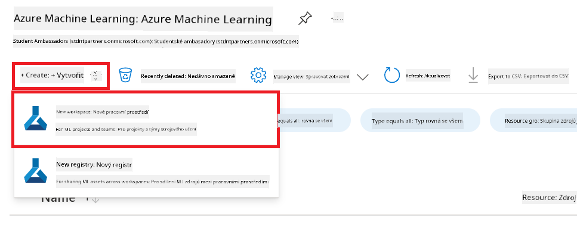

1. Proveďte následující kroky:

    - Vyberte svou Azure **Subscription**.
    - Vyberte **Resource group**, kterou chcete použít (v případě potřeby vytvořte novou).
    - Zadejte **Workspace Name**. Musí být jedinečný.
    - Vyberte **Region**, který chcete použít.
    - Vyberte **Storage account**, který chcete použít (v případě potřeby vytvořte nový).
    - Vyberte **Key vault**, který chcete použít (v případě potřeby vytvořte nový).
    - Vyberte **Application insights**, který chcete použít (v případě potřeby vytvořte nový).
    - Vyberte **Container registry**, který chcete použít (v případě potřeby vytvořte nový).

    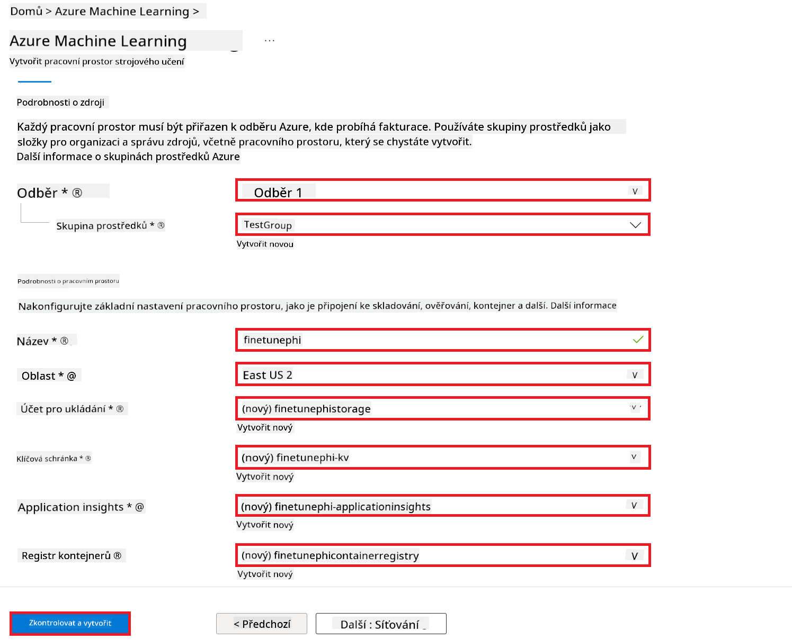

1. Vyberte **Review + Create**.

1. Vyberte **Create**.

### Žádost o kvóty GPU v Azure Subscription

V tomto E2E příkladu použijete *Standard_NC24ads_A100_v4 GPU* pro doladění, což vyžaduje žádost o kvótu, a *Standard_E4s_v3* CPU pro nasazení, které žádost o kvótu nevyžaduje.

> [!NOTE]
>
> GPU jsou dostupné pouze pro předplatné typu Pay-As-You-Go (standardní typ předplatného); benefitní předplatné momentálně není podporováno.
>
> Pro uživatele benefitních předplatných (například Visual Studio Enterprise Subscription) nebo pro rychlé otestování procesu doladění a nasazení tento návod také nabízí možnost doladění s minimálním datasetem na CPU. Je však důležité poznamenat, že výsledky doladění jsou výrazně lepší při použití GPU s většími datovými sadami.

1. Navštivte [Azure ML Studio](https://ml.azure.com/home?wt.mc_id=studentamb_279723).

1. Pro žádost o kvótu *Standard NCADSA100v4 Family* proveďte následující:

    - Vyberte **Quota** v levém panelu.
    - Vyberte **Virtual machine family**, kterou chcete použít. Například **Standard NCADSA100v4 Family Cluster Dedicated vCPUs**, která zahrnuje *Standard_NC24ads_A100_v4* GPU.
    - Vyberte **Request quota** v navigačním menu.

        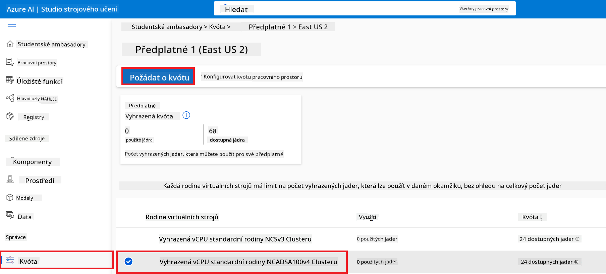

    - Na stránce Request quota zadejte **New cores limit**, který chcete použít. Například 24.
    - Na stránce Request quota vyberte **Submit** pro odeslání žádosti o kvótu GPU.

> [!NOTE]
> Pro výběr vhodného GPU nebo CPU podle vašich potřeb se můžete podívat do dokumentace [Sizes for Virtual Machines in Azure](https://learn.microsoft.com/azure/virtual-machines/sizes/overview?tabs=breakdownseries%2Cgeneralsizelist%2Ccomputesizelist%2Cmemorysizelist%2Cstoragesizelist%2Cgpusizelist%2Cfpgasizelist%2Chpcsizelist).

### Přidání role assignment

Pro doladění a nasazení modelů musíte nejprve vytvořit User Assigned Managed Identity (UAI) a přiřadit jí odpovídající oprávnění. Tato UAI bude použita pro autentizaci během nasazení.

#### Vytvoření User Assigned Managed Identity (UAI)

1. Do **vyhledávacího pole** v horní části portálu napište *managed identities* a z nabízených možností vyberte **Managed Identities**.

    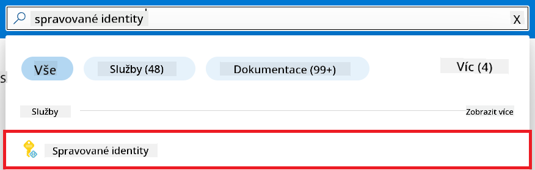

1. Vyberte **+ Create**.

    

1. Proveďte následující kroky:

    - Vyberte svou Azure **Subscription**.
    - Vyberte **Resource group**, kterou chcete použít (v případě potřeby vytvořte novou).
    - Vyberte **Region**, který chcete použít.
    - Zadejte **Name**. Musí být jedinečný.

1. Vyberte **Review + create**.

1. Vyberte **+ Create**.

#### Přidání role Contributor k Managed Identity

1. Přejděte k vytvořenému Managed Identity zdroji.

1. V levém panelu vyberte **Azure role assignments**.

1. V navigačním menu vyberte **+ Add role assignment**.

1. Na stránce Add role assignment proveďte následující:

    - Nastavte **Scope** na **Resource group**.
    - Vyberte svou Azure **Subscription**.
    - Vyberte **Resource group**, kterou chcete použít.
    - Vyberte roli **Contributor**.

    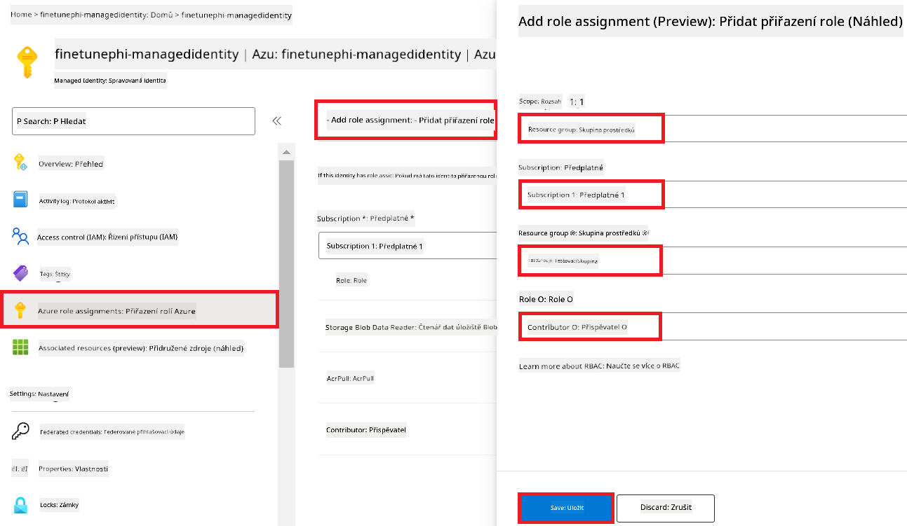

1. Vyberte **Save**.

#### Přidání role Storage Blob Data Reader k Managed Identity

1. Do **vyhledávacího pole** v horní části portálu napište *storage accounts* a z nabízených možností vyberte **Storage accounts**.

    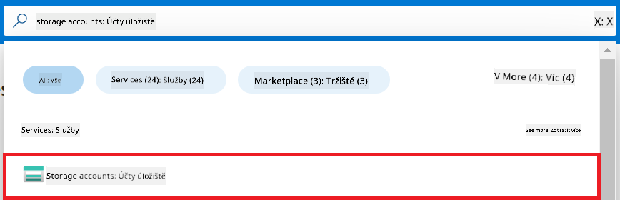

1. Vyberte storage účet, který je spojený s Azure Machine Learning workspace, který jste vytvořili. Například *finetunephistorage*.

1. Pro navigaci na stránku Add role assignment proveďte následující:

    - Přejděte do Azure Storage účtu, který jste vytvořili.
    - V levém panelu vyberte **Access Control (IAM)**.
    - V navigačním menu vyberte **+ Add**.
    - Vyberte **Add role assignment**.

    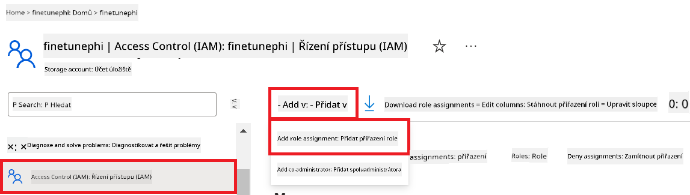

1. Na stránce Add role assignment proveďte následující:

    - Do vyhledávacího pole na stránce Role napište *Storage Blob Data Reader* a vyberte **Storage Blob Data Reader**.
    - Vyberte **Next**.
    - Na stránce Members vyberte **Assign access to** **Managed identity**.
    - Vyberte **+ Select members**.
    - Na stránce Select managed identities vyberte svou Azure **Subscription**.
    - Vyberte **Managed identity** jako **Manage Identity**.
    - Vyberte Manage Identity, kterou jste vytvořili, například *finetunephi-managedidentity*.
    - Vyberte **Select**.

    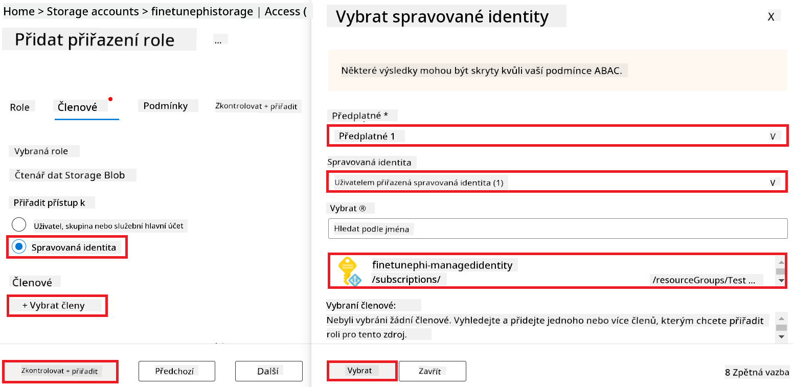

1. Vyberte **Review + assign**.

#### Přidání role AcrPull k Managed Identity

1. Do **vyhledávacího pole** v horní části portálu napište *container registries* a z nabízených možností vyberte **Container registries**.

    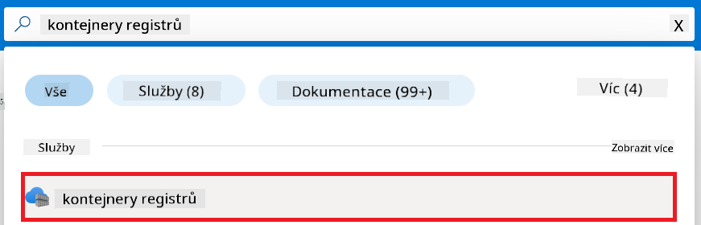

1. Vyberte container registry spojený s Azure Machine Learning workspace, například *finetunephicontainerregistries*.

1. Pro navigaci na stránku Add role assignment proveďte následující:

    - V levém panelu vyberte **Access Control (IAM)**.
    - V navigačním menu vyberte **+ Add**.
    - Vyberte **Add role assignment**.

1. Na stránce Add role assignment proveďte následující:

    - Do vyhledávacího pole na stránce Role napište *AcrPull* a vyberte **AcrPull**.
    - Vyberte **Next**.
    - Na stránce Members vyberte **Assign access to** **Managed identity**.
    - Vyberte **+ Select members**.
    - Na stránce Select managed identities vyberte svou Azure **Subscription**.
    - Vyberte **Managed identity** jako **Manage Identity**.
    - Vyberte Manage Identity, kterou jste vytvořili, například *finetunephi-managedidentity*.
    - Vyberte **Select**.
    - Vyberte **Review + assign**.

### Nastavení projektu

Nyní vytvoříte složku pro práci a nastavíte virtuální prostředí pro vývoj programu, který bude komunikovat s uživateli a využívat uloženou historii chatu z Azure Cosmos DB k informování svých odpovědí.

#### Vytvoření složky pro práci

1. Otevřete terminál a zadejte následující příkaz pro vytvoření složky s názvem *finetune-phi* v výchozí cestě.

    ```console
    mkdir finetune-phi
    ```

1. V terminálu zadejte následující příkaz pro přechod do složky *finetune-phi*, kterou jste vytvořili.

    ```console
    cd finetune-phi
    ```

#### Vytvoření virtuálního prostředí

1. V terminálu zadejte následující příkaz pro vytvoření virtuálního prostředí s názvem *.venv*.

    ```console
    python -m venv .venv
    ```

1. V terminálu zadejte následující příkaz pro aktivaci virtuálního prostředí.

    ```console
    .venv\Scripts\activate.bat
    ```
> [!NOTE]
>
> Pokud to fungovalo, měli byste před příkazovým řádkem vidět *(.venv)*.
#### Nainstalujte požadované balíčky

1. Zadejte následující příkazy do terminálu pro instalaci požadovaných balíčků.

    ```console
    pip install datasets==2.19.1
    pip install transformers==4.41.1
    pip install azure-ai-ml==1.16.0
    pip install torch==2.3.1
    pip install trl==0.9.4
    pip install promptflow==1.12.0
    ```

#### Vytvořte soubory projektu

V tomto cvičení vytvoříte základní soubory pro náš projekt. Tyto soubory zahrnují skripty pro stažení datové sady, nastavení prostředí Azure Machine Learning, doladění modelu Phi-3 a nasazení doladěného modelu. Také vytvoříte soubor *conda.yml* pro nastavení prostředí pro doladění.

V tomto cvičení:

- Vytvoříte soubor *download_dataset.py* pro stažení datové sady.
- Vytvoříte soubor *setup_ml.py* pro nastavení prostředí Azure Machine Learning.
- Vytvoříte soubor *fine_tune.py* ve složce *finetuning_dir* pro doladění modelu Phi-3 pomocí datové sady.
- Vytvoříte soubor *conda.yml* pro nastavení prostředí pro doladění.
- Vytvoříte soubor *deploy_model.py* pro nasazení doladěného modelu.
- Vytvoříte soubor *integrate_with_promptflow.py* pro integraci doladěného modelu a spuštění modelu pomocí Prompt flow.
- Vytvoříte soubor *flow.dag.yml* pro nastavení struktury workflow pro Prompt flow.
- Vytvoříte soubor *config.py* pro zadání informací o Azure.

> [!NOTE]
>
> Kompletní struktura složek:
>
> ```text
> └── YourUserName
> .    └── finetune-phi
> .        ├── finetuning_dir
> .        │      └── fine_tune.py
> .        ├── conda.yml
> .        ├── config.py
> .        ├── deploy_model.py
> .        ├── download_dataset.py
> .        ├── flow.dag.yml
> .        ├── integrate_with_promptflow.py
> .        └── setup_ml.py
> ```

1. Otevřete **Visual Studio Code**.

1. V menu vyberte **File**.

1. Vyberte **Open Folder**.

1. Vyberte složku *finetune-phi*, kterou jste vytvořili, nacházející se na *C:\Users\yourUserName\finetune-phi*.

    

1. V levém panelu Visual Studio Code klikněte pravým tlačítkem a vyberte **New File** pro vytvoření nového souboru s názvem *download_dataset.py*.

1. V levém panelu Visual Studio Code klikněte pravým tlačítkem a vyberte **New File** pro vytvoření nového souboru s názvem *setup_ml.py*.

1. V levém panelu Visual Studio Code klikněte pravým tlačítkem a vyberte **New File** pro vytvoření nového souboru s názvem *deploy_model.py*.

    

1. V levém panelu Visual Studio Code klikněte pravým tlačítkem a vyberte **New Folder** pro vytvoření nové složky s názvem *finetuning_dir*.

1. Ve složce *finetuning_dir* vytvořte nový soubor s názvem *fine_tune.py*.

#### Vytvořte a nakonfigurujte soubor *conda.yml*

1. V levém panelu Visual Studio Code klikněte pravým tlačítkem a vyberte **New File** pro vytvoření nového souboru s názvem *conda.yml*.

1. Přidejte do souboru *conda.yml* následující kód pro nastavení prostředí pro doladění modelu Phi-3.

    ```yml
    name: phi-3-training-env
    channels:
      - defaults
      - conda-forge
    dependencies:
      - python=3.10
      - pip
      - numpy<2.0
      - pip:
          - torch==2.4.0
          - torchvision==0.19.0
          - trl==0.8.6
          - transformers==4.41
          - datasets==2.21.0
          - azureml-core==1.57.0
          - azure-storage-blob==12.19.0
          - azure-ai-ml==1.16
          - azure-identity==1.17.1
          - accelerate==0.33.0
          - mlflow==2.15.1
          - azureml-mlflow==1.57.0
    ```

#### Vytvořte a nakonfigurujte soubor *config.py*

1. V levém panelu Visual Studio Code klikněte pravým tlačítkem a vyberte **New File** pro vytvoření nového souboru s názvem *config.py*.

1. Přidejte do souboru *config.py* následující kód pro zadání vašich Azure informací.

    ```python
    # Azure settings
    AZURE_SUBSCRIPTION_ID = "your_subscription_id"
    AZURE_RESOURCE_GROUP_NAME = "your_resource_group_name" # "TestGroup"

    # Azure Machine Learning settings
    AZURE_ML_WORKSPACE_NAME = "your_workspace_name" # "finetunephi-workspace"

    # Azure Managed Identity settings
    AZURE_MANAGED_IDENTITY_CLIENT_ID = "your_azure_managed_identity_client_id"
    AZURE_MANAGED_IDENTITY_NAME = "your_azure_managed_identity_name" # "finetunephi-mangedidentity"
    AZURE_MANAGED_IDENTITY_RESOURCE_ID = f"/subscriptions/{AZURE_SUBSCRIPTION_ID}/resourceGroups/{AZURE_RESOURCE_GROUP_NAME}/providers/Microsoft.ManagedIdentity/userAssignedIdentities/{AZURE_MANAGED_IDENTITY_NAME}"

    # Dataset file paths
    TRAIN_DATA_PATH = "data/train_data.jsonl"
    TEST_DATA_PATH = "data/test_data.jsonl"

    # Fine-tuned model settings
    AZURE_MODEL_NAME = "your_fine_tuned_model_name" # "finetune-phi-model"
    AZURE_ENDPOINT_NAME = "your_fine_tuned_model_endpoint_name" # "finetune-phi-endpoint"
    AZURE_DEPLOYMENT_NAME = "your_fine_tuned_model_deployment_name" # "finetune-phi-deployment"

    AZURE_ML_API_KEY = "your_fine_tuned_model_api_key"
    AZURE_ML_ENDPOINT = "your_fine_tuned_model_endpoint_uri" # "https://{your-endpoint-name}.{your-region}.inference.ml.azure.com/score"
    ```

#### Přidejte proměnné prostředí Azure

1. Pro přidání Azure Subscription ID proveďte následující kroky:

    - Do **vyhledávacího pole** v horní části portálu zadejte *subscriptions* a vyberte **Subscriptions** z nabídky.
    - Vyberte Azure Subscription, kterou aktuálně používáte.
    - Zkopírujte a vložte vaše Subscription ID do souboru *config.py*.

    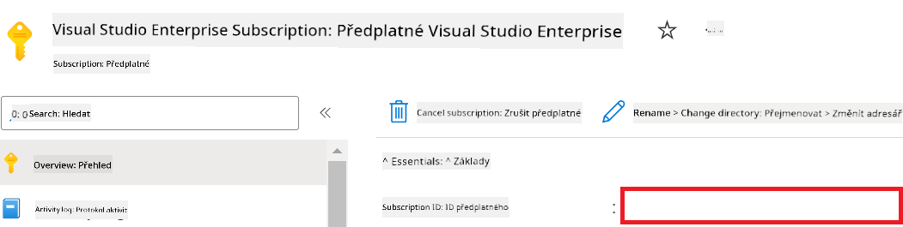

1. Pro přidání názvu Azure Workspace proveďte následující kroky:

    - Přejděte k Azure Machine Learning zdroji, který jste vytvořili.
    - Zkopírujte a vložte název vašeho workspace do souboru *config.py*.

    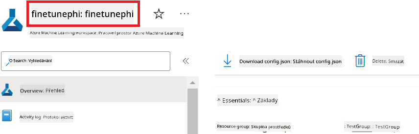

1. Pro přidání názvu Azure Resource Group proveďte následující kroky:

    - Přejděte k Azure Machine Learning zdroji, který jste vytvořili.
    - Zkopírujte a vložte název vaší Azure Resource Group do souboru *config.py*.

    

2. Pro přidání názvu Azure Managed Identity proveďte následující kroky:

    - Přejděte k Managed Identities zdroji, který jste vytvořili.
    - Zkopírujte a vložte název vaší Azure Managed Identity do souboru *config.py*.

    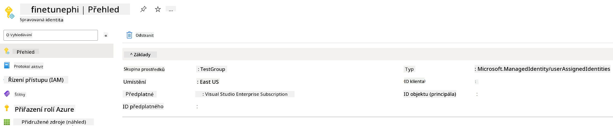

### Připravte datovou sadu pro doladění

V tomto cvičení spustíte soubor *download_dataset.py* pro stažení datové sady *ULTRACHAT_200k* do vašeho lokálního prostředí. Tuto datovou sadu pak použijete k doladění modelu Phi-3 v Azure Machine Learning.

#### Stáhněte datovou sadu pomocí *download_dataset.py*

1. Otevřete soubor *download_dataset.py* ve Visual Studio Code.

1. Přidejte do souboru *download_dataset.py* následující kód.

    ```python
    import json
    import os
    from datasets import load_dataset
    from config import (
        TRAIN_DATA_PATH,
        TEST_DATA_PATH)

    def load_and_split_dataset(dataset_name, config_name, split_ratio):
        """
        Load and split a dataset.
        """
        # Load the dataset with the specified name, configuration, and split ratio
        dataset = load_dataset(dataset_name, config_name, split=split_ratio)
        print(f"Original dataset size: {len(dataset)}")
        
        # Split the dataset into train and test sets (80% train, 20% test)
        split_dataset = dataset.train_test_split(test_size=0.2)
        print(f"Train dataset size: {len(split_dataset['train'])}")
        print(f"Test dataset size: {len(split_dataset['test'])}")
        
        return split_dataset

    def save_dataset_to_jsonl(dataset, filepath):
        """
        Save a dataset to a JSONL file.
        """
        # Create the directory if it does not exist
        os.makedirs(os.path.dirname(filepath), exist_ok=True)
        
        # Open the file in write mode
        with open(filepath, 'w', encoding='utf-8') as f:
            # Iterate over each record in the dataset
            for record in dataset:
                # Dump the record as a JSON object and write it to the file
                json.dump(record, f)
                # Write a newline character to separate records
                f.write('\n')
        
        print(f"Dataset saved to {filepath}")

    def main():
        """
        Main function to load, split, and save the dataset.
        """
        # Load and split the ULTRACHAT_200k dataset with a specific configuration and split ratio
        dataset = load_and_split_dataset("HuggingFaceH4/ultrachat_200k", 'default', 'train_sft[:1%]')
        
        # Extract the train and test datasets from the split
        train_dataset = dataset['train']
        test_dataset = dataset['test']

        # Save the train dataset to a JSONL file
        save_dataset_to_jsonl(train_dataset, TRAIN_DATA_PATH)
        
        # Save the test dataset to a separate JSONL file
        save_dataset_to_jsonl(test_dataset, TEST_DATA_PATH)

    if __name__ == "__main__":
        main()

    ```

> [!TIP]
>
> **Pokyny pro doladění s minimální datovou sadou pomocí CPU**
>
> Pokud chcete použít CPU pro doladění, tento přístup je ideální pro uživatele s benefitními předplatnými (například Visual Studio Enterprise Subscription) nebo pro rychlé otestování procesu doladění a nasazení.
>
> Nahraďte `dataset = load_and_split_dataset("HuggingFaceH4/ultrachat_200k", 'default', 'train_sft[:1%]')` tímto: `dataset = load_and_split_dataset("HuggingFaceH4/ultrachat_200k", 'default', 'train_sft[:10]')`
>

1. Zadejte následující příkaz do terminálu pro spuštění skriptu a stažení datové sady do lokálního prostředí.

    ```console
    python download_data.py
    ```

1. Ověřte, že datové sady byly úspěšně uloženy do lokální složky *finetune-phi/data*.

> [!NOTE]
>
> **Velikost datové sady a doba doladění**
>
> V tomto E2E příkladu používáte pouze 1 % datové sady (`train_sft[:1%]`). To výrazně snižuje množství dat, což urychluje jak nahrávání, tak i proces doladění. Můžete upravit procento, abyste našli správnou rovnováhu mezi dobou tréninku a výkonem modelu. Použití menší části datové sady zkracuje dobu doladění, což usnadňuje práci s E2E příkladem.

## Scénář 2: Doladění modelu Phi-3 a nasazení v Azure Machine Learning Studiu

### Nastavení Azure CLI

Musíte nastavit Azure CLI pro autentizaci vašeho prostředí. Azure CLI umožňuje spravovat Azure zdroje přímo z příkazové řádky a poskytuje přihlašovací údaje potřebné pro Azure Machine Learning k přístupu k těmto zdrojům. Pro začátek nainstalujte [Azure CLI](https://learn.microsoft.com/cli/azure/install-azure-cli)

1. Otevřete terminál a zadejte následující příkaz pro přihlášení do vašeho Azure účtu.

    ```console
    az login
    ```

1. Vyberte Azure účet, který chcete použít.

1. Vyberte Azure subscription, kterou chcete použít.

    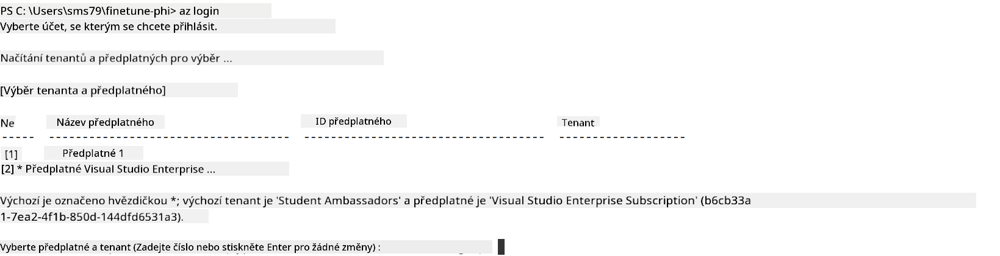

> [!TIP]
>
> Pokud máte potíže s přihlášením do Azure, zkuste použít kód zařízení. Otevřete terminál a zadejte následující příkaz pro přihlášení do Azure účtu:
>
> ```console
> az login --use-device-code
> ```
>

### Doladění modelu Phi-3

V tomto cvičení doladíte model Phi-3 pomocí poskytnuté datové sady. Nejprve definujete proces doladění v souboru *fine_tune.py*. Poté nakonfigurujete prostředí Azure Machine Learning a spustíte proces doladění pomocí souboru *setup_ml.py*. Tento skript zajistí, že doladění proběhne v prostředí Azure Machine Learning.

Spuštěním *setup_ml.py* spustíte proces doladění v prostředí Azure Machine Learning.

#### Přidejte kód do souboru *fine_tune.py*

1. Přejděte do složky *finetuning_dir* a otevřete soubor *fine_tune.py* ve Visual Studio Code.

1. Přidejte do souboru *fine_tune.py* následující kód.

    ```python
    import argparse
    import sys
    import logging
    import os
    from datasets import load_dataset
    import torch
    import mlflow
    from transformers import AutoModelForCausalLM, AutoTokenizer, TrainingArguments
    from trl import SFTTrainer

    # To avoid the INVALID_PARAMETER_VALUE error in MLflow, disable MLflow integration
    os.environ["DISABLE_MLFLOW_INTEGRATION"] = "True"

    # Logging setup
    logging.basicConfig(
        format="%(asctime)s - %(levelname)s - %(name)s - %(message)s",
        datefmt="%Y-%m-%d %H:%M:%S",
        handlers=[logging.StreamHandler(sys.stdout)],
        level=logging.WARNING
    )
    logger = logging.getLogger(__name__)

    def initialize_model_and_tokenizer(model_name, model_kwargs):
        """
        Initialize the model and tokenizer with the given pretrained model name and arguments.
        """
        model = AutoModelForCausalLM.from_pretrained(model_name, **model_kwargs)
        tokenizer = AutoTokenizer.from_pretrained(model_name)
        tokenizer.model_max_length = 2048
        tokenizer.pad_token = tokenizer.unk_token
        tokenizer.pad_token_id = tokenizer.convert_tokens_to_ids(tokenizer.pad_token)
        tokenizer.padding_side = 'right'
        return model, tokenizer

    def apply_chat_template(example, tokenizer):
        """
        Apply a chat template to tokenize messages in the example.
        """
        messages = example["messages"]
        if messages[0]["role"] != "system":
            messages.insert(0, {"role": "system", "content": ""})
        example["text"] = tokenizer.apply_chat_template(
            messages, tokenize=False, add_generation_prompt=False
        )
        return example

    def load_and_preprocess_data(train_filepath, test_filepath, tokenizer):
        """
        Load and preprocess the dataset.
        """
        train_dataset = load_dataset('json', data_files=train_filepath, split='train')
        test_dataset = load_dataset('json', data_files=test_filepath, split='train')
        column_names = list(train_dataset.features)

        train_dataset = train_dataset.map(
            apply_chat_template,
            fn_kwargs={"tokenizer": tokenizer},
            num_proc=10,
            remove_columns=column_names,
            desc="Applying chat template to train dataset",
        )

        test_dataset = test_dataset.map(
            apply_chat_template,
            fn_kwargs={"tokenizer": tokenizer},
            num_proc=10,
            remove_columns=column_names,
            desc="Applying chat template to test dataset",
        )

        return train_dataset, test_dataset

    def train_and_evaluate_model(train_dataset, test_dataset, model, tokenizer, output_dir):
        """
        Train and evaluate the model.
        """
        training_args = TrainingArguments(
            bf16=True,
            do_eval=True,
            output_dir=output_dir,
            eval_strategy="epoch",
            learning_rate=5.0e-06,
            logging_steps=20,
            lr_scheduler_type="cosine",
            num_train_epochs=3,
            overwrite_output_dir=True,
            per_device_eval_batch_size=4,
            per_device_train_batch_size=4,
            remove_unused_columns=True,
            save_steps=500,
            seed=0,
            gradient_checkpointing=True,
            gradient_accumulation_steps=1,
            warmup_ratio=0.2,
        )

        trainer = SFTTrainer(
            model=model,
            args=training_args,
            train_dataset=train_dataset,
            eval_dataset=test_dataset,
            max_seq_length=2048,
            dataset_text_field="text",
            tokenizer=tokenizer,
            packing=True
        )

        train_result = trainer.train()
        trainer.log_metrics("train", train_result.metrics)

        mlflow.transformers.log_model(
            transformers_model={"model": trainer.model, "tokenizer": tokenizer},
            artifact_path=output_dir,
        )

        tokenizer.padding_side = 'left'
        eval_metrics = trainer.evaluate()
        eval_metrics["eval_samples"] = len(test_dataset)
        trainer.log_metrics("eval", eval_metrics)

    def main(train_file, eval_file, model_output_dir):
        """
        Main function to fine-tune the model.
        """
        model_kwargs = {
            "use_cache": False,
            "trust_remote_code": True,
            "torch_dtype": torch.bfloat16,
            "device_map": None,
            "attn_implementation": "eager"
        }

        # pretrained_model_name = "microsoft/Phi-3-mini-4k-instruct"
        pretrained_model_name = "microsoft/Phi-3.5-mini-instruct"

        with mlflow.start_run():
            model, tokenizer = initialize_model_and_tokenizer(pretrained_model_name, model_kwargs)
            train_dataset, test_dataset = load_and_preprocess_data(train_file, eval_file, tokenizer)
            train_and_evaluate_model(train_dataset, test_dataset, model, tokenizer, model_output_dir)

    if __name__ == "__main__":
        parser = argparse.ArgumentParser()
        parser.add_argument("--train-file", type=str, required=True, help="Path to the training data")
        parser.add_argument("--eval-file", type=str, required=True, help="Path to the evaluation data")
        parser.add_argument("--model_output_dir", type=str, required=True, help="Directory to save the fine-tuned model")
        args = parser.parse_args()
        main(args.train_file, args.eval_file, args.model_output_dir)

    ```

1. Uložte a zavřete soubor *fine_tune.py*.

> [!TIP]
> **Můžete doladit model Phi-3.5**
>
> V souboru *fine_tune.py* můžete změnit `pretrained_model_name` z `"microsoft/Phi-3-mini-4k-instruct"` na jakýkoli model, který chcete doladit. Například pokud jej změníte na `"microsoft/Phi-3.5-mini-instruct"`, použijete model Phi-3.5-mini-instruct pro doladění. Pro nalezení a použití preferovaného názvu modelu navštivte [Hugging Face](https://huggingface.co/), vyhledejte požadovaný model a zkopírujte jeho název do pole `pretrained_model_name` ve vašem skriptu.
>
> :::image type="content" source="../../imgs/03/FineTuning-PromptFlow/finetunephi3.5.png" alt-text="Doladění Phi-3.5.":::
>

#### Přidejte kód do souboru *setup_ml.py*

1. Otevřete soubor *setup_ml.py* ve Visual Studio Code.

1. Přidejte do souboru *setup_ml.py* následující kód.

    ```python
    import logging
    from azure.ai.ml import MLClient, command, Input
    from azure.ai.ml.entities import Environment, AmlCompute
    from azure.identity import AzureCliCredential
    from config import (
        AZURE_SUBSCRIPTION_ID,
        AZURE_RESOURCE_GROUP_NAME,
        AZURE_ML_WORKSPACE_NAME,
        TRAIN_DATA_PATH,
        TEST_DATA_PATH
    )

    # Constants

    # Uncomment the following lines to use a CPU instance for training
    # COMPUTE_INSTANCE_TYPE = "Standard_E16s_v3" # cpu
    # COMPUTE_NAME = "cpu-e16s-v3"
    # DOCKER_IMAGE_NAME = "mcr.microsoft.com/azureml/openmpi4.1.0-ubuntu20.04:latest"

    # Uncomment the following lines to use a GPU instance for training
    COMPUTE_INSTANCE_TYPE = "Standard_NC24ads_A100_v4"
    COMPUTE_NAME = "gpu-nc24s-a100-v4"
    DOCKER_IMAGE_NAME = "mcr.microsoft.com/azureml/curated/acft-hf-nlp-gpu:59"

    CONDA_FILE = "conda.yml"
    LOCATION = "eastus2" # Replace with the location of your compute cluster
    FINETUNING_DIR = "./finetuning_dir" # Path to the fine-tuning script
    TRAINING_ENV_NAME = "phi-3-training-environment" # Name of the training environment
    MODEL_OUTPUT_DIR = "./model_output" # Path to the model output directory in azure ml

    # Logging setup to track the process
    logger = logging.getLogger(__name__)
    logging.basicConfig(
        format="%(asctime)s - %(levelname)s - %(name)s - %(message)s",
        datefmt="%Y-%m-%d %H:%M:%S",
        level=logging.WARNING
    )

    def get_ml_client():
        """
        Initialize the ML Client using Azure CLI credentials.
        """
        credential = AzureCliCredential()
        return MLClient(credential, AZURE_SUBSCRIPTION_ID, AZURE_RESOURCE_GROUP_NAME, AZURE_ML_WORKSPACE_NAME)

    def create_or_get_environment(ml_client):
        """
        Create or update the training environment in Azure ML.
        """
        env = Environment(
            image=DOCKER_IMAGE_NAME,  # Docker image for the environment
            conda_file=CONDA_FILE,  # Conda environment file
            name=TRAINING_ENV_NAME,  # Name of the environment
        )
        return ml_client.environments.create_or_update(env)

    def create_or_get_compute_cluster(ml_client, compute_name, COMPUTE_INSTANCE_TYPE, location):
        """
        Create or update the compute cluster in Azure ML.
        """
        try:
            compute_cluster = ml_client.compute.get(compute_name)
            logger.info(f"Compute cluster '{compute_name}' already exists. Reusing it for the current run.")
        except Exception:
            logger.info(f"Compute cluster '{compute_name}' does not exist. Creating a new one with size {COMPUTE_INSTANCE_TYPE}.")
            compute_cluster = AmlCompute(
                name=compute_name,
                size=COMPUTE_INSTANCE_TYPE,
                location=location,
                tier="Dedicated",  # Tier of the compute cluster
                min_instances=0,  # Minimum number of instances
                max_instances=1  # Maximum number of instances
            )
            ml_client.compute.begin_create_or_update(compute_cluster).wait()  # Wait for the cluster to be created
        return compute_cluster

    def create_fine_tuning_job(env, compute_name):
        """
        Set up the fine-tuning job in Azure ML.
        """
        return command(
            code=FINETUNING_DIR,  # Path to fine_tune.py
            command=(
                "python fine_tune.py "
                "--train-file ${{inputs.train_file}} "
                "--eval-file ${{inputs.eval_file}} "
                "--model_output_dir ${{inputs.model_output}}"
            ),
            environment=env,  # Training environment
            compute=compute_name,  # Compute cluster to use
            inputs={
                "train_file": Input(type="uri_file", path=TRAIN_DATA_PATH),  # Path to the training data file
                "eval_file": Input(type="uri_file", path=TEST_DATA_PATH),  # Path to the evaluation data file
                "model_output": MODEL_OUTPUT_DIR
            }
        )

    def main():
        """
        Main function to set up and run the fine-tuning job in Azure ML.
        """
        # Initialize ML Client
        ml_client = get_ml_client()

        # Create Environment
        env = create_or_get_environment(ml_client)
        
        # Create or get existing compute cluster
        create_or_get_compute_cluster(ml_client, COMPUTE_NAME, COMPUTE_INSTANCE_TYPE, LOCATION)

        # Create and Submit Fine-Tuning Job
        job = create_fine_tuning_job(env, COMPUTE_NAME)
        returned_job = ml_client.jobs.create_or_update(job)  # Submit the job
        ml_client.jobs.stream(returned_job.name)  # Stream the job logs
        
        # Capture the job name
        job_name = returned_job.name
        print(f"Job name: {job_name}")

    if __name__ == "__main__":
        main()

    ```

1. Nahraďte `COMPUTE_INSTANCE_TYPE`, `COMPUTE_NAME` a `LOCATION` vašimi konkrétními údaji.

    ```python
   # Uncomment the following lines to use a GPU instance for training
    COMPUTE_INSTANCE_TYPE = "Standard_NC24ads_A100_v4"
    COMPUTE_NAME = "gpu-nc24s-a100-v4"
    ...
    LOCATION = "eastus2" # Replace with the location of your compute cluster
    ```

> [!TIP]
>
> **Pokyny pro doladění s minimální datovou sadou pomocí CPU**
>
> Pokud chcete použít CPU pro doladění, tento přístup je ideální pro uživatele s benefitními předplatnými (například Visual Studio Enterprise Subscription) nebo pro rychlé otestování procesu doladění a nasazení.
>
> 1. Otevřete soubor *setup_ml*.
> 1. Nahraďte `COMPUTE_INSTANCE_TYPE`, `COMPUTE_NAME` a `DOCKER_IMAGE_NAME` následujícím. Pokud nemáte přístup k *Standard_E16s_v3*, můžete použít ekvivalentní CPU instanci nebo požádat o nový kvótu.
> 1. Nahraďte `LOCATION` vašimi konkrétními údaji.
>
>    ```python
>    # Uncomment the following lines to use a CPU instance for training
>    COMPUTE_INSTANCE_TYPE = "Standard_E16s_v3" # cpu
>    COMPUTE_NAME = "cpu-e16s-v3"
>    DOCKER_IMAGE_NAME = "mcr.microsoft.com/azureml/openmpi4.1.0-ubuntu20.04:latest"
>    LOCATION = "eastus2" # Replace with the location of your compute cluster
>    ```
>

1. Zadejte následující příkaz pro spuštění skriptu *setup_ml.py* a zahájení procesu doladění v Azure Machine Learning.

    ```python
    python setup_ml.py
    ```

1. V tomto cvičení jste úspěšně doladili model Phi-3 pomocí Azure Machine Learning. Spuštěním skriptu *setup_ml.py* jste nastavili prostředí Azure Machine Learning a zahájili proces doladění definovaný v souboru *fine_tune.py*. Upozorňujeme, že proces doladění může trvat delší dobu. Po spuštění příkazu `python setup_ml.py` je třeba počkat na dokončení procesu. Stav doladění můžete sledovat pomocí odkazu zobrazeného v terminálu, který vede do portálu Azure Machine Learning.

    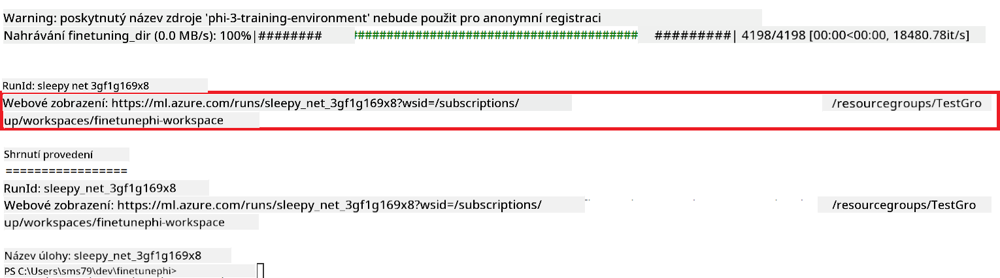

### Nasazení doladěného modelu

Pro integraci doladěného modelu Phi-3 s Prompt Flow je potřeba model nasadit, aby byl dostupný pro inferenci v reálném čase. Tento proces zahrnuje registraci modelu, vytvoření online endpointu a nasazení modelu.

#### Nastavte název modelu, název endpointu a název nasazení

1. Otevřete soubor *config.py*.

1. Nahraďte `AZURE_MODEL_NAME = "your_fine_tuned_model_name"` požadovaným názvem vašeho modelu.

1. Nahraďte `AZURE_ENDPOINT_NAME = "your_fine_tuned_model_endpoint_name"` požadovaným názvem vašeho endpointu.

1. Nahraďte `AZURE_DEPLOYMENT_NAME = "your_fine_tuned_model_deployment_name"` požadovaným názvem vašeho nasazení.

#### Přidejte kód do souboru *deploy_model.py*

Spuštěním souboru *deploy_model.py* automatizujete celý proces nasazení. Skript zaregistruje model, vytvoří endpoint a provede nasazení na základě nastavení uvedených v souboru *config.py*, který obsahuje název modelu, název endpointu a název nasazení.

1. Otevřete soubor *deploy_model.py* ve Visual Studio Code.

1. Přidejte do souboru *deploy_model.py* následující kód.

    ```python
    import logging
    from azure.identity import AzureCliCredential
    from azure.ai.ml import MLClient
    from azure.ai.ml.entities import Model, ProbeSettings, ManagedOnlineEndpoint, ManagedOnlineDeployment, IdentityConfiguration, ManagedIdentityConfiguration, OnlineRequestSettings
    from azure.ai.ml.constants import AssetTypes

    # Configuration imports
    from config import (
        AZURE_SUBSCRIPTION_ID,
        AZURE_RESOURCE_GROUP_NAME,
        AZURE_ML_WORKSPACE_NAME,
        AZURE_MANAGED_IDENTITY_RESOURCE_ID,
        AZURE_MANAGED_IDENTITY_CLIENT_ID,
        AZURE_MODEL_NAME,
        AZURE_ENDPOINT_NAME,
        AZURE_DEPLOYMENT_NAME
    )

    # Constants
    JOB_NAME = "your-job-name"
    COMPUTE_INSTANCE_TYPE = "Standard_E4s_v3"

    deployment_env_vars = {
        "SUBSCRIPTION_ID": AZURE_SUBSCRIPTION_ID,
        "RESOURCE_GROUP_NAME": AZURE_RESOURCE_GROUP_NAME,
        "UAI_CLIENT_ID": AZURE_MANAGED_IDENTITY_CLIENT_ID,
    }

    # Logging setup
    logging.basicConfig(
        format="%(asctime)s - %(levelname)s - %(name)s - %(message)s",
        datefmt="%Y-%m-%d %H:%M:%S",
        level=logging.DEBUG
    )
    logger = logging.getLogger(__name__)

    def get_ml_client():
        """Initialize and return the ML Client."""
        credential = AzureCliCredential()
        return MLClient(credential, AZURE_SUBSCRIPTION_ID, AZURE_RESOURCE_GROUP_NAME, AZURE_ML_WORKSPACE_NAME)

    def register_model(ml_client, model_name, job_name):
        """Register a new model."""
        model_path = f"azureml://jobs/{job_name}/outputs/artifacts/paths/model_output"
        logger.info(f"Registering model {model_name} from job {job_name} at path {model_path}.")
        run_model = Model(
            path=model_path,
            name=model_name,
            description="Model created from run.",
            type=AssetTypes.MLFLOW_MODEL,
        )
        model = ml_client.models.create_or_update(run_model)
        logger.info(f"Registered model ID: {model.id}")
        return model

    def delete_existing_endpoint(ml_client, endpoint_name):
        """Delete existing endpoint if it exists."""
        try:
            endpoint_result = ml_client.online_endpoints.get(name=endpoint_name)
            logger.info(f"Deleting existing endpoint {endpoint_name}.")
            ml_client.online_endpoints.begin_delete(name=endpoint_name).result()
            logger.info(f"Deleted existing endpoint {endpoint_name}.")
        except Exception as e:
            logger.info(f"No existing endpoint {endpoint_name} found to delete: {e}")

    def create_or_update_endpoint(ml_client, endpoint_name, description=""):
        """Create or update an endpoint."""
        delete_existing_endpoint(ml_client, endpoint_name)
        logger.info(f"Creating new endpoint {endpoint_name}.")
        endpoint = ManagedOnlineEndpoint(
            name=endpoint_name,
            description=description,
            identity=IdentityConfiguration(
                type="user_assigned",
                user_assigned_identities=[ManagedIdentityConfiguration(resource_id=AZURE_MANAGED_IDENTITY_RESOURCE_ID)]
            )
        )
        endpoint_result = ml_client.online_endpoints.begin_create_or_update(endpoint).result()
        logger.info(f"Created new endpoint {endpoint_name}.")
        return endpoint_result

    def create_or_update_deployment(ml_client, endpoint_name, deployment_name, model):
        """Create or update a deployment."""

        logger.info(f"Creating deployment {deployment_name} for endpoint {endpoint_name}.")
        deployment = ManagedOnlineDeployment(
            name=deployment_name,
            endpoint_name=endpoint_name,
            model=model.id,
            instance_type=COMPUTE_INSTANCE_TYPE,
            instance_count=1,
            environment_variables=deployment_env_vars,
            request_settings=OnlineRequestSettings(
                max_concurrent_requests_per_instance=3,
                request_timeout_ms=180000,
                max_queue_wait_ms=120000
            ),
            liveness_probe=ProbeSettings(
                failure_threshold=30,
                success_threshold=1,
                period=100,
                initial_delay=500,
            ),
            readiness_probe=ProbeSettings(
                failure_threshold=30,
                success_threshold=1,
                period=100,
                initial_delay=500,
            ),
        )
        deployment_result = ml_client.online_deployments.begin_create_or_update(deployment).result()
        logger.info(f"Created deployment {deployment.name} for endpoint {endpoint_name}.")
        return deployment_result

    def set_traffic_to_deployment(ml_client, endpoint_name, deployment_name):
        """Set traffic to the specified deployment."""
        try:
            # Fetch the current endpoint details
            endpoint = ml_client.online_endpoints.get(name=endpoint_name)
            
            # Log the current traffic allocation for debugging
            logger.info(f"Current traffic allocation: {endpoint.traffic}")
            
            # Set the traffic allocation for the deployment
            endpoint.traffic = {deployment_name: 100}
            
            # Update the endpoint with the new traffic allocation
            endpoint_poller = ml_client.online_endpoints.begin_create_or_update(endpoint)
            updated_endpoint = endpoint_poller.result()
            
            # Log the updated traffic allocation for debugging
            logger.info(f"Updated traffic allocation: {updated_endpoint.traffic}")
            logger.info(f"Set traffic to deployment {deployment_name} at endpoint {endpoint_name}.")
            return updated_endpoint
        except Exception as e:
            # Log any errors that occur during the process
            logger.error(f"Failed to set traffic to deployment: {e}")
            raise


    def main():
        ml_client = get_ml_client()

        registered_model = register_model(ml_client, AZURE_MODEL_NAME, JOB_NAME)
        logger.info(f"Registered model ID: {registered_model.id}")

        endpoint = create_or_update_endpoint(ml_client, AZURE_ENDPOINT_NAME, "Endpoint for finetuned Phi-3 model")
        logger.info(f"Endpoint {AZURE_ENDPOINT_NAME} is ready.")

        try:
            deployment = create_or_update_deployment(ml_client, AZURE_ENDPOINT_NAME, AZURE_DEPLOYMENT_NAME, registered_model)
            logger.info(f"Deployment {AZURE_DEPLOYMENT_NAME} is created for endpoint {AZURE_ENDPOINT_NAME}.")

            set_traffic_to_deployment(ml_client, AZURE_ENDPOINT_NAME, AZURE_DEPLOYMENT_NAME)
            logger.info(f"Traffic is set to deployment {AZURE_DEPLOYMENT_NAME} at endpoint {AZURE_ENDPOINT_NAME}.")
        except Exception as e:
            logger.error(f"Failed to create or update deployment: {e}")

    if __name__ == "__main__":
        main()

    ```

1. Pro získání `JOB_NAME` proveďte následující kroky:

    - Přejděte k Azure Machine Learning zdroji, který jste vytvořili.
    - Vyberte **Studio web URL** pro otevření Azure Machine Learning workspace.
    - V levém panelu vyberte **Jobs**.
    - Vyberte experiment pro doladění, například *finetunephi*.
    - Vyberte vytvořenou úlohu.
- Zkopírujte a vložte název své práce do `JOB_NAME = "your-job-name"` v souboru *deploy_model.py*.

1. Nahraďte `COMPUTE_INSTANCE_TYPE` svými konkrétními údaji.

1. Zadejte následující příkaz pro spuštění skriptu *deploy_model.py* a zahájení procesu nasazení v Azure Machine Learning.

    ```python
    python deploy_model.py
    ```


> [!WARNING]
> Abyste předešli dalším poplatkům na vašem účtu, nezapomeňte smazat vytvořený endpoint v Azure Machine Learning workspace.
>

#### Zkontrolujte stav nasazení v Azure Machine Learning Workspace

1. Navštivte [Azure ML Studio](https://ml.azure.com/home?wt.mc_id=studentamb_279723).

1. Přejděte do Azure Machine Learning workspace, který jste vytvořili.

1. Vyberte **Studio web URL** pro otevření Azure Machine Learning workspace.

1. Z levého panelu vyberte **Endpoints**.

    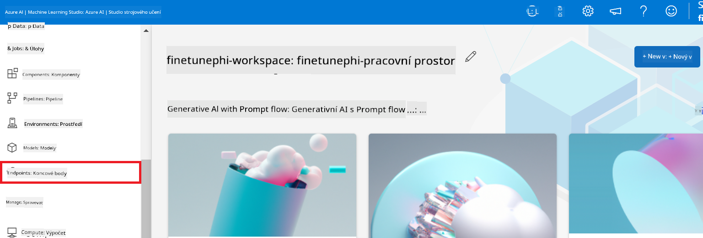

2. Vyberte endpoint, který jste vytvořili.

    

3. Na této stránce můžete spravovat endpointy vytvořené během procesu nasazení.

## Scénář 3: Integrace s Prompt flow a chatování s vlastním modelem

### Integrace vlastního modelu Phi-3 s Prompt flow

Po úspěšném nasazení vašeho doladěného modelu ho nyní můžete integrovat s Prompt flow a využívat ho v reálných aplikacích, což umožní různé interaktivní úkoly s vaším vlastním modelem Phi-3.

#### Nastavení api klíče a endpoint URI doladěného modelu Phi-3

1. Přejděte do Azure Machine Learning workspace, který jste vytvořili.
1. Z levého panelu vyberte **Endpoints**.
1. Vyberte endpoint, který jste vytvořili.
1. V navigačním menu vyberte **Consume**.
1. Zkopírujte a vložte svůj **REST endpoint** do souboru *config.py*, nahraďte `AZURE_ML_ENDPOINT = "your_fine_tuned_model_endpoint_uri"` vaším **REST endpointem**.
1. Zkopírujte a vložte svůj **Primary key** do souboru *config.py*, nahraďte `AZURE_ML_API_KEY = "your_fine_tuned_model_api_key"` vaším **Primary key**.

    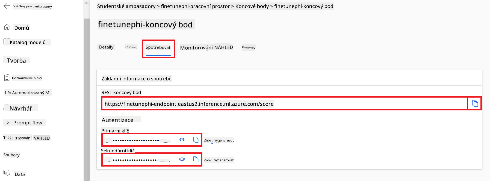

#### Přidejte kód do souboru *flow.dag.yml*

1. Otevřete soubor *flow.dag.yml* ve Visual Studio Code.

1. Přidejte následující kód do *flow.dag.yml*.

    ```yml
    inputs:
      input_data:
        type: string
        default: "Who founded Microsoft?"

    outputs:
      answer:
        type: string
        reference: ${integrate_with_promptflow.output}

    nodes:
    - name: integrate_with_promptflow
      type: python
      source:
        type: code
        path: integrate_with_promptflow.py
      inputs:
        input_data: ${inputs.input_data}
    ```

#### Přidejte kód do souboru *integrate_with_promptflow.py*

1. Otevřete soubor *integrate_with_promptflow.py* ve Visual Studio Code.

1. Přidejte následující kód do *integrate_with_promptflow.py*.

    ```python
    import logging
    import requests
    from promptflow.core import tool
    import asyncio
    import platform
    from config import (
        AZURE_ML_ENDPOINT,
        AZURE_ML_API_KEY
    )

    # Logging setup
    logging.basicConfig(
        format="%(asctime)s - %(levelname)s - %(name)s - %(message)s",
        datefmt="%Y-%m-%d %H:%M:%S",
        level=logging.DEBUG
    )
    logger = logging.getLogger(__name__)

    def query_azml_endpoint(input_data: list, endpoint_url: str, api_key: str) -> str:
        """
        Send a request to the Azure ML endpoint with the given input data.
        """
        headers = {
            "Content-Type": "application/json",
            "Authorization": f"Bearer {api_key}"
        }
        data = {
            "input_data": [input_data],
            "params": {
                "temperature": 0.7,
                "max_new_tokens": 128,
                "do_sample": True,
                "return_full_text": True
            }
        }
        try:
            response = requests.post(endpoint_url, json=data, headers=headers)
            response.raise_for_status()
            result = response.json()[0]
            logger.info("Successfully received response from Azure ML Endpoint.")
            return result
        except requests.exceptions.RequestException as e:
            logger.error(f"Error querying Azure ML Endpoint: {e}")
            raise

    def setup_asyncio_policy():
        """
        Setup asyncio event loop policy for Windows.
        """
        if platform.system() == 'Windows':
            asyncio.set_event_loop_policy(asyncio.WindowsSelectorEventLoopPolicy())
            logger.info("Set Windows asyncio event loop policy.")

    @tool
    def my_python_tool(input_data: str) -> str:
        """
        Tool function to process input data and query the Azure ML endpoint.
        """
        setup_asyncio_policy()
        return query_azml_endpoint(input_data, AZURE_ML_ENDPOINT, AZURE_ML_API_KEY)

    ```

### Chatování s vlastním modelem

1. Zadejte následující příkaz pro spuštění skriptu *deploy_model.py* a zahájení procesu nasazení v Azure Machine Learning.

    ```python
    pf flow serve --source ./ --port 8080 --host localhost
    ```

1. Zde je příklad výsledků: nyní můžete chatovat se svým vlastním modelem Phi-3. Doporučuje se klást otázky založené na datech použitých pro doladění.

    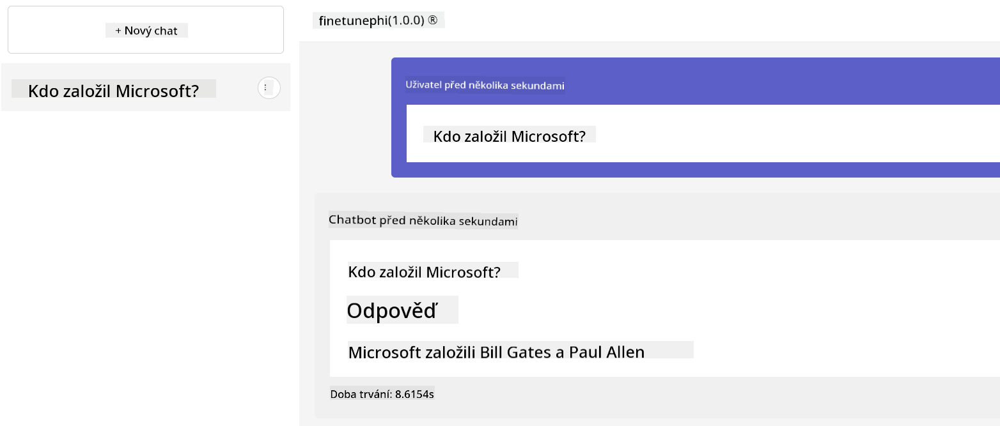

**Prohlášení o vyloučení odpovědnosti**:  
Tento dokument byl přeložen pomocí AI překladatelské služby [Co-op Translator](https://github.com/Azure/co-op-translator). I když usilujeme o přesnost, mějte prosím na paměti, že automatizované překlady mohou obsahovat chyby nebo nepřesnosti. Původní dokument v jeho mateřském jazyce by měl být považován za závazný zdroj. Pro důležité informace se doporučuje profesionální lidský překlad. Nejsme odpovědní za jakékoliv nedorozumění nebo nesprávné výklady vyplývající z použití tohoto překladu.