<!--
CO_OP_TRANSLATOR_METADATA:
{
  "original_hash": "ecbd9179a21edbaafaf114d47f09f3e3",
  "translation_date": "2025-07-17T01:53:26+00:00",
  "source_file": "md/02.Application/01.TextAndChat/Phi3/E2E_Phi-3-FineTuning_PromptFlow_Integration_AIFoundry.md",
  "language_code": "cs"
}
-->
# Doladění a integrace vlastních modelů Phi-3 s Prompt flow v Azure AI Foundry

Tento end-to-end (E2E) příklad je založen na průvodci "[Fine-Tune and Integrate Custom Phi-3 Models with Prompt Flow in Azure AI Foundry](https://techcommunity.microsoft.com/t5/educator-developer-blog/fine-tune-and-integrate-custom-phi-3-models-with-prompt-flow-in/ba-p/4191726?WT.mc_id=aiml-137032-kinfeylo)" z Microsoft Tech Community. Představuje procesy doladění, nasazení a integrace vlastních modelů Phi-3 s Prompt flow v Azure AI Foundry. Na rozdíl od E2E příkladu "[Fine-Tune and Integrate Custom Phi-3 Models with Prompt Flow](./E2E_Phi-3-FineTuning_PromptFlow_Integration.md)", který zahrnoval spuštění kódu lokálně, se tento tutoriál zaměřuje výhradně na doladění a integraci vašeho modelu přímo v Azure AI / ML Studiu.

## Přehled

V tomto E2E příkladu se naučíte, jak doladit model Phi-3 a integrovat ho s Prompt flow v Azure AI Foundry. Využitím Azure AI / ML Studia vytvoříte pracovní postup pro nasazení a využití vlastních AI modelů. Tento E2E příklad je rozdělen do tří scénářů:

**Scénář 1: Nastavení Azure zdrojů a příprava na doladění**

**Scénář 2: Doladění modelu Phi-3 a nasazení v Azure Machine Learning Studiu**

**Scénář 3: Integrace s Prompt flow a chatování s vlastním modelem v Azure AI Foundry**

Zde je přehled tohoto E2E příkladu.

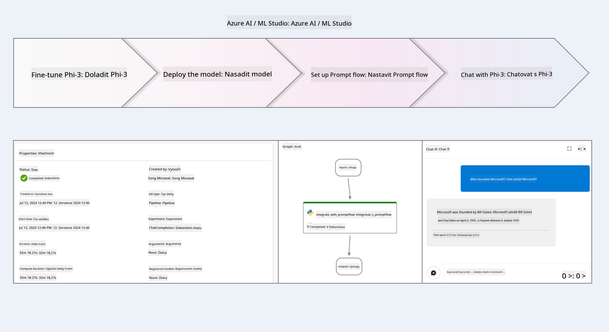

### Obsah

1. **[Scénář 1: Nastavení Azure zdrojů a příprava na doladění](../../../../../../md/02.Application/01.TextAndChat/Phi3)**
    - [Vytvoření Azure Machine Learning Workspace](../../../../../../md/02.Application/01.TextAndChat/Phi3)
    - [Žádost o kvóty GPU v Azure Subscription](../../../../../../md/02.Application/01.TextAndChat/Phi3)
    - [Přidání role assignment](../../../../../../md/02.Application/01.TextAndChat/Phi3)
    - [Nastavení projektu](../../../../../../md/02.Application/01.TextAndChat/Phi3)
    - [Příprava datasetu pro doladění](../../../../../../md/02.Application/01.TextAndChat/Phi3)

1. **[Scénář 2: Doladění modelu Phi-3 a nasazení v Azure Machine Learning Studiu](../../../../../../md/02.Application/01.TextAndChat/Phi3)**
    - [Doladění modelu Phi-3](../../../../../../md/02.Application/01.TextAndChat/Phi3)
    - [Nasazení doladěného modelu Phi-3](../../../../../../md/02.Application/01.TextAndChat/Phi3)

1. **[Scénář 3: Integrace s Prompt flow a chatování s vlastním modelem v Azure AI Foundry](../../../../../../md/02.Application/01.TextAndChat/Phi3)**
    - [Integrace vlastního modelu Phi-3 s Prompt flow](../../../../../../md/02.Application/01.TextAndChat/Phi3)
    - [Chatování s vlastním modelem Phi-3](../../../../../../md/02.Application/01.TextAndChat/Phi3)

## Scénář 1: Nastavení Azure zdrojů a příprava na doladění

### Vytvoření Azure Machine Learning Workspace

1. Do **vyhledávacího pole** v horní části portálu napište *azure machine learning* a z nabízených možností vyberte **Azure Machine Learning**.

    

2. V navigačním menu vyberte **+ Create**.

3. V navigačním menu vyberte **New workspace**.

    

4. Proveďte následující kroky:

    - Vyberte svou Azure **Subscription**.
    - Vyberte **Resource group**, kterou chcete použít (v případě potřeby vytvořte novou).
    - Zadejte **Workspace Name**. Musí být jedinečný.
    - Vyberte **Region**, který chcete použít.
    - Vyberte **Storage account**, který chcete použít (v případě potřeby vytvořte nový).
    - Vyberte **Key vault**, který chcete použít (v případě potřeby vytvořte nový).
    - Vyberte **Application insights**, který chcete použít (v případě potřeby vytvořte nový).
    - Vyberte **Container registry**, který chcete použít (v případě potřeby vytvořte nový).

    

5. Vyberte **Review + Create**.

6. Vyberte **Create**.

### Žádost o kvóty GPU v Azure Subscription

V tomto tutoriálu se naučíte, jak doladit a nasadit model Phi-3 s využitím GPU. Pro doladění použijete GPU *Standard_NC24ads_A100_v4*, který vyžaduje žádost o kvótu. Pro nasazení použijete GPU *Standard_NC6s_v3*, který rovněž vyžaduje žádost o kvótu.

> [!NOTE]
>
> GPU jsou dostupné pouze pro předplatná typu Pay-As-You-Go (standardní typ předplatného); benefitní předplatná momentálně nejsou podporována.
>

1. Navštivte [Azure ML Studio](https://ml.azure.com/home?wt.mc_id=studentamb_279723).

1. Pro žádost o kvótu *Standard NCADSA100v4 Family* proveďte následující:

    - Vyberte **Quota** v levém panelu.
    - Vyberte **Virtual machine family**, například **Standard NCADSA100v4 Family Cluster Dedicated vCPUs**, která zahrnuje GPU *Standard_NC24ads_A100_v4*.
    - Vyberte **Request quota** v navigačním menu.

        

    - Na stránce Request quota zadejte **New cores limit**, který chcete použít, například 24.
    - Na stránce Request quota vyberte **Submit** pro odeslání žádosti o kvótu GPU.

1. Pro žádost o kvótu *Standard NCSv3 Family* proveďte následující:

    - Vyberte **Quota** v levém panelu.
    - Vyberte **Virtual machine family**, například **Standard NCSv3 Family Cluster Dedicated vCPUs**, která zahrnuje GPU *Standard_NC6s_v3*.
    - Vyberte **Request quota** v navigačním menu.
    - Na stránce Request quota zadejte **New cores limit**, například 24.
    - Na stránce Request quota vyberte **Submit** pro odeslání žádosti o kvótu GPU.

### Přidání role assignment

Pro doladění a nasazení modelů musíte nejprve vytvořit User Assigned Managed Identity (UAI) a přiřadit jí odpovídající oprávnění. Tato UAI bude použita pro autentizaci během nasazení.

#### Vytvoření User Assigned Managed Identity (UAI)

1. Do **vyhledávacího pole** v horní části portálu napište *managed identities* a z nabízených možností vyberte **Managed Identities**.

    

1. Vyberte **+ Create**.

    

1. Proveďte následující kroky:

    - Vyberte svou Azure **Subscription**.
    - Vyberte **Resource group**, kterou chcete použít (v případě potřeby vytvořte novou).
    - Vyberte **Region**, který chcete použít.
    - Zadejte **Name**. Musí být jedinečný.

    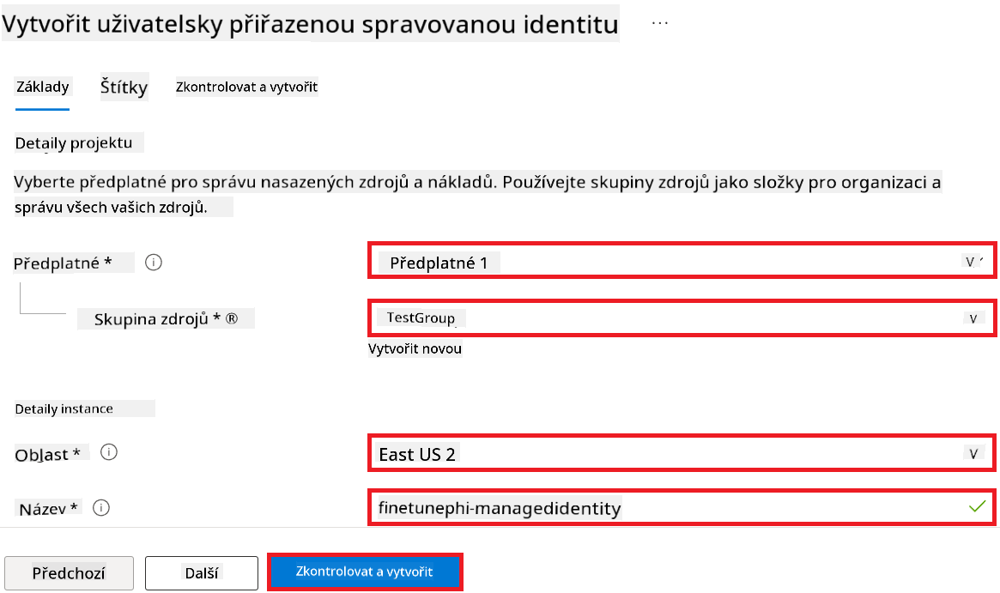

1. Vyberte **Review + create**.

1. Vyberte **+ Create**.

#### Přidání role Contributor k Managed Identity

1. Přejděte na zdroj Managed Identity, který jste vytvořili.

1. V levém panelu vyberte **Azure role assignments**.

1. V navigačním menu vyberte **+Add role assignment**.

1. Na stránce Add role assignment proveďte následující:

    - Nastavte **Scope** na **Resource group**.
    - Vyberte svou Azure **Subscription**.
    - Vyberte **Resource group**, kterou chcete použít.
    - Vyberte roli **Contributor**.

    

2. Vyberte **Save**.

#### Přidání role Storage Blob Data Reader k Managed Identity

1. Do **vyhledávacího pole** v horní části portálu napište *storage accounts* a z nabízených možností vyberte **Storage accounts**.

    

1. Vyberte storage účet, který je spojený s Azure Machine Learning workspace, který jste vytvořili. Například *finetunephistorage*.

1. Pro navigaci na stránku Add role assignment proveďte následující:

    - Přejděte do Azure Storage účtu, který jste vytvořili.
    - V levém panelu vyberte **Access Control (IAM)**.
    - V navigačním menu vyberte **+ Add**.
    - Vyberte **Add role assignment**.

    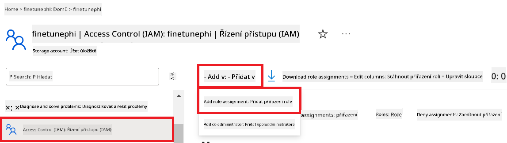

1. Na stránce Add role assignment proveďte následující:

    - Do vyhledávacího pole na stránce Role napište *Storage Blob Data Reader* a vyberte **Storage Blob Data Reader**.
    - Vyberte **Next**.
    - Na stránce Members vyberte **Assign access to** **Managed identity**.
    - Vyberte **+ Select members**.
    - Na stránce Select managed identities vyberte svou Azure **Subscription**.
    - Vyberte **Managed identity** typu **Manage Identity**.
    - Vyberte Managed Identity, kterou jste vytvořili, například *finetunephi-managedidentity*.
    - Vyberte **Select**.

    

1. Vyberte **Review + assign**.

#### Přidání role AcrPull k Managed Identity

1. Do **vyhledávacího pole** v horní části portálu napište *container registries* a z nabízených možností vyberte **Container registries**.

    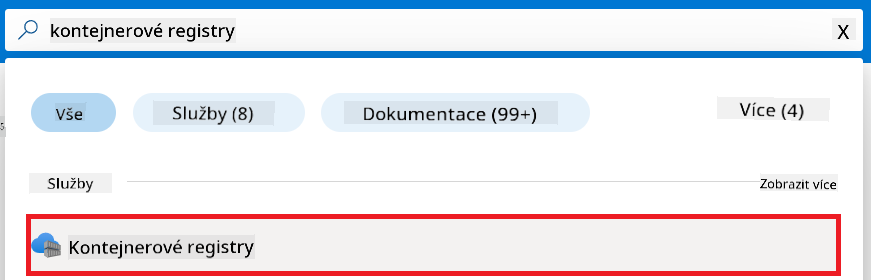

1. Vyberte container registry spojený s Azure Machine Learning workspace, například *finetunephicontainerregistry*.

1. Pro navigaci na stránku Add role assignment proveďte následující:

    - Vyberte **Access Control (IAM)** v levém panelu.
    - Vyberte **+ Add** v navigačním menu.
    - Vyberte **Add role assignment**.

1. Na stránce Add role assignment proveďte následující:

    - Do vyhledávacího pole na stránce Role napište *AcrPull* a vyberte **AcrPull**.
    - Vyberte **Next**.
    - Na stránce Members vyberte **Assign access to** **Managed identity**.
    - Vyberte **+ Select members**.
    - Na stránce Select managed identities vyberte svou Azure **Subscription**.
    - Vyberte **Managed identity** typu **Manage Identity**.
    - Vyberte Managed Identity, kterou jste vytvořili, například *finetunephi-managedidentity*.
    - Vyberte **Select**.
    - Vyberte **Review + assign**.

### Nastavení projektu

Pro stažení datasetů potřebných k doladění si nastavíte lokální prostředí.

V tomto cvičení:

- Vytvoříte složku, ve které budete pracovat.
- Vytvoříte virtuální prostředí.
- Nainstalujete potřebné balíčky.
- Vytvoříte soubor *download_dataset.py* pro stažení datasetu.

#### Vytvoření složky pro práci

1. Otevřete terminál a zadejte následující příkaz pro vytvoření složky s názvem *finetune-phi* v implicitní cestě.

    ```console
    mkdir finetune-phi
    ```

2. V terminálu zadejte následující příkaz pro přechod do složky *finetune-phi*, kterou jste vytvořili.
#### Vytvoření virtuálního prostředí

1. Zadejte následující příkaz do terminálu pro vytvoření virtuálního prostředí s názvem *.venv*.

    ```console
    python -m venv .venv
    ```

2. Zadejte následující příkaz do terminálu pro aktivaci virtuálního prostředí.

    ```console
    .venv\Scripts\activate.bat
    ```


> [!NOTE]
> Pokud to fungovalo, měli byste vidět *(.venv)* před příkazovým řádkem.

#### Instalace požadovaných balíčků

1. Zadejte následující příkazy do terminálu pro instalaci požadovaných balíčků.

    ```console
    pip install datasets==2.19.1
    ```

#### Vytvoření `download_dataset.py`

> [!NOTE]
> Kompletní struktura složek:
>
> ```text
> └── YourUserName
> .    └── finetune-phi
> .        └── download_dataset.py
> ```

1. Otevřete **Visual Studio Code**.

1. Vyberte **Soubor** v menu.

1. Vyberte **Otevřít složku**.

1. Vyberte složku *finetune-phi*, kterou jste vytvořili, nacházející se na *C:\Users\yourUserName\finetune-phi*.

    

1. V levém panelu Visual Studio Code klikněte pravým tlačítkem a vyberte **Nový soubor** pro vytvoření nového souboru s názvem *download_dataset.py*.

    

### Příprava datasetu pro doladění

V tomto cvičení spustíte soubor *download_dataset.py*, který stáhne dataset *ultrachat_200k* do vašeho lokálního prostředí. Tento dataset pak použijete k doladění modelu Phi-3 v Azure Machine Learning.

V tomto cvičení:

- Přidáte kód do souboru *download_dataset.py* pro stažení datasetů.
- Spustíte soubor *download_dataset.py* pro stažení datasetů do lokálního prostředí.

#### Stažení datasetu pomocí *download_dataset.py*

1. Otevřete soubor *download_dataset.py* ve Visual Studio Code.

1. Přidejte následující kód do souboru *download_dataset.py*.

    ```python
    import json
    import os
    from datasets import load_dataset

    def load_and_split_dataset(dataset_name, config_name, split_ratio):
        """
        Load and split a dataset.
        """
        # Load the dataset with the specified name, configuration, and split ratio
        dataset = load_dataset(dataset_name, config_name, split=split_ratio)
        print(f"Original dataset size: {len(dataset)}")
        
        # Split the dataset into train and test sets (80% train, 20% test)
        split_dataset = dataset.train_test_split(test_size=0.2)
        print(f"Train dataset size: {len(split_dataset['train'])}")
        print(f"Test dataset size: {len(split_dataset['test'])}")
        
        return split_dataset

    def save_dataset_to_jsonl(dataset, filepath):
        """
        Save a dataset to a JSONL file.
        """
        # Create the directory if it does not exist
        os.makedirs(os.path.dirname(filepath), exist_ok=True)
        
        # Open the file in write mode
        with open(filepath, 'w', encoding='utf-8') as f:
            # Iterate over each record in the dataset
            for record in dataset:
                # Dump the record as a JSON object and write it to the file
                json.dump(record, f)
                # Write a newline character to separate records
                f.write('\n')
        
        print(f"Dataset saved to {filepath}")

    def main():
        """
        Main function to load, split, and save the dataset.
        """
        # Load and split the ULTRACHAT_200k dataset with a specific configuration and split ratio
        dataset = load_and_split_dataset("HuggingFaceH4/ultrachat_200k", 'default', 'train_sft[:1%]')
        
        # Extract the train and test datasets from the split
        train_dataset = dataset['train']
        test_dataset = dataset['test']

        # Save the train dataset to a JSONL file
        save_dataset_to_jsonl(train_dataset, "data/train_data.jsonl")
        
        # Save the test dataset to a separate JSONL file
        save_dataset_to_jsonl(test_dataset, "data/test_data.jsonl")

    if __name__ == "__main__":
        main()

    ```

1. Zadejte následující příkaz do terminálu pro spuštění skriptu a stažení datasetu do lokálního prostředí.

    ```console
    python download_dataset.py
    ```

1. Ověřte, že dataset byl úspěšně uložen do lokální složky *finetune-phi/data*.

> [!NOTE]
>
> #### Poznámka k velikosti datasetu a času doladění
>
> V tomto tutoriálu používáte pouze 1 % datasetu (`split='train[:1%]'`). To výrazně snižuje množství dat, což urychluje jak nahrávání, tak proces doladění. Pro nalezení správné rovnováhy mezi dobou tréninku a výkonem modelu můžete procento upravit. Použití menší části datasetu zkracuje čas potřebný k doladění, což usnadňuje práci v rámci tutoriálu.

## Scénář 2: Doladění modelu Phi-3 a nasazení v Azure Machine Learning Studio

### Doladění modelu Phi-3

V tomto cvičení doladíte model Phi-3 v Azure Machine Learning Studio.

V tomto cvičení:

- Vytvoříte výpočetní cluster pro doladění.
- Doladíte model Phi-3 v Azure Machine Learning Studio.

#### Vytvoření výpočetního clusteru pro doladění

1. Navštivte [Azure ML Studio](https://ml.azure.com/home?wt.mc_id=studentamb_279723).

1. Vyberte **Compute** v levém panelu.

1. Vyberte **Compute clusters** v navigačním menu.

1. Vyberte **+ New**.

    

1. Proveďte následující kroky:

    - Vyberte **Region**, který chcete použít.
    - Vyberte **Virtual machine tier** na **Dedicated**.
    - Vyberte **Virtual machine type** na **GPU**.
    - Vyberte filtr **Virtual machine size** na **Select from all options**.
    - Vyberte **Virtual machine size** na **Standard_NC24ads_A100_v4**.

    

1. Vyberte **Next**.

1. Proveďte následující kroky:

    - Zadejte **Compute name**. Musí být jedinečný.
    - Nastavte **Minimum number of nodes** na **0**.
    - Nastavte **Maximum number of nodes** na **1**.
    - Nastavte **Idle seconds before scale down** na **120**.

    

1. Vyberte **Create**.

#### Doladění modelu Phi-3

1. Navštivte [Azure ML Studio](https://ml.azure.com/home?wt.mc_id=studentamb_279723).

1. Vyberte Azure Machine Learning workspace, který jste vytvořili.

    

1. Proveďte následující kroky:

    - Vyberte **Model catalog** v levém panelu.
    - Do **vyhledávacího pole** zadejte *phi-3-mini-4k* a vyberte **Phi-3-mini-4k-instruct** z nabídky.

    

1. Vyberte **Fine-tune** v navigačním menu.

    

1. Proveďte následující kroky:

    - Vyberte **Select task type** na **Chat completion**.
    - Vyberte **+ Select data** pro nahrání **Tréninkových dat**.
    - Vyberte typ nahrání validačních dat na **Provide different validation data**.
    - Vyberte **+ Select data** pro nahrání **Validačních dat**.

    

    > [!TIP]
    >
    > Můžete vybrat **Advanced settings** pro přizpůsobení nastavení jako **learning_rate** a **lr_scheduler_type** a optimalizovat tak proces doladění podle vašich potřeb.

1. Vyberte **Finish**.

1. V tomto cvičení jste úspěšně doladili model Phi-3 pomocí Azure Machine Learning. Upozorňujeme, že proces doladění může trvat delší dobu. Po spuštění doladění je potřeba počkat na jeho dokončení. Stav doladění můžete sledovat v záložce Jobs v levém panelu vašeho Azure Machine Learning Workspace. V další části nasadíte doladěný model a integrujete ho s Prompt flow.

    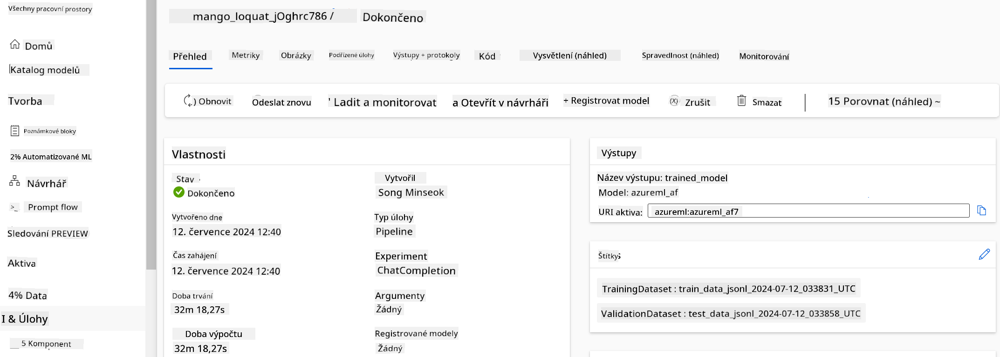

### Nasazení doladěného modelu Phi-3

Pro integraci doladěného modelu Phi-3 s Prompt flow je potřeba model nasadit, aby byl dostupný pro inferenci v reálném čase. Tento proces zahrnuje registraci modelu, vytvoření online endpointu a nasazení modelu.

V tomto cvičení:

- Zaregistrujete doladěný model v Azure Machine Learning workspace.
- Vytvoříte online endpoint.
- Nasadíte registrovaný doladěný model Phi-3.

#### Registrace doladěného modelu

1. Navštivte [Azure ML Studio](https://ml.azure.com/home?wt.mc_id=studentamb_279723).

1. Vyberte Azure Machine Learning workspace, který jste vytvořili.

    

1. Vyberte **Models** v levém panelu.
1. Vyberte **+ Register**.
1. Vyberte **From a job output**.

    

1. Vyberte úlohu, kterou jste vytvořili.

    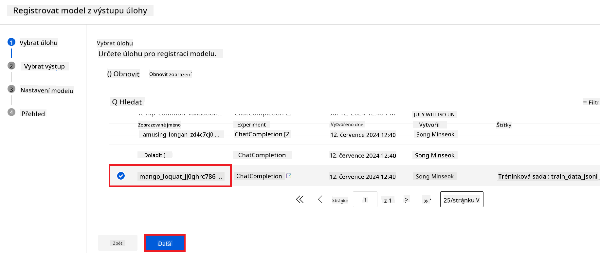

1. Vyberte **Next**.

1. Vyberte **Model type** na **MLflow**.

1. Ujistěte se, že je vybrán **Job output**; mělo by být vybráno automaticky.

    

2. Vyberte **Next**.

3. Vyberte **Register**.

    

4. Registrovaný model si můžete prohlédnout v menu **Models** v levém panelu.

    

#### Nasazení doladěného modelu

1. Přejděte do Azure Machine Learning workspace, který jste vytvořili.

1. Vyberte **Endpoints** v levém panelu.

1. Vyberte **Real-time endpoints** v navigačním menu.

    

1. Vyberte **Create**.

1. Vyberte registrovaný model, který jste vytvořili.

    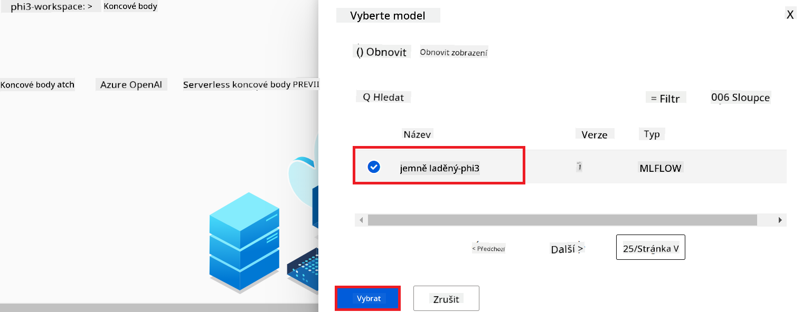

1. Vyberte **Select**.

1. Proveďte následující kroky:

    - Vyberte **Virtual machine** na *Standard_NC6s_v3*.
    - Vyberte počet instancí, které chcete použít, například *1*.
    - Vyberte **Endpoint** na **New** pro vytvoření nového endpointu.
    - Zadejte **Endpoint name**. Musí být jedinečný.
    - Zadejte **Deployment name**. Musí být jedinečný.

    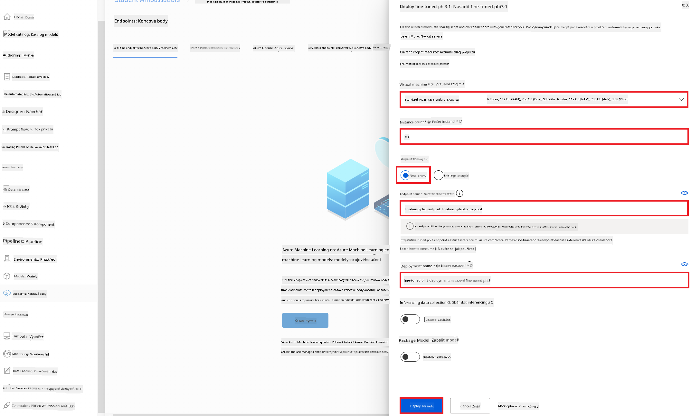

1. Vyberte **Deploy**.

> [!WARNING]
> Aby nedošlo k dalším poplatkům, nezapomeňte smazat vytvořený endpoint v Azure Machine Learning workspace.
>

#### Kontrola stavu nasazení v Azure Machine Learning Workspace

1. Přejděte do Azure Machine Learning workspace, který jste vytvořili.

1. Vyberte **Endpoints** v levém panelu.

1. Vyberte endpoint, který jste vytvořili.

    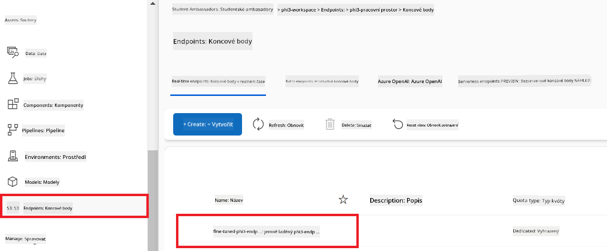

1. Na této stránce můžete spravovat endpointy během procesu nasazení.

> [!NOTE]
> Po dokončení nasazení se ujistěte, že **Live traffic** je nastaven na **100 %**. Pokud není, vyberte **Update traffic** pro úpravu nastavení provozu. Model nelze testovat, pokud je provoz nastaven na 0 %.
>
> 
>

## Scénář 3: Integrace s Prompt flow a chat s vlastním modelem v Azure AI Foundry

### Integrace vlastního modelu Phi-3 s Prompt flow

Po úspěšném nasazení doladěného modelu ho nyní můžete integrovat s Prompt Flow a používat ho v reálných aplikacích, což umožní různé interaktivní úkoly s vaším vlastním modelem Phi-3.

V tomto cvičení:

- Vytvoříte Azure AI Foundry Hub.
- Vytvoříte Azure AI Foundry projekt.
- Vytvoříte Prompt flow.
- Přidáte vlastní připojení pro doladěný model Phi-3.
- Nastavíte Prompt flow pro chat s vlastním modelem Phi-3.
> [!NOTE]
> Integraci s Promptflow můžete také provést pomocí Azure ML Studia. Stejný postup integrace platí i pro Azure ML Studio.
#### Vytvoření Azure AI Foundry Hubu

Než vytvoříte Projekt, musíte nejprve vytvořit Hub. Hub funguje jako Resource Group, která vám umožní organizovat a spravovat více Projektů v rámci Azure AI Foundry.

1. Navštivte [Azure AI Foundry](https://ai.azure.com/?WT.mc_id=aiml-137032-kinfeylo).

1. Z levého panelu vyberte **All hubs**.

1. V navigačním menu vyberte **+ New hub**.

    

1. Proveďte následující kroky:

    - Zadejte **Hub name**. Musí být jedinečný.
    - Vyberte svou Azure **Subscription**.
    - Vyberte **Resource group**, kterou chcete použít (v případě potřeby vytvořte novou).
    - Vyberte **Location**, kterou chcete použít.
    - Vyberte **Connect Azure AI Services** (v případě potřeby vytvořte nové).
    - U **Connect Azure AI Search** vyberte **Skip connecting**.

    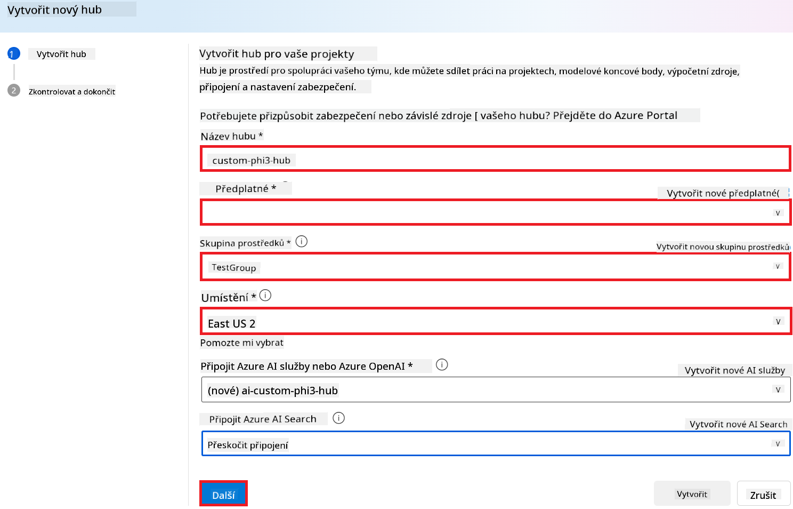

1. Klikněte na **Next**.

#### Vytvoření Azure AI Foundry Projektu

1. V Hubu, který jste vytvořili, z levého panelu vyberte **All projects**.

1. V navigačním menu vyberte **+ New project**.

    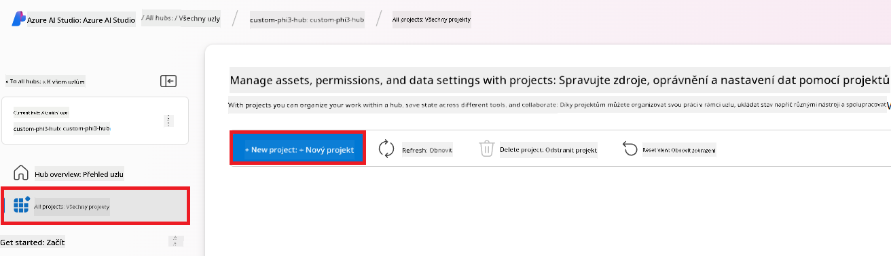

1. Zadejte **Project name**. Musí být jedinečný.

    

1. Klikněte na **Create a project**.

#### Přidání vlastního připojení pro doladěný model Phi-3

Pro integraci vašeho vlastního modelu Phi-3 s Prompt flow je potřeba uložit endpoint a klíč modelu do vlastního připojení. Toto nastavení zajistí přístup k vašemu doladěnému modelu Phi-3 v Prompt flow.

#### Nastavení api klíče a endpoint URI doladěného modelu Phi-3

1. Navštivte [Azure ML Studio](https://ml.azure.com/home?WT.mc_id=aiml-137032-kinfeylo).

1. Přejděte do Azure Machine learning workspace, který jste vytvořili.

1. Z levého panelu vyberte **Endpoints**.

    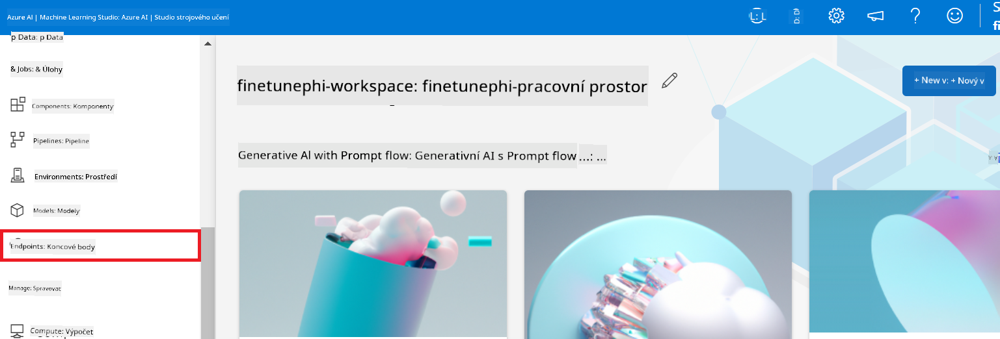

1. Vyberte endpoint, který jste vytvořili.

    

1. V navigačním menu vyberte **Consume**.

1. Zkopírujte svůj **REST endpoint** a **Primary key**.

    

#### Přidání vlastního připojení

1. Navštivte [Azure AI Foundry](https://ai.azure.com/?WT.mc_id=aiml-137032-kinfeylo).

1. Přejděte do Azure AI Foundry projektu, který jste vytvořili.

1. V projektu vyberte z levého panelu **Settings**.

1. Vyberte **+ New connection**.

    

1. V navigačním menu vyberte **Custom keys**.

    

1. Proveďte následující kroky:

    - Klikněte na **+ Add key value pairs**.
    - Do pole pro název klíče zadejte **endpoint** a vložte endpoint, který jste zkopírovali z Azure ML Studia, do pole hodnoty.
    - Znovu klikněte na **+ Add key value pairs**.
    - Do pole pro název klíče zadejte **key** a vložte klíč, který jste zkopírovali z Azure ML Studia, do pole hodnoty.
    - Po přidání klíčů zaškrtněte **is secret**, aby klíč nebyl veřejně viditelný.

    

1. Klikněte na **Add connection**.

#### Vytvoření Prompt flow

Přidali jste vlastní připojení v Azure AI Foundry. Nyní vytvoříme Prompt flow podle následujících kroků. Poté toto Prompt flow připojíte k vlastnímu připojení, abyste mohli používat doladěný model v rámci Prompt flow.

1. Přejděte do Azure AI Foundry projektu, který jste vytvořili.

1. Z levého panelu vyberte **Prompt flow**.

1. V navigačním menu vyberte **+ Create**.

    

1. V navigačním menu vyberte **Chat flow**.

    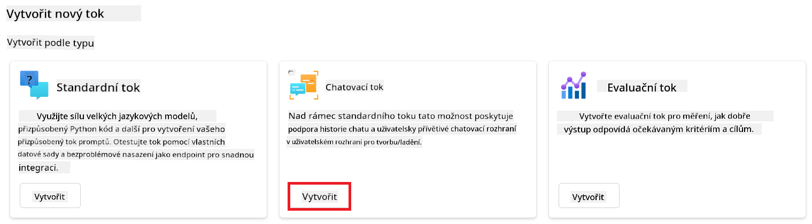

1. Zadejte **Folder name**, který chcete použít.

    

2. Klikněte na **Create**.

#### Nastavení Prompt flow pro chat s vaším vlastním modelem Phi-3

Je potřeba integrovat doladěný model Phi-3 do Prompt flow. Stávající Prompt flow však není pro tento účel navržen, proto je nutné Prompt flow přepracovat, aby bylo možné připojit vlastní model.

1. V Prompt flow proveďte následující kroky pro přestavbu stávajícího flow:

    - Vyberte **Raw file mode**.
    - Odstraňte veškerý existující kód v souboru *flow.dag.yml*.
    - Přidejte následující kód do souboru *flow.dag.yml*.

        ```yml
        inputs:
          input_data:
            type: string
            default: "Who founded Microsoft?"

        outputs:
          answer:
            type: string
            reference: ${integrate_with_promptflow.output}

        nodes:
        - name: integrate_with_promptflow
          type: python
          source:
            type: code
            path: integrate_with_promptflow.py
          inputs:
            input_data: ${inputs.input_data}
        ```

    - Klikněte na **Save**.

    

1. Přidejte následující kód do souboru *integrate_with_promptflow.py* pro použití vlastního modelu Phi-3 v Prompt flow.

    ```python
    import logging
    import requests
    from promptflow import tool
    from promptflow.connections import CustomConnection

    # Logging setup
    logging.basicConfig(
        format="%(asctime)s - %(levelname)s - %(name)s - %(message)s",
        datefmt="%Y-%m-%d %H:%M:%S",
        level=logging.DEBUG
    )
    logger = logging.getLogger(__name__)

    def query_phi3_model(input_data: str, connection: CustomConnection) -> str:
        """
        Send a request to the Phi-3 model endpoint with the given input data using Custom Connection.
        """

        # "connection" is the name of the Custom Connection, "endpoint", "key" are the keys in the Custom Connection
        endpoint_url = connection.endpoint
        api_key = connection.key

        headers = {
            "Content-Type": "application/json",
            "Authorization": f"Bearer {api_key}"
        }
        data = {
            "input_data": {
                "input_string": [
                    {"role": "user", "content": input_data}
                ],
                "parameters": {
                    "temperature": 0.7,
                    "max_new_tokens": 128
                }
            }
        }
        try:
            response = requests.post(endpoint_url, json=data, headers=headers)
            response.raise_for_status()
            
            # Log the full JSON response
            logger.debug(f"Full JSON response: {response.json()}")

            result = response.json()["output"]
            logger.info("Successfully received response from Azure ML Endpoint.")
            return result
        except requests.exceptions.RequestException as e:
            logger.error(f"Error querying Azure ML Endpoint: {e}")
            raise

    @tool
    def my_python_tool(input_data: str, connection: CustomConnection) -> str:
        """
        Tool function to process input data and query the Phi-3 model.
        """
        return query_phi3_model(input_data, connection)

    ```

    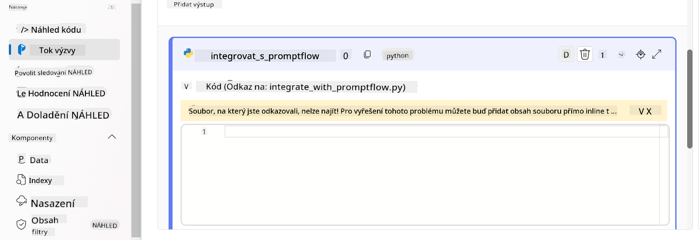

> [!NOTE]
> Pro podrobnější informace o používání Prompt flow v Azure AI Foundry můžete navštívit [Prompt flow in Azure AI Foundry](https://learn.microsoft.com/azure/ai-studio/how-to/prompt-flow).

1. Vyberte **Chat input**, **Chat output** pro povolení chatu s vaším modelem.

    

1. Nyní jste připraveni chatovat s vaším vlastním modelem Phi-3. V dalším cvičení se naučíte, jak spustit Prompt flow a používat ho pro chat s vaším doladěným modelem Phi-3.

> [!NOTE]
>
> Přestavěné flow by mělo vypadat jako na obrázku níže:
>
> 
>

### Chat s vaším vlastním modelem Phi-3

Nyní, když jste doladili a integrovali svůj vlastní model Phi-3 s Prompt flow, jste připraveni začít s ním komunikovat. Toto cvičení vás provede nastavením a spuštěním chatu s vaším modelem pomocí Prompt flow. Díky těmto krokům budete moci plně využít schopnosti vašeho doladěného modelu Phi-3 pro různé úkoly a konverzace.

- Chatujte se svým vlastním modelem Phi-3 pomocí Prompt flow.

#### Spuštění Prompt flow

1. Klikněte na **Start compute sessions** pro spuštění Prompt flow.

    

1. Klikněte na **Validate and parse input** pro obnovení parametrů.

    

1. Vyberte **Value** u **connection** na vlastní připojení, které jste vytvořili. Například *connection*.

    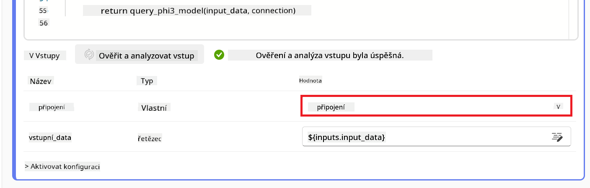

#### Chat s vaším vlastním modelem

1. Klikněte na **Chat**.

    

1. Zde je příklad výsledků: nyní můžete chatovat se svým vlastním modelem Phi-3. Doporučuje se klást otázky založené na datech použitých pro doladění.

    

**Prohlášení o vyloučení odpovědnosti**:  
Tento dokument byl přeložen pomocí AI překladatelské služby [Co-op Translator](https://github.com/Azure/co-op-translator). I když usilujeme o přesnost, mějte prosím na paměti, že automatizované překlady mohou obsahovat chyby nebo nepřesnosti. Původní dokument v jeho mateřském jazyce by měl být považován za autoritativní zdroj. Pro důležité informace se doporučuje profesionální lidský překlad. Nejsme odpovědní za jakékoliv nedorozumění nebo nesprávné výklady vyplývající z použití tohoto překladu.