<!--
CO_OP_TRANSLATOR_METADATA:
{
  "original_hash": "ecbd9179a21edbaafaf114d47f09f3e3",
  "translation_date": "2025-05-09T18:22:30+00:00",
  "source_file": "md/02.Application/01.TextAndChat/Phi3/E2E_Phi-3-FineTuning_PromptFlow_Integration_AIFoundry.md",
  "language_code": "cs"
}
-->
# Fine-tune and Integrate custom Phi-3 models with Prompt flow in Azure AI Foundry

This end-to-end (E2E) sample is based on the guide "[Fine-Tune and Integrate Custom Phi-3 Models with Prompt Flow in Azure AI Foundry](https://techcommunity.microsoft.com/t5/educator-developer-blog/fine-tune-and-integrate-custom-phi-3-models-with-prompt-flow-in/ba-p/4191726?WT.mc_id=aiml-137032-kinfeylo)" from the Microsoft Tech Community. It introduces the processes of fine-tuning, deploying, and integrating custom Phi-3 models with Prompt flow in Azure AI Foundry.
Unlike the E2E sample, "[Fine-Tune and Integrate Custom Phi-3 Models with Prompt Flow](./E2E_Phi-3-FineTuning_PromptFlow_Integration.md)", which involved running code locally, this tutorial focuses entirely on fine-tuning and integrating your model within the Azure AI / ML Studio.

## Overview

In this E2E sample, you will learn how to fine-tune the Phi-3 model and integrate it with Prompt flow in Azure AI Foundry. By leveraging Azure AI / ML Studio, you will establish a workflow for deploying and utilizing custom AI models. This E2E sample is divided into three scenarios:

**Scenario 1: Set up Azure resources and Prepare for fine-tuning**

**Scenario 2: Fine-tune the Phi-3 model and Deploy in Azure Machine Learning Studio**

**Scenario 3: Integrate with Prompt flow and Chat with your custom model in Azure AI Foundry**

Here is an overview of this E2E sample.


### Table of Contents

1. **[Scenario 1: Set up Azure resources and Prepare for fine-tuning](../../../../../../md/02.Application/01.TextAndChat/Phi3)**
    - [Create an Azure Machine Learning Workspace](../../../../../../md/02.Application/01.TextAndChat/Phi3)
    - [Request GPU quotas in Azure Subscription](../../../../../../md/02.Application/01.TextAndChat/Phi3)
    - [Add role assignment](../../../../../../md/02.Application/01.TextAndChat/Phi3)
    - [Set up project](../../../../../../md/02.Application/01.TextAndChat/Phi3)
    - [Prepare dataset for fine-tuning](../../../../../../md/02.Application/01.TextAndChat/Phi3)

1. **[Scenario 2: Fine-tune Phi-3 model and Deploy in Azure Machine Learning Studio](../../../../../../md/02.Application/01.TextAndChat/Phi3)**
    - [Fine-tune the Phi-3 model](../../../../../../md/02.Application/01.TextAndChat/Phi3)
    - [Deploy the fine-tuned Phi-3 model](../../../../../../md/02.Application/01.TextAndChat/Phi3)

1. **[Scenario 3: Integrate with Prompt flow and Chat with your custom model in Azure AI Foundry](../../../../../../md/02.Application/01.TextAndChat/Phi3)**
    - [Integrate the custom Phi-3 model with Prompt flow](../../../../../../md/02.Application/01.TextAndChat/Phi3)
    - [Chat with your custom Phi-3 model](../../../../../../md/02.Application/01.TextAndChat/Phi3)

## Scenario 1: Set up Azure resources and Prepare for fine-tuning

### Create an Azure Machine Learning Workspace

1. Введите *azure machine learning* в **строке поиска** в верхней части страницы портала и выберите **Azure Machine Learning** из появившихся вариантов.

    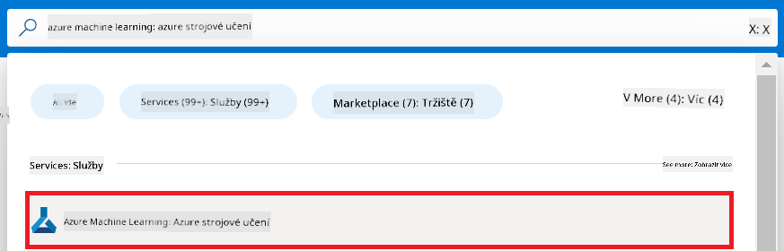

2. Выберите **+ Create** в навигационном меню.

3. Выберите **New workspace** в навигационном меню.

    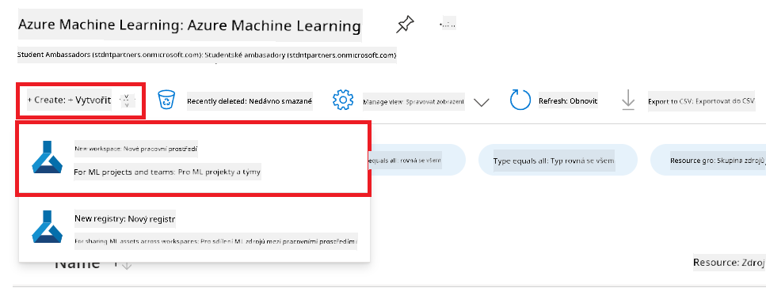

4. Выполните следующие действия:

    - Выберите вашу подписку Azure **Subscription**.
    - Выберите **Resource group** для использования (создайте новую, если необходимо).
    - Введите **Workspace Name**. Имя должно быть уникальным.
    - Выберите **Region**, который хотите использовать.
    - Выберите **Storage account** для использования (создайте новый, если необходимо).
    - Выберите **Key vault** для использования (создайте новый, если необходимо).
    - Выберите **Application insights** для использования (создайте новый, если необходимо).
    - Выберите **Container registry** для использования (создайте новый, если необходимо).

    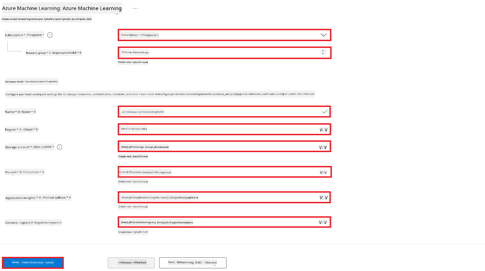

5. Выберите **Review + Create**.

6. Выберите **Create**.

### Request GPU quotas in Azure Subscription

В этом руководстве вы научитесь тонкой настройке и развертыванию модели Phi-3 с использованием GPU. Для тонкой настройки вы будете использовать GPU *Standard_NC24ads_A100_v4*, для которого требуется запрос квоты. Для развертывания будет использоваться GPU *Standard_NC6s_v3*, для которого также требуется запрос квоты.

> [!NOTE]
>
> Квоты на GPU доступны только для подписок Pay-As-You-Go (стандартный тип подписки); подписки с бонусами в настоящее время не поддерживаются.
>

1. Перейдите на [Azure ML Studio](https://ml.azure.com/home?wt.mc_id=studentamb_279723).

1. Выполните следующие действия, чтобы запросить квоту для *Standard NCADSA100v4 Family*:

    - Выберите **Quota** в левой панели.
    - Выберите **Virtual machine family**. Например, выберите **Standard NCADSA100v4 Family Cluster Dedicated vCPUs**, который включает GPU *Standard_NC24ads_A100_v4*.
    - Выберите **Request quota** в навигационном меню.

        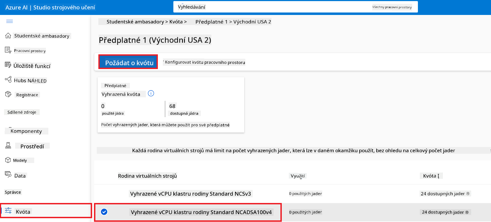

    - На странице запроса квоты введите желаемый **New cores limit**, например 24.
    - Нажмите **Submit**, чтобы отправить запрос квоты на GPU.

1. Выполните следующие действия, чтобы запросить квоту для *Standard NCSv3 Family*:

    - Выберите **Quota** в левой панели.
    - Выберите **Virtual machine family**. Например, выберите **Standard NCSv3 Family Cluster Dedicated vCPUs**, который включает GPU *Standard_NC6s_v3*.
    - Выберите **Request quota** в навигационном меню.
    - Введите желаемый **New cores limit**, например 24.
    - Нажмите **Submit** для отправки запроса квоты.

### Add role assignment

Для тонкой настройки и развертывания моделей необходимо сначала создать User Assigned Managed Identity (UAI) и назначить ей соответствующие разрешения. Эта UAI будет использоваться для аутентификации при развертывании.

#### Create User Assigned Managed Identity(UAI)

1. Введите *managed identities* в **строке поиска** в верхней части страницы портала и выберите **Managed Identities** из появившихся вариантов.

    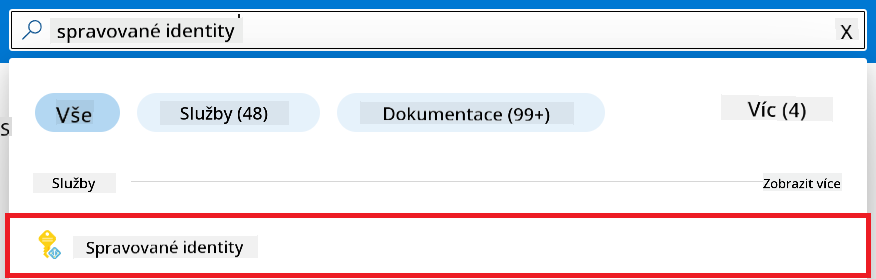

1. Выберите **+ Create**.

    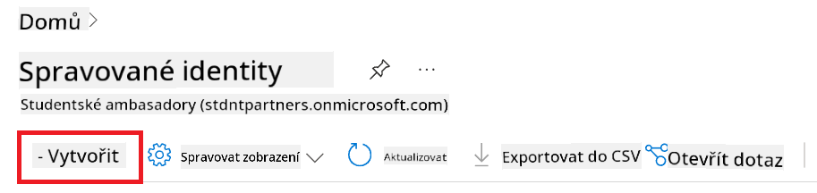

1. Выполните следующие действия:

    - Выберите вашу подписку Azure **Subscription**.
    - Выберите **Resource group** для использования (создайте новую, если необходимо).
    - Выберите **Region**, который хотите использовать.
    - Введите **Name**. Имя должно быть уникальным.

    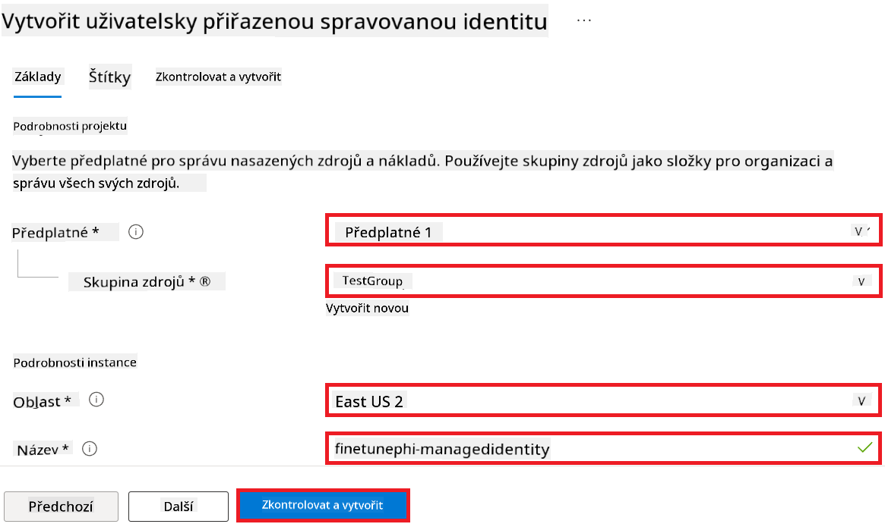

1. Выберите **Review + create**.

1. Выберите **+ Create**.

#### Add Contributor role assignment to Managed Identity

1. Перейдите к созданному Managed Identity.

1. Выберите **Azure role assignments** в левой панели.

1. Выберите **+Add role assignment** в навигационном меню.

1. На странице добавления назначения роли выполните следующие действия:
    - Установите **Scope** в значение **Resource group**.
    - Выберите вашу подписку Azure **Subscription**.
    - Выберите **Resource group** для использования.
    - Выберите роль **Contributor**.

    

2. Нажмите **Save**.

#### Add Storage Blob Data Reader role assignment to Managed Identity

1. Введите *storage accounts* в **строке поиска** в верхней части страницы портала и выберите **Storage accounts** из появившихся вариантов.

    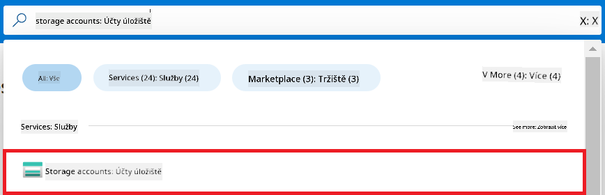

1. Выберите аккаунт хранения, связанный с Azure Machine Learning workspace, который вы создали. Например, *finetunephistorage*.

1. Выполните следующие действия, чтобы перейти на страницу добавления назначения роли:

    - Перейдите в созданный аккаунт хранения Azure.
    - Выберите **Access Control (IAM)** в левой панели.
    - Выберите **+ Add** в навигационном меню.
    - Выберите **Add role assignment** в навигационном меню.

    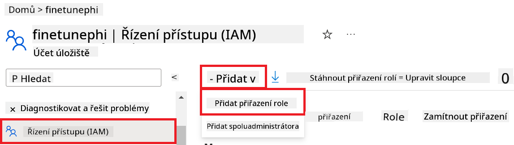

1. На странице добавления назначения роли выполните следующие действия:

    - В строке поиска ролей введите *Storage Blob Data Reader* и выберите **Storage Blob Data Reader** из появившихся вариантов.
    - Нажмите **Next**.
    - На странице участников выберите **Assign access to** **Managed identity**.
    - Нажмите **+ Select members**.
    - Выберите вашу подписку Azure **Subscription**.
    - Выберите **Managed identity** как **Manage Identity**.
    - Выберите созданную Managed Identity, например *finetunephi-managedidentity*.
    - Нажмите **Select**.

    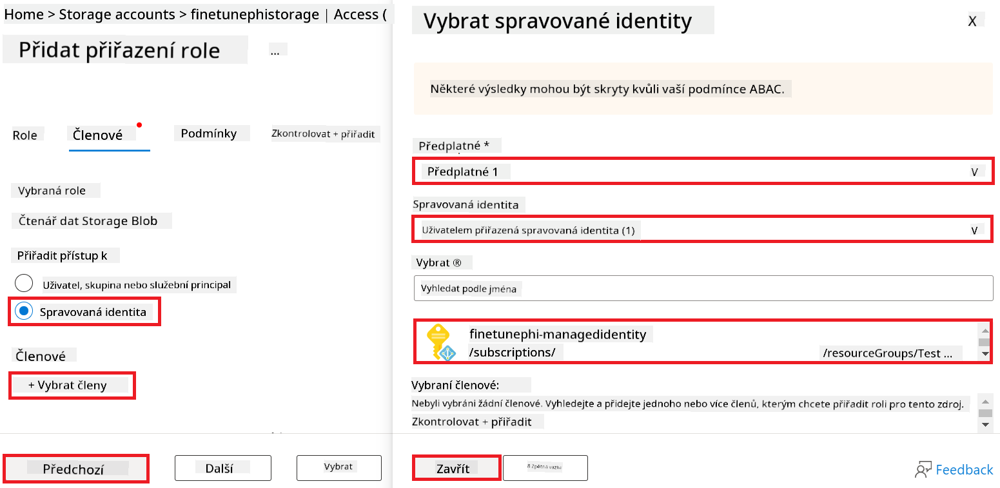

1. Нажмите **Review + assign**.

#### Add AcrPull role assignment to Managed Identity

1. Введите *container registries* в **строке поиска** в верхней части страницы портала и выберите **Container registries** из появившихся вариантов.

    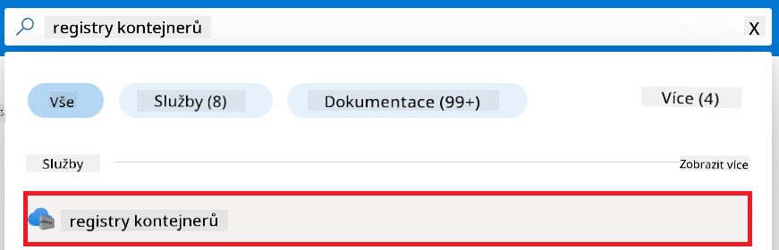

1. Выберите реестр контейнеров, связанный с Azure Machine Learning workspace. Например, *finetunephicontainerregistry*

1. Выполните следующие действия, чтобы перейти на страницу добавления назначения роли:

    - Выберите **Access Control (IAM)** в левой панели.
    - Выберите **+ Add** в навигационном меню.
    - Выберите **Add role assignment** в навигационном меню.

1. На странице добавления назначения роли выполните следующие действия:

    - В строке поиска ролей введите *AcrPull* и выберите **AcrPull** из появившихся вариантов.
    - Нажмите **Next**.
    - На странице участников выберите **Assign access to** **Managed identity**.
    - Нажмите **+ Select members**.
    - Выберите вашу подписку Azure **Subscription**.
    - Выберите **Managed identity** как **Manage Identity**.
    - Выберите созданную Managed Identity, например *finetunephi-managedidentity*.
    - Нажмите **Select**.
    - Нажмите **Review + assign**.

### Set up project

Чтобы скачать датасеты, необходимые для тонкой настройки, вам нужно настроить локальное окружение.

В этом упражнении вы:

- Создадите папку для работы.
- Создадите виртуальное окружение.
- Установите необходимые пакеты.
- Создадите файл *download_dataset.py* для загрузки датасета.

#### Create a folder to work inside it

1. Откройте терминал и выполните команду для создания папки с именем *finetune-phi* в стандартном каталоге.

    ```console
    mkdir finetune-phi
    ```

2. Выполните команду в терминале, чтобы перейти в созданную папку *finetune-phi*.

    ```console
    cd finetune-phi
    ```

#### Create a virtual environment

1. Выполните команду в терминале для создания виртуального окружения с именем *.venv*.

    ```console
    python -m venv .venv
    ```

2. Выполните команду в терминале для активации виртуального окружения.

    ```console
    .venv\Scripts\activate.bat
    ```

> [!NOTE]
> Если всё прошло успешно, перед приглашением командной строки появится *(.venv)*.

#### Install the required packages

1. Выполните следующие команды в терминале для установки необходимых пакетов.

    ```console
    pip install datasets==2.19.1
    ```

#### Create `donload_dataset.py`

> [!NOTE]
> Полная структура папок:
>
> ```text
> └── YourUserName
> .    └── finetune-phi
> .        └── download_dataset.py
> ```

1. Откройте **Visual Studio Code**.

1. Выберите **File** в меню.

1. Выберите **Open Folder**.

1. Выберите папку *finetune-phi*, которую создали, расположенную по пути *C:\Users\yourUserName\finetune-phi*.

    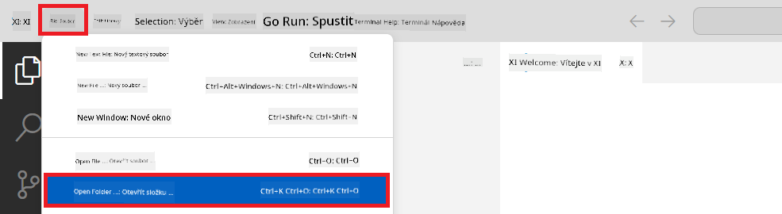

1. В левой панели Visual Studio Code кликните правой кнопкой мыши и выберите **New File**, чтобы создать новый файл с именем *download_dataset.py*.

    

### Prepare dataset for fine-tuning

В этом упражнении вы запустите файл *download_dataset.py*, чтобы скачать датасеты *ultrachat_200k* в локальное окружение. Затем вы будете использовать эти датасеты для тонкой настройки модели Phi-3 в Azure Machine Learning.

В этом упражнении вы:

- Добавите код в файл *download_dataset.py* для загрузки датасетов.
- Запустите файл *download_dataset.py* для скачивания датасетов в локальное окружение.

#### Download your dataset using *download_dataset.py*

1. Откройте файл *download_dataset.py* в Visual Studio Code.

1. Добавьте следующий код в файл *download_dataset.py*.

    ```python
    import json
    import os
    from datasets import load_dataset

    def load_and_split_dataset(dataset_name, config_name, split_ratio):
        """
        Load and split a dataset.
        """
        # Load the dataset with the specified name, configuration, and split ratio
        dataset = load_dataset(dataset_name, config_name, split=split_ratio)
        print(f"Original dataset size: {len(dataset)}")
        
        # Split the dataset into train and test sets (80% train, 20% test)
        split_dataset = dataset.train_test_split(test_size=0.2)
        print(f"Train dataset size: {len(split_dataset['train'])}")
        print(f"Test dataset size: {len(split_dataset['test'])}")
        
        return split_dataset

    def save_dataset_to_jsonl(dataset, filepath):
        """
        Save a dataset to a JSONL file.
        """
        # Create the directory if it does not exist
        os.makedirs(os.path.dirname(filepath), exist_ok=True)
        
        # Open the file in write mode
        with open(filepath, 'w', encoding='utf-8') as f:
            # Iterate over each record in the dataset
            for record in dataset:
                # Dump the record as a JSON object and write it to the file
                json.dump(record, f)
                # Write a newline character to separate records
                f.write('\n')
        
        print(f"Dataset saved to {filepath}")

    def main():
        """
        Main function to load, split, and save the dataset.
        """
        # Load and split the ULTRACHAT_200k dataset with a specific configuration and split ratio
        dataset = load_and_split_dataset("HuggingFaceH4/ultrachat_200k", 'default', 'train_sft[:1%]')
        
        # Extract the train and test datasets from the split
        train_dataset = dataset['train']
        test_dataset = dataset['test']

        # Save the train dataset to a JSONL file
        save_dataset_to_jsonl(train_dataset, "data/train_data.jsonl")
        
        # Save the test dataset to a separate JSONL file
        save_dataset_to_jsonl(test_dataset, "data/test_data.jsonl")

    if __name__ == "__main__":
        main()

    ```

1. Выполните команду в терминале, чтобы запустить скрипт и скачать датасет в локальное окружение.

    ```console
    python download_dataset.py
    ```

1. Проверьте, что датасеты успешно сохранились в локальной директории *finetune-phi/data*.

> [!NOTE]
>
> #### Примечание по размеру датасета и времени тонкой настройки
>
> В этом руководстве используется только 1% датасета (`split='train[:1%]'`). Это значительно уменьшает объем данных, ускоряя процесс загрузки и тонкой настройки. Вы можете регулировать процент, чтобы найти оптимальный баланс между временем обучения и качеством модели. Использование меньшей части датасета сокращает время тонкой настройки, делая процесс более удобным для учебных целей.

## Scenario 2: Fine-tune Phi-3 model and Deploy in Azure Machine Learning Studio

### Fine-tune the Phi-3 model

В этом упражнении вы выполните тонкую настройку модели Phi-3 в Azure Machine Learning Studio.

В этом упражнении вы:

- Создадите кластер вычислительных ресурсов для тонкой настройки.
- Выполните тонкую настройку модели Phi-3 в Azure Machine Learning Studio.

#### Create computer cluster for fine-tuning
1. Visita [Azure ML Studio](https://ml.azure.com/home?wt.mc_id=studentamb_279723).

1. Selecciona **Compute** en la pestaña lateral izquierda.

1. Selecciona **Compute clusters** en el menú de navegación.

1. Selecciona **+ New**.

    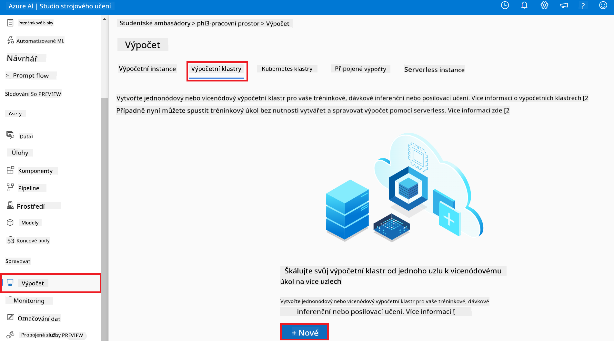

1. Realiza las siguientes tareas:

    - Selecciona la **Region** que deseas usar.
    - Selecciona el **Virtual machine tier** a **Dedicated**.
    - Selecciona el **Virtual machine type** a **GPU**.
    - Filtra el **Virtual machine size** a **Select from all options**.
    - Selecciona el **Virtual machine size** a **Standard_NC24ads_A100_v4**.

    

1. Selecciona **Next**.

1. Realiza las siguientes tareas:

    - Ingresa el **Compute name**. Debe ser un valor único.
    - Selecciona el **Minimum number of nodes** a **0**.
    - Selecciona el **Maximum number of nodes** a **1**.
    - Selecciona el **Idle seconds before scale down** a **120**.

    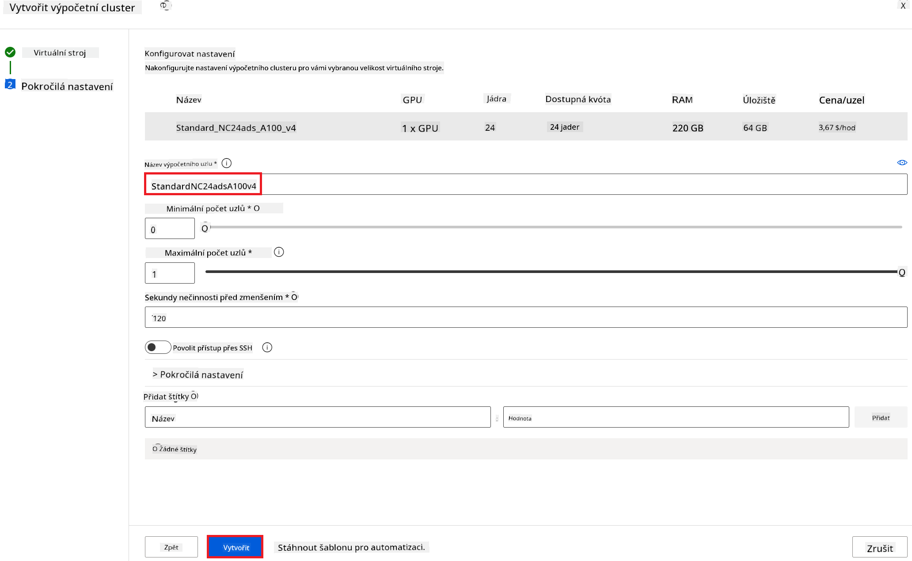

1. Selecciona **Create**.

#### Ajusta finamente el modelo Phi-3

1. Visita [Azure ML Studio](https://ml.azure.com/home?wt.mc_id=studentamb_279723).

1. Selecciona el espacio de trabajo de Azure Machine Learning que creaste.

    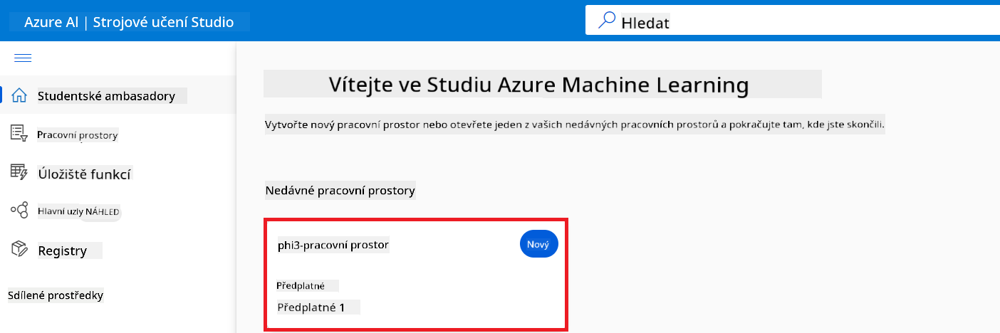

1. Realiza las siguientes tareas:

    - Selecciona **Model catalog** en la pestaña lateral izquierda.
    - Escribe *phi-3-mini-4k* en la **barra de búsqueda** y selecciona **Phi-3-mini-4k-instruct** de las opciones que aparecen.

    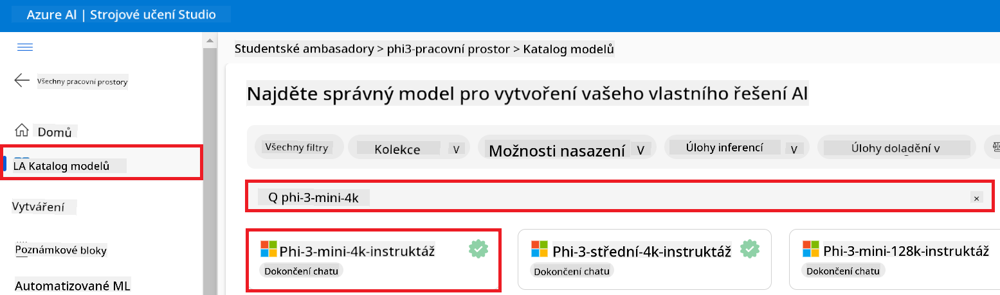

1. Selecciona **Fine-tune** en el menú de navegación.

    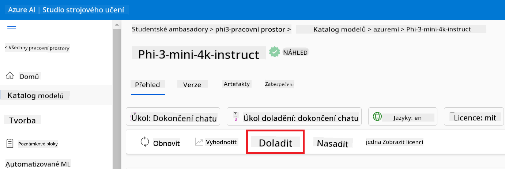

1. Realiza las siguientes tareas:

    - Selecciona **Select task type** a **Chat completion**.
    - Selecciona **+ Select data** para subir los **Traning data**.
    - Selecciona el tipo de subida de datos de validación a **Provide different validation data**.
    - Selecciona **+ Select data** para subir los **Validation data**.

    

    > [!TIP]
    >
    > Puedes seleccionar **Advanced settings** para personalizar configuraciones como **learning_rate** y **lr_scheduler_type** para optimizar el proceso de ajuste fino según tus necesidades específicas.

1. Selecciona **Finish**.

1. En este ejercicio, ajustaste finamente con éxito el modelo Phi-3 usando Azure Machine Learning. Ten en cuenta que el proceso de ajuste fino puede tomar bastante tiempo. Después de ejecutar el trabajo de ajuste fino, debes esperar a que se complete. Puedes monitorear el estado del trabajo en la pestaña Jobs en el lado izquierdo de tu espacio de trabajo de Azure Machine Learning. En la siguiente serie, desplegarás el modelo ajustado y lo integrarás con Prompt flow.

    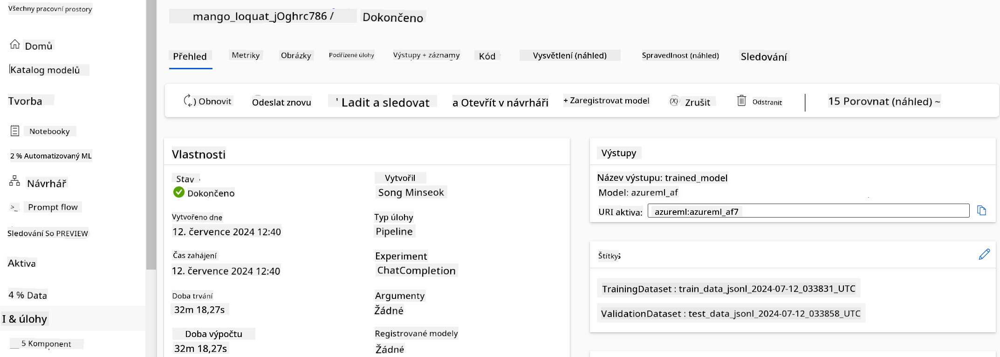

### Despliega el modelo Phi-3 ajustado

Para integrar el modelo Phi-3 ajustado con Prompt flow, necesitas desplegar el modelo para que esté disponible para inferencia en tiempo real. Este proceso incluye registrar el modelo, crear un endpoint en línea y desplegar el modelo.

En este ejercicio, realizarás:

- Registrar el modelo ajustado en el espacio de trabajo de Azure Machine Learning.
- Crear un endpoint en línea.
- Desplegar el modelo Phi-3 ajustado registrado.

#### Registra el modelo ajustado

1. Visita [Azure ML Studio](https://ml.azure.com/home?wt.mc_id=studentamb_279723).

1. Selecciona el espacio de trabajo de Azure Machine Learning que creaste.

    

1. Selecciona **Models** en la pestaña lateral izquierda.  
1. Selecciona **+ Register**.  
1. Selecciona **From a job output**.

    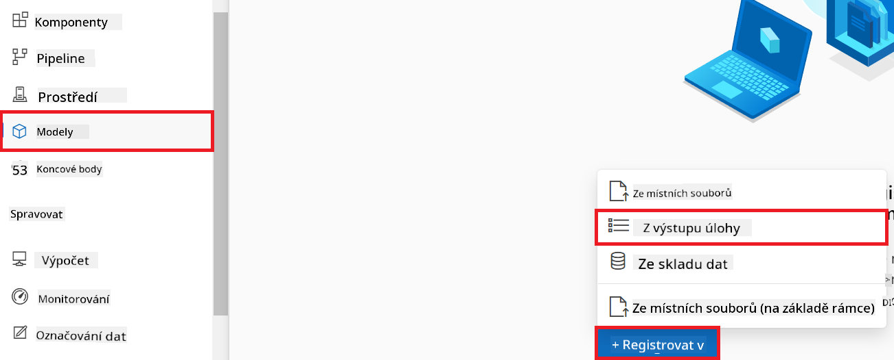

1. Selecciona el trabajo que creaste.

    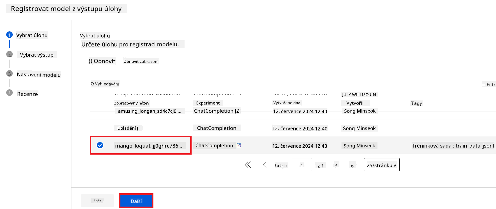

1. Selecciona **Next**.

1. Selecciona **Model type** a **MLflow**.

1. Asegúrate de que **Job output** esté seleccionado; debería estar seleccionado automáticamente.

    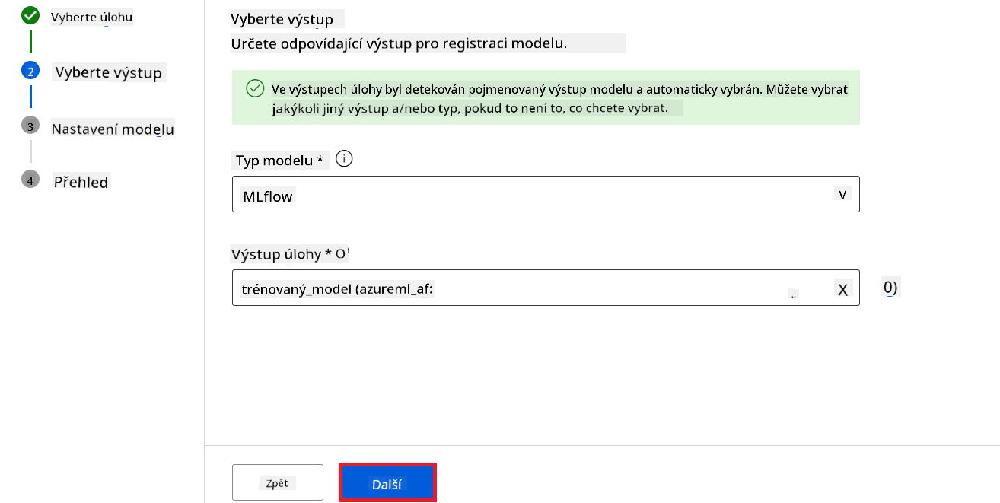

2. Selecciona **Next**.

3. Selecciona **Register**.

    

4. Puedes ver tu modelo registrado navegando al menú **Models** en la pestaña lateral izquierda.

    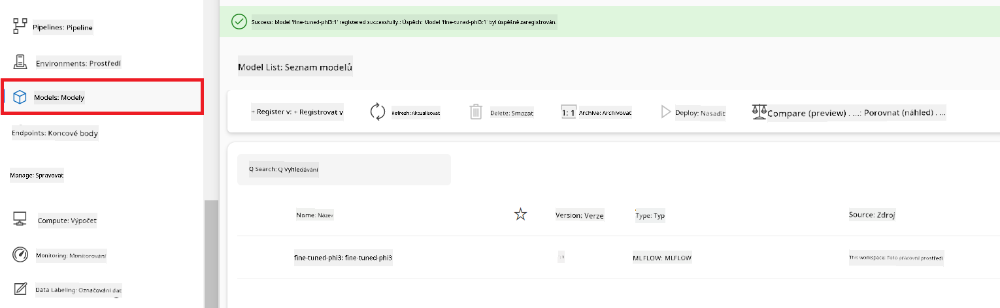

#### Despliega el modelo ajustado

1. Navega al espacio de trabajo de Azure Machine Learning que creaste.

1. Selecciona **Endpoints** en la pestaña lateral izquierda.

1. Selecciona **Real-time endpoints** en el menú de navegación.

    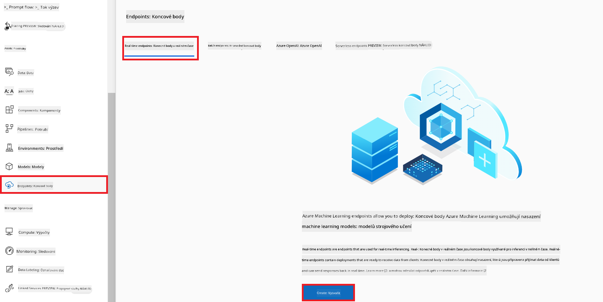

1. Selecciona **Create**.

1. Selecciona el modelo registrado que creaste.

    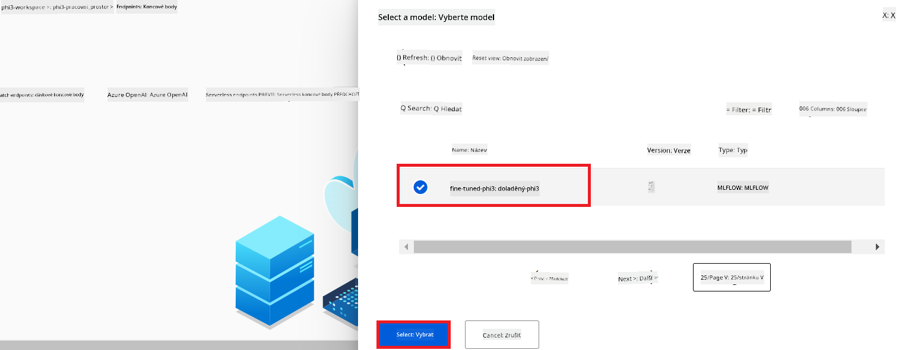

1. Selecciona **Select**.

1. Realiza las siguientes tareas:

    - Selecciona **Virtual machine** a *Standard_NC6s_v3*.
    - Selecciona la cantidad de instancias que deseas usar. Por ejemplo, *1*.
    - Selecciona **Endpoint** a **New** para crear un endpoint.
    - Ingresa **Endpoint name**. Debe ser un valor único.
    - Ingresa **Deployment name**. Debe ser un valor único.

    

1. Selecciona **Deploy**.

> [!WARNING]
> Para evitar cargos adicionales en tu cuenta, asegúrate de eliminar el endpoint creado en el espacio de trabajo de Azure Machine Learning.
>

#### Verifica el estado del despliegue en Azure Machine Learning Workspace

1. Navega al espacio de trabajo de Azure Machine Learning que creaste.

1. Selecciona **Endpoints** en la pestaña lateral izquierda.

1. Selecciona el endpoint que creaste.

    

1. En esta página puedes gestionar los endpoints durante el proceso de despliegue.

> [!NOTE]
> Una vez que el despliegue esté completo, asegúrate de que **Live traffic** esté configurado al **100%**. Si no es así, selecciona **Update traffic** para ajustar la configuración de tráfico. Ten en cuenta que no podrás probar el modelo si el tráfico está configurado en 0%.
>
> 
>

## Escenario 3: Integrar con Prompt flow y chatear con tu modelo personalizado en Azure AI Foundry

### Integra el modelo Phi-3 personalizado con Prompt flow

Después de desplegar exitosamente tu modelo ajustado, ahora puedes integrarlo con Prompt Flow para usar tu modelo en aplicaciones en tiempo real, habilitando una variedad de tareas interactivas con tu modelo Phi-3 personalizado.

En este ejercicio, realizarás:

- Crear Azure AI Foundry Hub.
- Crear Azure AI Foundry Project.
- Crear Prompt flow.
- Añadir una conexión personalizada para el modelo Phi-3 ajustado.
- Configurar Prompt flow para chatear con tu modelo Phi-3 personalizado.

> [!NOTE]
> También puedes integrar con Promptflow usando Azure ML Studio. El mismo proceso de integración se puede aplicar a Azure ML Studio.

#### Crea Azure AI Foundry Hub

Necesitas crear un Hub antes de crear el Proyecto. Un Hub funciona como un Grupo de Recursos, permitiéndote organizar y gestionar múltiples Proyectos dentro de Azure AI Foundry.

1. Visita [Azure AI Foundry](https://ai.azure.com/?WT.mc_id=aiml-137032-kinfeylo).

1. Selecciona **All hubs** en la pestaña lateral izquierda.

1. Selecciona **+ New hub** en el menú de navegación.

    

1. Realiza las siguientes tareas:

    - Ingresa el **Hub name**. Debe ser un valor único.
    - Selecciona tu **Subscription** de Azure.
    - Selecciona el **Resource group** a usar (crea uno nuevo si es necesario).
    - Selecciona la **Location** que deseas usar.
    - Selecciona **Connect Azure AI Services** a usar (crea uno nuevo si es necesario).
    - Selecciona **Connect Azure AI Search** a **Skip connecting**.

    

1. Selecciona **Next**.

#### Crea Azure AI Foundry Project

1. En el Hub que creaste, selecciona **All projects** en la pestaña lateral izquierda.

1. Selecciona **+ New project** en el menú de navegación.

    

1. Ingresa el **Project name**. Debe ser un valor único.

    

1. Selecciona **Create a project**.

#### Añade una conexión personalizada para el modelo Phi-3 ajustado

Para integrar tu modelo Phi-3 personalizado con Prompt flow, necesitas guardar el endpoint y la clave del modelo en una conexión personalizada. Esta configuración asegura el acceso a tu modelo Phi-3 personalizado en Prompt flow.

#### Configura la clave API y el URI del endpoint del modelo Phi-3 ajustado

1. Visita [Azure ML Studio](https://ml.azure.com/home?WT.mc_id=aiml-137032-kinfeylo).

1. Navega al espacio de trabajo de Azure Machine Learning que creaste.

1. Selecciona **Endpoints** en la pestaña lateral izquierda.

    

1. Selecciona el endpoint que creaste.

    

1. Selecciona **Consume** en el menú de navegación.

1. Copia tu **REST endpoint** y tu **Primary key**.


#### カスタム接続を追加する

1. [Azure AI Foundry](https://ai.azure.com/?WT.mc_id=aiml-137032-kinfeylo) にアクセスします。

1. 作成した Azure AI Foundry プロジェクトに移動します。

1. 作成したプロジェクト内で、左側のタブから **Settings** を選択します。

1. **+ New connection** を選択します。

    

1. ナビゲーションメニューから **Custom keys** を選択します。

    

1. 次の操作を行います：

    - **+ Add key value pairs** を選択します。
    - キー名に **endpoint** と入力し、Azure ML Studio からコピーしたエンドポイントを値の欄に貼り付けます。
    - 再度 **+ Add key value pairs** を選択します。
    - キー名に **key** と入力し、Azure ML Studio からコピーしたキーを値の欄に貼り付けます。
    - キーを追加したら、キーが漏えいしないように **is secret** を選択します。

    

1. **Add connection** を選択します。

#### Prompt flow を作成する

Azure AI Foundry にカスタム接続を追加しました。次に、以下の手順で Prompt flow を作成します。その後、この Prompt flow をカスタム接続に接続し、ファインチューニング済みモデルを Prompt flow 内で利用できるようにします。

1. 作成した Azure AI Foundry プロジェクトに移動します。

1. 左側のタブから **Prompt flow** を選択します。

1. ナビゲーションメニューから **+ Create** を選択します。

    

1. ナビゲーションメニューから **Chat flow** を選択します。

    

1. 使用する **Folder name** を入力します。

    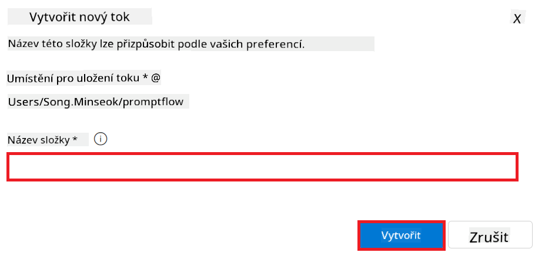

2. **Create** を選択します。

#### カスタム Phi-3 モデルでチャットするための Prompt flow の設定

ファインチューニング済みの Phi-3 モデルを Prompt flow に統合する必要があります。ただし、既存の Prompt flow はこの目的に適していないため、カスタムモデルを組み込めるように Prompt flow を再設計する必要があります。

1. Prompt flow 内で、以下の操作を行い既存のフローを再構築します：

    - **Raw file mode** を選択します。
    - *flow.dag.yml* ファイル内の既存のコードをすべて削除します。
    - 以下のコードを *flow.dag.yml* ファイルに追加します。

        ```yml
        inputs:
          input_data:
            type: string
            default: "Who founded Microsoft?"

        outputs:
          answer:
            type: string
            reference: ${integrate_with_promptflow.output}

        nodes:
        - name: integrate_with_promptflow
          type: python
          source:
            type: code
            path: integrate_with_promptflow.py
          inputs:
            input_data: ${inputs.input_data}
        ```

    - **Save** を選択します。

    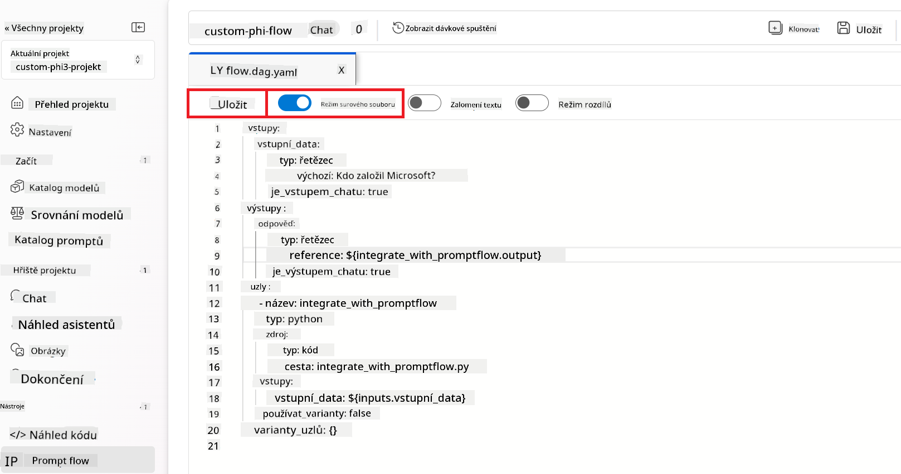

1. カスタム Phi-3 モデルを Prompt flow で使用するために、*integrate_with_promptflow.py* ファイルに以下のコードを追加します。

    ```python
    import logging
    import requests
    from promptflow import tool
    from promptflow.connections import CustomConnection

    # Logging setup
    logging.basicConfig(
        format="%(asctime)s - %(levelname)s - %(name)s - %(message)s",
        datefmt="%Y-%m-%d %H:%M:%S",
        level=logging.DEBUG
    )
    logger = logging.getLogger(__name__)

    def query_phi3_model(input_data: str, connection: CustomConnection) -> str:
        """
        Send a request to the Phi-3 model endpoint with the given input data using Custom Connection.
        """

        # "connection" is the name of the Custom Connection, "endpoint", "key" are the keys in the Custom Connection
        endpoint_url = connection.endpoint
        api_key = connection.key

        headers = {
            "Content-Type": "application/json",
            "Authorization": f"Bearer {api_key}"
        }
        data = {
            "input_data": {
                "input_string": [
                    {"role": "user", "content": input_data}
                ],
                "parameters": {
                    "temperature": 0.7,
                    "max_new_tokens": 128
                }
            }
        }
        try:
            response = requests.post(endpoint_url, json=data, headers=headers)
            response.raise_for_status()
            
            # Log the full JSON response
            logger.debug(f"Full JSON response: {response.json()}")

            result = response.json()["output"]
            logger.info("Successfully received response from Azure ML Endpoint.")
            return result
        except requests.exceptions.RequestException as e:
            logger.error(f"Error querying Azure ML Endpoint: {e}")
            raise

    @tool
    def my_python_tool(input_data: str, connection: CustomConnection) -> str:
        """
        Tool function to process input data and query the Phi-3 model.
        """
        return query_phi3_model(input_data, connection)

    ```

    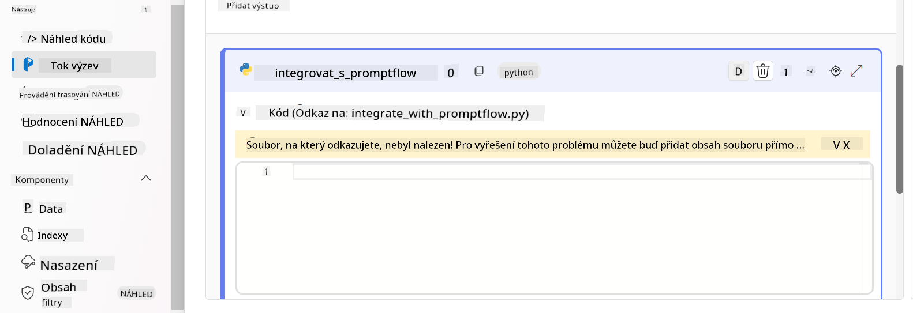

> [!NOTE]
> Azure AI Foundry で Prompt flow を使用する詳細については、[Prompt flow in Azure AI Foundry](https://learn.microsoft.com/azure/ai-studio/how-to/prompt-flow) を参照してください。

1. **Chat input** と **Chat output** を選択して、モデルとのチャットを有効にします。

    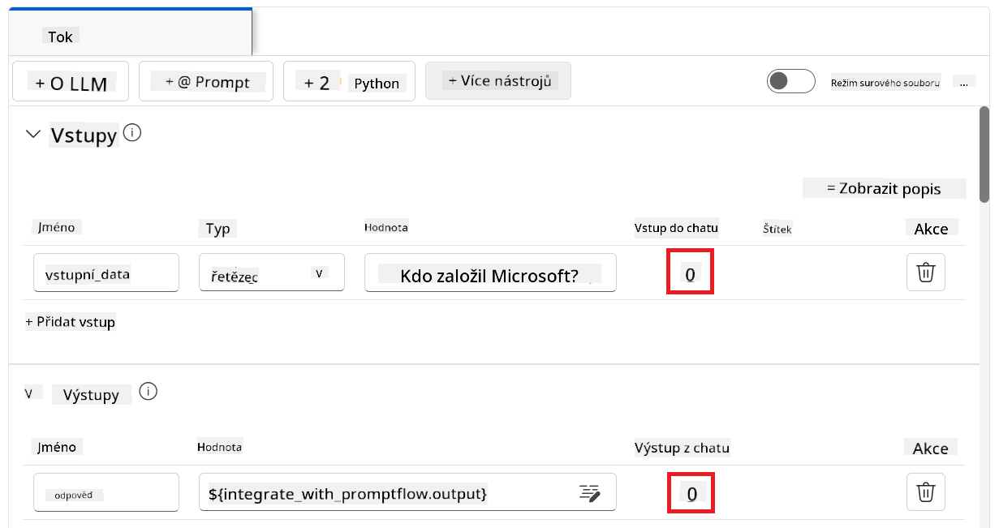

1. これでカスタム Phi-3 モデルとのチャット準備が整いました。次の演習では、Prompt flow を起動し、ファインチューニング済み Phi-3 モデルとチャットする方法を学びます。

> [!NOTE]
>
> 再構築したフローは以下の画像のようになります：
>
> 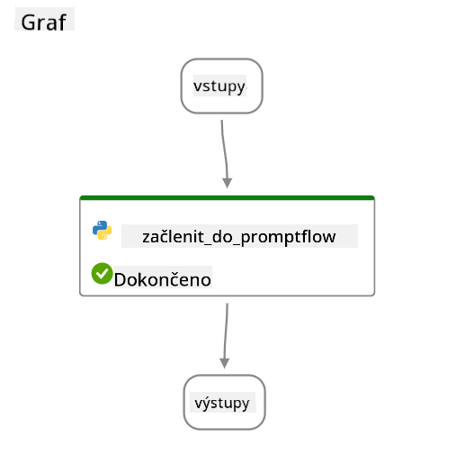
>

### カスタム Phi-3 モデルとチャットする

ファインチューニングして Prompt flow に統合したカスタム Phi-3 モデルと、いよいよ対話を始めましょう。この演習では、Prompt flow を使ってモデルとのチャットを設定し開始する手順を案内します。これにより、ファインチューニング済みの Phi-3 モデルの機能を様々なタスクや会話に活用できるようになります。

- Prompt flow を使ってカスタム Phi-3 モデルとチャットします。

#### Prompt flow を開始する

1. **Start compute sessions** を選択して Prompt flow を起動します。

    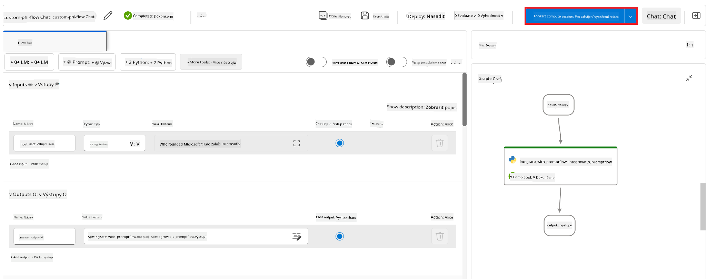

1. **Validate and parse input** を選択してパラメーターを更新します。

    

1. 作成したカスタム接続の **connection** の値を選択します。例：*connection*

    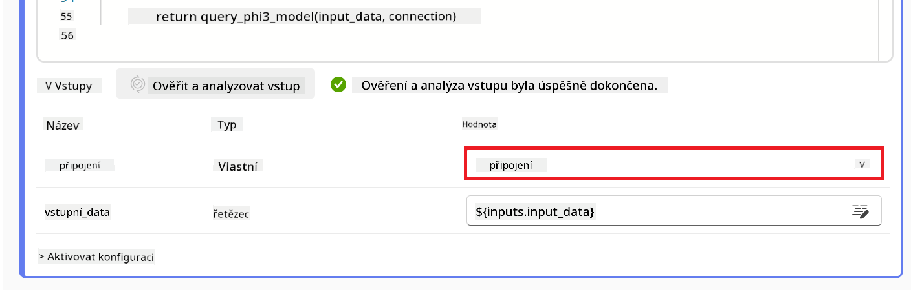

#### カスタムモデルとチャットする

1. **Chat** を選択します。

    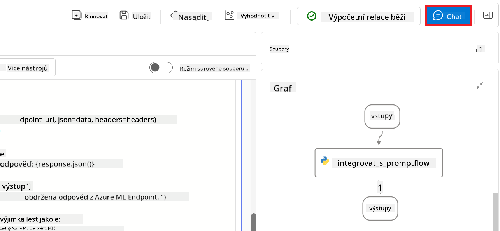

1. 以下は結果の例です：これでカスタム Phi-3 モデルとチャットできます。ファインチューニングに使用したデータに基づいた質問をすることをおすすめします。

    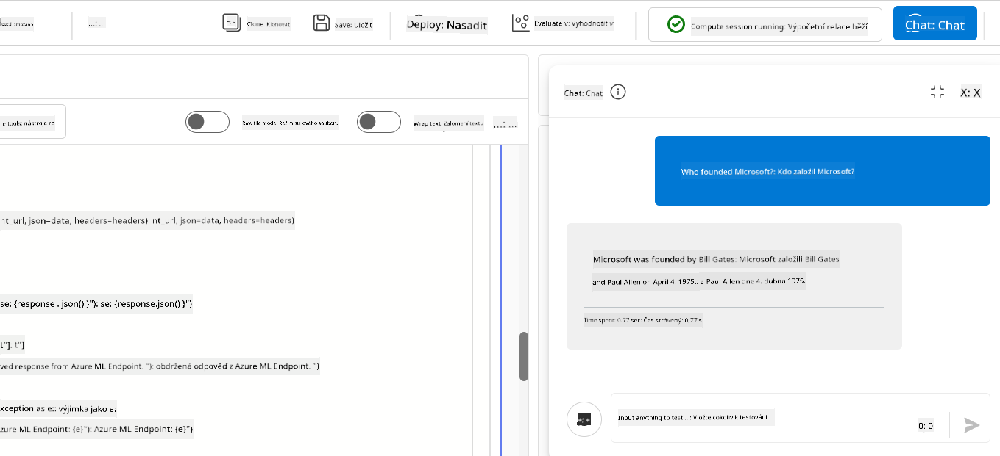

**Prohlášení o vyloučení odpovědnosti**:  
Tento dokument byl přeložen pomocí AI překladatelské služby [Co-op Translator](https://github.com/Azure/co-op-translator). Přestože usilujeme o přesnost, mějte prosím na paměti, že automatizované překlady mohou obsahovat chyby nebo nepřesnosti. Původní dokument v jeho mateřském jazyce by měl být považován za závazný zdroj. Pro kritické informace se doporučuje profesionální lidský překlad. Nejsme odpovědní za jakékoli nedorozumění nebo nesprávné výklady vzniklé použitím tohoto překladu.