<!--
CO_OP_TRANSLATOR_METADATA:
{
  "original_hash": "0df910a227098303cc392b6ad204c271",
  "translation_date": "2026-01-06T05:04:51+00:00",
  "source_file": "md/02.Application/01.TextAndChat/Phi3/E2E_Phi-3-FineTuning_PromptFlow_Integration_AIFoundry.md",
  "language_code": "cs"
}
-->
# Doladění a integrace vlastních modelů Phi-3 s Prompt flow v Azure AI Foundry

Tento kompletní (E2E) příklad vychází z průvodce „[Doladění a integrace vlastních modelů Phi-3 s Prompt flow v Azure AI Foundry](https://techcommunity.microsoft.com/t5/educator-developer-blog/fine-tune-and-integrate-custom-phi-3-models-with-prompt-flow-in/ba-p/4191726?WT.mc_id=aiml-137032-kinfeylo)“ z Microsoft Tech Community. Představuje procesy doladění, nasazení a integrace vlastních modelů Phi-3 s Prompt flow v Azure AI Foundry. Na rozdíl od E2E příkladu „[Doladění a integrace vlastních modelů Phi-3 s Prompt flow](./E2E_Phi-3-FineTuning_PromptFlow_Integration.md)“, který zahrnoval spouštění kódu lokálně, se tento tutoriál zaměřuje zcela na doladění a integraci vašeho modelu přímo v Azure AI / ML Studiu.

## Přehled

V tomto E2E příkladu se naučíte, jak doladit model Phi-3 a integrovat ho s Prompt flow v Azure AI Foundry. Využitím Azure AI / ML Studia si vytvoříte pracovní postup pro nasazení a využití vlastních AI modelů. Tento E2E příklad je rozdělen do tří scénářů:

**Scénář 1: Nastavení Azure zdrojů a příprava pro doladění**

**Scénář 2: Doladění modelu Phi-3 a nasazení v Azure Machine Learning Studiu**

**Scénář 3: Integrace s Prompt flow a chatování s vaším vlastním modelem v Azure AI Foundry**

Zde je přehled tohoto E2E příkladu.

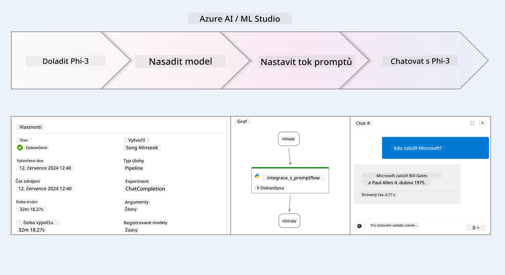

### Obsah

1. **[Scénář 1: Nastavení Azure zdrojů a příprava pro doladění](../../../../../../md/02.Application/01.TextAndChat/Phi3)**
    - [Vytvoření Azure Machine Learning Workspace](../../../../../../md/02.Application/01.TextAndChat/Phi3)
    - [Žádost o kvóty GPU v Azure Subscription](../../../../../../md/02.Application/01.TextAndChat/Phi3)
    - [Přidání přiřazení rolí](../../../../../../md/02.Application/01.TextAndChat/Phi3)
    - [Nastavení projektu](../../../../../../md/02.Application/01.TextAndChat/Phi3)
    - [Příprava datasetu pro doladění](../../../../../../md/02.Application/01.TextAndChat/Phi3)

1. **[Scénář 2: Doladění modelu Phi-3 a nasazení v Azure Machine Learning Studiu](../../../../../../md/02.Application/01.TextAndChat/Phi3)**
    - [Doladění modelu Phi-3](../../../../../../md/02.Application/01.TextAndChat/Phi3)
    - [Nasazení doladěného modelu Phi-3](../../../../../../md/02.Application/01.TextAndChat/Phi3)

1. **[Scénář 3: Integrace s Prompt flow a chatování s vaším vlastním modelem v Azure AI Foundry](../../../../../../md/02.Application/01.TextAndChat/Phi3)**
    - [Integrace vlastního modelu Phi-3 s Prompt flow](../../../../../../md/02.Application/01.TextAndChat/Phi3)
    - [Chatování s vlastním modelem Phi-3](../../../../../../md/02.Application/01.TextAndChat/Phi3)

## Scénář 1: Nastavení Azure zdrojů a příprava pro doladění

### Vytvoření Azure Machine Learning Workspace

1. Napište do **vyhledávacího pole** v horní části portálu „azure machine learning“ a ze zobrazených možností vyberte **Azure Machine Learning**.

    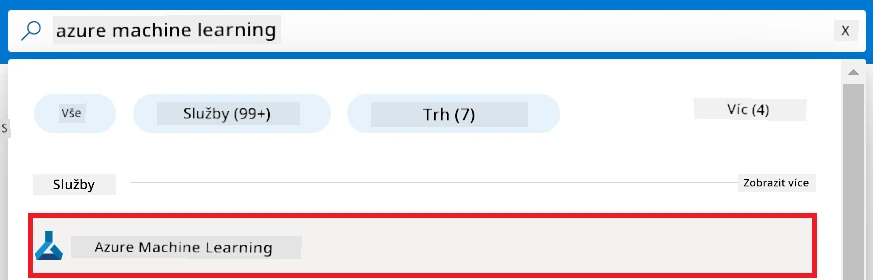

2. Ze navigačního menu vyberte **+ Create**.

3. Ze navigačního menu vyberte **New workspace**.

    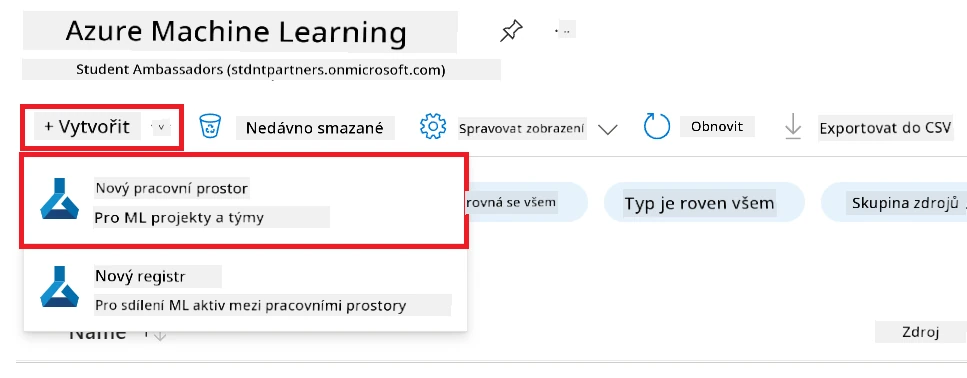

4. Proveďte následující kroky:

    - Vyberte svou Azure **Subscription**.
    - Vyberte **Resource group** (pokud nemáte, vytvořte novou).
    - Zadejte **Workspace Name**. Musí být jedinečný.
    - Vyberte **Region**, který chcete použít.
    - Vyberte **Storage account** (pokud nemáte, vytvořte nový).
    - Vyberte **Key vault** (pokud nemáte, vytvořte nový).
    - Vyberte **Application insights** (pokud nemáte, vytvořte nový).
    - Vyberte **Container registry** (pokud nemáte, vytvořte nový).

    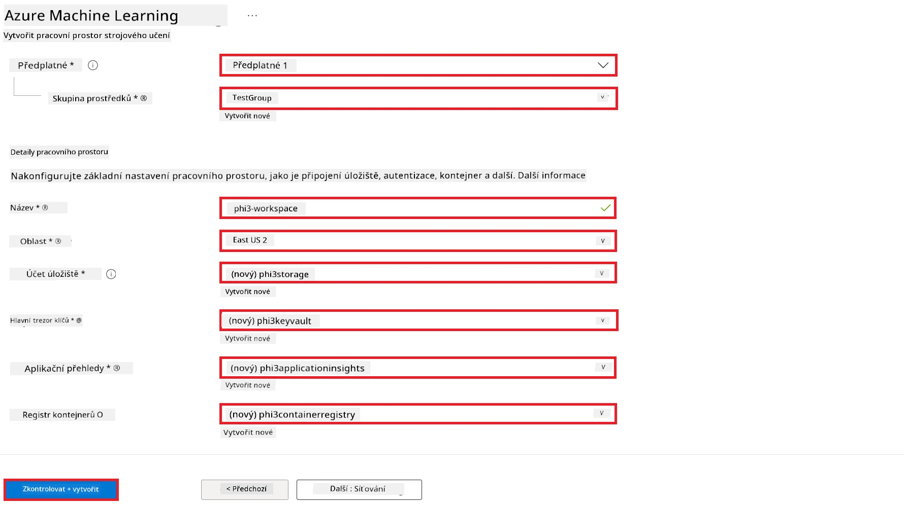

5. Klikněte na **Review + Create**.

6. Klikněte na **Create**.

### Žádost o kvóty GPU v Azure Subscription

V tomto tutoriálu se naučíte, jak doladit a nasadit model Phi-3 za pomoci GPU. Pro doladění použijete GPU *Standard_NC24ads_A100_v4*, která vyžaduje žádost o kvótu. Pro nasazení použijete GPU *Standard_NC6s_v3*, která rovněž vyžaduje žádost o kvótu.

> [!NOTE]
>
> Pouze předplatná typu Pay-As-You-Go (standardní typ předplatného) jsou způsobilá pro přidělení GPU; benefitní předplatná nejsou momentálně podporována.
>

1. Navštivte [Azure ML Studio](https://ml.azure.com/home?wt.mc_id=studentamb_279723).

1. Pro žádost o kvótu *Standard NCADSA100v4 Family* proveďte následující kroky:

    - Klikněte na **Quota** vlevo.
    - Vyberte **Virtual machine family**, např. **Standard NCADSA100v4 Family Cluster Dedicated vCPUs**, která zahrnuje GPU *Standard_NC24ads_A100_v4*.
    - Ze navigačního menu vyberte **Request quota**.

        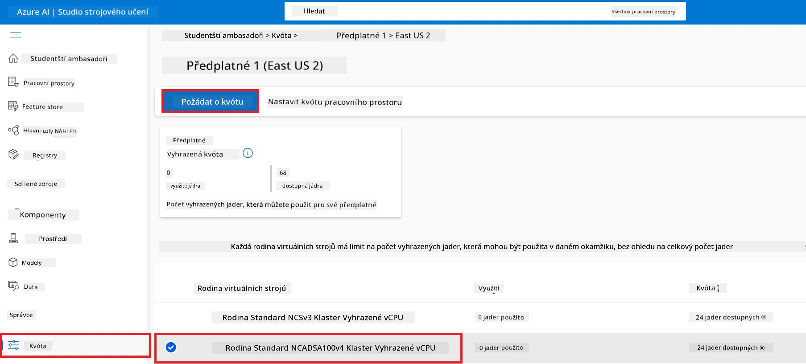

    - Na stránce Request quota zadejte požadovaný **New cores limit**, např. 24.
    - Klikněte na **Submit** pro odeslání žádosti o kvótu.

1. Pro žádost o kvótu *Standard NCSv3 Family* proveďte obdobné kroky:

    - Klikněte na **Quota** vlevo.
    - Vyberte **Virtual machine family**, např. **Standard NCSv3 Family Cluster Dedicated vCPUs**, která zahrnuje GPU *Standard_NC6s_v3*.
    - Ze navigačního menu vyberte **Request quota**.
    - Na stránce Request quota zadejte požadovaný **New cores limit**, např. 24.
    - Klikněte na **Submit** pro odeslání žádosti o kvótu.

### Přidání přiřazení rolí

Pro doladění a nasazení modelů musíte nejprve vytvořit Uživatelsky přiřazenou spravovanou identitu (User Assigned Managed Identity, UAI) a přiřadit jí odpovídající oprávnění. Tuto UAI budete používat pro autentizaci při nasazení.

#### Vytvoření Uživatelsky přiřazené spravované identity (UAI)

1. Napište do **vyhledávacího pole** „managed identities“ a ze zobrazených možností vyberte **Managed Identities**.

    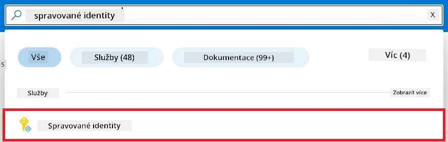

1. Klikněte na **+ Create**.

    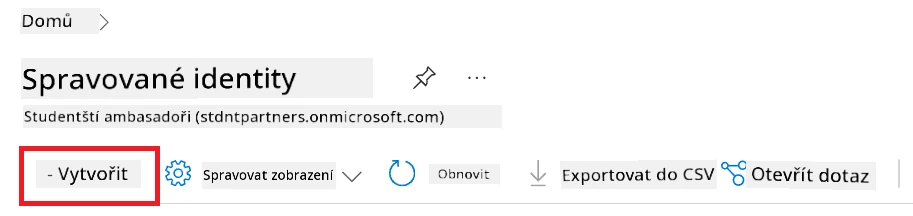

1. Proveďte následující kroky:

    - Vyberte Azure **Subscription**.
    - Vyberte **Resource group** (pokud nemáte, vytvořte novou).
    - Vyberte **Region**, který chcete použít.
    - Zadejte **Name**. Musí být jedinečný.

    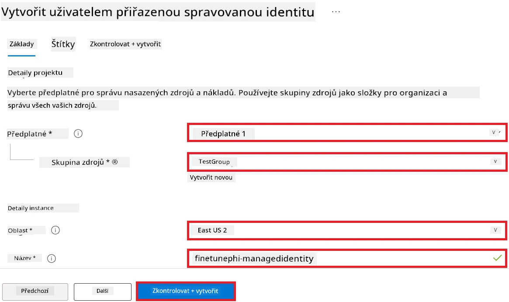

1. Klikněte na **Review + create**.

1. Klikněte na **+ Create**.

#### Přidání role Contributor spravované identitě

1. Přejděte na vytvořenou spravovanou identitu.

1. Ze seznamu vlevo vyberte **Azure role assignments**.

1. Ze navigačního menu vyberte **+Add role assignment**.

1. Na stránce Add role assignment proveďte následující kroky:
    - Nastavte **Scope** na **Resource group**.
    - Vyberte Azure **Subscription**.
    - Vyberte **Resource group**, kterou chcete použít.
    - Vyberte roli **Contributor**.

    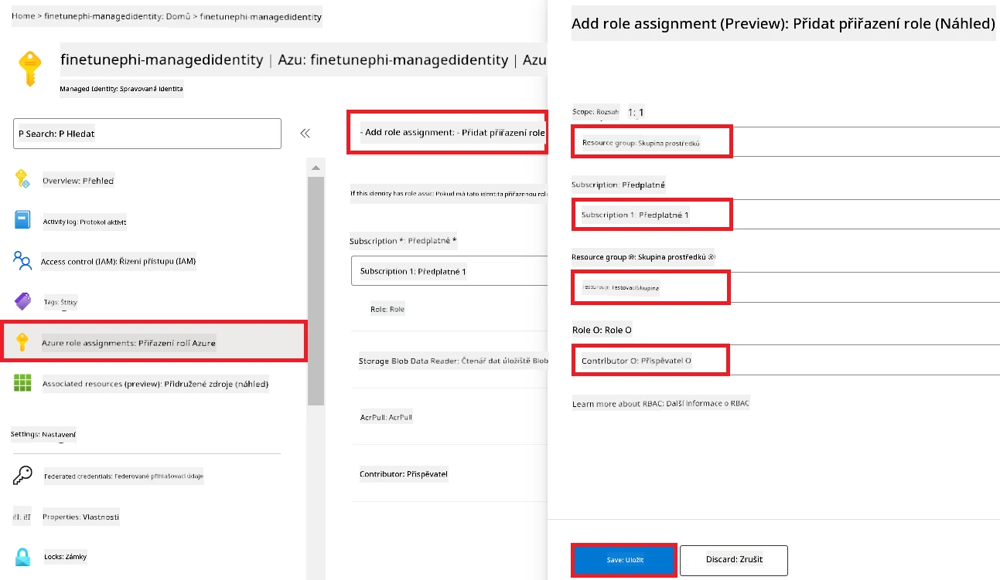

2. Klikněte na **Save**.

#### Přidání role Storage Blob Data Reader spravované identitě

1. Napište do **vyhledávacího pole** „storage accounts“ a vyberte **Storage accounts**.

    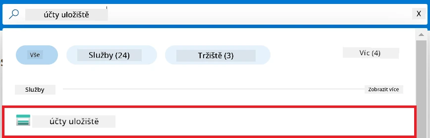

1. Vyberte storage account přidružený k Azure Machine Learning workspace, který jste vytvořili, např. *finetunephistorage*.

1. Proveďte následující kroky pro navigaci do stránky Add role assignment:

    - Přejděte do Azure Storage account, který jste vytvořili.
    - Vyberte **Access Control (IAM)** vlevo.
    - Klikněte na **+ Add** v menu.
    - Klikněte na **Add role assignment**.

    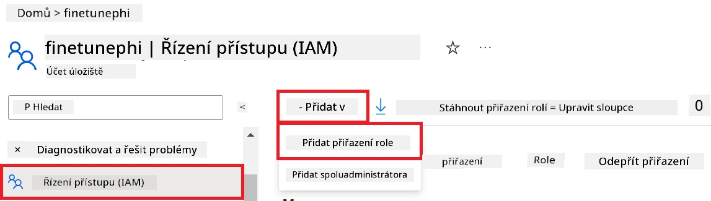

1. Na stránce Add role assignment proveďte:

    - Do vyhledávacího pole zadejte „Storage Blob Data Reader“ a vyberte **Storage Blob Data Reader**.
    - Klikněte na **Next**.
    - Na stránce Members vyberte **Assign access to** **Managed identity**.
    - Klikněte na **+ Select members**.
    - Na stránce Select managed identities vyberte Azure **Subscription**.
    - Vyberte **Managed identity** a zvolte správnou spravovanou identitu.
    - Vyberte spravovanou identitu, kterou jste vytvořili, např. *finetunephi-managedidentity*.
    - Klikněte na **Select**.

    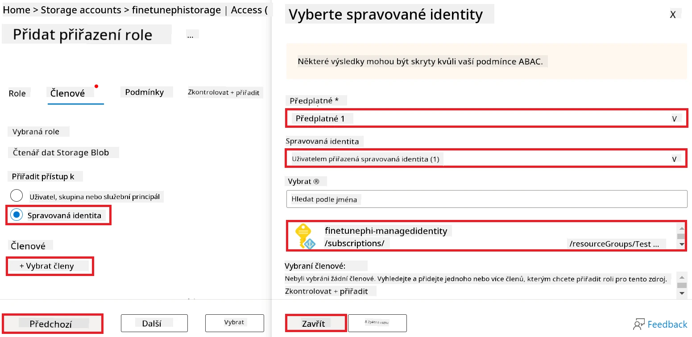

1. Klikněte na **Review + assign**.

#### Přidání role AcrPull spravované identitě

1. Napište do **vyhledávacího pole** „container registries“ a vyberte **Container registries**.

    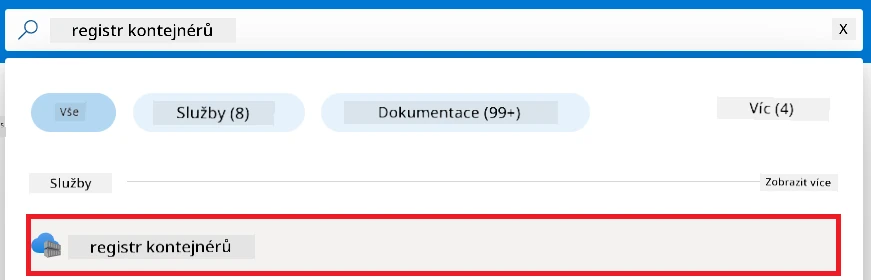

1. Vyberte container registry přidružený k Azure Machine Learning workspace, např. *finetunephicontainerregistry*.

1. Pro navigaci do stránky Add role assignment proveďte:

    - Vyberte **Access Control (IAM)** vlevo.
    - Klikněte na **+ Add**.
    - Klikněte na **Add role assignment**.

1. Na stránce Add role assignment proveďte:

    - Do vyhledávacího pole zadejte „AcrPull“ a vyberte **AcrPull**.
    - Klikněte na **Next**.
    - Na stránce Members zvolte **Assign access to** **Managed identity**.
    - Klikněte na **+ Select members**.
    - Vyberte Azure **Subscription**.
    - Vyberte **Managed identity** a správnou spravovanou identitu.
    - Vyberte spravovanou identitu, kterou jste vytvořili, např. *finetunephi-managedidentity*.
    - Klikněte na **Select**.
    - Klikněte na **Review + assign**.

### Nastavení projektu

Pro stažení datasetů potřebných pro doladění si nastavíte lokální prostředí.

V tomto cvičení:

- Vytvoříte složku, ve které budete pracovat.
- Vytvoříte virtuální prostředí.
- Nainstalujete požadované balíčky.
- Vytvoříte soubor *download_dataset.py* pro stažení datasetu.

#### Vytvoření složky pro práci

1. Otevřete terminál a zadejte následující příkaz pro vytvoření složky s názvem *finetune-phi* ve výchozí cestě.

    ```console
    mkdir finetune-phi
    ```

2. Zadejte v terminálu následující příkaz pro přechod do složky *finetune-phi*, kterou jste vytvořili.

    ```console
    cd finetune-phi
    ```

#### Vytvoření virtuálního prostředí

1. Zadejte v terminálu následující příkaz k vytvoření virtuálního prostředí s názvem *.venv*.

    ```console
    python -m venv .venv
    ```

2. Zadejte v terminálu následující příkaz k aktivaci virtuálního prostředí.

    ```console
    .venv\Scripts\activate.bat
    ```

> [!NOTE]
> Pokud to fungovalo, měli byste před výzvou příkazu vidět *(.venv)*.

#### Instalace požadovaných balíčků

1. Zadejte v terminálu následující příkazy k instalaci požadovaných balíčků.

    ```console
    pip install datasets==2.19.1
    ```

#### Vytvoření `download_dataset.py`

> [!NOTE]
> Kompletní struktura složek:
>
> ```text
> └── YourUserName
> .    └── finetune-phi
> .        └── download_dataset.py
> ```

1. Otevřete **Visual Studio Code**.

1. Vyberte z menu **File**.

1. Vyberte **Open Folder**.

1. Vyberte složku *finetune-phi*, kterou jste vytvořili, která se nachází na *C:\Users\yourUserName\finetune-phi*.

    

1. V levém panelu Visual Studio Code klikněte pravým tlačítkem a vyberte **New File** pro vytvoření nového souboru s názvem *download_dataset.py*.

    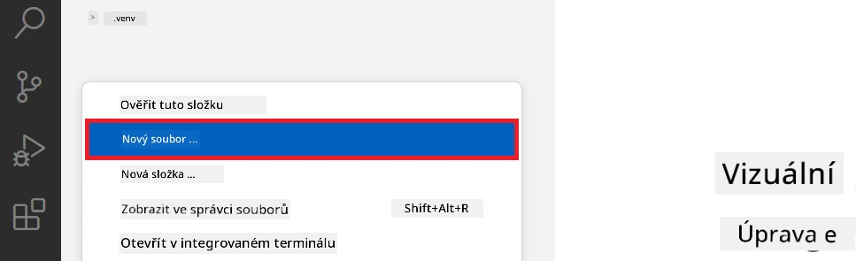

### Příprava datové sady pro doladění

V tomto cvičení spustíte soubor *download_dataset.py*, který stáhne datové sady *ultrachat_200k* do vašeho lokálního prostředí. Tyto datové sady pak použijete k doladění modelu Phi-3 v Azure Machine Learning.

V tomto cvičení provedete:

- Přidání kódu do souboru *download_dataset.py* pro stažení datových sad.
- Spuštění souboru *download_dataset.py* pro stažení datových sad do lokálního prostředí.

#### Stažení vaší datové sady pomocí *download_dataset.py*

1. Otevřete soubor *download_dataset.py* ve Visual Studio Code.

1. Přidejte následující kód do souboru *download_dataset.py*.

    ```python
    import json
    import os
    from datasets import load_dataset

    def load_and_split_dataset(dataset_name, config_name, split_ratio):
        """
        Load and split a dataset.
        """
        # Načíst datovou sadu se specifikovaným názvem, konfigurací a poměrem rozdělení
        dataset = load_dataset(dataset_name, config_name, split=split_ratio)
        print(f"Original dataset size: {len(dataset)}")
        
        # Rozdělit datovou sadu na trénovací a testovací sadu (80 % trénink, 20 % test)
        split_dataset = dataset.train_test_split(test_size=0.2)
        print(f"Train dataset size: {len(split_dataset['train'])}")
        print(f"Test dataset size: {len(split_dataset['test'])}")
        
        return split_dataset

    def save_dataset_to_jsonl(dataset, filepath):
        """
        Save a dataset to a JSONL file.
        """
        # Vytvořit adresář, pokud neexistuje
        os.makedirs(os.path.dirname(filepath), exist_ok=True)
        
        # Otevřít soubor v režimu zápisu
        with open(filepath, 'w', encoding='utf-8') as f:
            # Procházet každý záznam v datové sadě
            for record in dataset:
                # Vypsat záznam jako JSON objekt a zapsat jej do souboru
                json.dump(record, f)
                # Zapsat znak nového řádku pro oddělení záznamů
                f.write('\n')
        
        print(f"Dataset saved to {filepath}")

    def main():
        """
        Main function to load, split, and save the dataset.
        """
        # Načíst a rozdělit datovou sadu ULTRACHAT_200k se specifickou konfigurací a poměrem rozdělení
        dataset = load_and_split_dataset("HuggingFaceH4/ultrachat_200k", 'default', 'train_sft[:1%]')
        
        # Extrahovat tréninkové a testovací datové sady z rozdělení
        train_dataset = dataset['train']
        test_dataset = dataset['test']

        # Uložit tréninkovou datovou sadu do souboru JSONL
        save_dataset_to_jsonl(train_dataset, "data/train_data.jsonl")
        
        # Uložit testovací datovou sadu do samostatného souboru JSONL
        save_dataset_to_jsonl(test_dataset, "data/test_data.jsonl")

    if __name__ == "__main__":
        main()

    ```

1. Zadejte v terminálu následující příkaz pro spuštění skriptu a stažení datové sady do vašeho lokálního prostředí.

    ```console
    python download_dataset.py
    ```

1. Ověřte, že datové sady byly úspěšně uloženy do vašeho lokálního adresáře *finetune-phi/data*.

> [!NOTE]
>
> #### Poznámka o velikosti datové sady a čase doladění
>
> V tomto tutoriálu používáte pouze 1 % datové sady (`split='train[:1%]'`). To výrazně snižuje množství dat a zpomaluje jak proces nahrávání, tak doladění. Můžete upravit procento tak, abyste našli správnou rovnováhu mezi dobou tréninku a výkonem modelu. Použití menší podmnožiny datové sady zkracuje dobu doladění, což činí celý proces lépe zvládnutelný pro tento tutoriál.

## Scénář 2: Doladění modelu Phi-3 a nasazení v Azure Machine Learning Studio

### Doladění modelu Phi-3

V tomto cvičení doladíte model Phi-3 v Azure Machine Learning Studiu.

V tomto cvičení provedete:

- Vytvoření výpočetního clusteru pro doladění.
- Doladění modelu Phi-3 v Azure Machine Learning Studiu.

#### Vytvoření výpočetního clusteru pro doladění

1. Navštivte [Azure ML Studio](https://ml.azure.com/home?wt.mc_id=studentamb_279723).

1. Vyberte na levé straně záložku **Compute**.

1. Vyberte z navigačního menu **Compute clusters**.

1. Vyberte **+ New**.

    

1. Proveďte následující úkony:

    - Vyberte **Region**, který chcete používat.
    - Nastavte **Virtual machine tier** na **Dedicated**.
    - Nastavte typ virtuálního stroje na **GPU**.
    - Filtr pro velikost virtuálního stroje nastavte na **Select from all options**.
    - Vyberte velikost virtuálního stroje **Standard_NC24ads_A100_v4**.

    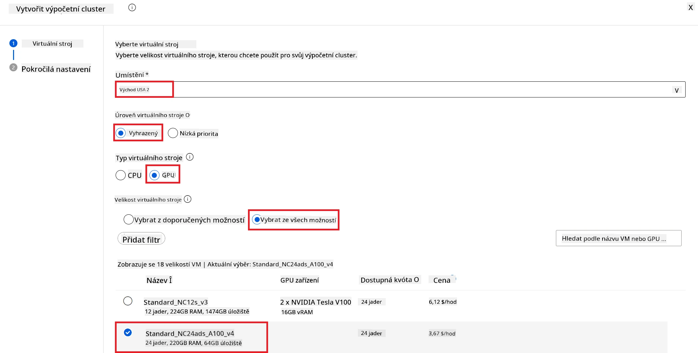

1. Klikněte na **Next**.

1. Proveďte následující úkony:

    - Zadejte **Compute name**. Musí být jedinečný.
    - Nastavte **Minimum number of nodes** na **0**.
    - Nastavte **Maximum number of nodes** na **1**.
    - Nastavte **Idle seconds before scale down** na **120**.

    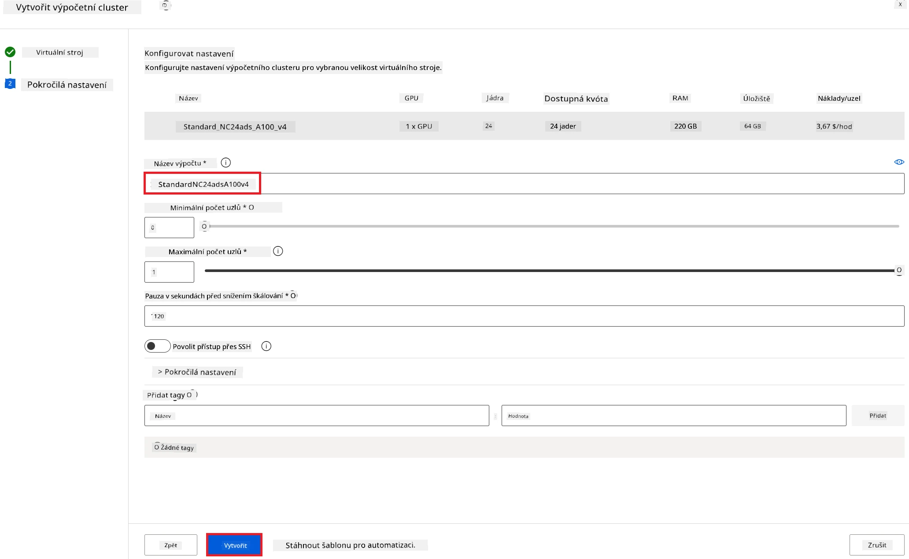

1. Vyberte **Create**.

#### Doladění modelu Phi-3

1. Navštivte [Azure ML Studio](https://ml.azure.com/home?wt.mc_id=studentamb_279723).

1. Vyberte Azure Machine Learning workspace, které jste vytvořili.

    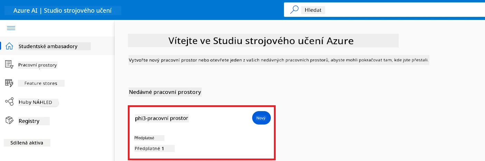

1. Proveďte následující úkony:

    - Vyberte z levé záložky **Model catalog**.
    - Do **vyhledávacího pole** napište *phi-3-mini-4k* a z možností vyberte **Phi-3-mini-4k-instruct**.

    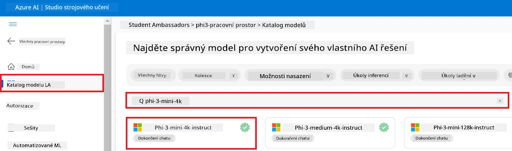

1. Vyberte v navigačním menu **Fine-tune**.

    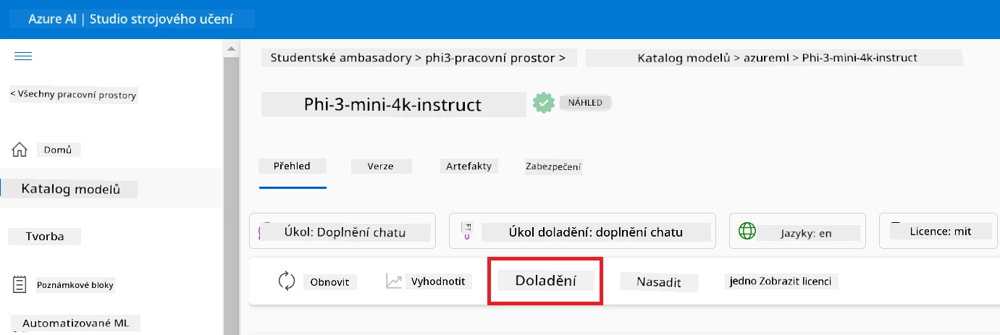

1. Proveďte následující úkony:

    - Nastavte **Select task type** na **Chat completion**.
    - Vyberte **+ Select data** pro nahrání **Traning data**.
    - Typ nahrávání validačních dat nastavte na **Provide different validation data**.
    - Vyberte **+ Select data** pro nahrání **Validation data**.

    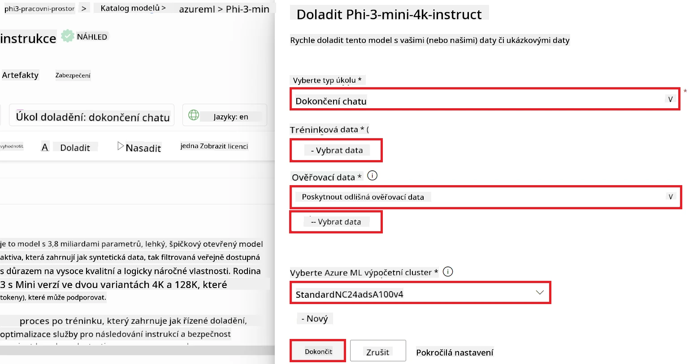

> [!TIP]
>
> Můžete vybrat **Advanced settings** a přizpůsobit konfigurace jako **learning_rate** a **lr_scheduler_type** pro optimalizaci procesu doladění podle vašich potřeb.

1. Vyberte **Finish**.

1. V tomto cvičení jste úspěšně doladili model Phi-3 pomocí Azure Machine Learning. Pamatujte, že proces doladění může trvat značnou dobu. Po spuštění jobu doladění je potřeba počkat na jeho dokončení. Stav doladění můžete sledovat na kartě Jobs v levém menu vašeho Azure Machine Learning Workspace. V dalším kroku nasadíte doladěný model a integrujete ho s Prompt flow.

    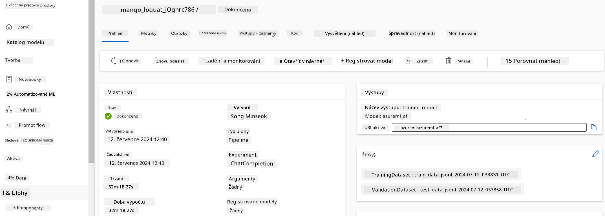

### Nasazení doladěného modelu Phi-3

Pro integraci doladěného modelu Phi-3 s Prompt flow je potřeba model nasadit tak, aby byl dostupný pro predikce v reálném čase. Proces zahrnuje registraci modelu, vytvoření online endpointu a nasazení modelu.

V tomto cvičení provedete:

- Registraci doladěného modelu v Azure Machine Learning workspace.
- Vytvoření online endpointu.
- Nasazení registrovaného doladěného modelu Phi-3.

#### Registrace doladěného modelu

1. Navštivte [Azure ML Studio](https://ml.azure.com/home?wt.mc_id=studentamb_279723).

1. Vyberte Azure Machine Learning workspace, které jste vytvořili.

    

1. Vyberte z levé záložky **Models**.
1. Vyberte **+ Register**.
1. Vyberte **From a job output**.

    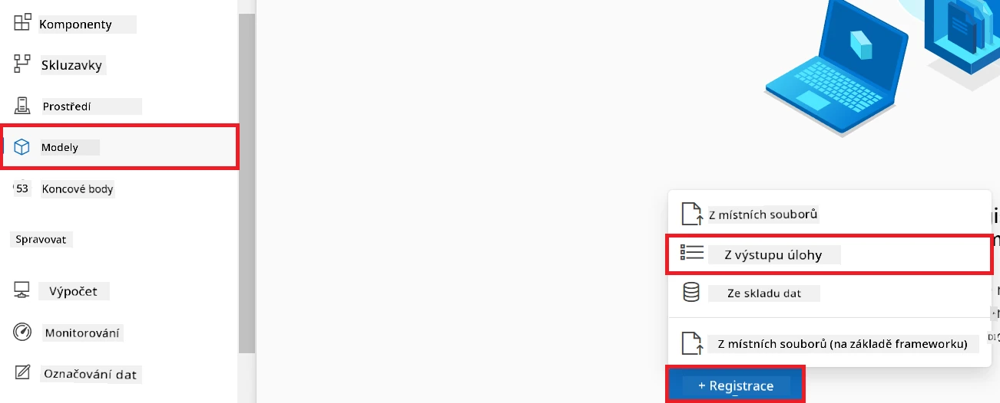

1. Vyberte job, který jste vytvořili.

    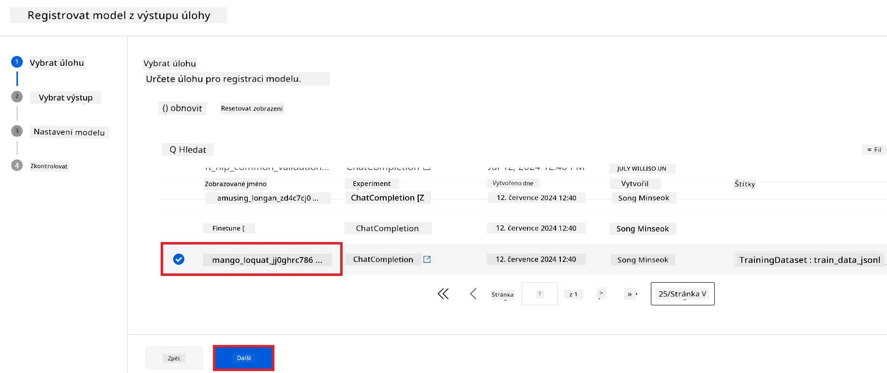

1. Vyberte **Next**.

1. Vyberte typ modelu **MLflow**.

1. Ujistěte se, že je zaškrtnutá položka **Job output**, měla by být vybrána automaticky.

    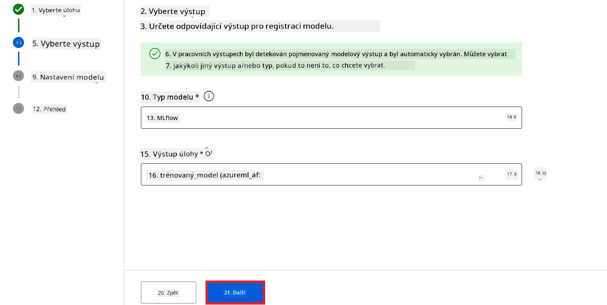

2. Vyberte **Next**.

3. Vyberte **Register**.

    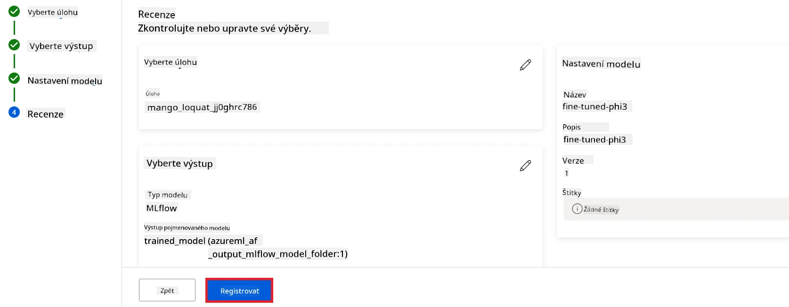

4. Registrovaný model si můžete zobrazit v menu **Models** na levé straně.

    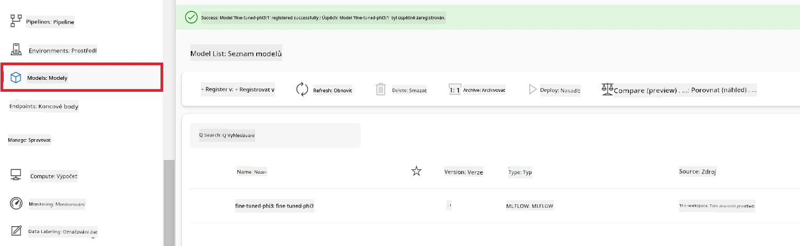

#### Nasazení doladěného modelu

1. Přejděte do Azure Machine Learning workspace, které jste vytvořili.

1. Vyberte z levé záložky **Endpoints**.

1. Vyberte z navigačního menu **Real-time endpoints**.

    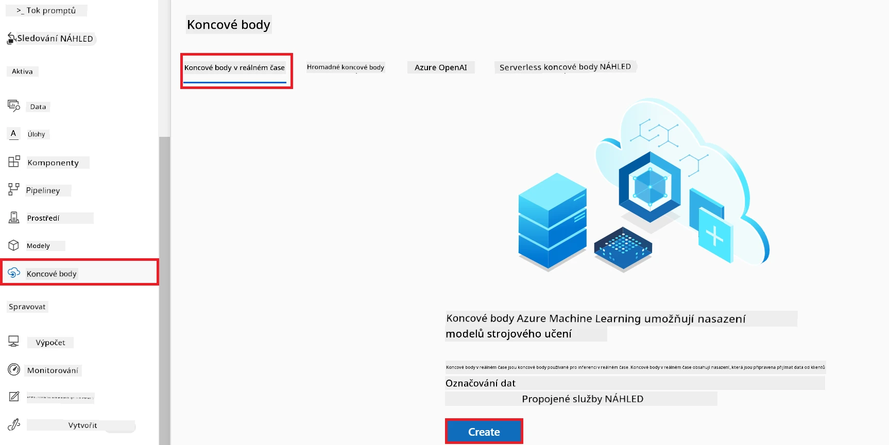

1. Vyberte **Create**.

1. Vyberte registrovaný model, který jste vytvořili.

    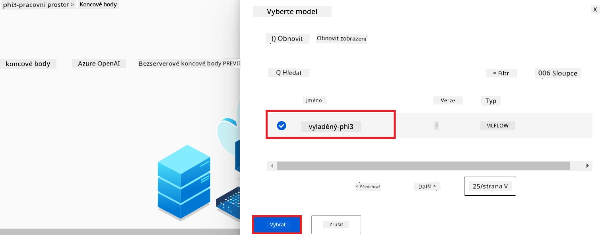

1. Vyberte **Select**.

1. Proveďte následující úkony:

    - Nastavte **Virtual machine** na *Standard_NC6s_v3*.
    - Vyberte **Instance count**, který chcete použít, například *1*.
    - Nastavte **Endpoint** na **New** pro vytvoření nového endpointu.
    - Zadejte **Endpoint name**. Musí být jedinečný.
    - Zadejte **Deployment name**. Musí být jedinečný.

    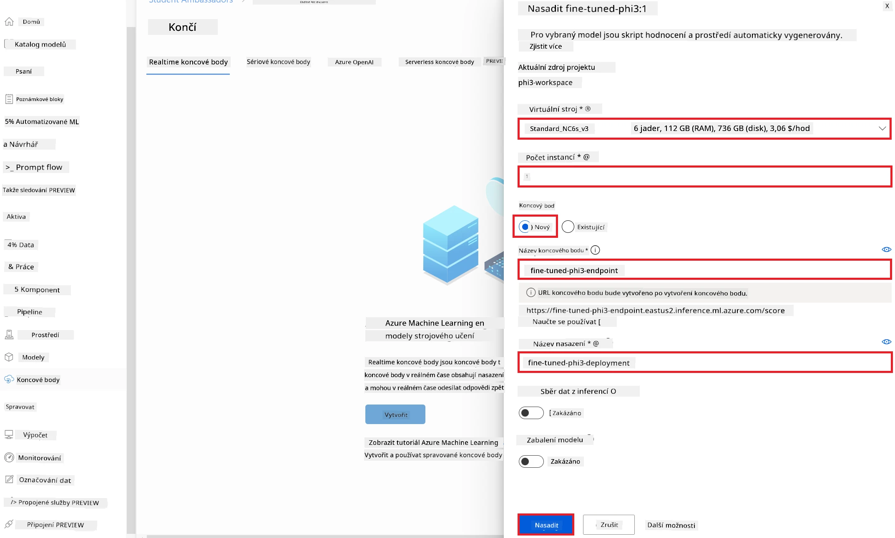

1. Klikněte na **Deploy**.

> [!WARNING]
> Abyste předešli dalším poplatkům na vašem účtu, nezapomeňte smazat vytvořený endpoint v Azure Machine Learning workspace.
>

#### Kontrola stavu nasazení v Azure Machine Learning Workspace

1. Přejděte do Azure Machine Learning workspace, které jste vytvořili.

1. Vyberte z levé záložky **Endpoints**.

1. Vyberte endpoint, který jste vytvořili.

    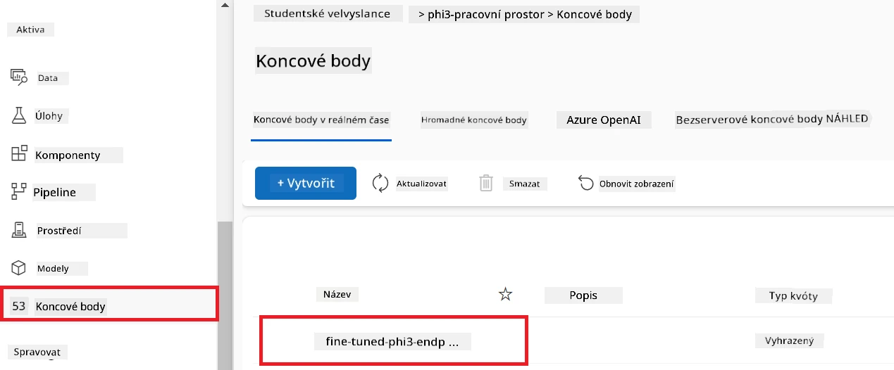

1. Na této stránce můžete spravovat endpointy během procesu nasazení.

> [!NOTE]
> Jakmile je nasazení dokončeno, ujistěte se, že **Live traffic** je nastaven na **100 %**. Pokud není, vyberte **Update traffic** pro úpravu nastavení provozu. Upozorňujeme, že model nelze testovat, pokud je provoz nastaven na 0 %.
>
> 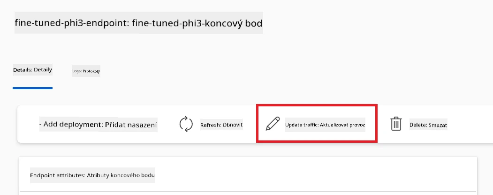
>

## Scénář 3: Integrace s Prompt flow a chat s vlastním modelem v Azure AI Foundry

### Integrace vlastního modelu Phi-3 s Prompt flow

Po úspěšném nasazení doladěného modelu jej nyní můžete integrovat s Prompt Flow, abyste mohli model používat v reálných aplikacích a umožnit různé interaktivní úkoly s vlastním modelem Phi-3.

V tomto cvičení provedete:

- Vytvoření Azure AI Foundry Hubu.
- Vytvoření Azure AI Foundry projektu.
- Vytvoření Prompt flow.
- Přidání vlastního připojení pro doladěný model Phi-3.
- Nastavení Prompt flow pro chat s vlastním modelem Phi-3.

> [!NOTE]
> Integraci s Promptflow můžete také provést pomocí Azure ML Studia. Stejný postup integrace platí i pro Azure ML Studio.

#### Vytvoření Azure AI Foundry Hubu

Nejprve musíte vytvořit Hub, než vytvoříte Projekt. Hub funguje jako Resource Group, která vám umožňuje organizovat a spravovat více projektů v rámci Azure AI Foundry.

1. Navštivte [Azure AI Foundry](https://ai.azure.com/?WT.mc_id=aiml-137032-kinfeylo).

1. Vyberte z levé záložky **All hubs**.

1. Vyberte z navigačního menu **+ New hub**.
    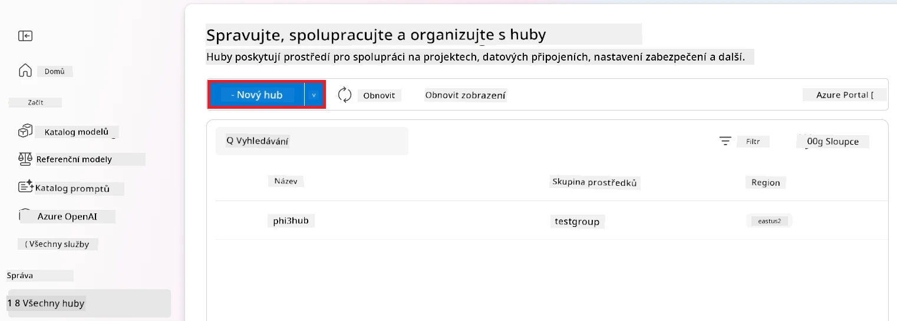

1. Proveďte následující úkoly:

    - Zadejte **Název hubu**. Musí to být jedinečná hodnota.
    - Vyberte váš Azure **Předplatné**.
    - Vyberte **Skupinu prostředků**, kterou chcete použít (v případě potřeby vytvořte novou).
    - Vyberte **Umístění**, které chcete použít.
    - Vyberte **Připojit Azure AI služby**, které chcete použít (v případě potřeby vytvořte nové).
    - Vyberte **Připojit Azure AI vyhledávání** a zvolte **Přeskočit připojení**.

    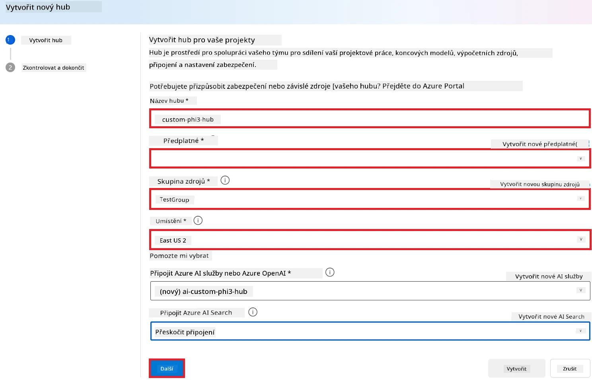

1. Vyberte **Další**.

#### Vytvořit projekt Azure AI Foundry

1. V hubu, který jste vytvořili, vyberte na levém panelu **Všechny projekty**.

1. Vyberte **+ Nový projekt** v navigačním menu.

    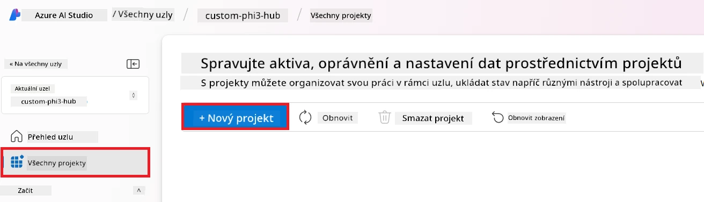

1. Zadejte **Název projektu**. Musí to být jedinečná hodnota.

    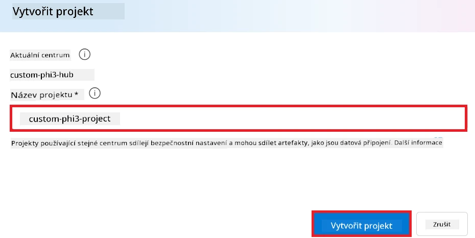

1. Vyberte **Vytvořit projekt**.

#### Přidat vlastní připojení pro doladěný model Phi-3

Pro integraci vašeho vlastní modelu Phi-3 s Prompt flow je potřeba uložit endpoint a klíč modelu jako vlastní připojení. Tento postup zajistí přístup k vašemu vlastnímu modelu Phi-3 v Prompt flow.

#### Nastavit api klíč a endpoint uri doladěného modelu Phi-3

1. Navštivte [Azure ML Studio](https://ml.azure.com/home?WT.mc_id=aiml-137032-kinfeylo).

1. Navigujte do Azure Machine learning workspace, který jste vytvořili.

1. Vyberte **Endpoints** na levém panelu.

    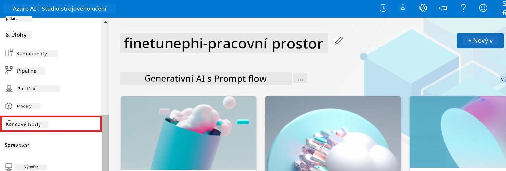

1. Vyberte endpoint, který jste vytvořili.

    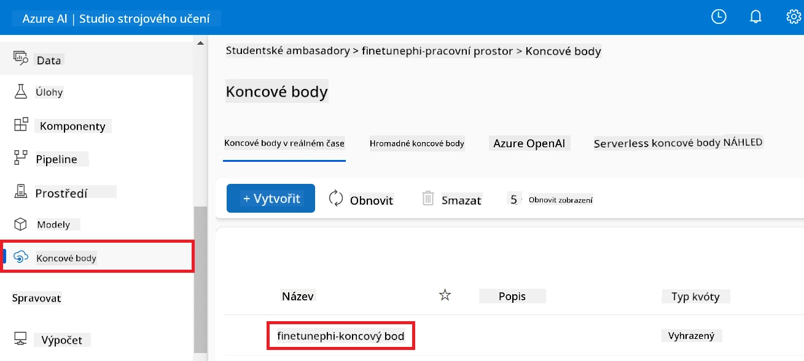

1. Vyberte **Consume** v navigačním menu.

1. Zkopírujte svůj **REST endpoint** a **Primární klíč**.

    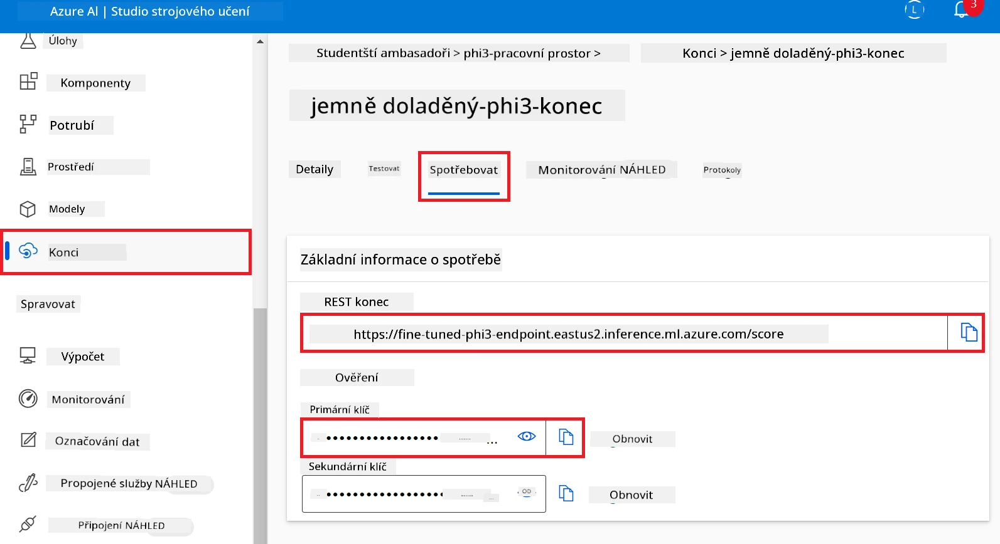

#### Přidejte vlastní připojení

1. Navštivte [Azure AI Foundry](https://ai.azure.com/?WT.mc_id=aiml-137032-kinfeylo).

1. Navigujte do Azure AI Foundry projektu, který jste vytvořili.

1. V projektu, který jste vytvořili, vyberte **Nastavení** na levém panelu.

1. Vyberte **+ Nové připojení**.

    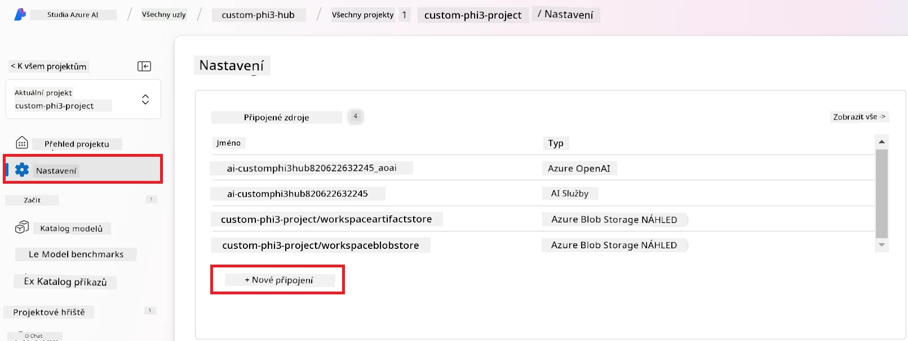

1. Vyberte **Vlastní klíče** v navigačním menu.

    

1. Proveďte následující úkoly:

    - Vyberte **+ Přidat klíč a hodnotu**.
    - Pro název klíče zadejte **endpoint** a vložte endpoint, který jste zkopírovali z Azure ML Studia, do pole hodnoty.
    - Opět vyberte **+ Přidat klíč a hodnotu**.
    - Pro název klíče zadejte **key** a vložte klíč, který jste zkopírovali z Azure ML Studia, do pole hodnoty.
    - Po přidání klíčů vyberte **je tajný** pro zabránění zveřejnění klíče.

    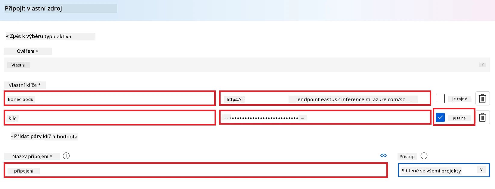

1. Vyberte **Přidat připojení**.

#### Vytvořit Prompt flow

Přidali jste vlastní připojení v Azure AI Foundry. Nyní vytvoříme Prompt flow podle následujících kroků. Poté připojíte tento Prompt flow k vlastnímu připojení, abyste mohli používat doladěný model v rámci Prompt flow.

1. Navigujte do Azure AI Foundry projektu, který jste vytvořili.

1. Vyberte **Prompt flow** na levém panelu.

1. Vyberte **+ Vytvořit** v navigačním menu.

    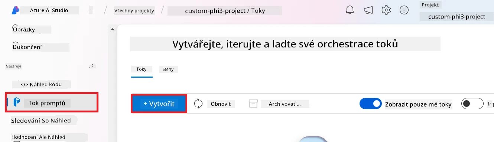

1. Vyberte **Chat flow** v navigačním menu.

    

1. Zadejte **Název složky**, kterou chcete použít.

    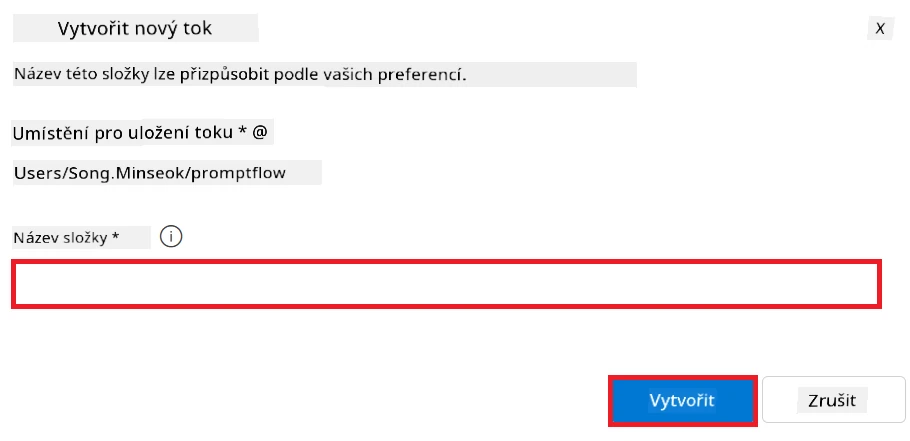

2. Vyberte **Vytvořit**.

#### Nastavit Prompt flow pro chat s vlastním modelem Phi-3

Musíte integrovat doladěný model Phi-3 do Prompt flow. Nicméně existující Prompt flow není navržen pro tento účel. Proto musíte Prompt flow přepracovat tak, aby umožnil integraci vlastního modelu.

1. V Prompt flow proveďte následující úkoly pro přestavbu stávajícího toku:

    - Vyberte **Režim surového souboru**.
    - Odstraňte veškerý stávající kód v souboru *flow.dag.yml*.
    - Přidejte následující kód do souboru *flow.dag.yml*.

        ```yml
        inputs:
          input_data:
            type: string
            default: "Who founded Microsoft?"

        outputs:
          answer:
            type: string
            reference: ${integrate_with_promptflow.output}

        nodes:
        - name: integrate_with_promptflow
          type: python
          source:
            type: code
            path: integrate_with_promptflow.py
          inputs:
            input_data: ${inputs.input_data}
        ```

    - Vyberte **Uložit**.

    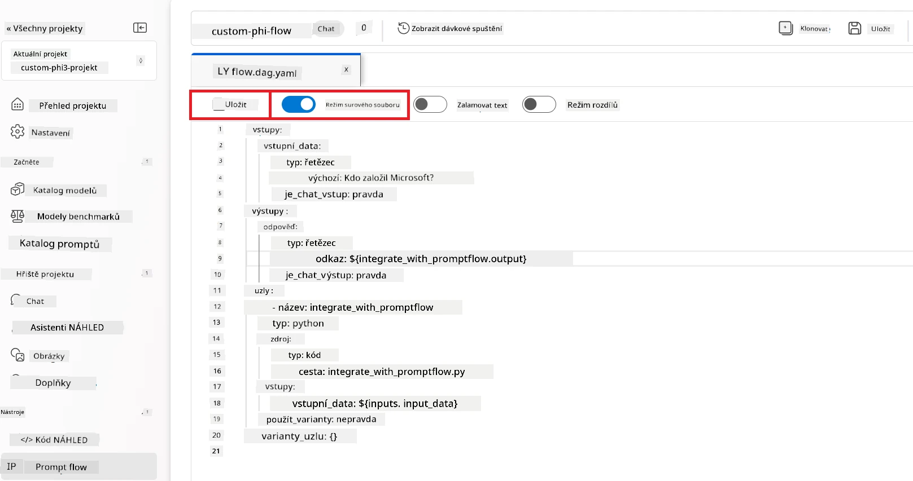

1. Přidejte následující kód do souboru *integrate_with_promptflow.py* pro použití vlastního modelu Phi-3 v Prompt flow.

    ```python
    import logging
    import requests
    from promptflow import tool
    from promptflow.connections import CustomConnection

    # Nastavení logování
    logging.basicConfig(
        format="%(asctime)s - %(levelname)s - %(name)s - %(message)s",
        datefmt="%Y-%m-%d %H:%M:%S",
        level=logging.DEBUG
    )
    logger = logging.getLogger(__name__)

    def query_phi3_model(input_data: str, connection: CustomConnection) -> str:
        """
        Send a request to the Phi-3 model endpoint with the given input data using Custom Connection.
        """

        # „connection“ je název vlastní konekce, „endpoint“ a „key“ jsou klíče v rámci vlastní konekce
        endpoint_url = connection.endpoint
        api_key = connection.key

        headers = {
            "Content-Type": "application/json",
            "Authorization": f"Bearer {api_key}"
        }
        data = {
            "input_data": {
                "input_string": [
                    {"role": "user", "content": input_data}
                ],
                "parameters": {
                    "temperature": 0.7,
                    "max_new_tokens": 128
                }
            }
        }
        try:
            response = requests.post(endpoint_url, json=data, headers=headers)
            response.raise_for_status()
            
            # Zaznamenejte celou JSON odpověď
            logger.debug(f"Full JSON response: {response.json()}")

            result = response.json()["output"]
            logger.info("Successfully received response from Azure ML Endpoint.")
            return result
        except requests.exceptions.RequestException as e:
            logger.error(f"Error querying Azure ML Endpoint: {e}")
            raise

    @tool
    def my_python_tool(input_data: str, connection: CustomConnection) -> str:
        """
        Tool function to process input data and query the Phi-3 model.
        """
        return query_phi3_model(input_data, connection)

    ```

    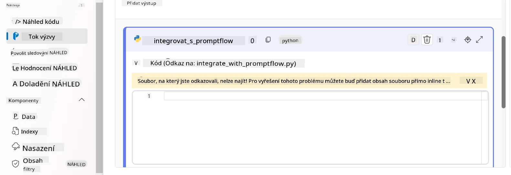

> [!NOTE]
> Pro podrobnější informace o používání Prompt flow v Azure AI Foundry můžete nahlédnout do [Prompt flow v Azure AI Foundry](https://learn.microsoft.com/azure/ai-studio/how-to/prompt-flow).

1. Vyberte **Chat vstup**, **Chat výstup** pro povolení chatu s vaším modelem.

    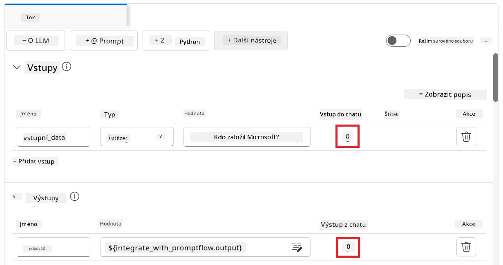

1. Nyní jste připraveni chatovat se svým vlastním modelem Phi-3. V následujícím cvičení se naučíte, jak Prompt flow spustit a použít ho pro chat s vaším doladěným modelem Phi-3.

> [!NOTE]
>
> Přestavěný tok by měl vypadat takto:
>
> 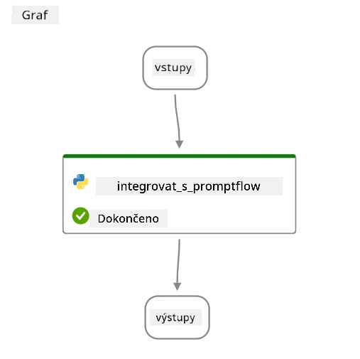
>

### Chatování s vlastním modelem Phi-3

Nyní, když jste doladili a integrovali svůj vlastní model Phi-3 s Prompt flow, jste připraveni začít s ním komunikovat. Toto cvičení vás provede procesem nastavení a zahájení chatu s vaším modelem pomocí Prompt flow. Postupováním podle těchto kroků budete moci plně využít schopnosti svého doladěného modelu Phi-3 pro různé úkoly a konverzace.

- Chatovat se svým vlastním modelem Phi-3 pomocí Prompt flow.

#### Spustit Prompt flow

1. Vyberte **Spustit výpočetní sezení** pro spuštění Prompt flow.

    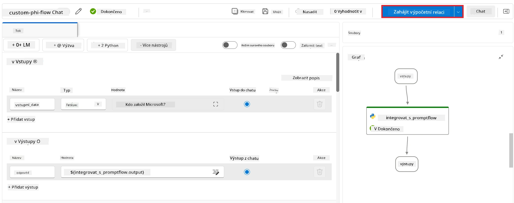

1. Vyberte **Ověřit a analyzovat vstup** pro obnovení parametrů.

    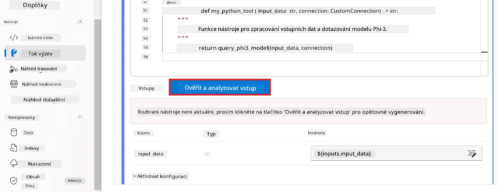

1. Vyberte **Hodnotu** u **připojení** k vlastnímu připojení, které jste vytvořili. Například *connection*.

    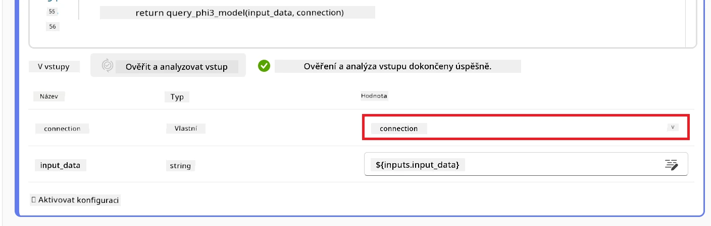

#### Chatovat s vlastním modelem

1. Vyberte **Chat**.

    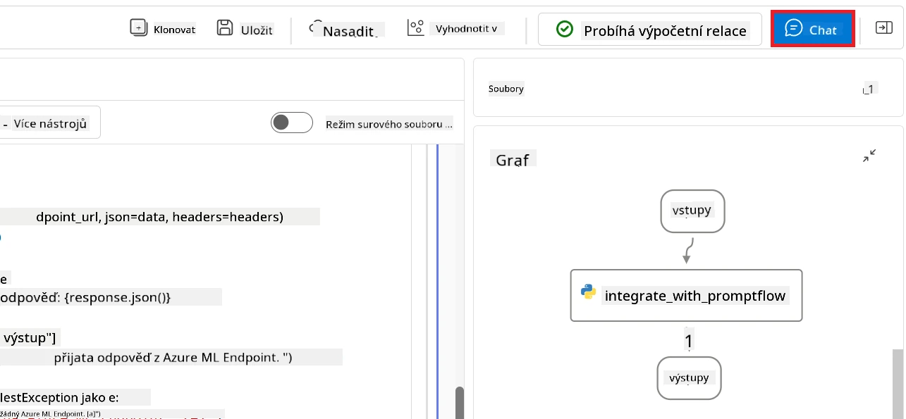

1. Zde je příklad výsledků: nyní můžete chatovat se svým vlastním modelem Phi-3. Doporučuje se klást otázky založené na datech použitých pro doladění.

    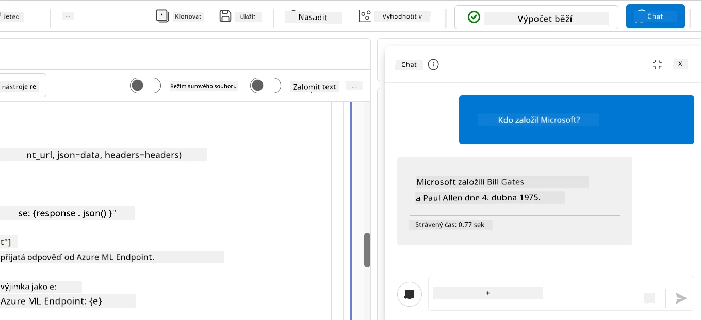

---

<!-- CO-OP TRANSLATOR DISCLAIMER START -->
**Prohlášení o vyloučení odpovědnosti**:
Tento dokument byl přeložen pomocí AI překladatelské služby [Co-op Translator](https://github.com/Azure/co-op-translator). I když usilujeme o přesnost, mějte prosím na paměti, že automatizované překlady mohou obsahovat chyby nebo nepřesnosti. Původní dokument v jeho mateřském jazyce by měl být považován za závazný zdroj. Pro důležité informace je doporučován profesionální lidský překlad. Nepřebíráme odpovědnost za jakékoli nedorozumění nebo nesprávné interpretace vyplývající z používání tohoto překladu.
<!-- CO-OP TRANSLATOR DISCLAIMER END -->