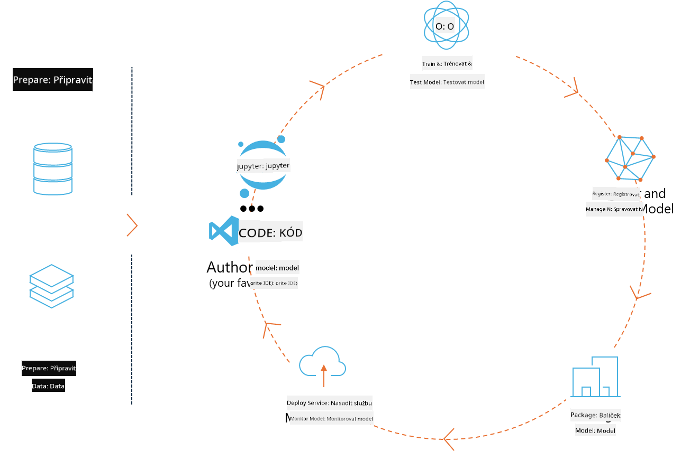
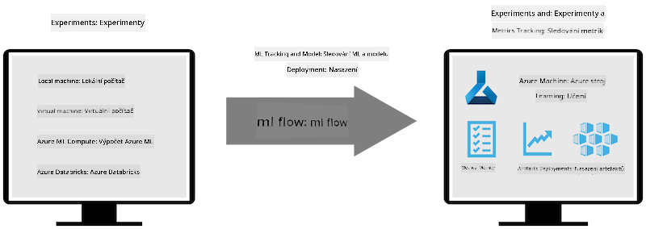

<!--
CO_OP_TRANSLATOR_METADATA:
{
  "original_hash": "f61c383bbf0c3dac97e43f833c258731",
  "translation_date": "2025-07-17T02:35:19+00:00",
  "source_file": "md/02.Application/01.TextAndChat/Phi3/E2E_Phi-3-MLflow.md",
  "language_code": "cs"
}
-->
# MLflow

[MLflow](https://mlflow.org/) je open-source platforma navržená pro správu celého životního cyklu strojového učení.



MLFlow se používá ke správě životního cyklu ML, včetně experimentování, reprodukovatelnosti, nasazení a centrálního registru modelů. MLflow aktuálně nabízí čtyři komponenty.

- **MLflow Tracking:** Zaznamenávání a dotazování experimentů, kódu, konfigurace dat a výsledků.
- **MLflow Projects:** Balení datově vědeckého kódu do formátu, který umožňuje reprodukovat běhy na jakékoli platformě.
- **Mlflow Models:** Nasazení modelů strojového učení v různých prostředích pro servírování.
- **Model Registry:** Ukládání, anotace a správa modelů v centrálním úložišti.

Obsahuje funkce pro sledování experimentů, balení kódu do reprodukovatelných běhů a sdílení a nasazení modelů. MLFlow je integrován do Databricks a podporuje různé ML knihovny, díky čemuž je nezávislý na konkrétní knihovně. Lze jej použít s jakoukoli knihovnou strojového učení a v jakémkoli programovacím jazyce, protože poskytuje REST API a CLI pro pohodlí.



Hlavní vlastnosti MLFlow zahrnují:

- **Sledování experimentů:** Zaznamenávání a porovnávání parametrů a výsledků.
- **Správa modelů:** Nasazení modelů na různé platformy pro servírování a inferenci.
- **Model Registry:** Spolupráce na správě životního cyklu MLflow modelů, včetně verzování a anotací.
- **Projects:** Balení ML kódu pro sdílení nebo produkční použití.

MLFlow také podporuje MLOps cyklus, který zahrnuje přípravu dat, registraci a správu modelů, balení modelů pro spuštění, nasazení služeb a monitorování modelů. Cílem je zjednodušit přechod od prototypu k produkčnímu workflow, zejména v cloudových a edge prostředích.

## E2E scénář – Vytvoření wrapperu a použití Phi-3 jako MLFlow modelu

V tomto E2E příkladu ukážeme dva různé přístupy k vytvoření wrapperu kolem malého jazykového modelu Phi-3 (SLM) a jeho spuštění jako MLFlow modelu buď lokálně, nebo v cloudu, například v Azure Machine Learning workspace.


| Projekt | Popis | Umístění |
| ------------ | ----------- | -------- |
| Transformer Pipeline | Transformer Pipeline je nejjednodušší možnost, jak vytvořit wrapper, pokud chcete použít HuggingFace model s experimentální variantou MLFlow pro transformery. | [**TransformerPipeline.ipynb**](../../../../../../code/06.E2E/E2E_Phi-3-MLflow_TransformerPipeline.ipynb) |
| Custom Python Wrapper | V době psaní tento transformer pipeline nepodporoval generování MLFlow wrapperu pro HuggingFace modely v ONNX formátu, ani s experimentálním balíčkem optimum Python. Pro takové případy můžete vytvořit vlastní Python wrapper pro MLFlow model. | [**CustomPythonWrapper.ipynb**](../../../../../../code/06.E2E/E2E_Phi-3-MLflow_CustomPythonWrapper.ipynb) |

## Projekt: Transformer Pipeline

1. Budete potřebovat příslušné Python balíčky z MLFlow a HuggingFace:

    ``` Python
    import mlflow
    import transformers
    ```

2. Dále byste měli inicializovat transformer pipeline odkazem na cílový Phi-3 model v registru HuggingFace. Jak je vidět z modelové karty _Phi-3-mini-4k-instruct_, jeho úkol je typu „Text Generation“:

    ``` Python
    pipeline = transformers.pipeline(
        task = "text-generation",
        model = "microsoft/Phi-3-mini-4k-instruct"
    )
    ```

3. Nyní můžete uložit transformer pipeline modelu Phi-3 do formátu MLFlow a zadat další detaily, jako je cílová cesta pro artefakty, specifická nastavení modelu a typ inference API:

    ``` Python
    model_info = mlflow.transformers.log_model(
        transformers_model = pipeline,
        artifact_path = "phi3-mlflow-model",
        model_config = model_config,
        task = "llm/v1/chat"
    )
    ```

## Projekt: Custom Python Wrapper

1. Zde můžeme využít Microsoft API [ONNX Runtime generate()](https://github.com/microsoft/onnxruntime-genai) pro inferenci ONNX modelu a kódování/dekódování tokenů. Pro cílový výpočet si vyberete balíček _onnxruntime_genai_, v níže uvedeném příkladu je cílem CPU:

    ``` Python
    import mlflow
    from mlflow.models import infer_signature
    import onnxruntime_genai as og
    ```

1. Naše vlastní třída implementuje dvě metody: _load_context()_ pro inicializaci **ONNX modelu** Phi-3 Mini 4K Instruct, **parametrů generátoru** a **tokenizéru**; a _predict()_ pro generování výstupních tokenů na základě zadaného promptu:

    ``` Python
    class Phi3Model(mlflow.pyfunc.PythonModel):
        def load_context(self, context):
            # Retrieving model from the artifacts
            model_path = context.artifacts["phi3-mini-onnx"]
            model_options = {
                 "max_length": 300,
                 "temperature": 0.2,         
            }
        
            # Defining the model
            self.phi3_model = og.Model(model_path)
            self.params = og.GeneratorParams(self.phi3_model)
            self.params.set_search_options(**model_options)
            
            # Defining the tokenizer
            self.tokenizer = og.Tokenizer(self.phi3_model)
    
        def predict(self, context, model_input):
            # Retrieving prompt from the input
            prompt = model_input["prompt"][0]
            self.params.input_ids = self.tokenizer.encode(prompt)
    
            # Generating the model's response
            response = self.phi3_model.generate(self.params)
    
            return self.tokenizer.decode(response[0][len(self.params.input_ids):])
    ```

1. Nyní můžete použít funkci _mlflow.pyfunc.log_model()_ k vytvoření vlastního Python wrapperu (ve formátu pickle) pro model Phi-3 spolu s původním ONNX modelem a potřebnými závislostmi:

    ``` Python
    model_info = mlflow.pyfunc.log_model(
        artifact_path = artifact_path,
        python_model = Phi3Model(),
        artifacts = {
            "phi3-mini-onnx": "cpu_and_mobile/cpu-int4-rtn-block-32-acc-level-4",
        },
        input_example = input_example,
        signature = infer_signature(input_example, ["Run"]),
        extra_pip_requirements = ["torch", "onnxruntime_genai", "numpy"],
    )
    ```

## Signatury generovaných MLFlow modelů

1. V kroku 3 projektu Transformer Pipeline výše jsme nastavili úkol MLFlow modelu na „_llm/v1/chat_“. Takové nastavení generuje API wrapper modelu, kompatibilní s OpenAI Chat API, jak je ukázáno níže:

    ``` Python
    {inputs: 
      ['messages': Array({content: string (required), name: string (optional), role: string (required)}) (required), 'temperature': double (optional), 'max_tokens': long (optional), 'stop': Array(string) (optional), 'n': long (optional), 'stream': boolean (optional)],
    outputs: 
      ['id': string (required), 'object': string (required), 'created': long (required), 'model': string (required), 'choices': Array({finish_reason: string (required), index: long (required), message: {content: string (required), name: string (optional), role: string (required)} (required)}) (required), 'usage': {completion_tokens: long (required), prompt_tokens: long (required), total_tokens: long (required)} (required)],
    params: 
      None}
    ```

1. Výsledkem je, že můžete odeslat svůj prompt v následujícím formátu:

    ``` Python
    messages = [{"role": "user", "content": "What is the capital of Spain?"}]
    ```

1. Poté použijte post-processing kompatibilní s OpenAI API, např. _response[0][‘choices’][0][‘message’][‘content’]_, pro úpravu výstupu do podoby jako je tato:

    ``` JSON
    Question: What is the capital of Spain?
    
    Answer: The capital of Spain is Madrid. It is the largest city in Spain and serves as the political, economic, and cultural center of the country. Madrid is located in the center of the Iberian Peninsula and is known for its rich history, art, and architecture, including the Royal Palace, the Prado Museum, and the Plaza Mayor.
    
    Usage: {'prompt_tokens': 11, 'completion_tokens': 73, 'total_tokens': 84}
    ```

1. V kroku 3 projektu Custom Python Wrapper výše umožňujeme balíčku MLFlow vygenerovat signaturu modelu z daného vstupního příkladu. Signatura našeho MLFlow wrapperu bude vypadat takto:

    ``` Python
    {inputs: 
      ['prompt': string (required)],
    outputs: 
      [string (required)],
    params: 
      None}
    ```

1. Náš prompt by tedy měl obsahovat klíč slovníku "prompt", podobně jako zde:

    ``` Python
    {"prompt": "<|system|>You are a stand-up comedian.<|end|><|user|>Tell me a joke about atom<|end|><|assistant|>",}
    ```

1. Výstup modelu bude pak poskytnut ve formátu řetězce:

    ``` JSON
    Alright, here's a little atom-related joke for you!
    
    Why don't electrons ever play hide and seek with protons?
    
    Because good luck finding them when they're always "sharing" their electrons!
    
    Remember, this is all in good fun, and we're just having a little atomic-level humor!
    ```

**Prohlášení o vyloučení odpovědnosti**:  
Tento dokument byl přeložen pomocí AI překladatelské služby [Co-op Translator](https://github.com/Azure/co-op-translator). I když usilujeme o přesnost, mějte prosím na paměti, že automatizované překlady mohou obsahovat chyby nebo nepřesnosti. Původní dokument v jeho mateřském jazyce by měl být považován za autoritativní zdroj. Pro důležité informace se doporučuje profesionální lidský překlad. Nejsme odpovědní za jakékoliv nedorozumění nebo nesprávné výklady vyplývající z použití tohoto překladu.