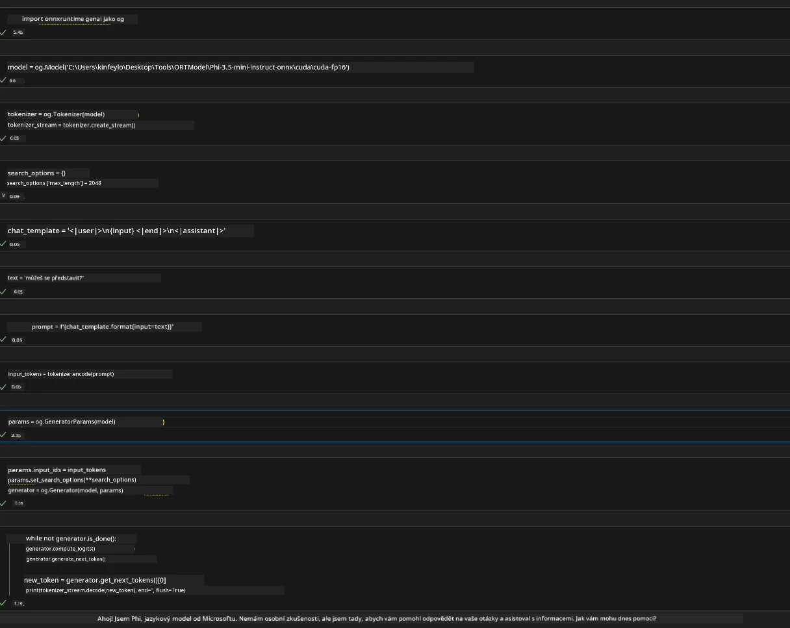
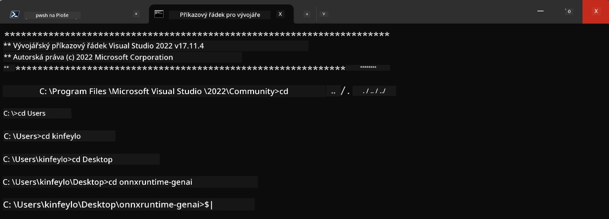

<!--
CO_OP_TRANSLATOR_METADATA:
{
  "original_hash": "b066fc29c1b2129df84e027cb75119ce",
  "translation_date": "2025-07-17T02:46:42+00:00",
  "source_file": "md/02.Application/01.TextAndChat/Phi3/ORTWindowGPUGuideline.md",
  "language_code": "cs"
}
-->
# **Pokyny pro OnnxRuntime GenAI Windows GPU**

Tyto pokyny popisují kroky pro nastavení a používání ONNX Runtime (ORT) s GPU na Windows. Jsou navrženy tak, aby vám pomohly využít akceleraci pomocí GPU pro vaše modely, čímž zlepšíte výkon a efektivitu.

Dokument obsahuje rady ohledně:

- Nastavení prostředí: Instrukce pro instalaci potřebných závislostí jako CUDA, cuDNN a ONNX Runtime.
- Konfigurace: Jak nastavit prostředí a ONNX Runtime pro efektivní využití GPU zdrojů.
- Tipy na optimalizaci: Doporučení, jak doladit nastavení GPU pro nejlepší výkon.

### **1. Python 3.10.x /3.11.8**

   ***Poznámka*** Doporučujeme použít [miniforge](https://github.com/conda-forge/miniforge/releases/latest/download/Miniforge3-Windows-x86_64.exe) jako vaše Python prostředí

   ```bash

   conda create -n pydev python==3.11.8

   conda activate pydev

   ```

   ***Připomenutí*** Pokud máte nainstalovanou nějakou python ONNX knihovnu, prosím odinstalujte ji

### **2. Instalace CMake pomocí winget**

   ```bash

   winget install -e --id Kitware.CMake

   ```

### **3. Instalace Visual Studio 2022 - Desktop Development s C++**

   ***Poznámka*** Pokud nechcete kompilovat, tento krok můžete přeskočit


### **4. Instalace NVIDIA ovladače**

1. **NVIDIA GPU Driver**  [https://www.nvidia.com/en-us/drivers/](https://www.nvidia.com/en-us/drivers/)

2. **NVIDIA CUDA 12.4** [https://developer.nvidia.com/cuda-12-4-0-download-archive](https://developer.nvidia.com/cuda-12-4-0-download-archive)

3. **NVIDIA CUDNN 9.4**  [https://developer.nvidia.com/cudnn-downloads](https://developer.nvidia.com/cudnn-downloads)

***Připomenutí*** Použijte prosím výchozí nastavení během instalace

### **5. Nastavení NVIDIA prostředí**

Zkopírujte NVIDIA CUDNN 9.4 složky lib, bin, include do NVIDIA CUDA 12.4 složek lib, bin, include

- zkopírujte soubory z *'C:\Program Files\NVIDIA\CUDNN\v9.4\bin\12.6'* do  *'C:\Program Files\NVIDIA GPU Computing Toolkit\CUDA\v12.4\bin'*

- zkopírujte soubory z *'C:\Program Files\NVIDIA\CUDNN\v9.4\include\12.6'* do  *'C:\Program Files\NVIDIA GPU Computing Toolkit\CUDA\v12.4\include'*

- zkopírujte soubory z *'C:\Program Files\NVIDIA\CUDNN\v9.4\lib\12.6'* do  *'C:\Program Files\NVIDIA GPU Computing Toolkit\CUDA\v12.4\lib\x64'*

### **6. Stažení Phi-3.5-mini-instruct-onnx**

   ```bash

   winget install -e --id Git.Git

   winget install -e --id GitHub.GitLFS

   git lfs install

   git clone https://huggingface.co/microsoft/Phi-3.5-mini-instruct-onnx

   ```

### **7. Spuštění InferencePhi35Instruct.ipynb**

   Otevřete [Notebook](../../../../../../code/09.UpdateSamples/Aug/ortgpu-phi35-instruct.ipynb) a spusťte



### **8. Kompilace ORT GenAI GPU**

   ***Poznámka*** 
   
   1. Nejprve odinstalujte všechny balíčky související s onnx, onnxruntime a onnxruntime-genai

   ```bash

   pip list 
   
   ```

   Poté odinstalujte všechny onnxruntime knihovny, například

   ```bash

   pip uninstall onnxruntime

   pip uninstall onnxruntime-genai

   pip uninstall onnxruntume-genai-cuda
   
   ```

   2. Zkontrolujte podporu rozšíření ve Visual Studiu

   Zkontrolujte složku C:\Program Files\NVIDIA GPU Computing Toolkit\CUDA\v12.4\extras, zda obsahuje C:\Program Files\NVIDIA GPU Computing Toolkit\CUDA\v12.4\extras\visual_studio_integration. 
   
   Pokud tam není, zkontrolujte jiné složky CUDA toolkit a zkopírujte složku visual_studio_integration a její obsah do C:\Program Files\NVIDIA GPU Computing Toolkit\CUDA\v12.4\extras\visual_studio_integration

   - Pokud nechcete kompilovat, tento krok můžete přeskočit

   ```bash

   git clone https://github.com/microsoft/onnxruntime-genai

   ```

   - Stáhněte [https://github.com/microsoft/onnxruntime/releases/download/v1.19.2/onnxruntime-win-x64-gpu-1.19.2.zip](https://github.com/microsoft/onnxruntime/releases/download/v1.19.2/onnxruntime-win-x64-gpu-1.19.2.zip)

   - Rozbalte onnxruntime-win-x64-gpu-1.19.2.zip, přejmenujte složku na **ort** a zkopírujte ji do onnxruntime-genai

   - Pomocí Windows Terminálu otevřete Developer Command Prompt pro VS 2022 a přejděte do onnxruntime-genai



   - Kompilujte s vaším python prostředím

   ```bash

   cd onnxruntime-genai

   python build.py --use_cuda  --cuda_home "C:\Program Files\NVIDIA GPU Computing Toolkit\CUDA\v12.4" --config Release
 

   cd build/Windows/Release/Wheel

   pip install .whl

   ```

**Prohlášení o vyloučení odpovědnosti**:  
Tento dokument byl přeložen pomocí AI překladatelské služby [Co-op Translator](https://github.com/Azure/co-op-translator). I když usilujeme o přesnost, mějte prosím na paměti, že automatické překlady mohou obsahovat chyby nebo nepřesnosti. Původní dokument v jeho mateřském jazyce by měl být považován za závazný zdroj. Pro důležité informace se doporučuje profesionální lidský překlad. Nejsme odpovědní za jakékoliv nedorozumění nebo nesprávné výklady vyplývající z použití tohoto překladu.