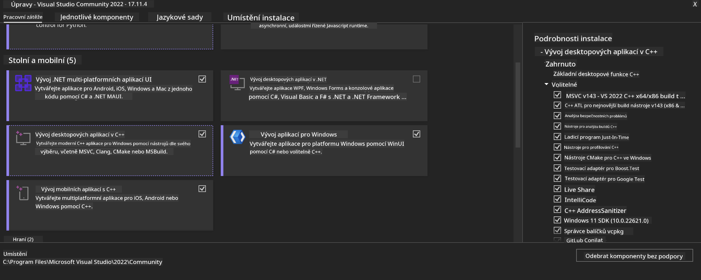
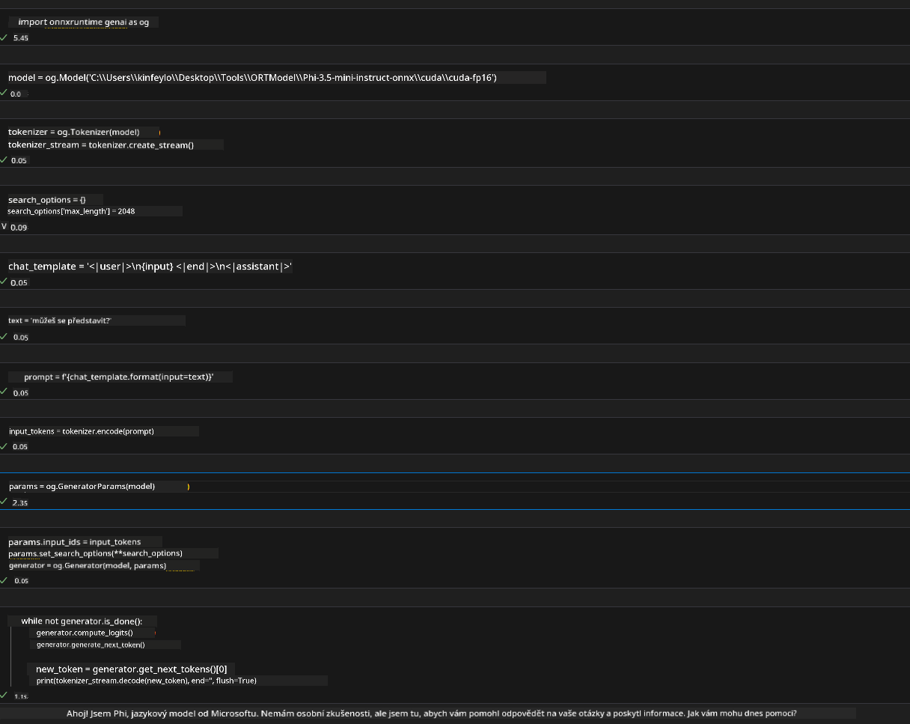
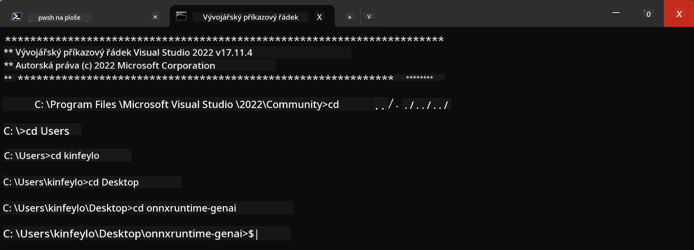

<!--
CO_OP_TRANSLATOR_METADATA:
{
  "original_hash": "b066fc29c1b2129df84e027cb75119ce",
  "translation_date": "2025-05-09T18:46:10+00:00",
  "source_file": "md/02.Application/01.TextAndChat/Phi3/ORTWindowGPUGuideline.md",
  "language_code": "cs"
}
-->
# **Richtlinie für OnnxRuntime GenAI Windows GPU**

Diese Richtlinie beschreibt die Schritte zur Einrichtung und Nutzung von ONNX Runtime (ORT) mit GPUs unter Windows. Sie soll Ihnen helfen, GPU-Beschleunigung für Ihre Modelle zu nutzen und dadurch Leistung und Effizienz zu steigern.

Das Dokument gibt Hinweise zu:

- Umgebungseinrichtung: Anweisungen zur Installation der notwendigen Abhängigkeiten wie CUDA, cuDNN und ONNX Runtime.
- Konfiguration: Wie Sie die Umgebung und ONNX Runtime konfigurieren, um GPU-Ressourcen effektiv zu nutzen.
- Optimierungstipps: Empfehlungen zur Feinabstimmung Ihrer GPU-Einstellungen für optimale Leistung.

### **1. Python 3.10.x /3.11.8**

   ***Hinweis*** Empfohlen wird die Verwendung von [miniforge](https://github.com/conda-forge/miniforge/releases/latest/download/Miniforge3-Windows-x86_64.exe) als Ihre Python-Umgebung

   ```bash

   conda create -n pydev python==3.11.8

   conda activate pydev

   ```

   ***Erinnerung*** Falls Sie eine Python ONNX-Bibliothek installiert haben, deinstallieren Sie diese bitte

### **2. Installation von CMake mit winget**

   ```bash

   winget install -e --id Kitware.CMake

   ```

### **3. Installation von Visual Studio 2022 - Desktopentwicklung mit C++**

   ***Hinweis*** Wenn Sie nicht kompilieren möchten, können Sie diesen Schritt überspringen



### **4. Installation des NVIDIA-Treibers**

1. **NVIDIA GPU Driver**  [https://www.nvidia.com/en-us/drivers/](https://www.nvidia.com/en-us/drivers/)

2. **NVIDIA CUDA 12.4** [https://developer.nvidia.com/cuda-12-4-0-download-archive](https://developer.nvidia.com/cuda-12-4-0-download-archive)

3. **NVIDIA CUDNN 9.4**  [https://developer.nvidia.com/cudnn-downloads](https://developer.nvidia.com/cudnn-downloads)

***Erinnerung*** Bitte verwenden Sie die Standardeinstellungen während der Installation

### **5. NVIDIA-Umgebung einrichten**

Kopieren Sie die NVIDIA CUDNN 9.4 lib, bin und include Dateien in die entsprechenden Ordner von NVIDIA CUDA 12.4

- Kopieren Sie Dateien aus *'C:\Program Files\NVIDIA\CUDNN\v9.4\bin\12.6'* nach *'C:\Program Files\NVIDIA GPU Computing Toolkit\CUDA\v12.4\bin'*

- Kopieren Sie Dateien aus *'C:\Program Files\NVIDIA\CUDNN\v9.4\include\12.6'* nach *'C:\Program Files\NVIDIA GPU Computing Toolkit\CUDA\v12.4\include'*

- Kopieren Sie Dateien aus *'C:\Program Files\NVIDIA\CUDNN\v9.4\lib\12.6'* nach *'C:\Program Files\NVIDIA GPU Computing Toolkit\CUDA\v12.4\lib\x64'*

### **6. Download Phi-3.5-mini-instruct-onnx**

   ```bash

   winget install -e --id Git.Git

   winget install -e --id GitHub.GitLFS

   git lfs install

   git clone https://huggingface.co/microsoft/Phi-3.5-mini-instruct-onnx

   ```

### **7. Ausführen von InferencePhi35Instruct.ipynb**

   Öffnen Sie das [Notebook](../../../../../../code/09.UpdateSamples/Aug/ortgpu-phi35-instruct.ipynb) und führen Sie es aus



### **8. Kompilieren von ORT GenAI GPU**

   ***Hinweis*** 
   
   1. Bitte deinstallieren Sie zuerst alle ONNX-, onnxruntime- und onnxruntime-genai-Pakete

   ```bash

   pip list 
   
   ```

   Danach deinstallieren Sie alle onnxruntime-Bibliotheken, z.B.

   ```bash

   pip uninstall onnxruntime

   pip uninstall onnxruntime-genai

   pip uninstall onnxruntume-genai-cuda
   
   ```

   2. Überprüfen Sie die Visual Studio Erweiterungsunterstützung

   Prüfen Sie, ob sich unter C:\Program Files\NVIDIA GPU Computing Toolkit\CUDA\v12.4\extras der Ordner C:\Program Files\NVIDIA GPU Computing Toolkit\CUDA\v12.4\extras\visual_studio_integration befindet. 

   Falls nicht vorhanden, suchen Sie in anderen CUDA Toolkit-Ordnern und kopieren Sie den Ordner visual_studio_integration samt Inhalt nach C:\Program Files\NVIDIA GPU Computing Toolkit\CUDA\v12.4\extras\visual_studio_integration

   - Wenn Sie nicht kompilieren möchten, können Sie diesen Schritt überspringen

   ```bash

   git clone https://github.com/microsoft/onnxruntime-genai

   ```

   - Laden Sie [https://github.com/microsoft/onnxruntime/releases/download/v1.19.2/onnxruntime-win-x64-gpu-1.19.2.zip](https://github.com/microsoft/onnxruntime/releases/download/v1.19.2/onnxruntime-win-x64-gpu-1.19.2.zip) herunter

   - Entpacken Sie onnxruntime-win-x64-gpu-1.19.2.zip, benennen Sie den Ordner in **ort** um und kopieren Sie ihn in onnxruntime-genai

   - Öffnen Sie Windows Terminal, wechseln Sie zum Developer Command Prompt für VS 2022 und navigieren Sie zu onnxruntime-genai



   - Kompilieren Sie es mit Ihrer Python-Umgebung

   ```bash

   cd onnxruntime-genai

   python build.py --use_cuda  --cuda_home "C:\Program Files\NVIDIA GPU Computing Toolkit\CUDA\v12.4" --config Release
 

   cd build/Windows/Release/Wheel

   pip install .whl

   ```

**Prohlášení o vyloučení odpovědnosti**:  
Tento dokument byl přeložen pomocí AI překladatelské služby [Co-op Translator](https://github.com/Azure/co-op-translator). I když usilujeme o přesnost, mějte prosím na paměti, že automatické překlady mohou obsahovat chyby nebo nepřesnosti. Původní dokument v jeho mateřském jazyce by měl být považován za závazný zdroj. Pro kritické informace se doporučuje profesionální lidský překlad. Nejsme odpovědní za jakékoliv nedorozumění nebo mylné výklady vzniklé použitím tohoto překladu.