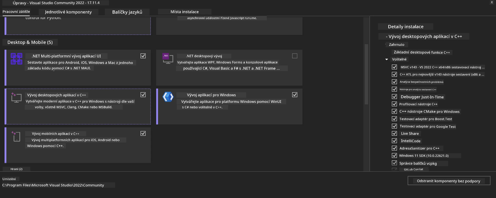
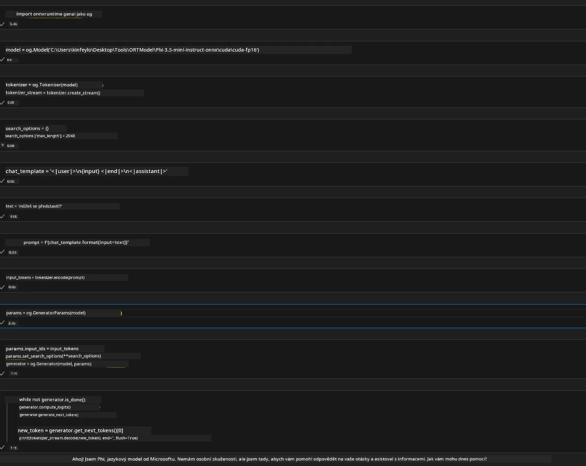
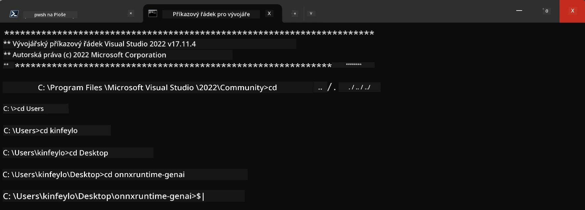

# **Pokyny pro OnnxRuntime GenAI Windows GPU**

Tento návod poskytuje kroky pro nastavení a použití ONNX Runtime (ORT) s GPU na Windows. Je navržen tak, aby vám pomohl využít akceleraci na GPU pro vaše modely, čímž zlepší výkon a efektivitu.

Dokument poskytuje pokyny ohledně:

- Nastavení prostředí: Instrukce pro instalaci nutných závislostí jako CUDA, cuDNN a ONNX Runtime.
- Konfigurace: Jak nastavit prostředí a ONNX Runtime pro efektivní využití GPU zdrojů.
- Tipy na optimalizaci: Rady, jak doladit nastavení GPU pro optimální výkon.

### **1. Python 3.10.x /3.11.8**

   ***Poznámka*** Doporučujeme používat [miniforge](https://github.com/conda-forge/miniforge/releases/latest/download/Miniforge3-Windows-x86_64.exe) jako své Python prostředí

   ```bash

   conda create -n pydev python==3.11.8

   conda activate pydev

   ```

   ***Připomínka*** Pokud máte nainstalovanou nějakou python ONNX knihovnu, prosím odinstalujte ji

### **2. Instalace CMake pomocí winget**


   ```bash

   winget install -e --id Kitware.CMake

   ```

### **3. Instalace Visual Studio 2022 - Desktop Development s C++**

   ***Poznámka*** Pokud nechcete kompilovat, můžete tento krok přeskočit




### **4. Instalace NVIDIA ovladače**

1. **NVIDIA GPU Driver**  [https://www.nvidia.com/en-us/drivers/](https://www.nvidia.com/en-us/drivers/)

2. **NVIDIA CUDA 12.4** [https://developer.nvidia.com/cuda-12-4-0-download-archive](https://developer.nvidia.com/cuda-12-4-0-download-archive)

3. **NVIDIA CUDNN 9.4**  [https://developer.nvidia.com/cudnn-downloads](https://developer.nvidia.com/cudnn-downloads)

***Připomínka*** Prosím použijte výchozí nastavení během instalace 

### **5. Nastavení NVIDIA prostředí**

Zkopírujte NVIDIA CUDNN 9.4 složky lib, bin, include do NVIDIA CUDA 12.4 lib, bin, include

- zkopírujte soubory z *'C:\Program Files\NVIDIA\CUDNN\v9.4\bin\12.6'* do  *'C:\Program Files\NVIDIA GPU Computing Toolkit\CUDA\v12.4\bin*

- zkopírujte soubory z *'C:\Program Files\NVIDIA\CUDNN\v9.4\include\12.6'* do  *'C:\Program Files\NVIDIA GPU Computing Toolkit\CUDA\v12.4\include*

- zkopírujte soubory z *'C:\Program Files\NVIDIA\CUDNN\v9.4\lib\12.6'* do  *'C:\Program Files\NVIDIA GPU Computing Toolkit\CUDA\v12.4\lib\x64'*


### **6. Stažení Phi-3.5-mini-instruct-onnx**


   ```bash

   winget install -e --id Git.Git

   winget install -e --id GitHub.GitLFS

   git lfs install

   git clone https://huggingface.co/microsoft/Phi-3.5-mini-instruct-onnx

   ```

### **7. Spuštění InferencePhi35Instruct.ipynb**

   Otevřete [Notebook](../../../../code/09.UpdateSamples/Aug/ortgpu-phi35-instruct.ipynb) a spusťte





### **8. Kompilace ORT GenAI GPU**


   ***Poznámka*** 
   
   1. Nejprve odinstalujte všechny knihovny onnx, onnxruntime a onnxruntime-genai

   
   ```bash

   pip list 
   
   ```

   Poté odinstalujte všechny knihovny onnxruntime, např. 


   ```bash

   pip uninstall onnxruntime

   pip uninstall onnxruntime-genai

   pip uninstall onnxruntume-genai-cuda
   
   ```

   2. Zkontrolujte podporu rozšíření Visual Studio 

   Zkontrolujte ve složce C:\Program Files\NVIDIA GPU Computing Toolkit\CUDA\v12.4\extras, zda je nalezena složka C:\Program Files\NVIDIA GPU Computing Toolkit\CUDA\v12.4\extras\visual_studio_integration. 
   
   Pokud není nalezena, zkontrolujte jiné složky ovladače Cuda toolkit a zkopírujte složku visual_studio_integration a její obsah do C:\Program Files\NVIDIA GPU Computing Toolkit\CUDA\v12.4\extras\visual_studio_integration


   - Pokud nechcete kompilovat, můžete tento krok přeskočit


   ```bash

   git clone https://github.com/microsoft/onnxruntime-genai

   ```

   - Stažení [https://github.com/microsoft/onnxruntime/releases/download/v1.19.2/onnxruntime-win-x64-gpu-1.19.2.zip](https://github.com/microsoft/onnxruntime/releases/download/v1.19.2/onnxruntime-win-x64-gpu-1.19.2.zip)

   - Rozbalte onnxruntime-win-x64-gpu-1.19.2.zip, přejmenujte ho na **ort** a zkopírujte složku ort do onnxruntime-genai

   - Pomocí Windows Terminal se přepněte do Developer Command Prompt pro VS 2022 a přejděte do onnxruntime-genai 



   - Kompilujte jej s vaším Python prostředím

   
   ```bash

   cd onnxruntime-genai

   python build.py --use_cuda  --cuda_home "C:\Program Files\NVIDIA GPU Computing Toolkit\CUDA\v12.4" --config Release
 

   cd build/Windows/Release/Wheel

   pip install .whl

   ```

---

<!-- CO-OP TRANSLATOR DISCLAIMER START -->
**Prohlášení o omezení odpovědnosti**:
Tento dokument byl přeložen pomocí AI překladatelské služby [Co-op Translator](https://github.com/Azure/co-op-translator). Přestože usilujeme o co největší přesnost, mějte prosím na paměti, že automatizované překlady mohou obsahovat chyby nebo nepřesnosti. Originální dokument v jeho mateřském jazyce by měl být považován za autoritativní zdroj. Pro kritické informace se doporučuje profesionální lidský překlad. Nejsme odpovědní za jakékoli nedorozumění nebo nesprávné interpretace vzniklé použitím tohoto překladu.
<!-- CO-OP TRANSLATOR DISCLAIMER END -->