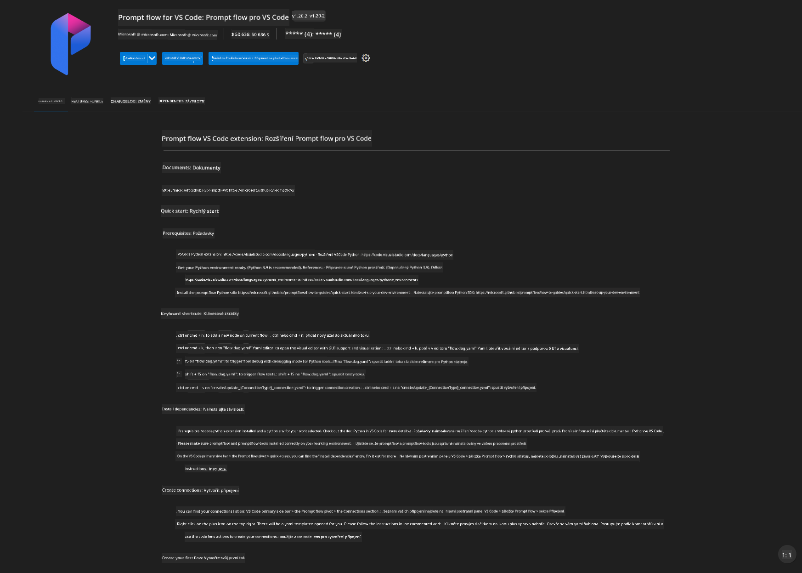
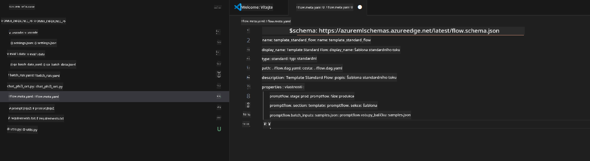
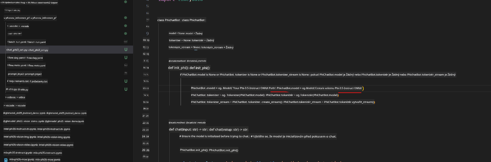
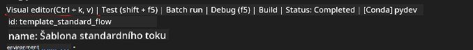
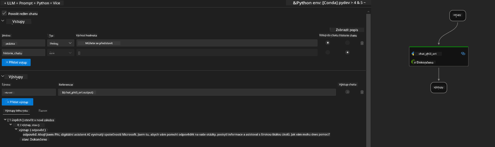
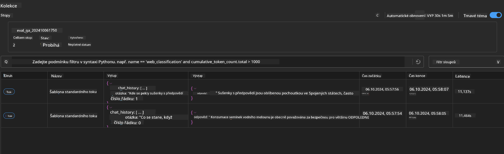

<!--
CO_OP_TRANSLATOR_METADATA:
{
  "original_hash": "92e7dac1e5af0dd7c94170fdaf6860fe",
  "translation_date": "2025-07-17T03:03:14+00:00",
  "source_file": "md/02.Application/01.TextAndChat/Phi3/UsingPromptFlowWithONNX.md",
  "language_code": "cs"
}
-->
# Použití Windows GPU pro vytvoření řešení Prompt flow s Phi-3.5-Instruct ONNX

Následující dokument je příkladem, jak používat PromptFlow s ONNX (Open Neural Network Exchange) pro vývoj AI aplikací založených na modelech Phi-3.

PromptFlow je sada vývojových nástrojů navržených k zefektivnění celého vývojového cyklu AI aplikací založených na LLM (Large Language Model), od nápadu a prototypování až po testování a vyhodnocení.

Integrací PromptFlow s ONNX mohou vývojáři:

- Optimalizovat výkon modelu: Využít ONNX pro efektivní inferenci a nasazení modelu.
- Zjednodušit vývoj: Použít PromptFlow k řízení pracovního postupu a automatizaci opakujících se úkolů.
- Zlepšit spolupráci: Usnadnit týmovou spolupráci díky jednotnému vývojovému prostředí.

**Prompt flow** je sada vývojových nástrojů navržených k zefektivnění celého vývojového cyklu AI aplikací založených na LLM, od nápadu, prototypování, testování, vyhodnocení až po nasazení do produkce a monitoring. Výrazně usnadňuje prompt engineering a umožňuje vytvářet LLM aplikace s kvalitou vhodnou pro produkci.

Prompt flow může být propojen s OpenAI, Azure OpenAI Service a přizpůsobitelnými modely (Huggingface, lokální LLM/SLM). Plánujeme nasadit kvantovaný ONNX model Phi-3.5 do lokálních aplikací. Prompt flow nám pomůže lépe plánovat naše podnikání a dokončit lokální řešení založená na Phi-3.5. V tomto příkladu zkombinujeme ONNX Runtime GenAI knihovnu pro dokončení Prompt flow řešení založeného na Windows GPU.

## **Instalace**

### **ONNX Runtime GenAI pro Windows GPU**

Přečtěte si tento návod pro nastavení ONNX Runtime GenAI pro Windows GPU [klikněte zde](./ORTWindowGPUGuideline.md)

### **Nastavení Prompt flow ve VSCode**

1. Nainstalujte rozšíření Prompt flow pro VS Code



2. Po instalaci rozšíření Prompt flow ve VS Code klikněte na rozšíření a vyberte **Installation dependencies**, podle tohoto návodu nainstalujte Prompt flow SDK do svého prostředí


3. Stáhněte si [ukázkový kód](../../../../../../code/09.UpdateSamples/Aug/pf/onnx_inference_pf) a otevřete ho ve VS Code



4. Otevřete **flow.dag.yaml** a vyberte své Python prostředí


   Otevřete **chat_phi3_ort.py** a změňte umístění vašeho Phi-3.5-instruct ONNX modelu



5. Spusťte svůj prompt flow k otestování

Otevřete **flow.dag.yaml** a klikněte na vizuální editor



Po kliknutí spusťte test



1. Můžete spustit batch v terminálu pro zobrazení dalších výsledků


```bash

pf run create --file batch_run.yaml --stream --name 'Your eval qa name'    

```

Výsledky si můžete prohlédnout ve svém výchozím prohlížeči




**Prohlášení o vyloučení odpovědnosti**:  
Tento dokument byl přeložen pomocí AI překladatelské služby [Co-op Translator](https://github.com/Azure/co-op-translator). I když usilujeme o přesnost, mějte prosím na paměti, že automatizované překlady mohou obsahovat chyby nebo nepřesnosti. Původní dokument v jeho mateřském jazyce by měl být považován za autoritativní zdroj. Pro důležité informace se doporučuje profesionální lidský překlad. Nejsme odpovědní za jakékoliv nedorozumění nebo nesprávné výklady vyplývající z použití tohoto překladu.