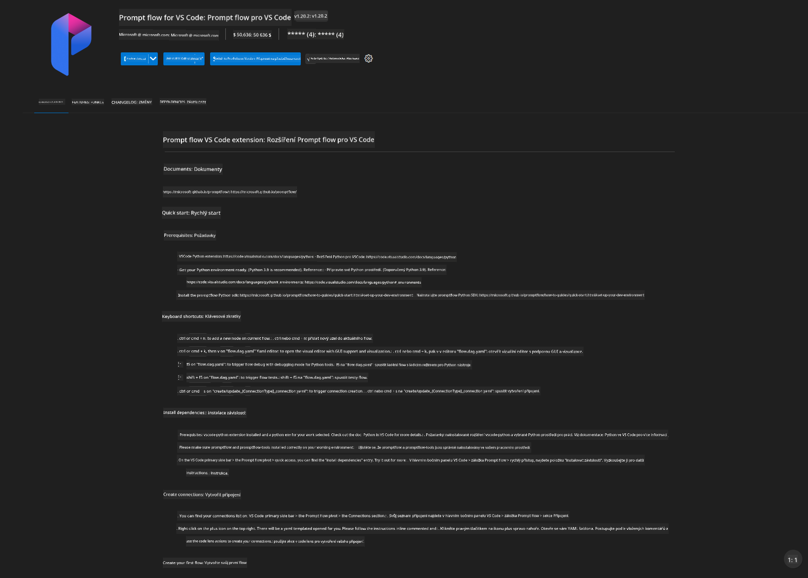
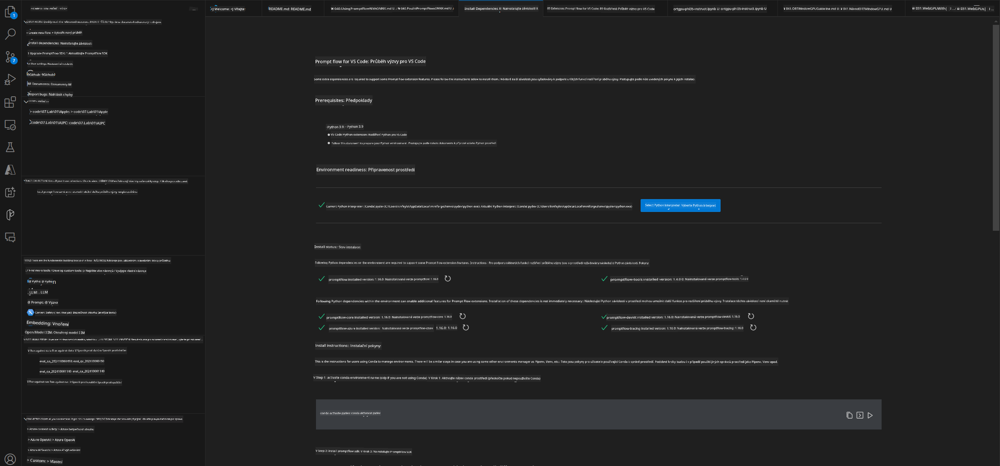
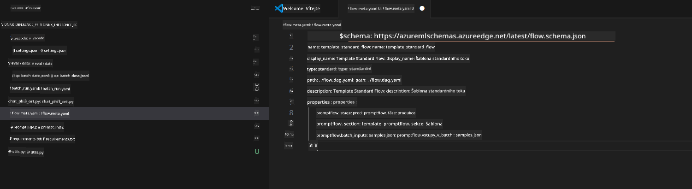
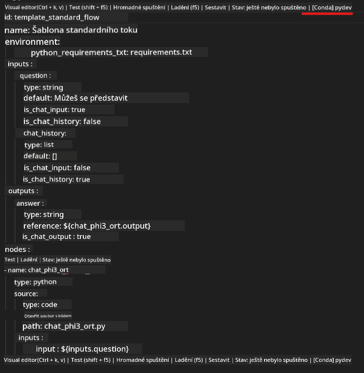
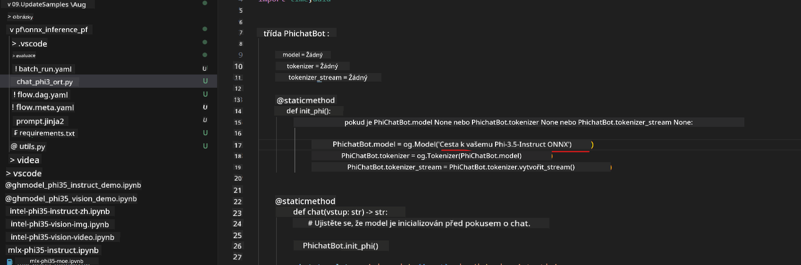
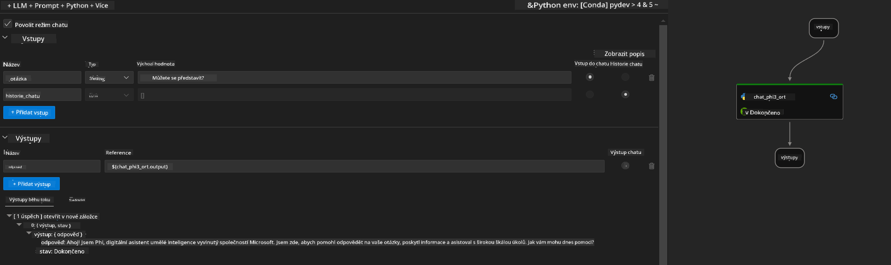
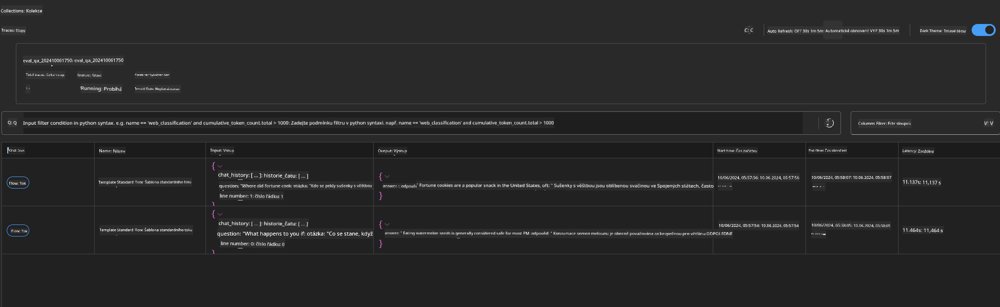

<!--
CO_OP_TRANSLATOR_METADATA:
{
  "original_hash": "92e7dac1e5af0dd7c94170fdaf6860fe",
  "translation_date": "2025-05-09T18:54:53+00:00",
  "source_file": "md/02.Application/01.TextAndChat/Phi3/UsingPromptFlowWithONNX.md",
  "language_code": "cs"
}
-->
# 使用 Windows GPU 创建基于 Phi-3.5-Instruct ONNX 的 Prompt flow 解决方案

以下文档示例展示了如何使用 PromptFlow 结合 ONNX（开放神经网络交换格式）开发基于 Phi-3 模型的 AI 应用。

PromptFlow 是一套开发工具，旨在简化基于大型语言模型（LLM）的 AI 应用从构思、原型设计到测试和评估的端到端开发流程。

通过将 PromptFlow 与 ONNX 集成，开发者可以：

- 优化模型性能：利用 ONNX 实现高效的模型推理和部署。
- 简化开发流程：使用 PromptFlow 管理工作流，自动化重复任务。
- 增强协作效率：提供统一的开发环境，促进团队成员间的更好协作。

**Prompt flow** 是一套开发工具，设计用于简化基于 LLM 的 AI 应用的端到端开发周期，从构思、原型、测试、评估到生产部署和监控。它让 prompt 工程变得更加简单，并帮助你构建具备生产质量的 LLM 应用。

Prompt flow 支持连接 OpenAI、Azure OpenAI 服务以及可定制模型（Huggingface、本地 LLM/SLM）。我们希望将 Phi-3.5 的量化 ONNX 模型部署到本地应用。Prompt flow 可以帮助我们更好地规划业务，完成基于 Phi-3.5 的本地解决方案。在本示例中，我们将结合 ONNX Runtime GenAI 库，完成基于 Windows GPU 的 Prompt flow 解决方案。

## **安装**

### **适用于 Windows GPU 的 ONNX Runtime GenAI**

请阅读此指南以设置适用于 Windows GPU 的 ONNX Runtime GenAI  [点击这里](./ORTWindowGPUGuideline.md)

### **在 VSCode 中设置 Prompt flow**

1. 安装 Prompt flow VS Code 扩展



2. 安装 Prompt flow VS Code 扩展后，点击扩展，选择 **Installation dependencies**，按照指南在你的环境中安装 Prompt flow SDK



3. 下载 [示例代码](../../../../../../code/09.UpdateSamples/Aug/pf/onnx_inference_pf)，并使用 VS Code 打开该示例



4. 打开 **flow.dag.yaml**，选择你的 Python 环境



   打开 **chat_phi3_ort.py**，修改你的 Phi-3.5-instruct ONNX 模型路径



5. 运行你的 prompt flow 进行测试

打开 **flow.dag.yaml**，点击可视化编辑器


点击后运行测试



1. 你也可以在终端批量运行以查看更多结果


```bash

pf run create --file batch_run.yaml --stream --name 'Your eval qa name'    

```

你可以在默认浏览器中查看结果




**Prohlášení o vyloučení odpovědnosti**:  
Tento dokument byl přeložen pomocí AI překladatelské služby [Co-op Translator](https://github.com/Azure/co-op-translator). I když usilujeme o přesnost, mějte prosím na paměti, že automatické překlady mohou obsahovat chyby nebo nepřesnosti. Originální dokument v jeho mateřském jazyce by měl být považován za autoritativní zdroj. Pro důležité informace se doporučuje profesionální lidský překlad. Nejsme odpovědní za jakékoliv nedorozumění nebo chybné výklady vyplývající z použití tohoto překladu.